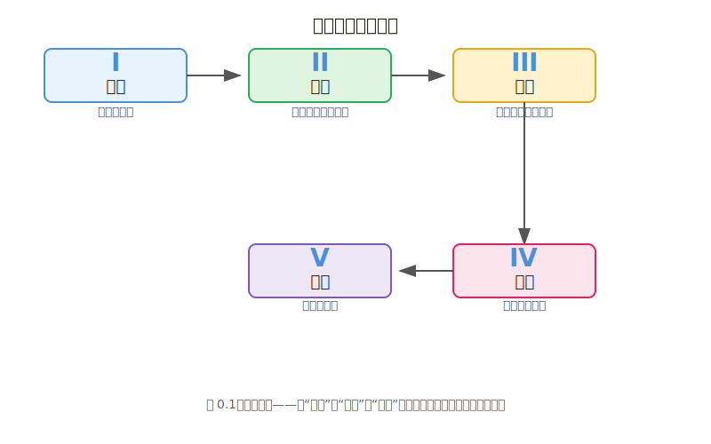
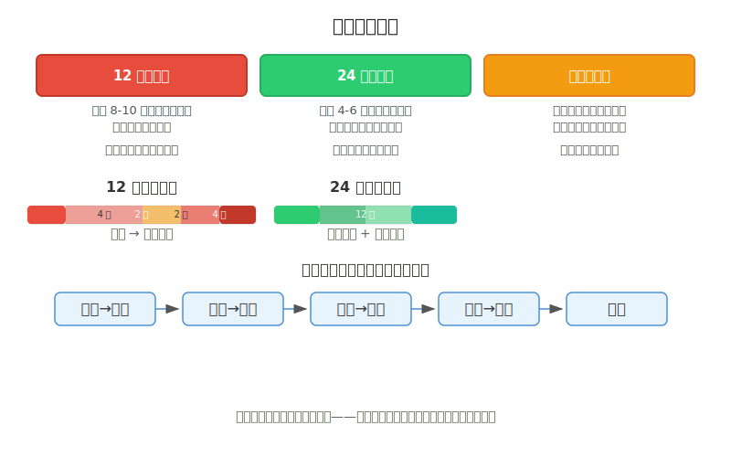

# 序章 · 一个程序员为什么要学"观察"

### 0.0 这一章解决什么问题

你打开 Steam，翻到自己游戏的商店页面——截图区那几张图让你迟迟不敢点"发布"。玩法你打磨了两年，手感调了上千次，但画面看起来像1998年的教学软件。你不是没努力：你打开过 Aseprite，对着 16×16 的空网格发了半小时呆；你看过像素画教程，但"先画一个圆，然后细化"这种话让你想摔键盘。

这一章不教你怎么画。这一章解决一个更根本的问题：**让你知道自己具体要补哪套能力，以及先补哪一层。**

说句实话：**这本书不是一本画画书，它是一本观察书。** 绝大多数程序员画不好，不是因为手不会，是因为眼不会。本书第一部不会让你马上打开 Aseprite——它会先训练一种几乎所有美术教材都不会教的能力：观察。

读完这一章，你会拿到三样东西：一张全书地图（知道每一站要做什么）、一套程序员专属的自我诊断方法（测出你到底卡在哪一关）、以及一个心理上的免责声明——"会画画"和"会做游戏美术"是两个完全不同的技能，而你只需要后一个。

*图 0.1：全书五部——从"观察"到"制作"到"继续"，每一步都是下一步的前置条件。*

### 0.1 核心概念

#### "会画画"和"会做游戏美术"是两个不同的技能

这是全书最重要的前置认知。请你现在就想清楚这两者的区别。

"会画画"意味着你能在纸上或屏幕上创作一幅独立的图画——从构图到完成，它自己就是最终作品。"会做游戏美术"意味着你能在风格约束下，高效地产出可组合、可动画、可引擎导入的视觉素材——它不是一个独立作品，它是一个系统的零件。

举个具体的例子。一个美术学院的毕业生能画出非常精美的角色设定图——但它可能是72个颜色的渐变稿，导入引擎后文件太大，缩放后糊成一团，而且和场景色板完全不搭。而一个做了三年像素游戏的程序员画的角色可能只有16个颜色、16×16像素，看起来粗糙——但它跑在引擎里、配上动画和场景后，**整体效果可能远好于那张精美设定图**。

这就是 Makko 在分析独立游戏失败原因时指出的核心问题——他称之为"两学科问题"（The Two-Discipline Problem）[1]：独立开发者必须同时掌握游戏设计和视觉生产，但绝大多数人只在其中一个领域有训练。结果呢？大多数项目不是在玩法上死的，是在美术这一关沉默放弃的——做出来的东西"看起来不对"，但又说不清楚哪里不对，反复改都改不好，最终热情耗尽。

这本书要解决的就是"哪里不对"的识别能力和"怎么改对"的执行能力。它不教你怎么成为一个插画家。它教你怎么成为一个能自己搞定像素视觉的独立游戏开发者。

#### 程序员做美术的三个隐藏优势

既然游戏美术和画画不是一回事——那么程序员有没有什么"不公平的优势"？有，而且有三个。

**第一，系统思维。** 你天然会把一个复杂问题拆成可管理的模块。画一个角色对纯艺术家来说是"一个创作"，但对你来说它天然是"剪影→内部结构→色彩→细节"的分层流程。你不需要被教"拆解"——你只需要被教"拆成什么"。

**第二，迭代习惯。** 你知道第一版代码注定是垃圾——你写出来，跑通，然后重构。美术生从小被教"画好每一笔"，所以他们不敢画丑画。而你天然接受"先丑后改"。这个心态差距是巨大的。在像素画里，先丑后改的效率远高于一笔到位——16×16 的网格太小，"一笔到位"根本不存在，每一像素都是一次迭代。

**第三，工具亲近感。** 你不会被 Aseprite 的界面吓到——你见过比它更不友好的编辑器。你不会觉得快捷键难记——你背过更难记的东西。你不信"软件学不会"——你是写软件的人。这本书的"制作"部默认工具就是 Aseprite + Godot，不再为"选哪个软件"浪费篇幅。

这三个优势加起来，意味着你的学习起点比纯艺术背景的人更高——前提是用对方法。

#### 为什么这些优势没有帮到你——因为你缺了"观察"

既然程序员有这么多优势，为什么你还是做不出满意的游戏画面？

2016年，一个叫 Eric Barone 的年轻人发布了一款游戏。他在大学学的是计算机科学，没有任何美术训练背景。为了做这款游戏，他自学像素画，一帧一帧地画了四年。那款游戏叫《星露谷物语》（Stardew Valley），截至2026年，它卖出了超过4100万份 [2]。

每次我讲这个案例，都会有程序员说："那是因为他有天赋。"这是最方便的解释，也是最没用的解释。你仔细看 Eric 最早的像素稿件——网上能找到他2012年发的开发日志——那些最初的素材并不好看。他是一张一张迭代过来的。四年时间，数万张练习。

**"天赋"是对"系统化训练"的误读。** 你不相信你能学会，是因为你从来没被教过怎么把美术当成一个系统来拆解。你学编程的时候有人教过你"先学会 if-else，再学循环，再学函数，再学面向对象"——美术为什么不能这样学？

可以。这本书要做的就是这个。只不过这本书只盯一个方向：**像素艺术**。手绘、矢量、3D 低模这些门类不是不重要，而是它们会被留到本书最后（继续04）作为"学完像素之后往哪走"的扩展方向。你的第一站是像素——因为像素艺术约束最强、反馈最快、和程序员的模块化思维最贴合。

**程序员缺的不是天赋，也不是优势——是"观察"。** 你把系统思维、迭代习惯、工具亲近感全用上了，但你打开 Aseprite 之前没做最关键的一步：先看看你想要的东西到底是什么样。你看不出来自己画得哪里不好，所有练习都是盲目重复。所以全书从"观察"开始，不从"打开 Aseprite"开始。

#### 这本书的结构：三能力与五部

先记住一个框架，全书的骨架就清楚了。这本书把游戏美术能力分成三层，从下往上：**看 → 做 → 整**。

- **看（See）** = 你能不能看出问题，并且说清楚问题。第一部"观察"训练这一层。
- **做（Make）** = 你能不能做出来，并且高效地产出。第二部"练手"训练执行，第四部"制作"前半应用它。
- **整（Integrate）** = 你能不能把素材导入引擎、跑通、确保一切看起来统一。第四部"制作"后半专门训练这一层。

这三层有严格的依赖关系：**"看"是"做"和"整"的前置条件。** 你看不出来自己画得哪里不好，后面所有练习都是盲目重复。

三能力映射到全书的五部结构：

| 三能力                 | 对应部        | 做什么                             |
| ---------------------- | ------------- | ---------------------------------- |
| **看**                 | 第一部 · 观察 | 感知与词汇——训练你的眼睛           |
| **做**（训练）         | 第二部 · 练手 | 八概念逐个攻克——训练你的手         |
| 方向决策               | 第三部 · 风格 | 选你的像素子风格——锁定约束         |
| **做**（应用）+ **整** | 第四部 · 制作 | 从素材到引擎——做出可运行的游戏视觉 |
| 维持与扩展             | 第五部 · 继续 | 持续输出、扩展方向——保持你的手不冷 |

三能力模型会在**观察01**正式展开，并给你一份自评量表——那里你会测出自己卡在哪一层。这里只记住一件事：**"看"是另外两项的前置条件。** 全书从"观察"开始，不从"打开 Aseprite"开始。

你可能注意到，这本书没有"选工具"这一步——不是漏了，是刻意省掉了。像素画用 Aseprite，引擎用 Godot，这两个工具在本书语境下没有替代选项。工具选择被压成了一段论证，收在制作01 的开头。少一个"选工具"的环节，少一个拖延的借口。

#### 这本书的方法论承诺

在你翻开观察01之前，我想把承诺说清楚，免得你有错误的期待。

**这本书不要求你有天赋。** 它要求的东西更具体、也更可控：每天投入一定的时间（多少由你选的路径定），用对的方法练对的东西。

**这本书不要求你每天4小时。** 下面会给你两个版本的学习节奏——密集版每周8-10小时，平衡版每周4-6小时。这两个版本覆盖了同一个能力系统，只是深度不同。如果你连每周4小时都挤不出来……说实话，做独立游戏这件事你可能需要重新考虑，不只是美术环节。

**这本书要求你用对方法。** 方法错了，练1000小时也是白练。方法对了，300小时足够完成一套可运行像素视觉系统。"对的方法"具体是什么，这正是全书要展开的内容。

### 0.2 三种阅读路径

你不必从头读到尾。做完观察01的自评量表后，你会知道自己的起点在哪里。但在此之前，先了解三种阅读路径的全貌：

*图 0.2：三条路径共享相同的学习阶段——区别在于节奏和深度。选一条，坚持走完。*

**路径一：12周速通版。** 每周投入8-10小时。适合有截止压力的开发者——你的游戏已经做了一半，现在需要快速补齐视觉。路径是：前2周建立感知和词汇（观察01-05），中间4周八概念深练（练手01-08，只做L1-L2练习），接着2周选风格（风格01-04），最后4周实战（制作01-09）。重点是"够用就好"——你不需要把每种像素子风格都探索一遍，你只需要把你的游戏做出来。

**路径二：24周平衡版。** 每周投入4-6小时。适合边学边做项目的开发者。把时间摊薄，允许每个概念有充分的消化时间。前半段（12周）主攻观察和练手，后半段（12周）主攻风格、制作和继续。这是本书推荐的默认路径。

**路径三：按需跳读版。** 你已经有了一些基础——比如你用过 Aseprite 但搞不定色彩，或者你做出来的东西总感觉"不对劲"但说不出为什么。观察01的自评量表会告诉你具体哪一层需要补。做完量表，直接跳到你对应的章。

无论选哪条路，有一条铁律不要违反：**先练观察，再练画。** 你的眼睛必须先学会识别问题，手才能去修问题。很多程序员卡在美术上不是因为他们画不好，是因为他们**看不出来自己画得哪里不好**——于是所有练习都是盲目重复。

如果把美术能力类比为你最熟悉的东西——API 文档——那么你现在的情况是：你知道有哪些 API 可以用（你玩过很多游戏，见过好画面），但你从来没看过文档（你不知道那些画面为什么好）。这本书就是那份文档。

### 0.3 上手行动

在翻开观察01之前，做这一件事，只需10分钟：

1. 打开你的 Steam 库或手机相册，找一张你最喜欢的像素游戏截图。
2. 用你能想到的任何词汇，写下你"为什么喜欢这张图"——写满两行就可以，不用长篇大论。
3. 把这张纸保存好。

这不是练习。这是一个时间胶囊。等你完成观察01和观察02之后，回到这张截图和这张纸前，再分析一遍——你大概率会发现，之前写的"好看、氛围好、颜色舒服"已经不够用了。你会开始使用"明度结构"、"负空间"、"色彩的温度偏向"这些词。

这个体验就是本书前五章要做的事：**把"感觉"翻译成"可分析的语言"**。

### 0.4 本章小结

- **会画画不等于会做游戏美术。** 你需要的是后者——一套可拆解、可练习、可验证的系统，不是一门玄学。
- **你有隐藏优势——但它需要一个方向。** 系统思维、迭代习惯、工具亲近感是程序员独有的起跑线。但这些优势只有作用在"对的方向"上才有用——那个方向叫"观察"。
- **全书的核心框架是三能力。** 看 → 做 → 整，这三层才是方法论。"看"是另外两项的前置条件，所以全书从观察开始。
- **如果只记住一句话：** 先练看，再练画。你不是不会画——你是不会看。

### 0.5 扩展阅读

**如果想深入：**
- 《Drawing Basics and Video Game Art》Chris Solarski——唯一一本把古典艺术原理和现代游戏美术放在一起讲的书。John Romero 作序。如果你只读一本游戏美术理论书，读这本。
- 《Color and Light》James Gurney——不是"游戏美术"书，但全书的色彩和光影原理直接适用于像素画。被 Kolibri Games 的艺术家称为"可能读过的最好的色彩书" [3]。

**如果时间有限：**
- Derek Yu 的像素教程（derekyu.com/makegames/pixelart.html）——Spelunky 的创作者写的免费教程。20分钟读完。像素线条的斜率规则是程序员最容易秒懂的美术概念。
- Drawabox 第1课（drawabox.com/lesson/1）——免费结构化课程，教你从肩膀而不是手腕画线。这个习惯的建立，比你想象的重要十倍。
- Riot Games "So You Wanna Make Games??" 系列第1集（YouTube）——11分钟视频，用"清晰度/满足感/风格"三个词重新定义了游戏美术的评判标准。本书三能力模型的基础框架之一。
- Molly Bang《Picture This: How Pictures Work》——一本用剪纸拼贴证明"为什么三角形让人紧张、圆形让人放松"的小书。1小时读完。读完你就明白形状的心理暗示不是玄学 [4]。

### 0.6 本章引注

[1] Makko，"Why Solo Devs Don't Finish Games — The Two-Discipline Problem"，2024。讨论了独立开发者必须同时掌握游戏设计与视觉生产的内在矛盾。全文见 Makko 的 YouTube 频道及个人网站。

[2] Stardew Valley 销量数据：截至2026年初，《星露谷物语》在所有平台上累计销售超过4100万份。参见 Stardew Valley 官方博客及维基百科词条。Eric Barone 的开发历程记录于其个人博客及 GDC 2017 演讲 "Stardew Valley: One Developer's Journey"。

[3] Kolibri Games，"Our 5 Favorite Resources for Game Artists"，kolibrigames.com。文中艺术家团队将《Color and Light》列为色彩学习首选。

[4] Bang, M.，《Picture This: How Pictures Work》，修订25周年纪念版，Chronicle Books。
