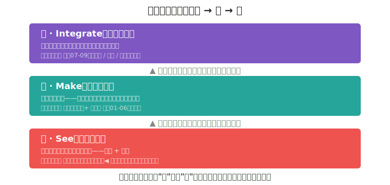
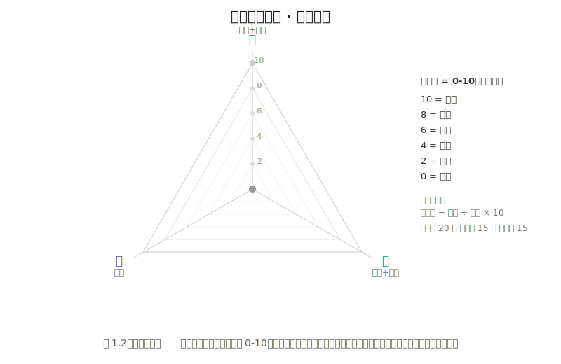
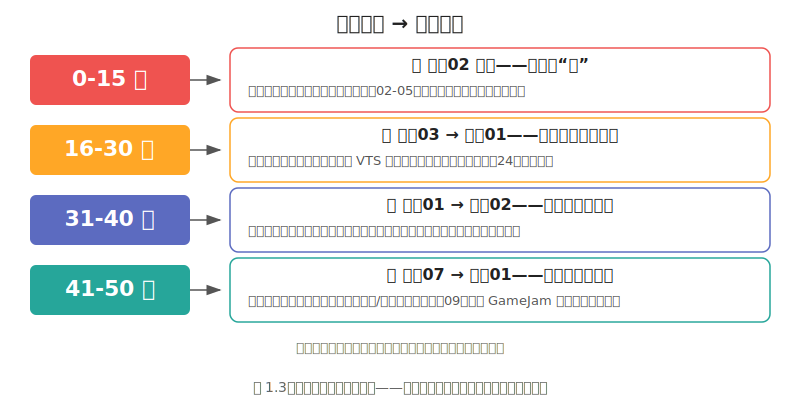

# 观察01 三能力模型与自评：你的美术能力不是零

### 1.0 这一章解决什么问题

你觉得自己"完全不会画画"，于是每次看到像素画教程都直接跳过——因为教程的第一句话就是"先画一个圆"。但你其实已经有了一定的美术能力，只是你自己不知道。你能分辨《空洞骑士》和《星露谷物语》的画面风格不同。你能感觉到某张截图"看起来舒服"、某张"说不出的别扭"。你能指出某个 UI 按钮颜色太刺眼。

这些都不是"零"。它们只是没有被命名、没有被量化、没有被组织成一个你可以主动使用的系统。

序章里我承诺过给你那个系统，并把全书的五部收窄成三个能力层——看 / 做 / 整。这一章就把这三层正式展开。读完这一章，你会拿到一个三层的分层模型（像你熟悉的协议栈一样分层清晰），一份10题自评量表（5分钟知道自己的短板在哪），和一张三轴雷达图（可视化你的能力轮廓）。从此你不会再说"我不会美术"——你会说"我的'看'是3分、'做'是1分，我需要先补'看'"。

### 1.1 核心概念

#### 三能力：一个程序员秒懂的"分层架构"

你知道 TCP/IP 协议栈吗？物理层负责传比特、链路层负责传帧、网络层负责路由、传输层负责可靠性、应用层负责你看到的网页。每一层有自己的职责，每一层出问题时表现的症状不同，每一层的调试方法也不同——但你要上网，每一层都得对。

游戏美术能力也是这样的一个**分层架构**。底层没通，上层再努力也没用。我把像素美术能力分成三层，从下往上：**看 → 做 → 整**。

> **为什么是三层，不是五层？** 如果你看过这本书的早期版本，会记得原来是五子能力——感知、词汇、执行、工具、整合。现在它坍缩成三个，原因就一条：**这本书只做像素艺术，工具已经替你选好——画用 Aseprite，引擎用 Godot**。当工具选择不再是你要操心的事，工具层就不再是独立的一层能力，它和执行层合并成"做"；而感知和词汇在像素这种强约束门类里几乎是一体的——你看不出问题往往就是因为叫不出名字，所以它们合并成"看"。少两层，少两个拖延的借口，也少两个让你误以为"我缺的是工具"或"我缺的是天赋"的幻觉。

*图 1.1：三能力像三层协议栈——底层没通，上面再努力也没用。大多数程序员的问题出在最底下的"看"。*

**第一层（底）：看（See）** = 感知 + 词汇。你能不能"看出"问题，并且"说清楚"问题。看到一张截图，你能不能具体说出它哪里好、哪里不好？不是"好看/不好看"，而是"这个角色的明度太接近背景了，剪影边界模糊"或"这个场景的视觉焦点被右上角的亮色块抢走了"。你看到了"颜色不太对"——但你知不知道是色相（Hue）不对、饱和度（Saturation）不对、还是明度（Value）不对？

这是最基础的一层，也是最容易被程序员跳过的一层。因为你习惯了"看到问题→打开代码→修问题"的闭环，但在美术里，**如果你看不到问题，你连修都不知道修什么**。感知是"看得出"，词汇是"说得出"——在像素画里这俩几乎一体：你叫不出"负空间"这个名字，你就看不见它。"看"就是这一整部"观察"要训练的东西。

**第二层（中）：做（Make）** = 执行 + 工具。你能不能"做出来"，并且"高效地产出"。你的手能不能控制像素线条的方向和粗细？你能不能在一个限定的调色板里画出有明度层次的物体？你熟练使用 Aseprite 吗——从新建文件、到镜像、到导出带动画的 PNG，能不能独立走完？这是大多数人以为"美术能力"的全部。但你看，它只是三层中的第二层。而且——这是本章最重要的洞察——**大多数程序员的问题不在这一层**。你画不好不是因为手残，是因为你不知道"好"是什么样（看），也不知道用什么标准去检验自己的画（还是看）。工具层在像素专版里已经坍缩：Aseprite + Godot 是固定的，你不用在"选哪个软件"上浪费一秒。第二部"练手"训练执行，第四部"制作"应用它。

**第三层（顶）：整（Integrate）** = 整合。你能不能"让东西跑起来"并且"看起来统一"。你的素材导入 Godot 后，Filter 设置对了吗？缩放比例对吗？不同场景之间的色彩风格一致吗？角色、UI、场景的调色板是同一个体系的吗？

这一层是独立游戏开发者的独有层——纯美术从业者不需要考虑"引擎导入"和"运行时一致性"，但你必须考虑。这也是"会画画"和"会做游戏美术"的终极区别。第四部"制作"的后半（制作07 上引擎 / 08 生产管线 / 09 一致性审计）专门训练这一层。

#### 三能力之间的关系

这三层之间存在严格的依赖关系。就像你不可能在链路层还没通的时候去调试 HTTP 请求——你不可能在"看"还空白的时候，期待"做"能产生好结果。

让我给你一个具体的场景。一个程序员打开 Aseprite，想画一个角色。他画了30分钟，觉得"很丑"，于是去搜"像素画教程"，跟着教程画了三个小时，还是丑。他得出结论："我没有美术天赋。"

实际上发生了什么？他跳过了"看"，直冲"做"。他画的时候不知道自己想要什么效果，画完之后没有词汇去诊断问题在哪，于是他只能感觉到"丑"这种模糊的整体判断——然后这个模糊的判断被他解释为"我没有天赋"。

正确的路径是：先在"看"建立判断力——看100张像素角色，每张用明度、剪影、构图去分析；能说出"这个角色的明度在背景中跳不出来，因为它的灰度值和背景太接近"；然后再进"做"——带着明确的目标和可验证的标准去画，每画几笔做一次自检；最后才到"整"——素材进引擎、跑通、检查一致性。

> **程序员类比：** 这三层就是一条流水线——"看"是测试用例（定义什么算"对"），"做"是单元测试（逐个像素过关），"整"是集成测试与部署（素材进引擎、跑通管线）。测试用例都没写就去写实现，你得到的就是一堆无法验证的代码——美术里这叫"盲目练习"。

序章里我说"会画画和会做游戏美术是两个不同的技能"——三能力模型把这个区别落地了：传统的"会画画"只覆盖"做"的一部分，而"会做游戏美术"需要三层全部打通，尤其是"整"。

#### Riot Games 的三分类框架：一个行业背景

三能力模型不是凭空编的。它的一个直接灵感来源是 Riot Games（拳头公司）在它的入门教程系列 "So You Wanna Make Games??" 第一集中提出的游戏美术评判三分类 [1]：

1. **清晰度（Clarity）**：画面能不能被快速读懂？角色、敌人、可交互物能不能在混乱中保持可辨认？
2. **满足感（Satisfaction）**：视觉反馈有没有让玩家的操作"感觉爽"？打击感、动画弹性、特效的节奏感。
3. **风格（Style）**：画面有没有独特的视觉语言？它是否符合游戏的世界观和叙事基调？

Riot 的这个框架非常精准，但它是一个"评判框架"——用来评估已有的画面。三能力模型把它下沉为"能力框架"——用来诊断你到底哪里不行。Riot 的"清晰度"依赖于你的"看"（你知不知道什么叫"清晰"，能不能说出影响清晰度的要素——明度对比、剪影辨识度、视觉权重分布）。"满足感"依赖于你的"做"和"整"（你能不能画出有弹性的动画帧、反馈效果在引擎里实际运行时对不对）。"风格"则贯穿三层——它是对三层的统一约束。

#### 自评量表：5分钟找到你的短板

下面是10道题，按三能力分组。每道题的评分标准尽量具体——不只是"自己判断"。如果你不理解某个术语（如"视觉权重""负空间""明度"），**直接打0分**。这不代表你不行——这代表你正好知道自己需要从哪学起。这些词正是这一部和观察02要教你的。**0 分是正常起点，不代表失败。**

**请不要跳过。** 跳过自评的结果是你在接下来的学习中不知道自己"应该重点读哪里"。5分钟，诚实作答。

**看（感知+词汇）——4题，满分 20：**

| # | 问题 | 评分解读 | 得分 |
|---|------|---------|:---:|
| 1 | 看到一张像素游戏截图，你能具体说出喜欢/不喜欢的原因吗？ | 5=能用≥3个专业概念（明度、构图、色彩温度）分析；3=能说≥2个具体原因但不涉专业词；1=只会"好看/不好看"；0=完全没想法 | /5 |
| 2 | 你知道"明度""互补色""视觉权重""负空间"这些词的意思吗？ | 5=全部能准确解释并举例；3=知道一半；1=只听过1-2个；0=完全不知道 | /5 |
| 3 | 你能说出至少5种不同的像素美术风格，并各举一个代表游戏吗？ | 5=≥5种每种配1款游戏；3=3-4种；1=1-2种；0=说不上来 | /5 |
| 4 | 你有固定的参考图收集习惯（参考板/moodboard）吗？ | 5=系统化收集并分类；3=偶尔收集但散乱；1=存过几张没整理；0=从不收集 | /5 |

看得分：\_\_ / 20

**做（执行+工具）——3题，满分 15：**

| # | 问题 | 评分解读 | 得分 |
|---|------|---------|:---:|
| 5 | 你能用4种以内的颜色画出一个有明确情绪的像素场景吗？ | 5=4色完成且情绪明确可读；3=做出来但情绪模糊；1=不知从何下手；0=没画过 | /5 |
| 6 | 你能用黑白灰做出一个有视觉引导方向的简单像素构图吗？ | 5=3个灰度完成、引导方向明确；3=完成但引导模糊；1=试过但不知算不算对；0=没概念 | /5 |
| 7 | 你熟练使用 Aseprite 吗（从新建到导出动画的完整流程）？ | 5=能独立完成完整流程；3=会基本操作但常卡住；1=打开过但不会用；0=没碰过 | /5 |

做得分：\_\_ / 15

**整（整合）——3题，满分 15：**

| # | 问题 | 评分解读 | 得分 |
|---|------|---------|:---:|
| 8 | 你做好的像素素材曾经成功导入 Godot 并跑起来过吗？ | 5=多次成功导入并调试过运行时效果；3=导入过一次、效果不满意但至少跑起来；1=尝试过但卡在导出/导入；0=完全没试过 | /5 |
| 9 | 你的游戏项目有书面的视觉风格文档（配色规范/角色设计语言/UI规则）吗？ | 5=有完整书面文档；3=有零散记录；1=脑子里想过没写；0=从没考虑过 | /5 |
| 10 | 你曾在游戏社区发布过自己的像素作品并据反馈迭代过吗？ | 5=≥3次获有效反馈并改进；3=1-2次；1=发过但没反馈；0=从未发过 | /5 |

整得分：\_\_ / 15

**总分：\_\_ / 50**

把三个能力的得分折算到统一的 0-10 雷达轴上，画到这张雷达图里：

*图 1.2：空白雷达图——把每个能力的得分折算到 0-10（看 ÷20×10，做 ÷15×10，整 ÷15×10），在三轴上标点连线，得到你的能力轮廓。凹进去的那一轴就是你最该补的。*

把三个点连起来——你得到的是什么形状？如果"看"那一轴明显凹进去（短），说明你是程序员的典型画像：能做、能整，但看不出来自己哪里不好。如果"做"凹进去，说明你看了很多但画得少。如果"整"凹进去，说明你能画但素材进引擎后总不对——这是从"会画画"到"会做游戏美术"的最后一道坎。

#### 自评分数 → 阅读起点

你的总分落在哪个段？

*图 1.3：别在错的地方浪费时间——你的分数直接告诉你去哪一章效率最高。*

| 分数 | 主要短板 | 起点 | 路径说明 |
|------|---------|------|---------|
| 0-15 | 看不出来、说不清楚 | **观察02** | 输入严重不足。先走完第一部（观察02-05）建立感知与词汇，别碰画笔。等你"看"的分上来再进练手部。 |
| 16-30 | 概念散、手感缺 | **观察03 → 练手01** | 有感知但分析力和执行都缺。补 VTS 侦探法，再进练手部逐概念过。24周平衡版路径最适合你。 |
| 31-40 | 缺方向与系统化 | **风格01 → 制作02** | 感知和概念够用。先定像素子风格方向，查漏练手，直接进角色工作流做完整产出。 |
| 41-50 | 缺整合与持续 | **制作07 → 继续01** | 技术够用。补上引擎/一致性审计（制作09），用 GameJam 做输出压力测试。 |

**总分定档，但要看雷达的形状。** 如果某个能力明显凹进去（远低于另两轴），优先补那一轴对应的部——哪怕你的总分已经够高。比如总分38但"整"只有3分，别去风格部，先去制作07把整合层补上。

### 1.2 上手行动

现在做这件事，只需2分钟：

打开你手机的备忘录或桌上的便签，写下这三个字——"看 → 做 → 整"。在每个字旁边，根据自评量表的结果，写下你的得分（比如"看 8/20、做 5/15、整 3/15"）。然后把这张纸贴在显示器旁边。

这听起来很简单，但它的作用远超你的想象。之后每一次你做练习卡住了，看这张纸——"我卡在'整'（素材进引擎后不对），但我发现我的'看'可能才是根源（当初画的时候没意识到明度结构有问题）"。这就是诊断思维的起点。

另外，如果你"看"的得分在8分以下，再做一个额外的动作：把自评题目中所有"不知道这个词什么意思"的术语列出来。这个列表就是你的观察02阅读清单——你不需要从头到尾啃，你只需要重点读你不认识的词。

### 1.3 本章小结

- **你的美术能力不是零**——你能分辨画面好坏，你能感知风格差异，你能指出UI问题。这些是"看"的基础，只是还没被系统化。三能力模型帮你把"感觉不行"拆成"哪一层不行"。
- **大多数程序员的问题出在"看"**——看不出问题、说不出问题，不是"做"不行（画不好、工具不熟）。你不是不会画，你是不会看。不会看就练看，不要在没有方向感的时候盲目地练画。
- **工具层已坍缩**——像素专版里 Aseprite + Godot 是固定的，工具选择不再是独立能力。少一层，少一个"我缺的是好工具"的借口。
- **如果只记住一句话：** 下次你想说"我不会画画"时，改成"我的'看'是X分、'做'是Y分、'整'是Z分，我需要先补最低的那一轴"——把模糊的自我否定，变成精确的能力诊断。

### 1.4 扩展阅读

**如果想深入：**
- 《Drawing on the Right Side of the Brain》Betty Edwards——这是一本关于"看到"的书，不是关于"画"的书。前半部分用颠覆性的练习证明了"你看不到明度差异"是你画不好的根源。全书最经典的练习是"颠倒画法"（把参考图倒过来临摹），它迫使你的大脑从"画符号"切到"画实际看到的线条"。这本书几乎就是"看"这一层的训练手册。
- 《Interaction of Color》Josef Albers——不要"读"这本书，要"做"书中的实验。50周年纪念版含近60个色板研究。每个实验在证明同一个原理：同一个颜色在不同背景下看起来完全不同 [2]。

**如果时间有限：**
- Riot Games "So You Wanna Make Games??" 第1集（YouTube，11分钟）——用"清晰度/满足感/风格"三个词建立了游戏美术评判框架。看完你就能对你的游戏截图做一个快速的"三标准自检"。这是三能力模型的直接灵感来源。
- 本章的自评量表——每个月重做一次。记录三个分数的变化，这就是你的"进步追踪器"。你不需要任何外部反馈来告诉自己进步了——分数自己在说话。
- Drawabox 第1课（drawabox.com/lesson/1）——如果你只做一个练习来从"看不出问题"过渡到"看得出问题"，做这个。它不是教你怎么画好看的线，而是教你怎么在看到一根线的瞬间判断它"对还是不对"。

### 1.5 本章引注

[1] Riot Games，"So You Wanna Make Games?? | Episode 1: Intro to Game Art"，YouTube，2018。将游戏美术的评判标准分解为 Clarity（清晰度）、Satisfaction（满足感）和 Style（风格）三个维度。该系列是 Riot Games 为入门者制作的免费教育内容。https://www.youtube.com/playlist?list=PL0N8FjRiKPI7LxM_D3cA30sx2AgBy5Gk0

[2] Albers, J.，《Interaction of Color: 50th Anniversary Edition》，Yale University Press，2013。https://yalebooks.co.uk/book/9780300179354/interaction-of-color/
