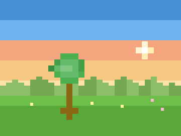
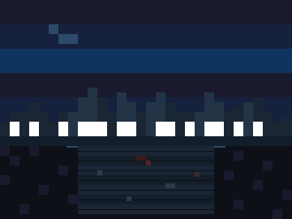

# 观察01 三能力模型与自评：你的美术能力不是零

### 1.0 这一章解决什么问题

先做一个实验，只需 30 秒。

观察下面两张生成的像素风格图片——一张让你觉得舒服、放松，另一张让你觉得紧张、压抑。盯着它们各看 10 秒。

*图 1.0a：温暖、开阔、平衡——你的眼睛会自动停留在树上，然后放松到周围的空间。*

*图 1.0b：阴冷、狭窄、方向不明——你的眼睛在墙壁之间来回扫，找不到可以停留的地方。*

现在回答：**为什么一张舒服，另一张压抑？**

你大概率能感觉到区别。你可能想说"颜色不一样"、"光线不一样"、"画面里的东西多和少的区别"。但你没办法把它说清楚——没办法像描述一个 bug 那样，精确地指出"第几行出了问题"。

**这不是"不会"。这是"会看，但还没名字"。**

这一章给你名字。三能力模型把美术能力分成三层——看 / 做 / 整。10 题自评量表让你 5 分钟定位自己的短板在哪里。读完这一章，你不会再说"我不会美术"——你会说"我的看是 3 分、做是 1 分，先补看"。

### 1.1 核心概念

#### 三能力：看 → 做 → 整

把游戏美术能力想象成三层系统。底层没通，上层再努力也没用。

*图 1.1：三能力 = 看（输入系统）→ 做（实现系统）→ 整（部署系统）。三层不能跳。大多数程序员的问题出在最底下的"看"。*

**三层不能跳。** 大多数程序员的问题不在"做"——不是手残。是你跳过了"看"，直接打开了 Aseprite。你不知道"好"是什么样，画完说不出哪里有问题，于是只能下结论："我没有美术天赋"。

> **程序员类比：** 这三层就是一条测试流水线——看是测试用例（定义什么算"对"），做是实现（逐个像素过关），整是集成部署（素材进引擎）。测试用例都没写就去写实现——这就是"盲目练习"。

#### 三能力之间的关系

这三层之间存在严格的依赖关系。让我给你一个很多程序员经历过——或者正在经历——的场景。

一个程序员打开 Aseprite，想画一个角色。他画了 30 分钟，觉得"很丑"，于是去搜教程，跟着画了三个小时，还是丑。他得出结论："我没有美术天赋。"

实际上发生了什么？他跳过了"看"，直冲"做"。他画的时候不知道自己想要什么效果，画完之后没有词汇去诊断问题在哪，只能感觉到"丑"这种模糊的整体判断——然后这个判断被他解释为"我没有天赋"。

正确的路径是：先在"看"建立判断力——看 100 张像素角色，每张用明度、剪影、构图去分析；能说出"这个角色的明度在背景中跳不出来"；然后再进"做"——带着明确的目标和可验证的标准去画；最后才到"整"——素材进引擎、跑通、检查一致性。

序章里我说"会画画和会做游戏美术是两个不同的技能"——三能力模型把这个区别落地了：传统的"会画画"只覆盖"做"的一部分，而"会做游戏美术"需要三层全部打通，尤其是"整"。

#### 自评量表：5分钟找到你的短板

下面是 10 道题，按三能力分组。如果你不理解某个术语（如"视觉权重""负空间""明度"），**直接打 0 分**。这不代表你不行——这代表你正好知道自己需要从哪学起。**0 分是正常起点，不代表失败。**

**请不要跳过。** 5 分钟，诚实作答。

**看（感知+词汇）——4 题，满分 20：**

| #   | 问题                                                      | 评分解读                                                                                                          | 得分  |
| --- | --------------------------------------------------------- | ----------------------------------------------------------------------------------------------------------------- | :---: |
| 1   | 看到一张像素游戏截图，你能具体说出喜欢/不喜欢的原因吗？   | 5=能用≥3个专业概念（明度、构图、色彩温度）分析；3=能说≥2个具体原因但不涉专业词；1=只会"好看/不好看"；0=完全没想法 |  /5   |
| 2   | 你知道"明度""互补色""视觉权重""负空间"这些词的意思吗？    | 5=全部能准确解释并举例；3=知道一半；1=只听过1-2个；0=完全不知道                                                   |  /5   |
| 3   | 你能说出至少5种不同的像素美术风格，并各举一个代表游戏吗？ | 5=≥5种每种配1款游戏；3=3-4种；1=1-2种；0=说不上来                                                                 |  /5   |
| 4   | 你有固定的参考图收集习惯（参考板/moodboard）吗？          | 5=系统化收集并分类；3=偶尔收集但散乱；1=存过几张没整理；0=从不收集                                                |  /5   |

看得分：\_\_ / 20

**做（执行+工具）——3 题，满分 15：**

| #   | 问题                                                   | 评分解读                                                                      | 得分  |
| --- | ------------------------------------------------------ | ----------------------------------------------------------------------------- | :---: |
| 5   | 你能用4种以内的颜色画出一个有明确情绪的像素场景吗？    | 5=4色完成且情绪明确可读；3=做出来但情绪模糊；1=不知从何下手；0=没画过         |  /5   |
| 6   | 你能用黑白灰做出一个有视觉引导方向的简单像素构图吗？   | 5=3个灰度完成、引导方向明确；3=完成但引导模糊；1=试过但不知算不算对；0=没概念 |  /5   |
| 7   | 你熟练使用 Aseprite 吗（从新建到导出动画的完整流程）？ | 5=能独立完成完整流程；3=会基本操作但常卡住；1=打开过但不会用；0=没碰过        |  /5   |

做得分：\_\_ / 15

**整（整合）——3 题，满分 15：**

| #   | 问题                                                                 | 评分解读                                                                                                      | 得分  |
| --- | -------------------------------------------------------------------- | ------------------------------------------------------------------------------------------------------------- | :---: |
| 8   | 你做好的像素素材曾经成功导入 Godot 并跑起来过吗？                    | 5=多次成功导入并调试过运行时效果；3=导入过一次、效果不满意但至少跑起来；1=尝试过但卡在导出/导入；0=完全没试过 |  /5   |
| 9   | 你的游戏项目有书面的视觉风格文档（配色规范/角色设计语言/UI规则）吗？ | 5=有完整书面文档；3=有零散记录；1=脑子里想过没写；0=从没考虑过                                                |  /5   |
| 10  | 你曾在游戏社区发布过自己的像素作品并据反馈迭代过吗？                 | 5=≥3次获有效反馈并改进；3=1-2次；1=发过但没反馈；0=从未发过                                                   |  /5   |

整得分：\_\_ / 15

**总分：\_\_ / 50**

把三个能力的得分折算到统一的 0-10 雷达轴上，画到这张雷达图里：

*图 1.2：空白雷达图——把每个能力的得分折算到 0-10（看 ÷20×10，做 ÷15×10，整 ÷15×10），在三轴上标点连线，得到你的能力轮廓。凹进去的那一轴就是你最该补的。*

把三个点连起来——你得到的是什么形状？如果"看"那一轴明显凹进去，说明你是程序员的典型画像：能做、能整，但看不出来自己哪里不好。如果"做"凹进去，说明你看了很多但画得少。如果"整"凹进去，说明你能画但素材进引擎后总不对——这是从"会画画"到"会做游戏美术"的最后一道坎。

#### 自评分数 → 阅读起点

你的总分落在哪个段？

*图 1.3：别在错的地方浪费时间——你的分数直接告诉你去哪一章效率最高。*

| 分数  | 主要短板           | 起点                | 路径说明                                                                                      |
| ----- | ------------------ | ------------------- | --------------------------------------------------------------------------------------------- |
| 0-15  | 看不出来、说不清楚 | **观察02**          | 输入严重不足。先走完第一部（观察02-05）建立感知与词汇，别碰画笔。等你"看"的分上来再进练手部。 |
| 16-30 | 概念散、手感缺     | **观察03 → 练手01** | 有感知但分析力和执行都缺。补 VTS 侦探法，再进练手部逐概念过。24周平衡版路径最适合你。         |
| 31-40 | 缺方向与系统化     | **风格01 → 制作02** | 感知和概念够用。先定像素子风格方向，查漏练手，直接进角色工作流做完整产出。                    |
| 41-50 | 缺整合与持续       | **制作07 → 继续01** | 技术够用。补上引擎/一致性审计（制作09），用 GameJam 做输出压力测试。                          |

**总分定档，但要看雷达的形状。** 如果某个能力明显凹进去，优先补那一轴对应的部——哪怕你的总分已经够高。比如总分 38 但"整"只有 3 分，别去风格部，先去制作07把整合层补上。

### 1.2 上手行动

现在做一件事——不是写纸条，是真正练一次"看"。只需 5 分钟。

1. 打开 Steam 库或手机相册，随便找两张像素游戏截图——不用精挑细选，任何两张都行。
2. 盯着一张看 10 秒，换另一张看 10 秒。来回两遍。
3. 回答这四个问题：

| 问题                                                     | 第一张 | 第二张 |
| -------------------------------------------------------- | ------ | ------ |
| 哪张更亮？                                               |        |        |
| 哪张的颜色更"统一"（看起来更像一个整体）？               |        |        |
| 哪张的视觉焦点更明显（你第一眼看过去就知道"主角在哪"）？ |        |        |
| 哪张让你感觉更舒服？                                     |        |        |

4. 把你填的这张表保存好。

恭喜——你刚刚已经做了一次"看"的练习。你比较的那四个维度（亮度、色彩统一度、焦点清晰度、整体感受）分别对应了八概念里的明度、色彩、构图和情绪。这正是观察02 要展开的内容。

另外，如果你自评量表里"看"的得分在 8 分以下，把题目中所有"不知道这个词什么意思"的术语列出来。这个列表就是你的观察02 阅读清单——你不需要从头啃到尾，只需要重点读你不认识的那几个词。

### 1.3 本章小结

- **你的美术能力不是零。** 你在这一章开头做的那个对比实验已经证明了——你能感知到两张图的差异，只是还没词汇去描述它。三能力模型帮你把"感觉不行"拆成"哪一层不行"。
- **大多数程序员的问题出在"看"。** 看不出问题、说不出问题，不是手的问题。先练看，再练画。不会看就练看，不要在没有方向感的时候盲目地练画。
- **三层不能跳。** 看是输入，做是实现，整是部署。跳过输入直接写实现——这在编程里叫盲目开发，在美术里叫盲目练习。
- **如果只记住一句话：** 下次你想说"我不会画画"时，改成"我的看是 X 分、做是 Y 分、整是 Z 分，先补最低的那一轴"——把模糊的自我否定，变成精确的能力诊断。

### 1.4 补充背景：三能力模型的来源

你可能会好奇——这个模型是从哪来的。

它的一个直接灵感来源是 Riot Games（拳头公司）在 "So You Wanna Make Games??" 第一集中提出的游戏美术评判三分类 [1]：

1. **清晰度（Clarity）**：画面能不能被快速读懂？角色、敌人、可交互物能不能在混乱中保持可辨认？
2. **满足感（Satisfaction）**：视觉反馈有没有让玩家的操作"感觉爽"？打击感、动画弹性、特效的节奏感。
3. **风格（Style）**：画面有没有独特的视觉语言？它是否符合游戏的世界观和叙事基调？

Riot 的这个框架非常精准，但它是一个"评判框架"——用来评估已有的画面。三能力模型把它下沉为"能力框架"——用来诊断你到底哪里不行。Riot 的"清晰度"依赖于你的"看"，"满足感"依赖于你的"做"和"整"，"风格"贯穿三层——它是对三层的统一约束。

### 1.5 扩展阅读

**如果想深入：**
- 《Drawing on the Right Side of the Brain》Betty Edwards——这是一本关于"看到"的书，不是关于"画"的书。
- 《Interaction of Color》Josef Albers——不要"读"这本书，要"做"书中的实验。50周年纪念版含近60个色板研究。每个实验在证明同一个原理：同一个颜色在不同背景下看起来完全不同 [2]。

**如果时间有限：**
- Riot Games "So You Wanna Make Games??" 第1集（YouTube，11分钟）——用"清晰度/满足感/风格"三个词建立了游戏美术评判框架。看完你就能对你的游戏截图做一个快速的"三标准自检"。这是三能力模型的直接灵感来源。
- 本章的自评量表——每个月重做一次。记录三个分数的变化，这就是你的"进步追踪器"。你不需要任何外部反馈来告诉自己进步了——分数自己在说话。
- Drawabox 第1课（drawabox.com/lesson/1）——如果你只做一个练习来从"看不出问题"过渡到"看得出问题"，做这个。它不是教你怎么画好看的线，而是教你怎么在看到一根线的瞬间判断它"对还是不对"。

### 1.6 本章引注

[1] Riot Games，"So You Wanna Make Games?? | Episode 1: Intro to Game Art"，YouTube，2018。将游戏美术的评判标准分解为 Clarity（清晰度）、Satisfaction（满足感）和 Style（风格）三个维度。该系列是 Riot Games 为入门者制作的免费教育内容。https://www.youtube.com/playlist?list=PL0N8FjRiKPI7LxM_D3cA30sx2AgBy5Gk0

[2] Albers, J.，《Interaction of Color: 50th Anniversary Edition》，Yale University Press，2013。https://yalebooks.co.uk/book/9780300179354/interaction-of-color/
