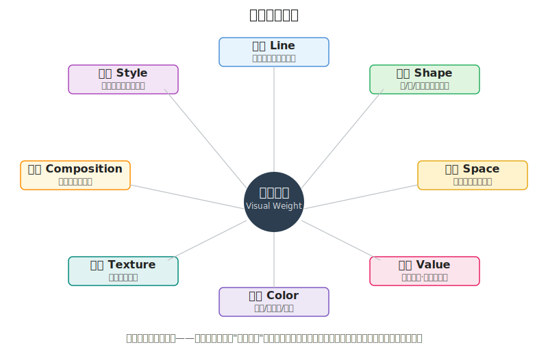
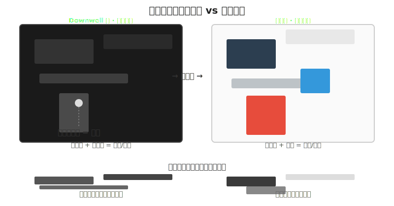
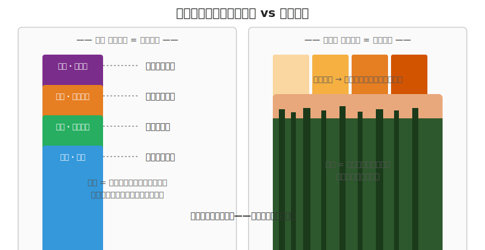
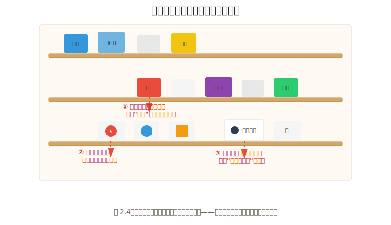

# 观察02 八概念速览：像素画面的八种数据类型

### 2.0 这一章解决什么问题

你现在有了一个三能力模型和一个自评分数，知道自己哪一层弱。但你还缺一套"分析语言"——一套拿来就能用的词汇，让你不再只能说"这张图好看"。

这一章给你八个词。这八个词构成了一套完整的视觉分析框架。读完这一章，你能拿着任何一张游戏截图，从至少三个维度说出"这里为什么有效"或"这里为什么垮了"。更重要的是，你会理解这八个概念如何组合成一个游戏美术中最核心的概念——**视觉权重**（Visual Weight）——玩家的眼睛先看哪里、再看哪里、忽略哪里，全由它决定。

这不是最终版。练手01 到练手07 会把前七个概念逐个拆开深练，风格01 到风格04 展开风格决策，练手09 做八概念合奏。这一章是速览——让你先有全局地图，知道自己手里有多少种工具。

### 2.1 核心概念

#### 八概念速览：像素画面的八种数据类型

在你看任何画面之前，先有词。这八个概念是西方美术教育的基石——通常归入"Elements of Art"（艺术元素）和"Principles of Design"（设计原则）两个范畴 [1]。它们不是八个孤立的课，而是八种观察视角——你每次看画面，可以调用其中任意几个来形成分析。

把八概念想象成编程语言的**八种基本数据类型**。你不会每次写程序都用上全部的 int、float、string、bool、array、map、struct、pointer——但你知道它们每一个的存在和用法。需要的时候，你自然知道用哪个。视觉分析同理：你不会每次都从八个维度看一张图，但你知道这八个维度的存在，需要的时候随时调取。

| # | 概念 | 一句话定义 | 在像素游戏中的体现 |
|---|------|-----------|---------------|
| 1 | **线条**（Line） | 点的运动轨迹。可以是实线、虚线、隐线（视线引导） | 《Shovel Knight》硬黑轮廓线强化 8-bit 实体感；《Hyper Light Drifter》几乎不用轮廓，靠抖动和发光界定形状 |
| 2 | **形状与体积**（Shape & Form） | Shape 是 2D 的轮廓区域；Form 是 3D 的体量感 | 《Dead Cells》主角轮廓在高速动作中仍一眼可辨；《Minit》用极简 1-bit 剪影传达身份 |
| 3 | **空间**（Space） | 正形（主体）与负形（留白）的关系，也指纵深层次 | 《Loop Hero》一条环路被大片空地包围，负空间营造冥想感；《Undertale》弹幕框塞满弹幕 = 压迫 |
| 4 | **明度**（Value） | 颜色的亮暗程度。比色彩更基础——去色后还能读出焦点才算合格 | 《Downwell》黑底白敌红道具，几乎只用明度对比；检验法：把截图去色，焦点还在就是明度扎实 |
| 5 | **色彩**（Color） | 色相/饱和度/明度三者组合的系统 | 《蔚蓝》冷紫/暖橙区分危险与安全；《星露谷物语》黄昏暖色营造怀旧情绪 |
| 6 | **质感**（Texture） | 表面的视觉特性——光滑/粗糙/透明/金属/毛茸茸 | 《星露谷物语》的 tile 重复纹理让地面有"摸得到"的颗粒感；《Hyper Light Drifter》用抖动模拟过渡质感 |
| 7 | **构图**（Composition） | 元素在画面中的组织方式——焦点、平衡、视线流 | 《空洞骑士》前景/中景/远景分层营造纵深；任何好像素游戏的截图都能找到明确的视觉重心 |
| 8 | **风格**（Style） | 以上七者在特定方向和约束下的整体视觉语言 | 1-bit 极简、8-bit 复古、高细节现代像素——风格是一个"打包好的视觉决定集" |

建议你现在就把这八个词写在便利贴上，贴到显示器旁边。之后每次看到任何画面——游戏截图、电影帧、便利店货架、地铁广告——试着用其中2-3个概念去描述它。坚持两周，你会发现自己看东西的方式已经变了。这不是玄学，这是词汇量带来的认知分辨率提升。

*图 2.1：八个概念不是孤立的——它们全部作用于"视觉权重"这个核心。一个元素在哪方面权重高，玩家的眼睛就会先看到它。*

#### 线条（Line）——画面的骨架

线条是画面最基本的构成单元。但"线条"在这里不只是一根可见的线——它包括实线（轮廓线）、虚线（虚线边界）、隐线（视线方向、动态轨迹）。

在像素艺术中，线条遵循简单的比率规则 [2]。斜线的斜率必须遵守特定比例，否则就会产生"锯齿"（jaggies）——像素画中那种看起来像阶梯的粗糙边缘。1:1 斜率 = 45° 对角线，最平滑；2:1 斜率 = 较缓的斜线，次平滑；1:0 斜率 = 纯水平或垂直，完全平滑。任何偏离这三个比率的斜线——比如 3:1——都会在像素尺度下产生视觉噪音。

> **程序员类比：** 像素线条不是你画出来的，是**斜率决定的**。就像你写 Bresenham 画线算法时，不同的斜率产生不同的"阶梯模式"——像素艺术中的线条规则就是从同一个数学原理出发的。画线工具只是在选好的格点上落子，规则还是那套整数增量。

**游戏中的极端差异**。《Shovel Knight》的线条是硬直的黑色轮廓——每一道边都用纯黑勾边，没有柔和过渡。这种处理让整个世界看起来像一台升级版 NES，一切充满"可触碰"的实体感和复古的稳定感。而《Hyper Light Drifter》几乎不用轮廓线——它的形状靠抖动（dithering）渐变和发光描边来界定，线条是隐形的、由色块边界自然形成。同样的元素（线条），完全不同的处理方式：一个用线去"圈住"形状，一个让线从色块中"长出来"，产生完全不同的心理感受——前者是经典工匠感，后者是空灵末世感。

#### 形状与体积（Shape & Form）——一眼能认出来吗

形状（Shape）是 2D 轮廓，体积（Form）是 3D 体量感。在游戏中，形状语言是第一可读要素。行业标准测试叫**剪影测试**（Silhouette Test）：把角色填黑，缩小到游戏实际尺寸——你还能认出它是谁、在干什么吗？

形状心理学有一条简单规则：圆形 = 友好/安全/软萌（想想《星露谷物语》里圆滚滚的母鸡和史莱姆），方形 = 可靠/笨重/稳定（想想《Minit》里所有 NPC 都是稳重的方块），三角形 = 危险/尖锐/攻击性（想想《蔚蓝》里到处扎人的紫色尖刺）。这不是感觉——这是认知心理学层面的视觉分类机制。你的大脑在看到尖角形状的瞬间就已经进入了警觉状态，远在你"思考"这个角色是什么之前 [3]。

**游戏中的极端差异**。《Dead Cells》的主角"被囚者"细节不少——破布、锁链、面部——但它的整体剪影是一个前倾、蓄势的锐角三角形，在高速翻滚和攻击中你永远能一眼锁定它在哪、朝哪。这就是形状语言的力量：细节再多，剪影先行。《Minit》走的完全相反的路线——它用 1-bit 黑白方块和极简几何拼出所有角色，几乎没有内部细节，身份完全靠轮廓的几何差异传达。同样的"形状"概念，前者在复杂动作中保剪影可读，后者在极简抽象中靠几何辨识——都是在"减到只剩最必要的形状信息"。

#### 空间（Space）——空白不是空

空间 = 正形（有物体的区域）+ 负形（留白/空白区域）。构图大师 Arthur Wesley Dow 有一句名言："空白是绘画的肺"——负形不是"没有东西"，它是画面的"呼吸" [4]。

> **程序员类比：** 正形是你的 UI 元素，负形是元素之间的 padding 和 margin。没有足够 padding 的设计是灾难性的——所有东西挤在一起，你不知道先看哪一个。画面同理。负空间的三个功能：（1）给眼睛提供休息区；（2）通过对比突出正形（留白越大，主体越重要）；（3）建立视觉节奏（有规律的留白制造秩序感）。

在 2D 游戏中，空间还表现为**纵深层次**——前景、中景、远景的分层。视差滚动（Parallax Scrolling）就是通过移动速度差来模拟深度：远景层移动最慢，中景居中，前景最快 [5]。像素游戏虽然天生 2D，但靠分层和视差一样能"骗"出深度感——练手03 会专门拆这个。

**游戏中的极端差异**。《Loop Hero》的画面几乎就是一条小环路被一大片空地包围——正形极小、负形极大。这种"几乎全是空白"的构图配合自动战斗的慢节奏，传达的是冥想、抽离、"世界在自行运转"的 contemplative 情绪。而《Undertale》的弹幕战斗框则是另一极端——一个小框里塞满各种形状的弹幕，几乎全是正形、没有留白——它传达的是压迫、紧张、"下一秒躲不躲得开"的刺激。两种极端用途：空 = 情绪/冥想，满 = 刺激/压迫。

#### 明度（Value）——去色之后才见真章

明度是颜色的亮暗程度。**在所有八个概念中，明度是最基础的——比色彩更基础。** 詹姆斯·格尼（James Gurney）在《Color and Light》中说了一句被无数次引用的话："如果你的画面去饱和后看起来不好，那加颜色也不会救回来。" [6]

> **程序员类比：** 明度就是像素的**灰度值 intensity**——0 到 255 之间的那个数字。色彩是"类型"（hue type），明度是"强度"（intensity value）。你天然擅长处理"值"——循环里的计数器就是值，变量的状态就是值。明度是八概念中最接近"数据类型"的概念，所以程序员应该从明度开始建立美术直觉。

明度在游戏中的三个作用：（1）构建体积感——亮面、灰面、暗面的过渡让你感知到"这是个三维物体"；（2）建立视觉焦点——人的眼睛会先被画面中最亮或对比最强的区域吸引；（3）营造情绪——全局偏暗 = 压抑/神秘/恐怖；全局偏亮 = 开阔/安全/轻快。

**游戏中的极端差异**。《Downwell》几乎只依赖明度对比——它的色板就是黑、白、红三色：黑底、白敌、红道具与血。所有信息——敌人在哪、道具在哪、井壁可踩不可踩——全由"哪里亮、哪里暗、哪里是唯一的红"决定。把它的截图去色，结构和焦点几乎没有任何损失。而《星露谷物语》的画面则更依赖色彩来区分元素——不同季节的色调、不同作物的色相、不同 NPC 的服装颜色各有标识。但如果你把两张截图都去色（转灰度），《Downwell》的画面依然锋利清晰，《星露谷》里靠季节色相编码的信息会损失一部分（春夏草地的明度可能很接近）。

*图 2.2：无论画面是极暗（Downwell 式）还是极亮，明度结构决定了画面的第一印象。去色后还能看出层次和焦点 = 明度扎实。*

去色检验法是你从现在开始就应该养成的习惯：画完任何东西，Ctrl+Shift+U（Photoshop/Krita 的去色快捷键）或在 Aseprite 里把图层转灰度模式看一眼。如果去色后画面变成了一团灰——焦点消失了、层次扁平了、角色和背景混在一起了——说明你在靠色彩"作弊"掩盖明度问题。练手04 会展开讲如何修复明度结构。

#### 色彩（Color）——信号，然后才是装饰

色彩有三个可以独立调节的变量：**色相**（Hue——红还是蓝）、**饱和度**（Saturation——鲜艳还是灰色）、**明度**（Value——亮还是暗） [6]。这三个变量的组合形成了一个巨大的可能性空间——这也是为什么色彩是八个概念中最容易让人"迷失"的。

但对游戏美术来说，色彩有一条黄金规则：**色彩在游戏中的第一作用是信号，第二作用才是装饰。** 玩家可能不会分析你的色彩搭配，但玩家一定会——在 0.2 秒内——根据颜色判断"那个是平台吗？那个会伤害我吗？我要往哪边走？"

《蔚蓝》（Celeste）是这条规则的极致践行者：冷紫色 = 危险尖刺区，暖橙色 = 安全平台/可抓墙，红色 = 草莓（收集物），冰蓝色 = 主角 Madeline。玩家不需要读任何教程——颜色本身就是在说"踩那里！别踩这里！"《Undertale》同理：战斗中灵魂的颜色改变直接改变玩法机制——红魂自由移动、蓝魂受重力、黄魂可射击——颜色的对比本身就是玩法机制的一部分。这不是"配色好看"，这是"色彩在运行游戏逻辑" [7]。

*图 2.3：色彩可以"发出指令"（左，蔚蓝式），也可以"建立情绪"（右，星露谷式）。好的游戏美术通常两者兼有。*

另一种用法是色彩作为情绪载体。《星露谷物语》的整个游戏有一个温柔的昼夜循环——黄昏时分整个调色板滑向暖橙→紫红的暮色，色彩不传递任何玩法指令，但建立了一种持续的"劳作一天后的满足与怀旧"的情绪基调。你不需要分辨哪个颜色是平台——因为《星露谷》里没有会扎死你的尖刺。

关键认知：**同一个色板不能同时做"信号"和"情绪"两种事——至少不能同等重要地做，这在高可读性游戏界面中是有效原则，不是绝对规律。** 如果你的游戏有高速的操作反馈需求（平台跳跃、射击），优先让色彩服务于功能性；如果你的游戏是叙事驱动的慢节奏体验，可以让色彩更多地服务于情绪。但无论哪类游戏，功能性色彩（危险提示、选中状态、可交互物标记）必须优先于装饰性色彩——因为玩家看不到信息比画面不好看更致命。练手05 会展开这个优先级体系。

约瑟夫·阿尔伯斯（Josef Albers）的经典色彩实验证明了一个你试过一次就忘不掉的原理：**同一个颜色在不同背景下看起来完全不同** [8]。一个中灰色块放在白色背景上显得深，放在黑色背景上显得浅。这不是玄学，这是视觉系统的工作方式——你的大脑不是在读取"绝对颜色值"，而是在计算"颜色差异"。这对游戏美术的启示：不要孤立地选择颜色，要在"这个颜色会和什么颜色相邻"的上下文中选择。

#### 质感（Texture）——让画面可以触摸

质感是画面的触觉维度。一段不加纹理的木地板只是一个褐色长条——你知道它是木头因为你被"告诉"了它是木头。加了木纹后，它让你"感觉到"脚踩在上面的触感——你知道它是木头因为你"体验"到了它是木头 [9]。

在像素游戏中，质感主要通过以下方式实现：
- **Tile 重复纹理**——地面、墙壁、植被的"无缝拼接图案"。一块 16×16 或 32×32 的 tile 在引擎中自动重复铺满整个场景。这本质上是把一张小图当数组循环——练手06 会把它和"无缝 tile = 可平铺数组"的程序员视角接起来。
- **抖动**（Dithering）——在像素艺术中，用 1px 间隔的棋盘格分布来制造"过渡质感"的视觉幻觉。这是只有几个颜色时模拟渐变和粗糙面的核心技术。
- **法线贴图 / PBR 材质**——这两项主要属于 3D 流水线，像素游戏一般用不到；但如果走"3D 渲染→像素化"的非手绘管线（制作06），它们会回到台面上。
- **轮廓与抗锯齿的取舍**——硬边 = 像素感/手工感；抗锯齿边 = 柔软/现代感。这也是质感的一部分。

**游戏中的极端差异**。《星露谷物语》中每一个地块、每一块地板、每一种作物都有自己的 tile 纹理——当你走过草地、翻过泥土、踩在木地板上时，画面下方的纹理在无声地告诉你"你在哪里"。这种质感处理让一个像素游戏有了"触感"。《Hyper Light Drifter》走的是另一条路——它大量使用抖动来在极有限的色板里模拟光、雾、金属反光的过渡质感。去掉抖动，《HLD》的画面会瞬间塌成一块块平涂色块；加上抖动，它有一种可以"摸到空气湿度"的末世质感。两种做法，一个靠 tile 重复定义"地点的触感"，一个靠抖动定义"空气的触感"。

#### 构图（Composition）——观众的眼睛跟着你的设计走

构图是所有视觉要素在画面中的组织方式。Chris Solarski 在《Drawing Basics and Video Game Art》中阐述了核心原理："强构图指引玩家的视线沿着设计师预设的路径，逐一经历游戏中要传达的事件和信息。" [10]

构图的几个基本工具：
- **视觉权重分布**——亮>暗，高对比>低对比，暖色>冷色，大>小，人脸>物体。画面中权重最高的区域 = 焦点。
- **引导线**——道路、栏杆、光线、角色的目光方向——指向焦点的任何线条。
- **三分法**——把画面横竖各切两刀，四个交点是天然的高权重位置。放主体在这些交点上。
- **负空间**（见上文"空间"）——留白不仅是"空"，它是构图中的主动力量。

**游戏中的极端差异**。《空洞骑士》的构图被很多分析者当作 2D 游戏纵深构图的教科书——圣巢的每一个场景都有清晰的前景植被、中景可走平台、远景殿堂轮廓三层，玩家的视线被引导从近到远地"读"出一个立体的地下王国，玩家角色永远处于构图中的合理位置。而《Dead Cells》的构图是动态的、中心化的——镜头紧贴主角，玩家的视线永远锁定在自机周围的一个小区域内，构图服务于"在这个区域内快速识别威胁和路线"的需求。两种极端：静态的构图像拍照（你停下来看），动态的构图像导航（你边跑边扫）。

游戏构图的特殊之处：不同于油画或照片——游戏画面中玩家角色在移动、镜头在移动、UI 元素会叠加遮挡、不同分辨率窗口下同一构图可能完全不同。这意味着游戏构图需要一定的"鲁棒性"（robustness）——它不能只在一个理想焦距和长宽比下工作。这是纯美术训练不会教你的，但在第四部制作（尤其是制作02 角色工作流到制作09 一致性审计）的实战环节中你会反复碰到。练手07 会专门训练构图。

#### 风格（Style）——当所有零件开始说同一种语言

风格不是八个概念中的一个"额外"的概念。风格是前七个概念在特定方向和约束下的**整体语言**。像素风格不是"把分辨率降低"——它是一套关于线条斜率、色板大小、形状简化程度、纹理抖动模式、构图比例的一致约定。同为"像素风格"，1-bit 极简、8-bit 复古、16-bit SNES、高细节现代像素又是各自不同的整套决策——风格是一个多轴系统，可以按"分辨率 × 色板大小 × 线条处理 × 抖动程度 × 动画密度"几个轴去拆 [11]。

一个简单的方法来理解风格：假设你的游戏要做两种不同的像素视觉方向——

- **方向 A**（1-bit / 8-bit 极简，Minit 式）：线条遵循严格的 1:1/2:1/1:0 斜率；形状用极简剪影，内部细节 ≤ 2-3 种颜色；明度用高对比（因为颜色少，全靠明度区分元素）；色彩用 1-4 色的固定色板（每一色都有具体的 RGB 值，不能随便加）；质感用抖动来模拟过渡；构图用横向卷轴或单屏的比例约束。风格文档会说"任何新素材必须从 Lospec 色板 X 中取色，全图不超过 4 色，禁止抗锯齿"。

- **方向 B**（高细节现代像素，Dead Cells / Hyper Light Drifter 式）：线条用更细的像素勾边或干脆无轮廓靠色块界定；形状用更多内部层次和动态姿势；明度用更细的渐变（通过抖动或更多色阶）；色彩用 16-32 色以上的扩展色板，但仍受约束；质感用抖动 + 细密 tile + 程序化光效模拟氛围；构图用更复杂的分层和动态镜头。风格文档会说"动画帧数充足，允许运动模糊帧，但所有素材必须共用同一套色板和光照方向"。

同一个概念（比如"一个宝箱"）在这两种风格下会是完全不同的东西——不是说"好"和"坏"的区别，是"类型"的区别。风格选择的本质不是"选好看的"，是"选你做得到的而且和你的游戏匹配的"。风格01 到风格04 会有风格选择的详细决策框架。

#### 视觉权重：八概念的统一主题

如果本章只能记住一个词，记住**视觉权重**（Visual Weight）。Riot Games 在它的入门教程中说了一句可以作为全书哲学前提的话："我们做的一切都可以被理解为对比度——一切归于对比。"（Everything we do can be framed in terms of contrast.） [1]

这就是视觉权重的本质：**画面中每个元素都在竞争玩家的注意力，而八概念就是你可以调节的八个"注意力旋钮"。** 一个元素如果在某个维度上和其他元素产生显著差异，它在那个维度上的视觉权重就高——玩家的眼睛会先看到它。

具体来说：
- **线条**：粗线>细线，曲线>直线，斜线>水平线。一根粗的红色斜线会把玩家的目光直接从角色身上拉走。
- **形状**：复杂形状>简单形状，不规则>规则，人脸形状>任何其他形状。这就是为什么主角的细节密度必须高于 NPC。
- **空间**：被负空间包围的物体>挤在一起的物体。单独一粒棋子比棋盘中任意一粒更显眼。
- **明度**：亮>暗，高对比区域>低对比区域。这是最基础、最强的注意力调节旋钮。
- **色彩**：暖色>冷色，高饱和>低饱和，红色>任何其他颜色。红色在画面中的权重在多数高可读性游戏界面中成立，不是绝对规律——如果不是有意让玩家看红色物体，就别在画面中放红色。
- **质感**：高细节纹理>低细节纹理，不规则纹理>规则重复纹理。
- **构图**：画面中心>边缘，三分线交点>其他位置，被引导线指向的区域>未被指向的区域。
- **风格**：风格一致的元素增强彼此的视觉权重（互相强化），风格不一致的元素互相削弱（互相抵消）。

**八概念的组合逻辑**。在实际画面中，这些旋钮不是独立工作的。一个元素可能同时在线条维度权重低（细线勾边），但在色彩维度权重极高（唯一的红色），综合下来它仍然可能是视觉焦点。这就是为什么你不能单独用"这个红色太亮了"来判断问题——你需要同时考虑这个红色物体在明度、形状、空间、构图上的相对权重。如果它被放在画面角落（低构图权重）且被大量负空间包围（高空间权重），它仍然可能是视线第一个到达的点。

> **程序员类比：** 这个"权重叠加"的概念，对程序员来说应该不陌生。它就像 CSS 的 **z-index 叠加规则**——不是某个单一属性决定谁在上层，而是 position、z-index、opacity、transform 的综合结果。视觉权重同理——不是某一个概念单独工作，而是八个概念在互相叠加和竞争。练手09 的八概念合奏会专门练这种"同时调八个旋钮"的综合判断。

### 2.2 上手行动

本章的上手行动叫**便利店测试**。这不是比喻——是真的去一家便利店。

过程很简单：走进任何一家便利店（7-11、全家、罗森），站在货架前，不要"思考"，先让眼睛自然被吸引。你最先看到的是什么商品？（拍照前注意不要影响商家/顾客。）然后问自己三个问题：

1. **色彩**：它是不是用了货架上最突出的颜色组合？（红色包装在灰白蓝的海洋里天然是焦点）
2. **形状**：它的 logo 或瓶身形状是否打破了周围的矩形阵列？（圆形 logo 在全是方盒子的货架上是天然异类）
3. **空间**：它周围的留白是否比别的商品多？（包装上大面积留白的产品看起来比满版文字的产品更"重要"）

*图 2.4：下次去便利店，用三个概念分析货架——哪个商品先抓住你的眼睛？为什么？这是最天然的构图和视觉权重训练场。*

如果你不想出门，替代方案：打开手机上的任何电商 App 首页（淘宝、京东、Amazon），截屏，用同样的三个问题分析——"我第一眼看的是哪个区域？为什么是它？"每天花 2 分钟做一次，持续一周。你会在不需要任何额外工具的情况下，把"视觉权重"从抽象概念变成身体直觉。

### 2.3 本章小结

- **八概念是你的视觉分析工具箱**——线条、形状、空间、明度、色彩、质感、构图、风格。它们是八种观察视角，不是八门独立的课。每次看画面时调用其中 2-3 个概念，就像写代码时调用你知道的库函数。
- **明度是所有概念中最基础的**——比色彩更基础。去色检验法是你从现在开始就应该养成的习惯。如果去色后画面焦点丢失、层次扁平，说明你在靠色彩掩盖明度问题。
- **视觉权重是八概念的统一主题**——Riot 的"一切归于对比度"是全书的核心设计哲学。你在画面上做的每一个决定，本质是在调节某个元素在某个维度上的视觉权重。
- **如果只记住一句话：** 一切归于对比。

### 2.4 扩展阅读

**如果想深入：**
- 《Color and Light》James Gurney——整本书都在展开"明度"和"色彩"两节提到的原理。不是学术书——每一页都是一个具体的绘画案例和一个具体的原理 [6]。
- 《Picture This: How Pictures Work》Molly Bang——用剪纸拼贴一步一步证明形状、色彩、空间如何操纵情绪。1 小时读完。读完后你会用完全不同的眼光看任何画面 [3]。
- 《Framed Ink》Marcos Mateu-Mestre——从电影分镜的视角讲构图和视觉引导。对游戏场景设计师来说，分镜语言比纯绘画理论更直接可转译 [12]。

**如果时间有限：**
- Marco Bucci "10 Minutes to Better Painting" 系列（YouTube）——从第 1 集 "Value" 开始。业内公认最好的免费明度入门。不需要看完全系列，看明度和色彩那两集就够了。
- Derek Yu 的像素教程（derekyu.com/makegames/pixelart.html）——Spelunky 创作者的经典免费像素教程，涵盖了本章提及的线条斜率规则和色板原则 [2]。
- Riot Games "So You Wanna Make Games??" 第 1 集（YouTube）——如果序章时没看，现在看。本章的"视觉权重"框架和 Riot 的"对比度"思想完全对齐 [1]。
- Coolors（coolors.co）——打开网站，按空格。每按一次生成一套五色色板。锁定你喜欢的颜色继续微调。这是一个零成本的"色彩感知训练器"——你不需要知道理论，你的手指会学会什么搭配"看起来对"。
- Lospec（lospec.com/palette-list）——像素向的调色板库。数百套社区验证的有限色板，每套都标了颜色数和用途。挑一套临摹一张图，感受"有限色板"如何逼你把明度做扎实。

### 2.5 本章引注

[1] Riot Games，"So You Wanna Make Games?? | Episode 1: Intro to Game Art"，YouTube，2018。https://www.youtube.com/playlist?list=PL0N8FjRiKPI7LxM_D3cA30sx2AgBy5Gk0

[2] Derek Yu，"PIXEL ART TUTORIAL: BASICS"。Spelunky 创作者的经典免费像素教程，涵盖了本章提及的线条斜率规则和色板原则。https://derekyu.com/makegames/pixelart.html

[3] Bang, M.，《Picture This: How Pictures Work》，修订 25 周年纪念版，Chronicle Books。用剪纸拼贴实验证明了形状语言如何操控情绪反应。https://www.chroniclebooks.com/products/picture-this-revised-edition-paperback

[4] Dow, A.W.，《Composition: A Series of Exercises in Art Structure for the Use of Students and Teachers》，1899。最早系统阐述负空间在构图中地位的著作之一。

[5] Moos，"Parallax Scrolling in 2D Game Art"——引自 Nguyen, M.，"Fundamentals of 2D Game Art"，Theseus，2021。https://www.theseus.fi/bitstream/handle/10024/504796/Nguyen_Mai_Fundamentals_of_2D_Game_Art.pdf

[6] Gurney, J.，《Color and Light: A Guide for the Realist Painter》。被 Kolibri Games 艺术家称为"可能读过的最好的色彩书"：https://www.kolibrigames.com/blog/our-5-favorite-resources-for-game-artists/

[7] Beast Breaker 开发日志——Jemma Salume 关于"色彩词汇"（Color Vocabulary）和相关色彩编码的设计论述。参见 Game Developer 及开发者个人博客。

[8] Albers, J.，《Interaction of Color: 50th Anniversary Edition》，Yale University Press，2013。https://yalebooks.co.uk/book/9780300179354/interaction-of-color/

[9] Magnopus，"Why it looks 'amazing': The foundational rules of visual composition"，2025。https://www.magnopus.com/blog/why-it-looks-amazing-the-foundational-rules-of-visual-composition

[10] Solarski, C.，《Drawing Basics and Video Game Art》，Penguin Random House。John Romero 作序，将古典艺术原理与游戏美术并置讨论。https://www.penguinrandomhouse.com/books/214681/drawing-basics-and-video-game-art-by-chris-solarski/

[11] RocketBrush，"3D Art Styles for Games: Most Popular Types Overview"，2024。将风格分解为方向 × 几何复杂度 × 渲染方式 × 视角 × 情绪的多轴系统；其多轴拆解方法同样适用于像素子风格。https://rocketbrush.com/blog/exploring-3d-art-styles-for-games-a-guide-to-the-most-popular-types

[12] Mateu-Mestre, M.，《Framed Ink: Drawing and Composition for Visual Storytellers》。电影分镜视角的构图教学，对游戏场景设计师极有参考价值。
