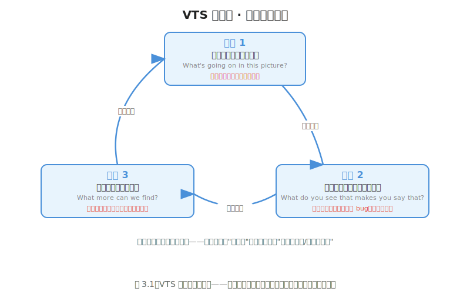
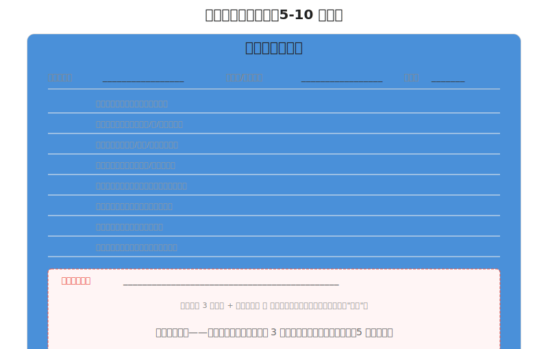

# 观察03 VTS侦探法：像调试代码一样分析画面

### 3.0 这一章解决什么问题

观察02给了你八个词。但知道词和会分析是两回事。就像你背下了编程语言的所有关键词，不代表你就能读懂别人的代码——你还需要一套"怎么读"的方法。

这一章给你那个方法。它叫VTS（Visual Thinking Strategies，视觉思维策略）——由认知心理学家Abigail Housen和博物馆教育者Philip Yenawine在1990年代开发的一套画面分析方法 [1]。它的核心是三个开放式追问。这三个问题看起来简单到不可思议，但当你真正用它去分析一张游戏截图时，你会发现：你之前的"看"，几乎都是在"感觉"；用了这三个问题之后，你才开始在"分析"。

这就好比——你之前看到一个crash只说"程序崩了"，学完这一章你会像调试代码一样说"这是NullPointerException，原因是第42行的user对象在init之前被调用了"。

### 3.1 核心概念

#### 3.1.1 VTS三问法——三个问题拆开任何画面

VTS最初是为博物馆教育设计的：让没有美术训练的普通人也能对艺术品进行有深度的观察和讨论。Housen的研究发现，当观众被反复问这三个问题时，他们的观看方式会发生结构性变化——从"我只看到了一个花瓶"到"我注意到画家的笔触方向创造了一种向左下流动的感觉，而花瓶上的高光点让我觉得光源在右上方" [1]。

这三个问题是：

**问题一：这幅画里发生了什么？**（What's going on in this picture?）

这是入口问题。它不问你"这幅画好不好看"，不问你"这是什么风格"，只问你"发生了什么"。这个问题把"判断"变成了"描述"——就像你在Code Review时第一句话不是"这段代码很烂"，而是"这个函数做了三件事：验证输入格式、查询数据库、发邮件"。

**问题二：你看到了什么让你这么说？**（What do you see that makes you say that?）

这是三个问题中最关键的一个。它要求你提供**画面证据**。你不能只停留在"我觉得这个角色很重要"——你必须指出画面中的什么东西让你产生了这个判断。是它被放在了画面正中？是它的明度比周围所有元素都亮？是它的颜色是画面中唯一的红色？

这个问题就像调试时的那句追问——"你说这个变量有问题，你看到了什么让你这么说？是它的值在断点处是null？是它的类型和预期不符？证据呢？"

**问题三：我们还能发现什么？**（What more can we find?）

这是推动深度的引擎。第一遍你看到了"一个角色站在场景里"，第二遍你看到了"光源引导视线注意到主角"，第三遍你看到了"负空间的比例让这个场景有一种被压扁的窒息感"。这个问题禁止你说"我看完了"——它假设任何画面都有更多东西可看。

这就好比你在写测试用例——写完Happy Path，问自己"还有什么边界条件没测到？"。第一次你测了"空字符串"，第二次你测了"超长字符串"，第三次你测了"包含SQL注入字符的字符串"。

这三个问题不是线性问答——它们是一个**循环**。问完问题三之后，你可能会发现新的线索，这又会触发新的问题一。每一轮循环，你的分析深度增加一层。

*图 3.1：VTS 三问法核心流程——三个问题形成闭环，每一轮循环都将分析推深一层。*

#### 3.1.2 为什么这三个问题有效——从"感觉"到"证据"

你之前分析画面的方式可能是这样的：

> 这个场景挺有氛围的。颜色很好看。角色设计也不错。

这不是分析，这是**基于直觉的整体印象**。直觉不是错的——但直觉不能告诉你"怎么改"和"为什么对"。如果一张图"感觉不对"，你拿着直觉去找问题，就像在十几万行代码里用`print`排查bug——你可能最终会找到，但你浪费了大量时间，而且下次碰到类似问题你仍然要从头摸索。

VTS三问法的核心机制是把"判断"和"证据"强制绑定。第二个问题——"你看到了什么让你这么说"——是整套方法的引擎。它做了一件事：**把主观感受转译成可验证的视觉事实**。

这和你调试代码时的思维过程是一样的。你写了一个函数，它返回了错误结果。你不会只停在"结果不对"这个感觉层面——你会问自己："我看到函数的输入是X，预期输出是Y，但实际输出是Z。这个差异告诉我什么？"然后你会进一步验证："输出Z是在哪一步产生的？是什么变量的值异常导致了这个问题？"

转换到VTS的语境中：

| 调试代码 | VTS分析画面 |
|----------|------------|
| "程序崩了" | "这张图看着不舒服" |
| "哪里崩了？" → 查stack trace | "哪里不舒服？" → 找画面证据 |
| "这个变量为什么是null？" | "这个区域的明度为什么让我看不清角色？" |
| "回溯调用链找到根因" | "回溯视觉权重链——是色彩太接近了还是背景太亮？" |
| "修bug → 跑测试 → 验证" | "调整明度 → 再看 → 验证焦点是否清晰" |

VTS 理论将观看者发展描述为，当观众（无论有无美术背景）持续使用VTS三问法后，他们的视觉分析能力会经历一个可预测的进阶过程——从"叙述型观看者"（Stage 1: 只看故事情节，用个人经验填补空白）到"建构型观看者"（Stage 2: 开始用形式语言——线条、色彩、构图——来构建自己的解读框架）再到"分类型观看者"（Stage 3: 能同时考虑风格特征、历史语境和艺术家的意图） [1][2]。

对独立游戏开发者来说，你不需要到Stage 3——你只需要从Stage 1快速过渡到Stage 2。Stage 2已经足够你去分析任何游戏截图、诊断自己的画面、和美术合作时有据可依地提出反馈。

#### 3.1.3 完整VTS实操实例——《Dead Cells》囚犯的宿舍

为了让你看到VTS三问法在实际操作中的威力，我用一个具体的例子来演示——Motion Twin的《Dead Cells》（死亡细胞，2018）开局区域"囚犯的宿舍"（Prisoners' Quarters）的一个典型场景 [3]。如果你没玩过也没有关系——我用文字描述画面，你跟着走三遍分析。这是高细节现代像素风格的代表作，正好可以让你看到像素专属的视觉手段（tile、抖动、色板约束、视差分层）如何被VTS逐层拆开。

**画面描述**（用文字代替截图）：

> 画面是一个横向卷轴的地下牢房。整体色调是冷青蓝绿——墙壁、地面、远处的栏杆都在这个色域里。地面和平台由重复的石块 tile 拼成，边缘有苔藓和破损。中景两侧插着火把，发出暖橙黄色的光，照亮脚下的一小块地面。主角"被囚者"是一个小尺寸像素人，头部是一团明亮的绿色火焰，身体是深褐绿色的破布和锁链，手持武器站在画面中偏左的平台边缘。右侧远处站着一个僵尸敌人，颜色比背景略亮、略饱和，但色调同属冷域。背景分了三层：最远是一排模糊的栏杆和拱门（最暗、最去饱和），中景是悬挂的锁链和断裂的墙（中等明度），前景是贴近镜头的几根立柱（最暗、最锐利）。所有过渡都用 1px 棋盘格抖动（dithering）实现，没有平滑渐变。

**第一轮VTS分析——"看有什么"**

- 问题一（发生了什么？）：一个头顶绿色火焰的小人在一个冷色调的地下牢房里，站在平台边缘。墙上有火把，右侧远处有一个敌人。背景有栏杆和锁链。
- 问题二（看到了什么让你这么说？）：头顶那团绿色火焰是画面里唯一的小面积亮色块，让我认出那是主角。火把的橙黄光在冷青环境里是异色，自然标出了它的位置。右侧那个敌人比它周围的墙壁略亮、略饱和，所以我能把它从背景里分出来。
- 问题三（还能发现什么？）：地面不是一整块平涂——你能看到石块的拼接缝，是 tile 重复。火把的光照不远，有一个明显的衰减边界，边界外就回到冷色暗调。背景的栏杆和锁链明显分了好几层，越远越淡。

这一轮分析停留在"叙述"层——你在描述画面里有什么，谁在哪，什么亮什么暗。这是初学者的自然起点。但真正的分析从第二遍才开始。

**第二轮VTS分析——"找证据"**

- 问题一（发生了什么？）：画面用一个"明度+饱和度"双层系统把玩法相关信息（主角、敌人、可踩平台、火把）从装饰（远景栏杆、锁链、苔藓）里分离出来。所有"你需要快速反应"的元素都被推到更高的对比度上。
- 问题二（看到了什么让你这么说？）：主角的绿色火焰头是画面中**唯一的小面积高明度暖色块**——它同时占用了明度对比和色相对比两条通道，所以在高速翻滚中你永远锁得住它。敌人的明度和背景接近，但**饱和度**略高一档——它不靠明度炸眼，靠"比周围纯一点点"被识别，这是在受限色板内做信息分层的典型手法。可踩平台的顶面有一道亮边（火把光打到的高光），侧面是暗的——这道亮边是"这里能踩"的视觉信号。远景栏杆被压到最低饱和度+最暗明度，几乎和空气融合——它的功能是"暗示这是牢房"而不是"你要去看它"。
- 问题三（还能发现什么？）：抖动。光照到暗的过渡不是平滑渐变，是 1px 棋盘格——这是像素艺术在受限色板下"假装有更多色阶"的标准技术（观察02 质感节提到过，练手06 会展开）。再看视差分层：前景立柱最暗最锐利，中景锁链中等，远景栏杆最淡——一个**用明度差模拟景深**的层级，和练手03 的视差滚动是同一套原理。圆形（火把光圈、主角火焰头）在这个满是直角石块和垂直栏杆的场景里是异类形状，天然吸眼。

第二轮你已经开始调用八概念——明度、色彩、形状、空间——来做具体分析。你不再说"这个场景有氛围"，你在说"主角靠明度+色相双通道抢占注意力，敌人靠饱和度微差被识别，装饰被压到低明度低饱和度退场"。这是从"感觉"到"证据"的质变。

**第三轮VTS分析——"诊断视觉权重"**

- 问题一（发生了什么？）：这个画面的视觉权重分布服务于一个明确目标——让玩家在一个动态镜头、高速移动的场景里，用 0.1 秒分辨"我在哪、威胁在哪、能踩哪里"。它用一套受约束的色板和像素专属手段（抖动、tile、视差层）做到了这件事，不靠任何文字。
- 问题二（看到了什么让你这么说？）：把画面去色（练手04 的去色检验法），你会发现焦点依然清晰——主角的火焰头转灰度后仍是画面中**最亮的小区域**，可踩平台的亮边是**第二亮的连续线索**，敌人比背景明度高一档。明度结构本身已经把"看这里→别管那里"说清楚了；色彩（暖火把 vs 冷环境）只是在明度之上叠了一层情绪与方向信号，没有喧宾夺主。这正是观察02说的"明度比色彩更基础"在真实画面里的证据。
- 问题三（还能发现什么？）：负空间在这里是"功能性黑暗"——没被火把照亮的角落不是"空"，是"威胁未知的模糊区"。它不承载信息，但它制造张力（观察02 空间节的"空白不是空"在这里换了情绪色）。tile 的拼接缝没有被藏起来——这是风格契约的一部分：你接受了"这是一个 tile 拼出来的世界"，所以重复不是 bug，是美学。抖动也不是装饰，是在固定色板内**扩展有效色阶数的工程手段**，相当于在常量池里挤出了更多水位。

三轮分析，同一个画面。第一轮你知道"有什么"，第二轮你开始找"为什么"，第三轮你在诊断"设计的逻辑是什么"。这不是天赋——这是方法。你把VTS三问法反复应用在任何一张画面上，三遍之后你的分析深度会自然增长。

现在来对比一下《Downwell》（Moppin，2015）的一个典型画面 [4]。Downwell 的画面构成和《Dead Cells》几乎是两个极端：

> Downwell 的某一帧：画面是一个垂直竖井，主角是一只黑色的鞋状小人，从上往下掉。整个画面只有三种颜色——纯黑背景、白色敌人与地形、红色道具与血。没有任何过渡色，没有抖动，没有视差层，没有内部细节。所有形状都是 1-bit 的硬边剪影。

用VTS三问法去分析 Downwell，你得到的是完全另一套视觉逻辑：

- **第一轮**：一个黑色小人在一个黑白红的竖井里往下掉，路上有白色敌人和红色道具。
- **第二轮**：这里没有任何"装饰层"——每一个像素都在传递玩法信号。白色 = 可以踩/会动的敌人，红色 = 拿了有益的道具，黑色 = 井壁。明度对比被推到极限（纯白 vs 纯黑），红色是唯一的色相，用来给"有益"打高优先级标签。没有抖动、没有视差、没有 tile 纹理——不是因为做不出，是因为这个游戏的信息密度只需要三个值就够编码。
- **第三轮**：Downwell 和 Dead Cells 是同一枚硬币的两面。Dead Cells 用**丰富的色板+抖动+视差层**编码一个"有质感的、可以驻足的世界"；Downwell 用**极简的三值色板+纯明度**编码一个"只能不停下落的高速反应场"。两者都是好像素艺术——它们只是在"信息密度 vs 信号清晰度"这条轴上选了相反的端点。Dead Cells 的视觉复杂度服务于"沉浸感+可读性的平衡"；Downwell 的视觉极简度服务于"零延迟信号识别"。

这就是VTS三问法的最终价值：不是告诉你"哪个场景更好看"，而是让你**看出不同的视觉语言在说什么**。你看了两个场景，你不只是在"感受"它们的差异——你能**说出**它们用了什么技术手段制造了这种差异。

#### 3.1.4 每日练习模板——5分钟就够了

光看别人分析是不够的。你必须自己上手。下面是每天5-10分钟的练习模板——你不需要画笔，不需要软件，只需要打开一张游戏截图（或从 Pinterest 上找一张你喜欢的像素游戏画面）和一张纸（或一个文本文件）。

*图 3.2：每日练习模板——不需要全部填满，每天挑3个维度分析一张图，写一句话，5分钟足够。*

**使用规则**（越简单越能坚持）：

1. **只看一张图**。不要贪多。一张图，5分钟。贪多是这个练习最大的杀手。
2. **每天只选3个维度**。你不需要把八个维度全分析一遍。看图的当天，选3个你最想用的维度。比如今天你看一张截图，发现抖动特别有意思——就选质感、明度、色彩。明天换一张，发现视差层很抢眼——就选空间、构图、明度。
3. **先VTS三问，再填模板**。先对着画面自问三遍VTS三问（每遍约1分钟），然后再把观察结果填入模板的对应维度。VTS三问是你的"观察引擎"，模板只是你的"记录器"——不要反过来（先看模板提示再看画面）。
4. **一句话总结必写**。这句话是最重要的。它强迫你把散落在八个维度里的观察合成一个统一的判断。如果写不出来，说明你看得不够——再来一轮VTS。
5. **保存你的卡片**。今天写的卡，两周后回头看。你会惊讶于自己第一天的分析有多浅——这不是打击，这是证据：你在进步。

**坚持两周**。两周后你再打开一张没见过的游戏截图，你的大脑会自动开始"解构"它——你会不自觉地注意到引导线、色彩的功能分配、明度层次、抖动模式、tile 拼接。这不是魔法，这是你在累积视觉词汇后，认知模式的自然升级。

### 3.2 上手行动

这一章的上手行动是**5分钟VTS初体验**。现在就做。

1. 打开你手机或电脑上任意一张像素游戏截图。如果手头没有，打开 Google Images 搜索"Dead Cells screenshot"或"Celeste screenshot"或"Downwell screenshot"，随便选一张。
2. 设置一个5分钟的倒计时。
3. 问自己第一个VTS问题："这张图里发生了什么？"——口头回答，或者在心里默念。不要超过1分钟。
4. 问第二个问题："我看到了什么让我这么说？"——**这一步必须说出至少2个具体的画面证据**。比如说"我说这个场景威胁感强，因为：（1）主角的明度只比背景高一档，容易跟丢；（2）画面约一半面积是没被照亮的暗角，威胁可能从任何暗处出现"。如果说不出来，回到画面再看。
5. 问第三个问题："还能发现什么？"——试着在刚才的证据之外再找一个你第一眼没注意到的东西。可能是背景里一个 tile 的拼接缝，可能是一处抖动过渡，可能是色板里某个唯一色的功能。
6. 写下一句话总结。这句话的格式是："这个画面通过[具体手段]制造了[具体效果]，服务于[游戏目标]。"
   比如："这个画面通过明度+色相双通道（绿色火焰头 vs 冷青环境）锁定主角位置，服务于高速动作平台游戏的快速自机识别需求。"
7. 到此为止。5分钟结束了。关掉图。明天再找一张新的。

如果你觉得5分钟太短——那是正常的。但不要延长。限定时间的目的不是让你"完成分析"，而是让你学会**在有限时间内提取最关键的信息**。你做Code Review时也不可能花一下午看一个函数。快速提取视觉要点本身就是一种需要练习的能力。

### 3.3 本章小结

- **VTS三问法是视觉分析的调试器**——问题一（发生了什么？）→ 定位问题域；问题二（证据在哪？）→ 回溯调用链；问题三（还能发现什么？）→ 覆盖边界条件。三个问题形成闭环，每一轮循环分析深度递增。你不再说"这张图好看"，而是说"这张图的明度结构在哪些区域制造了焦点、通过什么手段引导了视线"。
- **第二个问题是核心引擎**——"你看到了什么让你这么说"是VTS三问法中最关键的一问。它强制把主观感觉（"氛围很好"）转化为可验证的视觉事实（"主角火焰头是画面中唯一的高明度暖色块，可踩平台顶面的亮边是第二亮的连续线索，二者靠明度+色相双通道建立焦点"）。没有这一问，你的分析永远停在感觉层。
- **如果只记住一句话：** 下次你对一张画面有"说不出的感觉"时，问自己第二个问题——"我看到了什么让我这么说？"——直到你能在画面中找出至少两个具体的视觉证据。

> **附：** 附录C 提供了一份可复用的 Markdown 画面分析模板，包含每日练习所需的全部字段。你可以直接拷贝该模板到自己的笔记中，按天填写，作为 VTS 分析的标准记录格式。

### 3.4 扩展阅读

**如果想深入：**
- Abigail Housen，"Eye of the Beholder: Research, Theory and Practice"（VTS官网 vtshome.org）——Housen本人关于审美发展阶段理论的论文。她提出的五阶段观看者发展模型是VTS的底层理论。如果你只读一篇VTS相关文献，读这篇 [1]。
- Philip Yenawine，《Visual Thinking Strategies: Using Art to Deepen Learning Across School Disciplines》（Harvard Education Press，2013）——Yenawine是VTS的共同开发者，这本书用课堂实例展示了VTS如何被应用于从幼儿园到大学的教育场景。对"如何有效提问"的讨论可以直接转译到"如何有效分析画面" [5]。
- 《Dead Cells》开发者 GDC 演讲"Dead Cells: Designing a Mutable Castlevania"（YouTube，Motion Twin 的 Sébastien Bénard）——讲述他们如何在受限色板和 tile 约束下做视觉引导。片中关于"主角永远要是画面最亮的小点"的讨论是VTS分析问题二的完美案例 [3]。

**如果时间有限：**
- VTS官网（vtshome.org）的"What is VTS?"页面——5分钟读完，核心概念一句话就能拿起来用。
- David Hellman，"The Art of Braid"（Game Developer，原Gamasutra）——Braid美术总监逐一解析游戏关键场景的视觉设计逻辑。它是VTS分析法的绝佳教材——Hellman的每一帧分析本质上就是在做VTS三问 [6]。
- 《Downwell》开发者 Moppin 的"Downwell Postmortem"（GDC YouTube）——讲三色色板决策。是"极简色板如何放大明度信号"的教科书级自述，正好和本章的对比分析对齐 [4]。
- Marco Bucci "10 Minutes to Better Painting - Episode 1: Value"（YouTube）——如果你在VTS分析中卡在"我看到了明度差异但说不出它重要在哪"，看这一集。10分钟内你会建立"明度即焦点"的直觉。
- "So You Wanna Make Games??" 第1集（YouTube，Riot Games）——如果在VTS分析后你想验证自己的判断，把这集的三标准（清晰度/满足感/风格）套到你分析的画面上，看你的VTS分析是否覆盖了这三个维度 [7]。

### 3.5 本章引注

[1] Housen, A.，"Eye of the Beholder: Research, Theory and Practice"。VTS的原始理论基础——Housen在1980-1990年代通过实证研究提出的审美发展阶段模型（Aesthetic Development Stages），共五个阶段从"Accountive"到"Re-creative"。https://vtshome.org/research/

[2] Housen, A. & Yenawine, P.，"Visual Thinking Strategies: Understanding the Basics"。VTS的核心方法论概述，包括三问法的设计逻辑和在多学科中的应用。https://vtshome.org/about/

[3] Motion Twin，《Dead Cells》，2018。本章中的画面分析基于开局区域"囚犯的宿舍"（Prisoners' Quarters）的典型场景。Sébastien Bénard 的 GDC 演讲"Dead Cells: Designing a Mutable Castlevania"是关于其视觉引导设计的核心自述。https://www.gdcvault.com/

[4] Moppin，《Downwell》，2015。本章中的画面分析基于 Downwell 的典型竖井下落帧。开发者 GDC postmortem："Downwell Postmortem"，YouTube。https://www.youtube.com/

[5] Yenawine, P.，《Visual Thinking Strategies: Using Art to Deepen Learning Across School Disciplines》，Harvard Education Press，2013。ISBN: 978-1612506098。https://www.hepg.org/hep-home/books/visual-thinking-strategies

[6] Hellman, D.，"The Art of Braid: Creating a Visual Identity for an Unusual Game"，Game Developer（原Gamasutra），2008。Hellman逐帧解析了Braid关键场景的视觉设计决策——从构图到色彩到时间层的视觉语言。https://www.gamedeveloper.com/design/the-art-of-braid-creating-a-visual-identity-for-an-unusual-game

[7] Riot Games，"So You Wanna Make Games?? | Episode 1: Intro to Game Art"，YouTube，2018。https://www.youtube.com/playlist?list=PL0N8FjRiKPI7LxM_D3cA30sx2AgBy5Gk0
