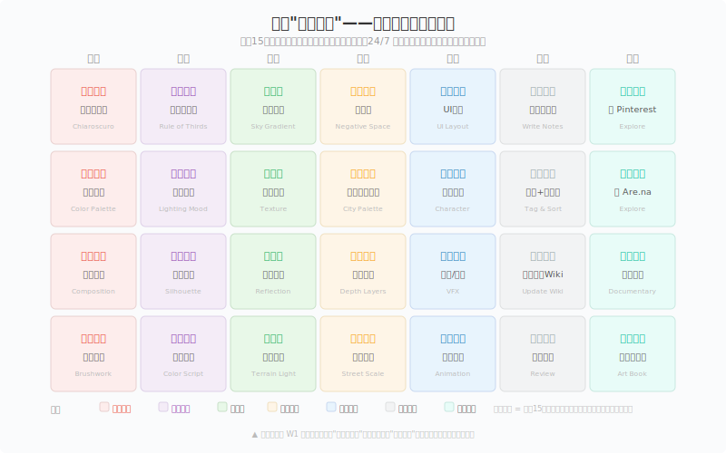
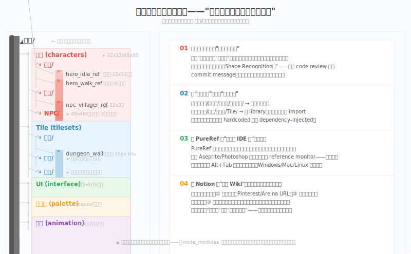

# 观察04 喂养眼睛：建立你的视觉食谱

### 4.0 这一章解决什么问题

观察02给了你八个视觉要素的词，观察03给了你一套把"感觉"转成"证据"的分析方法。但接下来你一定会撞上三个很具体的问题：**去哪看？** 一打开浏览器就迷失在 ArtStation 瀑布流里，刷了两小时，记住的只有"那个人画得真好"。**看什么？** 一张图盯三十秒，除了"好看"找不到第二个词——跟看代码报错但不知道 bug 在哪一样。**怎么记住？** 收藏过几百张参考图，三个月后打开那个叫"参考"的文件夹，里面是一堆忘了为什么存的图。

这一章给你一套系统——**视觉食谱（Visual Diet）**。它不是教你怎么画，而是教你如何"喂养"你的眼睛，让视觉判断力通过有意识、有结构的输入慢慢长出来。你会得到一张月度看画计划表、一套参考图分类系统、以及让 Pinterest/Notion/PureRef 变成真正工具而非拖延借口的操作指南。

---

### 4.1 核心概念

#### 4.1.1 "视觉节食"——不是看越多越好

先来一个程序员类比。假设你要做一个 HTTP 请求：

```python
# 坏习惯：import 整个库
from requests import *  # 你其实只需要 get() 和 post()
```

你写 Python 的时候不会这样 import，因为你知道垃圾进垃圾出——命名空间污染、意外覆盖、依赖混乱。但在视觉参考这件事上，独立开发者几乎所有人都在干类似的事：

> 打开 Pinterest/ArtStation → 无差别浏览 → 看到顺眼的就 Pin → 收藏夹越来越臃肿 → 从不回看。

这是**视觉暴食（Visual Binge）**。和代码里 `import *` 一样：一堆东西涌进来看似丰富，实际你什么都没"导入"到大脑里。信息过载的结果不是学得更多，而是学得更少——认知心理学称之为"选择过载效应"（Choice Overload Effect），当选项超过一定阈值，人的决策质量和满意度反而显著下降。Iyengar 和 Lepper（2000）的经典果酱实验证明了这一点：24 种果酱吸引更多顾客驻足，但只买一种的转化率只有 3%；6 种果酱的选择组，转化率是 30% [1]。

视觉参考同理。**看 100 张图不如分析 10 张好图。** 这 10 张图你要做到：
1. 能说出它哪里吸引你（不是"好看"，是"这个角色的面具设计用了不对称的负空间"）
2. 能归入你的参考系统的一个具体类别
3. 能在一个月后回看时依然理解当初的判断

我把这个原则叫**视觉节食（Visual Diet）**——就像依赖管理，你不是 `import *`，而是：

```python
# 好习惯：精准 import
from PIL import Image  # 只引入图像处理
from dataclasses import dataclass  # 只引入数据类
```

**月度"看画食谱"** 的设计逻辑是这样的：

| 时段 | 输入源 | 类比 |
|------|--------|------|
| 周一到周四 | 四类主输入源（每天一类） | 主依赖——你的核心视觉养分 |
| 周五 | 像素游戏截图与社区浏览 | 同领域 benchmark——看同行怎么做 |
| 周六 | 整理归档 | garbage collection——清理缓存、建立索引 |
| 周日 | 自由浏览 | 留白——允许未计划的新输入 |



*图 4.1：月度"看画食谱"——每天15分钟，每周循环四类输入源。每个格子标注当天的聚焦关键词，帮助你从"随便看看"转变为"带着问题看"。*

这个食谱每周循环一次，四周为一个完整周期。四周后回到第一周的"传统艺术·明暗对照法"，你会发现你看的已经不是"哦，有明有暗"，而是开始注意到光源方向、阴影的软硬过渡、以及画家是用渐变还是用硬边来处理形体转折。这就是**视觉判断力的复利效应**——同样的输入，经过结构化的重复后，你的大脑提取出了更细粒度的特征。

每周一换输入源还有一个额外好处：**防止算法茧房**。Pinterest 和 Instagram 的推荐算法会在你反复浏览某一类内容后把你困在一个视觉气泡里——你只看得到类似风格、类似配色、类似构图的图。每周切换输入源相当于主动 reset 你的推荐流，迫使算法给你推送不同领域的内容。

---

#### 4.1.2 四类视觉输入源

> **如果你只做最低版本，本月只选两类输入源。** 建议从"传统艺术"和"电影与动画"开始——这两类对构图和明度的训练最密集，性价比最高。

下面展开四类主输入源——每一类的"看什么、去哪看、怎么看"，并在每类末尾补一条像素艺术专属的看画建议。四类之后还有一个第五类：像素专属的日常看画源。

---

##### 第一类：传统艺术（画作、雕塑、素描）

**看什么**：传统艺术是视觉语言的"底层库"。游戏美术中几乎所有的光影原则、构图法则和色彩理论，都是画家们在过去五百年里先摸索出来的。

具体来说，看传统艺术时聚焦这三个点：

- **明暗对照法（Chiaroscuro）**：卡拉瓦乔和伦勃朗的作品是教科书。观察他们如何用强烈的明暗对比引导你的视线——画面的最亮区域往往就是叙事焦点。这个原则直接迁移到游戏场景设计：在阴暗的地牢里，玩家会本能地走向有光的地方。这不是关卡设计，这是视觉引导。
- **构图骨架（Composition Skeleton）**：古典绘画的构图不是凭感觉，是有几何骨架的。比如拉斐尔的《雅典学院》，所有人物的头部位置构成了一条清晰的抛物线。去搜"Classical Painting Composition Lines"，你会看到叠加在原画上的辅助线——跟 UI 布局的网格系统是一个道理。
- **色彩限制（Limited Palette）**：印象派之前的画家调色板上通常只有 5-8 种颜料。安德斯·佐恩（Anders Zorn）的调色板只有四种颜色：铅白、黄赭石、朱红、象牙黑——却能画出极其丰富的肤色层次。这对 pixel art 开发者尤其有启发：**限制即风格**。你用 16 色色板能做出的层次，比你以为的多得多。

**像素艺术专属建议**：传统艺术里你要重点补的是**明度与色彩的基础直觉**——像素画在低分辨率下最依赖的两件事。James Gurney 的《Color and Light》（2010）是像素艺术社区公认的入门书 [3]。他讲的"光源色 vs 天光色 vs 反射色"三层模型，直接对应你在 Aseprite 里给 32×32 角色上高光、中间调、反射光的决策。

**去哪看**：
- Google Arts & Culture（https://artsandculture.google.com）：超高分辨率扫描，可放大看清笔触
- WikiArt（https://www.wikiart.org）：按艺术家、风格、时期分类浏览
- 大都会博物馆开放资源（https://www.metmuseum.org/art/collection）：40 万件公共领域作品免费下载
- Gurney Journey 博客（https://gurneyjourney.blogspot.com）：日常光影观察笔记

---

##### 第二类：自然界

**看什么**：自然界是你永远无法穷尽的参考库。但很多人看自然的方式是"哇好美"然后拍张照——这和"看代码"完全不一样。你需要像 debug 一样看自然。

- **天空色彩渐变（Sky Gradient）**：一天之中，天空从地平线的暖色过渡到天顶的冷色，这个渐变的速率、色相偏移、饱和度变化是任何游戏天空盒的终极参考。下次日落时，用取色器 App（比如 Adobe Capture）抓一条从地平线到头顶的垂直渐变色带，你会发现天顶的蓝色比你以为的深得多。
- **地形光影**：找一片起伏的草地或山丘，在清晨或傍晚低角度光照下观察。注意凸起的顶部是亮的（迎光面），凹下的谷底是暗的（背光面），但最暗的地方通常不在谷底而在"明暗交界线"附近。这是画游戏地形 tile 和 heightmap 渲染时最基本的体积感来源。
- **水面反射**：观察静水、微波、涟漪三种状态下反射的区别。注意反射的颜色不是水的颜色——深色水面反射天空时，反射的蓝色比天空更深。这是实时渲染中 Fresnel 效应的物理原理，但你不需要公式，看一眼真实的湖面就懂了。
- **纹理自相似（Fractal Texture）**：树木的分枝结构、山脉的轮廓线、海岸线的蜿蜒——自然界充满了不同尺度上的自相似模式。理解这点后，你做程序化生成（procedural generation）时就有了直觉基础。

**像素艺术专属建议**：看自然时练"降采样"——眯起眼睛，或把手机照片缩小到 64×64，看哪些形还能认出来。能活过低分辨率的形，就是你要带进像素画的"骨架"；被磨掉的细节，在 32×32 tile 里也画不下。长期下来你会对"哪些特征是结构性的、哪些是装饰性的"有很准的直觉。

**去哪看**：不需要网站。去公园、去阳台、去任何有自然光的地方。如果想系统收集：
- Earth Science World Image Bank（https://www.earthscienceworld.org/images）：地质纹理、岩石结构
- NASA Visible Earth（https://visibleearth.nasa.gov）：卫星照片，看大尺度地形色彩

不过最重要的工具是**你手机里的相机**。拍，然后在家仔细看。

---

##### 第三类：电影与动画

**看什么**：对于游戏视觉设计，电影和动画可能是性价比最高的输入源——因为它们的每一帧都是被精心设计过的。

- **电影截图（Film Stills）**：FlimGrab（https://film-grab.com）是一个按电影分类的截图库，每一帧都可以当作构图教科书来分析。挑一部你喜欢的电影，翻它的截图库，你会发现在 120 分钟的电影里，真正"好看"的镜头构图只有几十种——但这几十种反复变奏。这和游戏设计一样：场景类型有限，但排列组合无限。
- **皮克斯/迪士尼的色彩脚本（Color Script）**：动画电影在前期会制作色彩脚本——用一系列小色块画面来规划整部电影的情绪节奏和色彩走向。搜索"Pixar Color Script"或"Ratatouille Color Script"，你会看到一部电影的情绪如何通过色彩从暖到冷、从亮到暗地流动。这对游戏关卡的情绪规划有直接启发：你的关卡不是一个一个孤立的场景，而是一条连续的色彩情绪曲线。
- **布光（Lighting）**：罗杰·迪金斯（Roger Deakins）等摄影指导的作品是游戏光照的绝佳参考。注意他们如何用**主光源（Key Light）**、**补光（Fill Light）**和**轮廓光（Rim Light）**三个层次塑造立体感。在像素画里它简化成"高光像素 + 中间调 + 暗部 + 一道轮廓亮边"，但层级关系一模一样。

**像素艺术专属建议**：像素动画和传统 2D 动画一样是**逐帧（frame-by-frame）**的，timing 原理能直接搬。Richard Williams 的《The Animator's Survival Kit》讲的"压扁拉伸、预备、余动"在 4 帧像素走路循环里照样适用。看动画时逐帧暂停，数一数一个动作用了几帧、哪一帧是极限姿态、哪几帧是过渡帧——这种拆解习惯直接迁移到你在 Aseprite 里排时间轴。

**去哪看**：
- FlimGrab（https://film-grab.com）：电影截图库，最佳构图参考
- Shotdeck（https://shotdeck.com）：可按色彩、情绪、光线条件搜索的影视镜头数据库

---

##### 第四类：建筑与空间

**看什么**：建筑是"负空间（Negative Space）"的最佳老师。负空间不是"空的地方"，而是被实体切割后留出来的、有形状的空间。理解负空间的设计对游戏 UI 布局和关卡动线设计极有帮助。

- **日本园林的负空间哲学**：龙安寺的枯山水石庭——15 块石头被精心摆放，使得从任何视角都无法同时看到全部 15 块。这个设计的核心不是石头，而是石头之间的空白。游戏 UI 同理：信息密度不是"塞得越多越好"，空白是信息的一部分。
- **街道尺度（Street Scale）**：用 Google Earth 观察不同城市的街道宽高比。中国传统古镇的街道宽 3-5 米，两侧建筑高 6-8 米，形成 1:2 的宽高比——这让行人感觉被"包裹"但不压抑。对比现代城市主干道 30 米宽却只有 20 米高的建筑群，宽高比变成 3:2，"包裹感"消失。这直接影响你做城镇地图时的道路宽度设计。
- **城市色彩倾向（City Color Palette）**：摩洛哥的舍夫沙万是蓝色的，印度焦特布尔是蓝色的，但两种蓝完全不同——前者是偏白的淡蓝（建筑涂料），后者是偏灰的靛蓝（本地石材）。每个城市有一套无意识的色彩倾向，由当地建材、气候、文化共同塑造。Google Earth 漫游不同地区的城市，用取色器抓取建筑立面的主色，你会发现一套天然的调色板。

**像素艺术专属建议**：看建筑时聚焦"剪影阅读"——哥特教堂缩到 32×32 只剩几根竖向尖刺，日式町屋只剩一个缓坡屋顶加一面墙。细节在低分辨率下全部消失，剩下的剪影就是你在 tile 里要抓住的。这个练习能治好你"想往 tile 里塞太多窗户和砖纹"的毛病。

**去哪看**：
- Google Earth / Google Maps Street View：免费的建筑与城市色彩参考库
- ArchDaily（https://www.archdaily.com）：建筑项目数据库，按功能、材料、地区筛选

---

##### 第五类：像素专属的日常看画源

上面四类是"底层养分"——它们训练的是可迁移的视觉判断力。但你还需要一类**同领域的日常看画源**：看同行在做什么、用什么色板、怎么处理 16×16 的脸。这一类对应食谱里的周五，也对应你碎片时间的浏览。

- **Lospec（https://lospec.com）**：像素艺术色板数据库。按标签、颜色、色板大小筛选。看色板时不要只看色——点进每个色板，看它在实际画面里怎么被分配到明度区、怎么被压成 ramp。这是"限制即风格"这句话的可搜索版本。
- **Pixel Joint（https://pixeljoint.com）与 r/pixelart（Reddit）**：两个最活跃的像素艺术社区。Pixel Joint 偏作品展示与挑战赛，r/pixelart 偏日常发图与反馈。每天 5 分钟扫一遍热榜，你能在一周内摸到当前社区在玩什么风格、什么分辨率。
- **@pixelpedro（Pedro Machado，Twitter/X）**：一个值得 follow 的案例。他长期坚持发每日像素练习，从 32×32 小场景到大型 isometric 建筑，feed 本身就是"视觉节食 + 高频输出"的活样本 [4]。
- **#pixelart、#pixelartistry、#pixel_dailies 标签**：前两个是通用标签，第三个是每日主题挑战（@Pixel_Dailies 每天出一个主题词，全球画师按主题创作）。参与挑战逼你画自己平时不会画的东西，相当于每周一换输入源的小型版本。
- **itch.io（https://itch.io）**：独立游戏平台。按"Pixel Art"标签筛选，能直接看到**在游戏里实际跑**的像素素材，而不是孤立画廊图——很多缩略图好看的作品，进了游戏被 UI、动效、tile 拼接一挤压就垮了。看 itch.io 是看"成品表现"，不是看"单帧海报"。
- **The Spriters Resource（https://www.spriters-resource.com）**：商业游戏 sprite sheet 拆解库。《星之卡比》的走路循环是几帧、《合金弹头》的爆炸怎么排帧，这里都能下到原始帧序列——相当于动画帧结构的"参考实现"。

> **用这一类时更要守"视觉节食"。** 这类源最容易让人陷进去刷——Lospec 上一色板接一色板、Spriters Resource 上一套 sprite 接一套。硬限制：每次只取一个色板或一套 sprite，存进参考库，写一句注释，然后关掉。和 `import *` 的陷阱一模一样。

---

#### 4.1.3 建立自动成长的参考图系统

有了输入源，下一个问题是：**收集的图放哪、怎么放、以后怎么找？**

> **最低工具栈：文件夹 + README + PureRef 即可。** 你不需要 Pinterest、Notion 和 Are.na 全部配齐才能开始。先用文件夹做分类、README 写分析笔记、PureRef 做画图时的即时参考。其余工具等参考库超过 50 张图后再逐步引入。

很多独立开发者的做法是：建一个叫"游戏参考"的大文件夹，把图往里扔。三个月后打开——两百张图，没有分类，找不到想要的，然后新建一个叫"游戏参考2"的文件夹。这跟写代码不建目录结构一样荒谬。你需要一套**自动成长的参考图系统**，核心原则就两条：

1. **按功能分类，不按来源/游戏分类**
2. **每条参考附分析注释，不是只存图**

##### Pinterest/Are.na 操作指南

Pinterest 和 Are.na 是目前最适合视觉参考收集的两个平台。它们的区别就像 GitHub 和个人博客——Pinterest 是大众平台，算法推荐强；Are.na 是小众社区，手动策展逻辑。

**Pinterest 建板块策略**：

不要建"游戏灵感"这种大杂烩板块。按功能来建：

| 板块名 | 搜什么关键词 | 用途 |
|--------|------|------|
| 像素角色 | "pixel art character" "sprite sheet walk cycle" "32x32 character" | 角色剪影、帧序列 |
| Tile 与场景 | "pixel art tileset" "16x16 tile" "isometric environment" | tile 接缝、场景氛围 |
| 像素UI | "pixel art UI" "game HUD pixel" "inventory screen" | 界面布局、信息层级 |
| 色板灵感 | "pixel art palette" "limited palette 16 colors" "Lospec palette" | 调色板、情绪色彩 |
| 动画帧 | "pixel art animation" "sprite explosion" "attack frames" | 动作 timing、帧结构 |

**让算法为你工作的技巧**：Pinterest 的推荐质量取决于你 Pin 的前 20 张图。一开始就 Pin 很多"anime girl"，算法就会把你锁在那个风格里。**前 50 个 Pin 要刻意多样化**——油画、摄影、建筑、自然风光、不同分辨率的像素画混着来，然后逐步收敛到你真正需要的像素风格。

**Are.na** 则更像程序的 linked list——你连接的是"频道（Channel）"，不同频道之间可以相互引用。适合做更深入的研究型收集。Are.na 上有一个经典频道叫"Video Game Interface Design Patterns"，收集了上百个游戏 UI 的截图和交互分析。这种深度策展是 Pinterest 算法做不到的。

##### "借鉴不抄袭"——为什么必须写注释

GDevelop（一个开源游戏引擎）的文档里有一节讲得特别好，叫"Borrowing Without Copying"（借鉴不抄袭）[2]：**参考的目的是理解原理，不是复制结果。**

怎么确保自己在"借"而不是"抄"？答案很简单：**给每张参考图写一句注释。** 不是文件名，是注释——你为什么存这张图。格式不限，但必须包含"看哪里"和"为什么"：

```
❌ 错误示范：
  参考图文件夹里只有一个文件：cool_knight.png

✅ 正确示范：
  knight_idle_ref_01.png  → "盔甲接缝处的磨损高光集中在边缘凸起处，不是整片均匀高光"
  knight_walk_ref_02.gif  → "走路循环 6 帧，第 3 帧是极限姿态，脚跟落地瞬间重心最低"
```

这相当于你在给自己写"视觉 code review"。三个月后回看这个文件夹，你不需要重新理解当时为什么觉得这张图好——注释已经帮你记住了判断。

---

#### 4.1.4 程序员友好的参考管理

作为程序员，你可能对管理文件、目录和元数据有天生的舒适区。把你的参考图系统当成一个**视觉资产仓库（Visual Asset Repository）**来管理——和你的代码仓库用同一套心智模型。

##### 文件夹命名规范

```
参考/
├── 角色/
│   ├── 32x32/
│   │   ├── hero_idle_ref.png      # 待机帧剪影参考
│   │   ├── hero_walk_ref.gif      # 走路循环帧序列
│   │   └── README.md
│   ├── 48x48/
│   └── NPC/
├── Tile/
│   ├── 地牢/
│   │   ├── wall_16x_ref.png       # 16px 墙体 tile 接缝
│   │   └── floor_wear_ref.png     # 地面磨损 tile
│   ├── 草地/
│   └── 室内/
├── UI/
│   ├── 主菜单/  HUD/  图标/
├── 调色板/
│   ├── lospec/                    # Lospec 抓取的色板
│   └── 情绪板/
└── 动画/
    └── 帧序列/                    # 拆解过的 sprite sheet 帧
```



*图 4.2：参考图系统的文件夹结构。按功能（角色/Tile/UI/调色板/动画）分类而非按游戏分类，每条参考附"为什么被吸引"的分析注释。右侧四条是建立自己参考库时必须遵守的核心原则。*

注意这里的分类逻辑和 `src/components/Button/`、`src/utils/api.js` 的命名逻辑完全一致——**按功能聚合，不按来源聚合**。角色再按分辨率分（32x32/48x48），是因为不同分辨率的像素画技法差异大到几乎是两种"语言"，混在一起找不到。建议给每个重要的子文件夹加一个 `README.md`，记录你对这个类别的整体思考。比如 `参考/调色板/README.md` 可以写：

```markdown
# 调色板参考

## 当前项目的色板策略
- 主色板：16 色（参考 PICO-8 限制，练手05 会展开）
- 暖 ramp：用于角色与火光
- 冷 ramp：用于场景与远景
- 禁用色：纯饱和紫（和当前色板 ramp 冲突）

## 需要补充的参考
- [ ] 夜景的降饱和处理色板
- [ ] 地下洞穴的色彩偏移色板
```

##### Notion 建"视觉 Wiki"

Notion 的数据库功能非常适合建一个"视觉 Wiki"。创建一个数据库，每条记录包含：

| 字段 | 类型 | 说明 |
|------|------|------|
| 图片 | Files & Media | 参考图本身 |
| 类别 | Select | 角色/Tile/UI/调色板/动画 |
| 子类别 | Select | 32x32/地牢/HUD/Lospec/帧序列... |
| 来源 | URL | Pinterest/Are.na/itch.io 原始链接 |
| 分析笔记 | Text | "为什么被吸引"的核心注释 |
| 日期 | Date | 自动记录创建时间 |
| 状态 | Select | 待分析 / 已分析 / 已应用 |

Notion 的看板视图（Board View）相当于你的视觉任务追踪面板——哪些参考图已分析过、哪些还是"裸收藏"，一目了然。画廊视图（Gallery View）则是纯视觉的情绪板。

这个 Wiki 的价值会随时间指数增长。一年后回看早期笔记，你会清楚地看到自己的视觉判断力从"这张图颜色很好看"进化到"这张图用了互补色 + 高饱和前景 + 低饱和背景制造景深感"。**这就是进步的证据。**

##### PureRef：程序员的"多窗口 IDE 式"参考面板

PureRef（https://www.pureref.com）是一个免费工具，专门用来在屏幕上悬浮显示参考图片。核心用法和程序员的双显示器 + 多窗口 IDE 一致：把参考图拖进去变成悬浮窗口，右键"Always on Top"置顶，切到 Aseprite 时参考图始终可见。支持多张图自由排列、缩放、旋转，保存为 `.pur` 文件相当于参考图工作区快照。

它解决了画像素时反复 Alt+Tab 切回参考图窗口的烦人问题——相当于开了第三个显示器放参考，余光就能看到，不需要切换。是独立开发者社区里被严重低估的工具之一。

---

### 4.2 上手行动

看完这一章，你需要做的不是"更努力地看参考图"，而是**换一种方式看**。下面是第一周的行动清单：

**第一天（今天）——最低动作：** 创建 `参考/` 文件夹，按图 4.2 建好五类子目录；安装 PureRef。

**第一天——完整动作（在最低之上）：** 在 Pinterest 创建 5 个板块（名字和上面的板块表对齐）；在 Notion 创建"视觉 Wiki"数据库；从今天的输入源中 Pin 1-3 张图，每张写一句注释。

**第一周：**
1. 按图 4.1 的食谱，每天用 15 分钟浏览对应的输入源
2. 每次只收藏 1-3 张真正打动你的图，每张写一句注释（"为什么被吸引"+"可以用在哪里"）
3. 周六花 20 分钟整理本周收藏：归入对应文件夹，分析笔记写入 Notion

**关键规则**：
- **15 分钟一到就停。** 视觉输入的边际效益衰减很快——第 16 分钟和第 60 分钟的效果差距很小，但第 16 分钟和第 1 分钟的差距巨大。刻意限制时间反而提高单位时间内的注意力质量。
- **不存"以后可能有用"的图。** 只存当下能说出为什么有用的图。模糊的"有用感"是收藏夹膨胀的主要原因——和代码里的 `TODO: optimize later` 一样，永远不会被执行。
- **写注释，哪怕只写一句话。** 不写注释 ≈ 没看过。一周后你会忘记为什么存这张图，一个月后你甚至不记得自己存过这张图。

---

### 4.3 本章小结

视觉能力的成长不是靠"天赋"或"多看"——是靠**有结构的输入**。这一章给你搭了三个结构：

1. **视觉食谱**：每周循环四类输入源 + 像素专属日常源，每天 15 分钟，带着一个关键词去看。四周一个周期，视觉判断力在重复中发生复利。
2. **参考图系统**：五大板块按功能分类（角色/Tile/UI/调色板/动画），每条参考附"为什么被吸引"注释。这是你的视觉资产库，和代码仓库一样需要维护和索引。
3. **管理工具**：Pinterest 负责发现，PureRef 负责创作时的即时参考，Notion 负责长期的知识积累。三个工具分别对应"输入 → 使用 → 沉淀"。

**如果只记住一句话：** 把眼睛当成你的第二编译器——你需要给它正确的源文件（精准 import 而不是 `import *`），它才能产出正确的视觉判断。

---

### 4.4 扩展阅读

1. **《Steal Like an Artist》— Austin Kleon**
   一本讲"所有创意都是对前人作品的重新组合"的小书。100 页，一小时读完。对理解"借鉴不抄袭"的哲学基础极有帮助。

2. **《Color and Light: A Guide for the Realist Painter》— James Gurney**
   像素艺术社区公认的光影色彩入门书。讲光源色、天光色、反射色三层模型——直接对应你在 Aseprite 里给一个 sprite 上高光/中间调/反射光的决策 [3]。

3. **Lospec（lospec.com）**
   像素艺术色板数据库。按色板大小、颜色、标签筛选。每天花 5 分钟看一个新色板，一个月后你对"16 色能做什么"的直觉会完全不一样。

4. **The Spriters Resource（spriters-resource.com）**
   商业游戏 sprite sheet 拆解库。想研究某个经典游戏的走路循环或爆炸特效是几帧的，直接下原始帧序列——相当于动画帧结构的"参考实现"。

5. **《The Visual Story》— Bruce Block**
   影视视觉设计教材，但完全适用于游戏。讲空间、线条、形状、色调、色彩、运动六大视觉要素在叙事中的应用。如果你的游戏有故事，这本书必读。

6. **PureRef（pureref.com）**
   免费悬浮参考图工具。下载后用一次你就回不去了——相当于给你的画布旁边开了一个参考图显示器。

7. **@pixelpedro（Pedro Machado，Twitter/X）**
   一个长期坚持每日像素练习的画师 feed。看他的存档你能直观理解"视觉节食 + 高频输出"如何累积出个人风格 [4]。

---

### 4.5 本章引注

[1] Iyengar, S. S., & Lepper, M. R. (2000). "When choice is demotivating: Can one desire too much of a good thing?" *Journal of Personality and Social Psychology*, 79(6), 995–1006. https://psycnet.apa.org/doi/10.1037/0022-3514.79.6.995

[2] GDevelop 文档，"Borrowing Without Copying: How to Use References Effectively"。https://wiki.gdevelop.io/gdevelop5/tutorials/borrowing-without-copying

[3] Gurney, J. (2010). *Color and Light: A Guide for the Realist Painter*. Andrews McMeel Publishing. ISBN: 978-0740797712. 博客：https://gurneyjourney.blogspot.com

[4] Pedro Machado（@pixelpedro），Twitter/X。长期每日像素练习存档。
