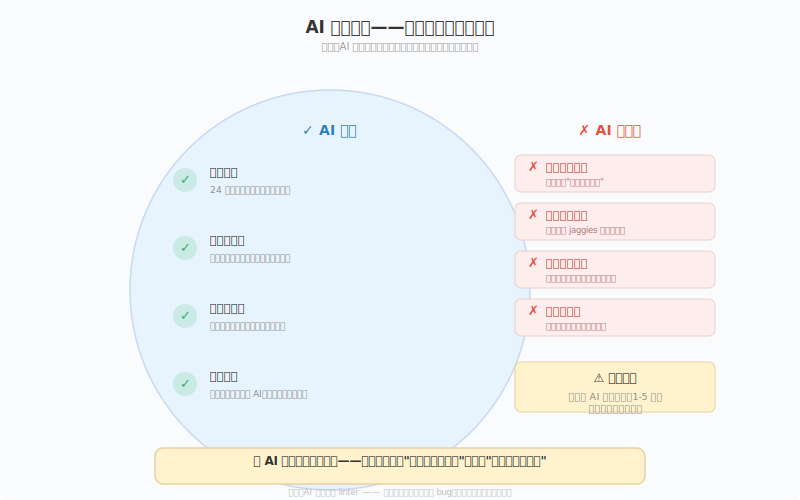
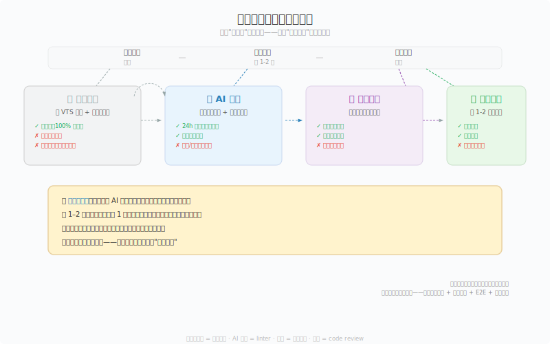

# 观察05 AI美术私教：24小时在线的反馈回路

### 5.0 这一章解决什么问题

你已经知道视觉要素是什么（观察02），知道怎么分析一张画面（观察03），也知道去哪找好参考（观察04）。但接下来你会撞上一个只有独立开发者才会遇到的问题：

**你看完一张画、做完分析、写完笔记，然后呢？** 你对照八维度给自己打了分，但你不确定自己打的对不对。你想找个人帮你看一眼，但身边没有美术同事。发到社区，回复通常只有"好看！"或者"感觉不太对"——前者没用，后者等于没说。

这就是独立开发者学美术最头疼的死循环：**你需要反馈来校准判断力，但你没有获取反馈的渠道。** 美术校招生有导师每天改作业，游戏公司的程序员有美术同事随时问。你只有自己。

这一章给你一个"作弊方案"：**把 AI 当成你的 24 小时美术私教。** 不是让 AI 代替你画画，而是让它给你即时反馈——就像写代码时 IDE 里的 linter，不是替你写代码，而是帮你发现你没注意到的 bug。你会学到 AI 在视觉反馈这件事上能做什么、不能做什么（诚实先行），拿到一套可以直接复制使用的结构化提示词模板，以及一套 AI + 社区 + 同伴三者互补的反馈策略。

---

### 5.1 核心概念

#### 5.1.1 AI 能做什么、不能做什么——诚实先行

在把 AI 塞进你的工作流之前，你必须先搞清楚一件事：**AI 看画和你用眼睛看画，是两种完全不同的"看"。**

AI 看画的方式更接近一个超级认真的实习生——它认真阅读了所有关于视觉设计原则的教科书，但它的"眼睛"和你的不一样。它能告诉你画面里有什么、这些元素是否符合教科书里的规则，但它无法像一个人类那样"感受到"画面哪里不对劲。对你这些画 16×16 tile 和 32×32 角色的人来说，需要特别注意：视觉模型不是像素编辑器——它能够识别整体结构和局部区域，但对于 16×16、32×32 这类每一个像素都影响最终结果的作品，它无法稳定完成逐像素校验。因此 AI 的反馈应作为分析的起点和假设，最终修改仍应回到编辑器中由作者确认。



*图 5.1：AI 能力边界——记住中心那句话：AI 是参考，不是权威。它给的分数没有校准基准。*

##### AI 能做的事

**第一，24 小时即时反馈。** 这是 AI 反馈最硬核的优势——你不需要等任何人。凌晨两点画完一张角色设计草图，截图丢给 AI，10 秒内得到结构化分析。这种"零延迟反馈"对于独立开发者的意义不亚于"自动保存"之于程序员——它让你敢试错。画废了不用丢脸，因为对面是个没有情绪的机器。

**第二，耐心无限。** 人类导师在第 5 次纠正你同样的错误时，语气会微妙变化。AI 不会。你可以在同一天里问 20 次"这个明度结构对吗？"，它会不厌其烦地给你分析 20 次。对初学者来说，这种"被允许无限犯错"的安全感本身就是学习加速器——教育心理学把这叫"无威胁反馈环境"（Non-threatening Feedback Environment），研究表明，在不对表现做社会性评价的环境中，学习者的试错频率显著提高（Kluger & DeNisi, 1996）[1]。

**第三，完整覆盖八概念维度。** 一个人类美术导师也有自己的盲区——色彩出身的人可能对构图没那么敏感，3D 建模师不一定擅长讲明度。但 AI 可以同时覆盖形状、明度、色彩、空间、材质、构图、焦点、层次全部八个维度。它不会在某一个维度上偏科。

**第四，方案推演——画之前就能用。** 这个用法经常被忽略：你不需要画完才能用 AI。在你动笔之前，把构思描述发给 AI——"我想画一个 64×64 的俯视森林场景，用暖色系的橙色和黄色做秋季色调，焦点是画面中心的一棵大树"——AI 可以提前告诉你："俯视视角 + 中心焦点容易产生静态感，考虑用不对称的树枝分布来引入动态张力。"这种"事前审查"比画完后的"事后诸葛亮"价值大得多。

**第五，术语翻译机。** 这是 AI 对零美术基础开发者最被低估的价值。你看一张参考图时觉得"这个影子画得不太对"，但你说不出哪里不对。AI 可以告诉你："这个暗部缺乏环境光遮蔽（Ambient Occlusion），导致物体看起来浮在表面而不是接触地面。"这句话你不一定完全理解，但它给了你一个精准的**搜索关键词**——你拿去 Google，就能找到教程、文章、其他人的讨论。AI 充当了"你模糊的直觉"和"精确的美术术语"之间的翻译器。

##### AI 目前不适合作为最终判断依据的领域

**第一，精确的明度结构评估。** AI 可以告诉你"画面的明度对比偏弱"，但当你追问"暗部应该从 #2A2A2A 降到 #1A1A1A 还是保持原样"时，AI 的回答不稳定。原因：模型缺少稳定校准基准、显示环境不可控、视觉判断与玩家任务上下文相关。AI 可以提供假设（"暗部可能需要再降一档"），但不应作为你最终选定具体 hex 值的依据。在像素画里"Aseprite 里第几级明度阶该用哪个 hex"的决策，最终只能由你在标准显示器上盯着原文件确认。

**第二，像素级逐格校验。** AI 能识别"画面边缘存在锯齿感（Jaggies）"，但对于"锯齿出现在角色左肩轮廓从第 142 像素行到第 156 像素行的区域"这种像素级的精确定位，AI 目前无法稳定输出。对于 sprite 像素画、像素字体渲染、UI 图标的抗锯齿效果等需要逐像素审查的工作，AI 能指出大方向（"线稿的锯齿感偏重"），但精确到具体格点的诊断和修复仍需你手动完成。再次强调：视觉模型不是像素编辑器——它识别结构但不枚举像素。

**第三，构图焦点的精确判断。** AI 可以基于三分法、引导线等通用构图原则给出分析，但对于"视觉重量分布让焦点偏离意图中心约 2 度"这种微妙判断，AI 的结论不应作为唯一标准。你可以用 AI 的回答作为起点——"AI 说焦点可能在右上角，我来验证一下"——然后用自己的眼睛做最终判断。人类设计师有一种"直觉测量"能力——扫一眼就知道画面"哪里重了"或"哪里飘了"。AI 目前接近这个能力但不到可靠的程度。

**第四，原创性评价。** AI 语言模型在训练时被大量微调为"有帮助、无害、诚实"的助手，这导致它在评价作品时倾向于正面和鼓励。更关键的是，AI 没有"艺术史坐标系"——它可能无法准确判断你的某种风格选择是在致敬某个流派，还是在无意中模仿一个已经被用烂的模板。它倾向于说"很有特色"。对原创性的判断，目前更适合借助社区和同伴反馈（见 5.1.4）。

##### 最关键的警示

> **不要让 AI 给你的作品打分（1-5 分），尤其不要用它给的分数作为自我评估的成绩。**

原因很简单：**AI 的评分没有校准基准（Calibration Baseline）。** 当 AI 说你的作品是"4/5 分"时，这个 4 分是什么意思？是"在所有人类画作中排前 20%"？还是"在初学者的作品中排前 20%"？还是"在和本次对话历史中其他图片的比较中排前 20%"？你不知道。AI 自己也不知道——因为它没有一个固定的、可解释的评分参照系。

打个程序员类比：这就像你让一个没有配置过规则的 linter 给你的代码打 1-5 分的"代码质量分"——它可能基于行数、嵌套深度、变量名长度等信号瞎猜一个数字，但这个数字既不能反映性能，也不能反映可维护性，更不能反映正确性。**有用的反馈告诉你"哪里可以改"，没用的反馈告诉你"你得了多少分"。**

##### 一个诚实案例

hexicada，一位以 devlog 记录独立游戏开发全过程的开发者，在多次尝试用 AI 辅助美术创作后给出了一个很实在的总结[2]：

- **UI 资产**方面，AI"几乎做不好"——按钮、图标、菜单栏这些需要精确对齐和功能明确性的东西，AI 生成的结果要么尺寸不一致，要么视觉层次混乱，最终仍需大量人工修正。
- **精细动画**方面，AI 辅助仍然需要"大量人审"——关键帧之间的插值、运动曲线的微调、角色肢体运动的物理合理性，这些目前 AI 都做不到满意的程度。
- 但 AI 在**概念探索阶段**的反馈价值很高——快速生成风格变体、测试配色方案、预判构图问题，这些"脑暴阶段"的任务是 AI 的强项。

这个总结吻合前面的能力边界：**AI 擅长发散阶段的辅助，不擅长收敛阶段的精确判断。** 把它用在前端（构思、探索、方案推演），不要用在末端（最终验收、像素级打磨）。

---

#### 5.1.2 结构化提示词模板——别再问"帮我看看这张画"

大部分人第一次用 AI 做美术反馈时，提示词（Prompt）是这样的：

> "帮我看看这张画怎么样。"

**核心原则：不要问开放式问题，指定反馈维度和输出格式。** 这就像调用 API——传入的参数越精确，返回值越有用。你给 AI 的提示词本质上就是一个"函数签名"：你定义输入格式、处理维度、输出结构，AI 按照你的规格返回结果。

这里有一个类比帮助你记忆：**"帮我看画"就像一个没有指定返回类型的 API——`function review(image): any`。你需要把签名写清楚——`function review(image, dimensions[], format): ReviewResult`。**

下面是一个可以直接复制使用的结构化提示词模板。模板基于观察02的八概念维度设计，要求 AI 输出表格评分 + TOP 3 改进建议。

---

**提示词模板（直接复制使用）**

```
你是一位像素艺术指导，专门帮助独立游戏开发者提升像素画视觉设计能力。
请用以下结构分析我上传的这张图：

## 分析框架
按照以下 8 个维度逐一分析，每个维度给出：
1. 高/中/低置信度的问题列表（仅做相对参考，不代表绝对水平）
2. 一句话点评（具体指出哪里好/哪里可以改进）

8 个维度：
- 形状（Shape）：剪影可识别度（缩到 32×32 还认得出吗？）
- 明度（Value）：画面最亮和最暗区域的分布（去色后明度阶是否清晰）
- 色彩（Color）：调色板的协调性和情绪传达（每条 ramp 是否独立可读）
- 空间（Space）：前景/中景/背景的层次感（靠明度对比还是色相分离拉远）
- 材质（Material）：表面质感的表现（抖动 Dithering、边缘锐度、tile 复用）
- 构图（Composition）：元素在画面中的排列逻辑
- 焦点（Focal Point）：视线被引导到的位置（最高明度对比落在哪）
- 层次（Hierarchy）：信息的主次关系（细节密度是否给焦点让路）

## 输出格式
请用表格输出 8 个维度的评分和点评，然后给出 TOP 3 具体改进建议。
每条改进建议必须包含：
- 当前问题（具体描述，不模糊）
- 建议做法（可操作，不是"更努力"）
- 搜索关键词（让我能自己去搜教程）

## 约束
- 不要说"很好""不错"这类没有信息量的夸奖
- 即使画面整体质量不高，也要给出诚实、直接的分析
- 如果某个维度你无法判断，直接说"无法判断"，不要编造
- 分析时请用像素画术语（ramp、抖动、tile、剪影、明度阶），不要用油画或矢量插画的术语
```

---

**一个填好的示例**——输入是 Celeste 第七章「Reflection」的一张场景截图，意图是"8 色蓝紫 ramp、焦点为中段 Madeline 剪影、情绪孤独与自我对话"。下面是 AI 按模板返回的分析（节选）：

| 维度 | 置信度 | 一句话点评                                                                                                              |
| ---- | ------ | ----------------------------------------------------------------------------------------------------------------------- |
| 形状 | 高     | Madeline 剪影在 16×32 体型下仍可识别，但与背景岩石轮廓的负空间咬合偏弱，剪影边缘有两处与背景等明度的像素导致轮廓"缺口"  |
| 明度 | 中     | 去色后分三个明度阶：天顶暗、中段亮（焦点）、地面中——但右侧岩石暗部与天空暗部明度差不足，中景与远景粘连                  |
| 色彩 | 高     | 8 色 ramp 分配清晰（天空冷蓝、岩石中蓝、Madeline 暖红点缀），暖红只出现在角色与一处火光，色相对比精准地把焦点钉在角色上 |
| 空间 | 中     | 前景/中景/远景三层靠明度差拉开，但中景与远景之间缺少空气透视过渡，"贴"在一起                                            |
| 材质 | 低     | 岩石表面用 2×2 棋盘抖动模拟颗粒感，但抖动密度均匀、没有随曲面转折变化，平面和凸起的质感没区分开                         |
| 构图 | 高     | Madeline 位于画面纵向中段、横向偏左三分之一处，符合三分法；但右侧大面积暗色岩石把视觉重量往右拉，与左侧焦点轻微失衡     |
| 焦点 | 高     | 实际第一落点是 Madeline 头顶那抹暖红高光（全画唯一暖色 + 最高明度对比），与意图一致                                     |
| 层次 | 中     | 信息主次清楚（角色 > 站台 > 远景），但右侧岩石裂纹细节密度接近角色，分散了对主信息的注意                                |

**TOP 3 改进建议：**

1. **明度分离中景与远景**——当前：右侧岩石暗部与天空暗部明度差 < 8，去色后融为一块。建议：远景天空压暗一级，或给中景岩石边缘加 1px 亮轮廓（rim light）切层。搜索关键词：pixel art rim light, value separation foreground background。

2. **抖动跟随曲面**——当前：2×2 棋盘抖动密度均匀，平面与凸起无差异。建议：迎光面减少抖动（亮区纯色），明暗交界线加密，背光面纯暗——抖动只用在过渡带。搜索关键词：pixel art dithering curves, ordered dithering pixel art。

3. **削减右侧裂纹细节**——当前：右侧裂纹像素密度接近 Madeline 剪影，抢焦点。建议：裂纹减少一半、留主干删细支，或明度降一级退到中景。搜索关键词：pixel art detail hierarchy, focal point detail density。

注意这个示例里 AI 的价值不在"打分"，而在**给你三个可以立刻动手的动作 + 三个能继续深搜的关键词**。你拿"pixel art dithering curves"去搜，就能找到练手06 质感章要讲的抖动模式——AI 把你指向了下一章。

---

**为什么这个模板有效？**

1. **指定了角色身份。** "像素艺术指导"比"你是一个助手"更聚焦——它告诉 AI 用什么专业视角来分析，而不是泛泛而谈。
2. **要求了搜索关键词。** 这是最关键的一条。AI 最实用的价值不是"告诉你好坏"，而是"告诉你该搜什么"。一个精准的搜索关键词能把你引向高质量的教程、参考图和社区讨论。
3. **禁止了废话夸奖。** 明确告诉 AI 不要奉承。不加这条约束，AI 默认会花 40% 的 token 预算来夸你，剩下的才是有用的分析。

**使用时的一个关键技巧：附上你的意图。** 在发送图片之前，先加一句："这张图的意图是：一个暗色调的压抑地牢场景，焦点是画面右侧的火把光源，主要情绪是孤独和紧张。"告诉 AI 你**想**达到什么效果，它才能判断你**实际**达到了多少。这和给 API 传入正确的参数是一个道理——你不告诉它你的需求，它就按默认参数处理，结果当然不准。

---

##### 进阶用法一：让 AI 先提问——提问模式

大多数人用 AI 反馈的习惯是：发图 → AI 分析 → 看结果。但真正有效的反馈，第一步往往是了解需求。如果 AI 在分析前缺少上下文，它的反馈就是基于默认假设——准确度天然打折。

在发送图片之前，在提示词末尾加上这一段：

```
在开始分析之前，如果缺少以下任何信息，请先向我提三个问题：
- 作品的用途？（角色设计 / 场景 tile / UI 图标 / 宣传图）
- 目标玩家？（动作游戏 / 叙事游戏 / 休闲游戏 / 恐怖游戏）
- 参考作品或风格方向？
- 完成度？（草图 / 中期 / 接近完成）
- 是否限制调色板？如果限制，色数和色板是什么？
- 你目前最不满意的地方？
```

这样 AI 会先反问你——等你回答后才开始分析。它的分析不再是"盲猜你的需求"，而是基于你的具体情境。这和你在 code review 时第一时间问"这个 PR 的目标是什么"是同一个思维：先对齐上下文，再看具体实现。

---

##### 进阶用法二：反向 Prompt——让 AI 训练你的眼睛，而不是替你思考

这是最符合本书"先练看、再练画"理念的用法。普通 Prompt 是 AI 直接给答案——你看完可能记住了结论，但没有训练到自己的观察能力。

反向 Prompt 的做法：**不让 AI 告诉答案，让 AI 提问——你来回答——最后 AI 公布参考答案。**

上传一张图（比如 Celeste 的截图），用这个 Prompt：

```
不要直接分析这张图。

请先给我三个问题，让我自己发现画面中的关键设计。
每个问题应该引导我观察一个具体的视觉维度。

在我回答完三个问题后，你再公布你的分析，并对照我的回答。
```

AI 可能会这样提问：

> **问题一：** 这张图中，最亮的区域在哪里？它对应画面中的什么元素？
>
> **问题二：** 去色后（想象转成黑白的），哪个元素最先消失、和背景融在一起？
>
> **问题三：** 画面中哪个颜色只出现了一次？它出现在什么位置？

你回答完之后，AI 公布它的分析并对照你的答案。这个过程做一次，比你被动读十次 AI 分析都管用——因为你在主动训练眼睛，而不是被动积累知识。

> **程序员类比：** 普通 Prompt = 直接看答案。反向 Prompt = 用习题集先自己做一遍再看答案。学编程的时候你是先做题还是先看源码？反向 Prompt 让你先做题。这和本书从头到尾强调的"先练看，再练画"是一套哲学：先练眼，再练手——现在加上一条——先自己观察，再看 AI 怎么说。

---

#### 5.1.3 四种使用场景——从分析到推演

有了模板，接下来是**什么情况下用、怎么用**。四种最实用的场景，按难度从低到高：

---

##### 场景一：分析别人的画

这是入门用法，也是最安全的使用方式。我不建议你一上来就让 AI 评价自己的作品——原因很简单：**初学者对自己的作品有情感依附，负面反馈带来的挫败感会抵消学习动力。** 先拿别人的画练手。

**操作步骤：**
1. 找一张你觉得"好但说不清为什么好"的像素游戏截图（Dead Cells、Celeste、星之卡比都行）
2. 自己先用观察03的 VTS 三问法做一遍分析（这张图里发生了什么？是什么让这张图有趣？我能从中学到什么？）
3. 把同一张图丢给 AI，用上面的提示词模板
4. **对照你做的分析和 AI 的分析**——找到差异点：AI 注意到了哪些你没注意到的维度？你的分析在哪个维度上比 AI 更深入？
5. 把两者融合成你自己的分析笔记

这个"先自评、再 AI 验证"的流程，本质上是在训练你的视觉判断力校准能力。**对照差异才是最有效的学习时刻**——你发现自己完全没注意到构图里的对角线引导，但 AI 指出来了。下次你就会主动去看画面里的隐藏线条。这和 code review 是一个道理：看别人发现的 bug 你的印象不深，但如果是你自己 review 时漏掉的 bug 被同事指出来，你会记住很久。

---

##### 场景二：获得自己作品的反馈

当你已经习惯拿别人作品练手后（建议至少做 10 次场景一），可以开始用 AI 分析自己的画了。

**关键操作：附上意图描述。** 这个在前面强调过，这里再强调一次——因为这是大多数人犯的第一个错误。不给意图描述 = 让 AI 盲猜你想达到什么效果 = 得到的反馈大概率文不对题。

**进阶用法：问 AI 焦点偏离。** 有一个特别有用的问题，你自己很难回答但 AI 能提供有价值的参考：

> "这张图的视觉焦点实际上在哪里？和我的意图有偏差吗？"

画面的视觉焦点取决于明度对比、色彩对比、细节密度和引导线这四个因素的综合作用。人类作者在画的时候心里知道"我希望观众看这里"，但他的眼睛已经被自己的意图"污染"了——他会自动把注意力放在意图焦点上，而不是实际焦点上。AI 没有这个偏见。它可能告诉你："你意图的焦点是画面右侧的角色，但实际上画面左侧那扇亮黄色的窗户因为明度对比更高，成了实际的第一视觉落点。"这种信息对你来说并不一定 100% 准确（回到 5.1.1 的警告），但它是你"意图 vs 实际"的极好**起点**，给了你一个需要验证的假设。

---

##### 场景三：带参考图的比对

这是四个场景中最实用的一个。你现在同时上传两张图：你的作品 + 一张你想要接近风格的参考游戏截图。

**提示词追加：**

```
同时分析我的作品（图1）和参考图（图2），逐维度对比差异。
重点标注：
- 哪些维度我的作品已经接近参考图
- 哪些维度差距最大
- 差距的具体表现是什么（不是"色彩不如参考图"，而是"参考图用了高饱和暖色前景+低饱和冷色背景的互补策略，你的作品前景和背景饱和度接近"）
```

**为什么这个用法效率极高？** 因为"接近参考图"是一个**明确的目标**，不是一个抽象的"画得更好"。AI 在有明确参照物时的分析准确性远高于开放式的"这张画怎么样"——它有具体的东西可以比较，而不是在真空中做判断。

这个用法直接衔接观察04的参考图系统——你在"像素游戏截图日"（周五）找到的参考图，可以在这个场景里变成 AI 帮助你对标的靶子。

---

##### 场景四：练习前的方案推演

这是最被低估的使用场景。大多数人在**画完后**找 AI 反馈，但更高杠杆的做法是在**画之前**把构思发给 AI。

**操作：** 在打开 Aseprite 之前，把下面这段文字发给 AI：

> "我计划画一个[尺寸，如 32×32 / 64×64]的[类型，如角色立绘 / 场景 tile / UI 图标]。主题是[一句话描述]。我打算用的策略包括：[列出你的计划，如'三分法构图''暖色前景+冷色背景''左上到右下的对角线引导''8 色 ramp 不抖动']。请分析这个方案可能存在的问题，并建议我需要注意什么。"

**AI 可能会这样回复：**

> "你的方案中'左上到右下的对角线引导'和'三分法构图'可能存在冲突——对角线引导会把视线拉向画面右下角，而三分法的黄金焦点通常在四个交叉点上。如果你的意图焦点在右上交叉点，对角线的走向可能需要调成右上到左下。另外，'暖色前景+冷色背景'的色彩策略本身没问题，但注意：如果前景物体占画面比例低于 30%，暖色的视觉重量可能不足以对抗大面积的冷色背景，导致你的意图焦点（前景物体）被背景淹没。在 32×32 这种小尺寸下，'8 色 ramp 不抖动'意味着你完全靠纯色块切明度阶——确认你的 8 色里至少有 3 个明度阶，否则去色后会糊成两团。"

**这种用法的精髓在于：AI 充当了你的"橡皮鸭"[3]——不只是听你说，而是对你的设计假设进行压力测试。** 你不需要完全听从它的建议，但它的反问会让你意识到自己之前没想过的盲区。

---

#### 5.1.4 四种反馈方式的对比——互补才是最优解

现在你有了 AI 反馈这个强大工具。但这里有一个很容易掉进去的陷阱：**因为 AI 太方便，你就只用 AI 反馈，不再寻求其他形式的反馈。**

这是错的。四种主要反馈方式——自评量表、AI 反馈、社区反馈、同伴互评——不是互相替代的关系，而是互补关系。下面是它们的对比：



*图 5.2：四种反馈方式的互补策略——从左到右反馈深度递增但频率递减。类比：自评 = 单元测试，AI 反馈 = linter，社区 = 用户测试，同伴 = code review。*

| 维度           | 自评量表       | AI 反馈            | 社区反馈         | 同伴互评       |
| -------------- | -------------- | ------------------ | ---------------- | -------------- |
| **频率**       | 每天           | 每天               | 每 1-2 周        | 每月           |
| **延迟**       | 即时           | 10 秒              | 数小时到数天     | 约定时间       |
| **隐私性**     | 完全私密       | 对话私密           | 公开             | 半私密         |
| **心理负担**   | 低             | 极低（无评判压力） | 中等（公开暴露） | 低（信任基础） |
| **专业深度**   | 取决于你的水平 | 覆盖全面但不够精确 | 参差不齐         | 取决于同伴水平 |
| **明度判断**   | 可训练         | 不可靠             | 取决于个体       | 可校准         |
| **像素细节**   | 需要经验       | 不可靠             | 通常忽略         | 可深入         |
| **原创性评价** | 无法自知       | 会奉承             | 可能真实         | 最可靠         |
| **持续追踪**   | 有             | 无（无状态）       | 无               | 有             |

**核心洞察：**

1. **AI 反馈和社区反馈是非重叠的。** AI 擅长的是"这本教科书上说……"类型的原则性反馈，而社区擅长的是"作为一个玩家，我的感受是……"类型的人类体验反馈。前者告诉你是否符合规则，后者告诉你是否有感染力。两者缺一不可。

2. **同伴互评是不可替代的。** 找一个也在学像素画的独立开发者，每月互相看一次对方的作品。这个关系不需要太正式——一个 Discord DM 就够了。关键是"持续性"：同一个人反复看你的作品，能看到你跨越时间的进步轨迹，能指出"你上个月那个抖动铺太满的问题还在"或者"这个月你在明度阶上明显进步了"。不要假设 AI 的记忆可靠或可迁移，社区评论者是陌生人——只有同伴能看到你的成长曲线。

3. **自评量表是"内化锚点"。** 所有外部反馈——AI 的建议、社区的评论、同伴的点评——最终都需要你用自己的判断力来过滤。如果你没有一套自评框架（比如观察02的八维度 + 观察03的 VTS 三问），外部反馈就会变成噪音——今天 A 说色彩不好，明天 B 说构图不好，你像无头苍蝇一样乱改。**自评量表是你消化外部反馈的"胃酸"——没有它，外部反馈无法被内化。**

##### 推荐节奏

```
日常（每天）：画完练习 → 用 AI 模板跑一次分析（10秒） → 记下 TOP 3 改进点 → 明天针对改进

每周（每 1-2 周）：从本周挑 1 张最好的发到社区（Twitter/Discord/Reddit r/pixelart；中文可补充 itch.io、B站、TapTap、Lospec 论坛），获取"作为玩家"的视角

每月：约同伴互评，提前准备 3 个具体问题（不要泛泛的"帮我看画"），校准方向、防止盲区累积
```

**这个节奏的设计逻辑很简单：高频反馈用 AI（无心理负担，适合大量试错），中频验证用社区（人类视角，适合筛选精品），低频校准用同伴（深度信任，适合方向性调整）。**

---

### 5.2 上手行动

这一章给你的不是概念，是工具。下面是你读完这一章后第一周应该做的事。

**第一天（今天）：**

1. **把 5.1.2 的提示词模板存下来。** 随便存在哪——Notion、备忘录、代码注释里都行。关键是你要能在 5 秒内找到并复制它。建议存成文本替换快捷方式（macOS: 系统偏好设置 → 键盘 → 文本替换；Windows: 用 AutoHotkey 或 aText），输入 `;aireview` 自动展开为完整模板。

2. **找一个 AI 平台。** Claude（claude.ai）和 ChatGPT（chatgpt.com）都能用。免费版即可。注意：必须是**能上传图片**的多模态模型。如果用的平台不支持图片上传，这章的整套方法都不适用。已经在用其中某一个平台做编程辅助的，用同一个即可——不需要为美术反馈单独开账号。

3. **做第一次场景一练习。** 找一张让你"觉得好但说不清为什么好"的像素游戏截图，先用 VTS 三问自己分析，再用模板让 AI 分析，最后对照差异。写下你漏掉了哪个维度。

**第一周：**

4. **每天做一次场景一（分析别人的画），连续 7 天。** 不要急着自己画——先训练你的"对比眼"。每天花 10 分钟足够：5 分钟自评 + 2 分钟 AI 分析 + 3 分钟对照差异。7 天后你会发现一个明显的变化：你看画面的方式从"整体感"变成了"维度感"——你会有意识地去扫形状、明度、色彩等独立维度，而不是模糊地觉得"好看"或"不好看"。

5. **第 4 天开始，做一次场景四（方案推演）。** 在你计划画的下一张练习之前，把构思发给 AI，看它能提前指出什么问题。记下其中 1 条你在实际画的过程中确实验证了的建议。

**关键规则：**

- **场景二（自己作品的 AI 反馈）前 10 天不要碰。** 先用别人的画建立"AI 反馈能说多准"的直觉，再用自己的画。这能防止你因为 AI 的模糊评价而产生不必要的自我怀疑。
- **AI 的"评分"只看趋势，不看绝对值。** 如果你连续一周的明度维度评分从 2 变成了 3，这个趋势有意义——你在进步。但"我的色彩得了 4 分"本身没有意义。
- **至少发一次社区。** 在第一周末尾，从你本周分析的图中选一张，加上你自己的分析要点，发到社区。写清楚"你的分析是什么"而不只是丢一张图。社区反馈的质量与你提供的信息量成正比。

---

### 5.3 本章小结

AI 不会帮你画画，但它能帮你**看**画——而且比你自己看更全面、更快。

这一章的核心论点是四个：

1. **AI 反馈有明确的能力边界。** 它擅长原则性分析、维度覆盖和方案推演，但不适合作为精确明度判断、像素级校验和原创性评价的最终依据。AI 可以提供假设，但不能替代人工确认——对于 16×16 这类每个像素都影响结果的作品，最终修改必须回到编辑器里由你亲手确认。

2. **结构化提示词是"函数签名"。** 不要问开放式问题。模板已给你——复制、粘贴、使用。在此基础上，提问模式让 AI 先了解你的需求再分析；反向 Prompt 让 AI 提问你来回答——训练眼睛，不是记忆答案。

3. **AI 反馈五原则是整个交互的基础。** 先自评再 AI → 附上意图 → 不接受评分 → 连续追问 → AI 假设你判断。贴在显示器旁边，每次问 AI 前扫一眼。

4. **AI 不是唯一的反馈源。** 高频私密迭代用 AI，中频人类视角验证用社区，低频深度方向校准用同伴。三者互补——就像你不会只用 linter 就声称代码质量合格。

**如果只记住一句话：** 把 AI 当成一个无限耐心的助教——用它加速"试错→反馈→调整"循环，但品味判断和最终决策留给你自己。

---

### 5.4 扩展阅读

1. **Claude（claude.ai）或 ChatGPT（chatgpt.com）**
   选择支持多模态（图片上传）的版本。如果你已经在用其中某一个平台做编程辅助，用同一个平台即可——不需要为美术反馈单独开一个账号。免费版完全够用。

2. **Google AI Studio（aistudio.google.com）**
   Google 的免费 AI 平台，支持 Gemini 多模态模型。上传图片后可以精确控制提示词参数。如果你想要比 ChatGPT 更灵活的模型温度（Temperature）和输出格式控制，这个是更好的选择。

3. **《AI-Powered Developer》— Nathan B. Crocker（Manning, 2025）**
   虽然这本书主要讲 AI 辅助编程，但其中关于"提示词工程（Prompt Engineering）"的方法论——如何设计结构化提示词、如何设置角色身份、如何要求输出格式——可以直接迁移到美术反馈场景。

4. **hexicada 的 devlog（YouTube 搜索 "hexicada devlog"）**
   一位用 devlog 记录独立游戏开发全过程的开发者。他在多个视频中诚实讨论了用 AI 辅助美术创作的成败经验，尤其值得看的是他对 UI 资产和精细动画的"AI 搞不定"总结。这是前端开发者的第一手资料，不是 AI 公司的宣传文案。

5. **《The Design of Everyday Things》— Don Norman**
   一本讲设计原则的经典。读它的目的不是为了做 UI，而是建立一套"评判视觉设计好坏"的思维框架。AI 反馈的质量上限取决于你给的提示词质量，而提示词质量取决于你对设计原则的理解深度。

6. **Discord 社区 "Indie Game Developers"（discord.gg/indiedev）与 r/pixelart（reddit.com/r/pixelart）**
   寻找同伴互评对象的最佳场所。建议在反馈频道先潜水一周，观察其他人的反馈质量和互动方式，找一个反馈风格和你对路的成员，私信邀请月度互评。

---

### 5.5 本章引注

[1] Kluger, A. N., & DeNisi, A. (1996). "The effects of feedback interventions on performance: A historical review, a meta-analysis, and a preliminary feedback intervention theory." *Psychological Bulletin*, 119(2), 254–284. https://psycnet.apa.org/doi/10.1037/0033-2909.119.2.254

[2] hexicada devlog 中关于 AI 辅助美术创作的诚实讨论。具体视频标题和章节位置可能随 devlog 更新而变动，建议在 YouTube 搜索 "hexicada AI art feedback" 或 "hexicada AI game dev" 获取最新讨论。https://www.youtube.com/@hexicada

[3] "橡皮鸭调试法"（Rubber Duck Debugging）——程序员通过向一只橡皮鸭逐行解释代码来发现 bug 的方法。源自《程序员修炼之道》（*The Pragmatic Programmer*）。此处借用这个概念：AI 充当了你的"橡皮鸭"，但它是会反问的橡皮鸭。Hunt, A., & Thomas, D. (1999). *The Pragmatic Programmer*. Addison-Wesley.

---