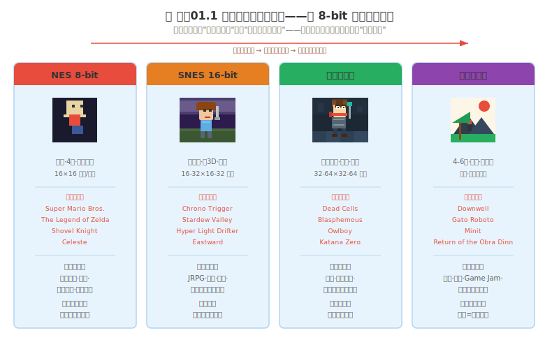
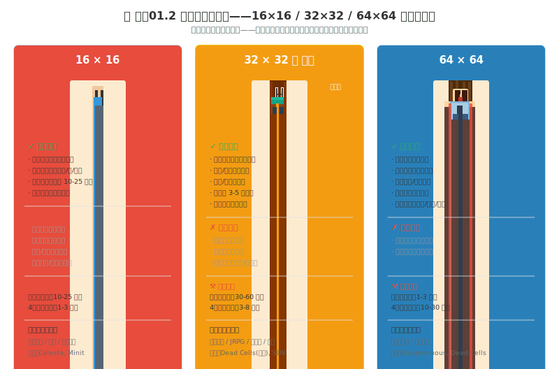

# 风格01 像素风格全景

### 1.0 这章解决什么问题

第二部你走完了练手01 到练手09——八概念逐个深练，加上练手08 的像素专属技法。你的眼睛升级了，你的手也有了肌肉记忆。第二部的最后一句话是"不要再练了——开始做"。

第三部"风格"就是"做"的第一个决策入口。**风格不是审美选择，而是工程选择——选择一种像素风格，本质上是在选择一套成本结构。** 本章帮你回答三个问题：① 我该不该选像素？② 如果选，选哪种？③ 开始做以后有什么坑需要提前知道？

读完这一章，你不是"会画像素"——你是"知道自己该不该画像素，以及如果该，以什么参数画、提前避开哪些坑"。

---

## 第一部分：我该不该选像素

### 1.1 像素是什么

**核心定义：** 以离散像素为最小视觉单位，每个像素的颜色和位置都经过显式决策。不是"低分辨率"——是"精确控制每一个像素"。

**视觉特征：** 硬边缘、有限色板、整数缩放（2×/3×/4× 等整数倍）、逐帧动画而非插值。

**代表游戏：** Celeste、Shovel Knight、Dead Cells、Stardew Valley、Hyper Light Drifter、Enter the Gungeon、Downwell、Minit——这八款覆盖了四个子代与三种游戏类型。

**适用场景：** 平台跳跃（像素边界天然对应碰撞框）、肉鸽（低单件资产成本支撑高随机组合量，换色极快）、复古/怀旧题材（像素本身是叙事语言）、资源有限的独立开发者（单角色静态帧制作时间通常在一小时以内）。

**隐藏成本——"像素便宜但动画贵"：** 这是本节最重要的一句话。像素在单个静态帧上的制作速度确实比手绘快。但像素在动画上的成本可能超过手绘——手绘用骨骼动画可以靠移动骨骼自动生成新动作，像素的每一个新动作的每一帧都需要逐像素重画。一个 Dead Cells 级别的像素角色可能有 30+ 帧——总工时可能达到数十小时。有一个解法是"3D→像素"管线（制作06），即用 Blender 建模后渲染成像素风格帧序列，把逐帧劳动转移给渲染管线。

**像素的核心优势不是"便宜"——是"换色极度快"。** 像素的每一个颜色都是独立的色板条目，换整个角色的颜色方案只需替换色板条目，数秒完成。手绘换色需要重画整层，可能数小时。如果你在做肉鸽、需要大量道具换色、需要大量角色变体——像素的换色优势是压倒性的。如果不需要大量换色——像素动画的昂贵可能抵消静态的便宜。

---

### 1.2 我到底该不该选像素

在谈"怎么做"之前，先谈"不要做"。以下是几类需要谨慎选择像素的情况——不是绝对不能，但你需要诚实地评估。

**需要谨慎的情况一：游戏高度依赖角色表情演出。** 像素的微表情表达能力有限。一个 16×16 的像素脸上，你能画的"表情差异"在两像素之间的移动——眼睛向上移 1 像素是"看天"，向下移 2 像素是"看地"。但要表达"犹豫中带着希望"——你做不到。这不关乎你的技术，关乎像素的物理信息容量。如果你的游戏核心体验依赖角色的面部微表情——像素会受到较大限制。不过，这不是绝对的——To the Moon、OneShot 等像素叙事游戏证明了在特定设计下仍可成立。

**需要谨慎的情况二：需要大量文字阅读的 UI。** 像素字体必须是等宽且偶数宽度。中文字符在 16×16 的网格内几乎不可辨识——需要至少 24×24 甚至 32×32 的像素网格才能让中文字符可读。如果你的游戏有大量物品描述、对话文本、数值界面——玩家阅读像素文字时的视觉疲劳会远超高清字体。这不只是审美问题——如果你的 RPG 有 500 件道具，像素 UI 就是一个持续的可读性摩擦。

**需要谨慎的情况三：需要丰富色彩渐变的大场景。** 像素的有限色板是其美学核心，但这也意味着天空不能有 64 级蓝的柔和过渡。有些开发者用大量 dithering（抖动渐变）来模拟色彩过渡——但 dithering 在放大后是视觉噪声而非渐变，且在动画场景中会产生闪烁效应。如果你的游戏核心体验依赖大气的柔和渐变（开放世界远山变淡变蓝、水面反射渐变），像素在结构上有局限。

**需要谨慎的情况四：目标用户画像。** 某些偏写实或城市规划类模拟游戏的玩家通常更期待高信息密度的画面——像素在这些品类中可能不被视为"风格选择"而是"看起来像便宜的游戏"。不过，Stardew Valley、Graveyard Keeper、Core Keeper 等模拟经营向像素游戏也获得了巨大成功——关键是你需要诚实地评估自己的目标用户在不在意像素的视觉信息密度。

**诚实自检问题：** 在你决定选像素之前，问自己——"如果我的游戏用高清手绘风格做，它会变得更好吗？"如果答案是"会"，那你选像素的理由可能只是"画不出手绘"——这不是风格选择，这是技能妥协。技能妥协本身不是问题，但你需要诚实地面对这个事实——因为这会直接影响你对像素"能做什么、不能做什么"的判断。

**像素的工程成本速览：**

| 维度 | 像素艺术 |
|---|---|
| 静态图制作 | 通常较快（小尺寸角色一小时以内） |
| 动画成本 | 较高（逐帧重画；30+ 帧可能需要数周） |
| 技术复杂度 | 低（Aseprite 入门几天） |
| 换色成本 | 极低（替换色板条目 = 数秒） |
| 分辨率锁定 | 是（中途改分辨率 = 重画所有素材） |

关键洞察不是"像素最省钱"——而是"像素的钱花在动画上，不是静态图上"。如果选像素，减少动画帧数或动作种类（详见制作05）。

---

## 第二部分：选哪种像素风格

### 1.3 选择你的像素风格——四代 × 分辨率 × 写实/卡通

确定了要做像素，接下来是一组连续决策：世代 → 分辨率 → 写实还是卡通。这不是三个独立选择题——它们互相锁定。

> **关于"四代"分类的说明：** 业内对像素风格没有统一的世代分类。有人按 Console Era / Modern / Palette 分，有人按 Classic / SNES / Neo Pixel / HD-2D 分。本书采用"四代"的工作分类——NES 8-bit / SNES 16-bit / 现代高比特 / 调色板艺术——目的是帮独立开发者快速对齐制作成本和设计约束，而非提供历史学分类。

*图 风格01.1：四个像素子代——选择基于你的游戏需求而非"越新越好"。*

#### 子代一：NES 8-bit（4色·硬边·16×16）

最严格的设计约束。视觉特征：绝对硬边、4 色/精灵、色板小、无透明混合。代表游戏：Super Mario Bros.、Shovel Knight、Gato Roboto。

**选 8-bit：** 你在做 Game Jam、项目周期短、需要极端快速的资产迭代、或者游戏核心机制极简。
**不选 8-bit：** 你需要角色表情传达情感、需要区分不同道具、目标玩家没有 NES 怀旧感。

---

#### 子代二：SNES 16-bit（更多色·渐变·32×32）

视觉特征：更多颜色、渐变可能、精灵尺寸 32×32 或 64×64、开始出现 dithering。代表游戏：Chrono Trigger、Stardew Valley、Hyper Light Drifter、Eastward。

**选 16-bit：** 你在做 JRPG、种田游戏、探索冒险——需要角色有可读的表情和服装细节。Stardew Valley 证明了 16-bit 像素的大众市场接受度。
**不选 16-bit：** 你一个人做且内容量大——16-bit 角色制作时间比 8-bit 多数倍。项目有大量角色时总工时会急剧上升。

---

#### 子代三：现代高比特（大分辨率·全色·大帧数）

不是技术限制驱动的风格——是"故意选择像素媒介"同时在像素内做到最大细节。视觉特征：大分辨率精灵（64×64-128×128+）、全色、像素仍然可见但极其精细、动画帧数高、可能混合非像素元素。代表游戏：Dead Cells、Blasphemous、Owlboy、Katana Zero。

**选高比特：** 你在做动作游戏或类银河城，游戏卖点之一是视觉精致，有像素经验或足够的开发时间。
**不选高比特：** 你是第一次做像素、一个人做且角色数量大、项目周期短。高比特一个角色的动画集可能需要数天到数周的全职工作。

---

#### 子代四：调色板艺术（4-6色·极简·极高设计感）

不是技术限制——是纯粹的设计选择。视觉特征：极度有限的色板、每色有明确职责、强剪影、高对比。代表游戏：Downwell（3 色）、Minit（1-bit）、Return of the Obra Dinn。

**选调色板艺术：** 你在做 Game Jam、喜欢"极少元素做极多事情"的设计挑战、需要极其强烈的视觉签名。
**不选调色板艺术：** 你不会做色彩设计——4 色中一个色温度不对，整个画面的情绪就崩塌。你的游戏需要丰富的视觉信息来表达游戏性——4 色在信息密度上是天然瓶颈。

---

#### 分辨率决策速览

分辨率不是"选大就是选好"——是信息容量 × 制作成本的权衡。

*图 风格01.2：16×16 = 极速制作但无表情。64×64 = 细节丰富但工时爆发。32×32 是独立开发者的"甜点区"。*

**16×16：** 极快制作、基础动作可读、但无法表达面部表情、无法区分精细材质。适合平台跳跃、解谜、Game Jam 快速原型。

**32×32（⭐ 推荐甜点区）：** 表情可读（虽微妙表情仍做不到）、服装/道具细节清晰。角色静态帧通常在半小时到一小时左右。适合动作冒险、JRPG、肉鸽——正好卡在"做得到"和"做得起"的交界点上。

**64×64：** 丰富表情与微表情、可表现材质差异。但角色静态帧可能需要数小时，一个完整行走动画集可能需要数天到一周。适合高品质动作游戏，但需要有足够的时间和预算。

分辨率的深度决策矩阵（16/32/64 完整能力边界、工时代价、视觉分辨率双轨方案）见风格02。风格02 同时覆盖调色板选择策略。

---

#### 写实向 vs 卡通向

四代按历史分期组织，但在现代像素中，写实向和卡通向的技法差异也足够大，值得单独选择：

| 维度 | 写实向像素 | 卡通向像素 |
|------|----------|----------|
| **色数** | 16-64+ | 4-16 |
| **明度阶** | 多级渐变（抖动密度高） | 2-4 级（硬切为主） |
| **轮廓** | 隐式或无轮廓 | 1-2px 明确轮廓 |
| **比例** | 写实头身比（5-8 头身） | 大头/chibi（2-4 头身） |
| **工时/角色** | 高 | 中低 |
| **代表游戏** | Blasphemous、Owlboy | Celeste、Stardew Valley |

**选卡通向——** 核心是"可读性"和"快节奏"（平台跳跃、肉鸽），工时友好。
**选写实向——** 核心是"氛围"和"叙事"（类银河城、动作 RPG），工时是卡通向的数倍。

**混血可能：** Hyper Light Drifter——卡通角色 + 写实场景。Dead Cells——写实比例但克制的色数。如果你喜欢写实的氛围但承受不了写实的工时，用"卡通角色 + 写实场景"做折中。

---

## 第三部分：开始制作之前

### 1.4 开始制作之前——UI、动画、特效与常见坑

选了世代、分辨率、风格方向之后，在动第一笔之前，还有几个像素特有的工程问题需要提前知道。这些问题在你不做像素时不会遇到。

#### UI 与文字

像素 UI 的最大矛盾：像素需要整数倍缩放，但文字需要清晰可读。三条路径：

- **路径 A：UI 不跟随像素风格。** UI 用矢量/高分辨率字体，游戏画面用像素。Dead Cells、Celeste 都用这个方案。代价：你的游戏有两种视觉语言。
- **路径 B：使用像素字体。** 有开源像素字体支持中文（如"站酷像素体"、"Zpix"）。但中文像素字体的最小可读尺寸约 15-16px——意味着 UI 面板需要足够空间容纳这些字体。
- **路径 C：整数缩放 UI 面板。** 整个 UI 面板保持像素渲染，用整数倍缩放保持清晰。

**实践建议：** 手机游戏选路径 A（手机屏幕尺寸差异巨大 + 像素整数倍限制 = 灾难）。PC 游戏路径 B 和 C 都可以。

#### 动画帧间一致性

像素逐帧动画中，每一帧都是手画的——容易出现"浮动像素"：角色某部分在相邻帧之间偏移了 1-2 像素，动画播放时产生"颤动"。解法：Aseprite 的洋葱皮（Onion Skinning）+ 图层分离（头/躯干/手臂/腿各一层）。

#### 粒子特效的像素适配

像素游戏特效的两难：引擎粒子系统是平滑的（破坏像素一致性），手画像素特效是巨量手工。解法：关键特效手画关键帧然后循环（8-12 帧足够），次要特效用像素化的粒子系统（设粒子纹理为像素方块、关抗锯齿、低分辨率渲染再整数倍放大）。特效完整管线见制作05。

#### 常见坑——提前知道省掉返工

**踩坑一：在项目中期改分辨率。** 这是像素项目的"架构突变"。分辨率锁定是像素的第一约束——动第一笔之前就锁死。不确定就选 32×32——从 16×16 升到 32×32 是"重画所有东西"。

**踩坑二：忽略像素字体的中文困境。** 12px 的英文像素字体很常见——12px 的中文像素字体几乎不可读。15-16px 是中文像素字体的最小可读尺寸。

**踩坑三：用非整数缩放。** 非整数缩放 = 所有像素模糊化。启动前就算好：目标分辨率 × 整数倍 = 基础画布尺寸。整数缩放与引擎设置见制作07。

**踩坑四：像素 ≠ 便宜。** 像素在静态上快，在动画上贵。Dead Cells 团队用 3D→像素管线（制作06）来应对动画成本——这是一个工程解法，不是"像素本来就该这么贵"。

---

#### 12 问启动前检查清单

在你动第一笔之前：

1. **我的游戏类型适合像素吗？** 平台跳跃/肉鸽/动作冒险 → 适合。高度依赖表情演出或偏写实模拟经营 → 需谨慎评估（见 1.2）。
2. **我选的像素子代对吗？** 8-bit（极快不表达表情）/ 16-bit（甜点区）/ 高比特（细节丰富工时长）/ 调色板艺术（设计门槛高）。见 1.3。
3. **角色分辨率锁定了吗？** 16/32/64——选定后不可中途更改。不确定选 32。见风格02。
4. **目标平台分辨率 × 整数倍 = 基础画布尺寸确定了？** 见制作07。
5. **色板选定了吗？** 从 Lospec 选现成的。不要从零建。见风格02。
6. **第一个角色（含动画）的工时测过了吗？** 做完第一个角色的完整流程，据此评估整个项目的动画总时间。见制作02。
7. **用了洋葱皮 + 图层分离维护帧间一致性吗？**
8. **UI 用像素字体还是非像素矢量字体？** 像素字体的话，确认最小中文可读尺寸。
9. **缩放是整数倍吗？**
10. **特效方案定了吗？** 全像素手画 / 像素化粒子系统 / 混合？见制作05。
11. **分辨率在不同设备上测试过了吗？**
12. **如果答案不确定，有地方问吗？** 像素圈社区：Twitter #pixelart、Lospec 社区、PixelJoint 论坛。

完整决策流程（约束清单 → 逆向工程 → MVP → 混血三原则）见风格03。所有决策写成可追溯文档见风格04。

---

### 1.5 小结

像素艺术的本质不是"画得小"——是一种"每一个像素都是设计决策"的视觉语言。**风格不是审美选择，而是工程选择。** 你选的不是"哪种好看"，而是"哪种成本结构匹配你的项目约束"。

三个决策顺序：
1. **该不该选？** —— 不是"会不会画"，是"适不适合"（1.2）。
2. **选哪种？** —— 世代 → 分辨率 → 写实/卡通，互相锁定（1.3）。
3. **开工前知道什么？** —— UI、动画、特效、常见坑、12 问自查（1.4）。

**如果只记住一句话：** 像素的最强优势不是"便宜"——是"换色极度快"。如果不需要大量换色，像素动画的昂贵可能抵消静态的便宜。做选择之前，先算账。

---

### 1.6 扩展阅读

1. **Lospec — Palette List（lospec.com/palette-list）** — 超过 2000 个专业像素调色板，支持直接导入 Aseprite。
2. **《Pixel Logic》— Michafrar（michafrar.com）** — 从单像素到完整场景的全面教程。免费在线可读。
3. **Aseprite（aseprite.org）** — 像素艺术事实标准工具。开源可自行编译或 Steam 购买。
4. **Dead Cells 美术风格开发日志** — Motion Twin 团队关于"为什么选像素"、"3D→像素管线"的系列发布。
5. **PixelJoint（pixeljoint.com）** — 像素艺术社区和画廊，每周/月挑战。

---

### 1.7 本章引注

[^1] Michafrar. 《Pixel Logic — A Guide to Pixel Art》, 2019. https://www.michafrar.com/pixel-logic

[^2] Motion Twin. Dead Cells 开发日志. https://dead-cells.com/

[^3] Lospec Palette Library. https://lospec.com/palette-list

[^4] Aseprite. https://www.aseprite.org/

[^5] PixelJoint 像素艺术社区. https://pixeljoint.com/

