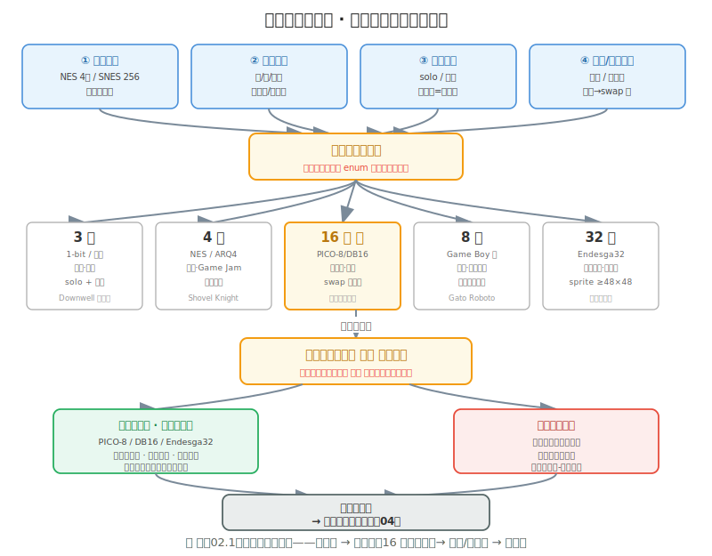

# 风格02 分辨率与调色板决策

### 2.0 这一章解决什么问题

风格01 给了你像素的"全景地图"——四代像素、分辨率的速览、像素的特殊挑战。但那张地图上标的是"有什么"，不是"怎么选"。本章是把那张地图上两个最关键的参数——**分辨率**和**调色板色数**——从"速览"展开成"决策表"。

为什么是这两个参数而不是别的？因为在像素的所有风格参数里，只有这两个**改一次 = 全部资产重画**。色调可以后期统一调（练手05 5.7 的 palette swap 15 秒搞定），抗锯齿可以事后修（练手08），构图可以重排——但分辨率一改，每个 sprite 的像素数变了，所有帧重画；色数一改，每个色的职责重分，所有上色重做。这两个是"地基级"参数，定完就不动，所以它们配得上一张专门的决策表。

因此本章只回答一个问题：给定你的项目约束（平台/情绪/团队/动画需求），分辨率选几乘几、调色板选几色、用固定板还是自定义？

---

### 2.1 分辨率决策深度：16 / 32 / 64 的能力边界与工时

风格01一章中 已经把 16×16 / 32×32 / 64×64 三种分辨率的"能做到/做不到/工作量/适合游戏类型"画成了三列对比图。如果你还没看，先看那张图——它是本节的视觉速览。本节做的是那张图的"决策展开"：把能力边界换成可量化的数字，把工作量换成项目级的总工时预算。

#### 2.1.1 能力边界——用面部画布像素数量化

判断一个分辨率"能不能表达表情"，最诚实的度量是**角色面部可用于五官表达的有效像素数**。表情是像素艺术里信息密度最高的需求——能用多少像素画脸，决定了你能表达多少种情绪。

| 分辨率 | 总像素 | 面部有效区域（典型） | 能表达的层级 |
|---|---|---|---|
| 16×16 | 256 | 大约 10×10 区域 | 两点眼睛 + 一条嘴线；皱眉/微笑靠 1 像素位移，微表情不可能 |
| 32×32 | 1024 | 大约 16×12 区域 | 喜怒哀惊可读；嘴角轻扬这种微妙微表情仍做不到 |
| 64×64 | 4096 | 充足空间 | 眉毛角度、嘴角幅度都能画；像素语言内的微表情成立 |

面部有效像素数决定了你能编码的表情种类数量。

#### 2.1.2 工时——从单帧到项目总预算

风格01 给了单角色静态帧和 4 向行走动画的工时。本节把它推到**项目级**：如果你的游戏有 N 个需要全动画的角色，总工时是多少。这一步是很多人在启动前跳过的——跳过的代价是项目做到一半才发现"光角色动画就要半年"。

工时基准：

| 分辨率 | 静态帧 | 4向×6帧行走（24帧） | 单角色全动画 |
|---|---|---|---|
| 16×16 | 10-25 分钟 | 4-6 小时 | ~5-7 小时 |
| 32×32 | 30-60 分钟 | 8-16 小时 | ~10-17 小时 |
| 64×64 | 1-3 小时 | 18-36 小时 | ~19-39 小时 |

**项目级预算（假设 10 角色 + 10 敌人 + 20 NPC = 40 个全动画角色）：**

| 分辨率 | 40 角色全动画总工时 | 折合全职工作周 |
|---|---|---|
| 16×16 | 200-280 小时 | 5-7 周 |
| 32×32 | 400-680 小时 | 10-17 周 |
| 64×64 | 760-1560 小时 | 19-39 周 |

这张表是"分辨率的真实代价"。64×64 的 40 角色全动画 = **19-39 周全职**——这还只是走路动画，不含攻击、受击、死亡、UI、场景。如果你是一个人做、业余时间开发（每周 10 小时），64×64 的 40 角色动画 = **76-156 周**（一年半到三年）。这就是为什么风格01 把 32×32 定为甜点——它不是"最好的"，是"一个人做得起、又做得出来"的。

**工时超预算时拉哪个杠杆——先砍角色数，还是先降分辨率？** 这是 2.1 决策表里没写但实操中必然撞到的问题。规则看角色关系：如果你的角色**彼此剪影不同、不可复用**（10 个造型各异的 boss），砍数量会让游戏内容缩水，这时降分辨率更划算；如果你的角色**是同体换色变体**（50 把只是颜色不同的剑、6 种颜色的小怪），降分辨率 + 靠 palette swap 拉数量更划算——因为像素的换色成本是 15 秒，你用"低分辨率 × 多换色"对冲了"高分辨率 × 少角色"。判断标准一句话：**视觉差异靠剪影 → 砍数量；视觉差异靠颜色 → 降分辨率**。

#### 2.1.3 决策表——约束 → 分辨率

把上面两张表合成一张可执行的决策表：

| 你的约束 | 推荐 | 理由 |
|---|---|---|
| Game Jam / 周期 < 3 月 | 16×16 | 5-7 周做完 40 角色动画，留足时间给机制 |
| 单人 + 业余 + 想做完 | 32×32 ⭐ | 10-17 周可控；表情可读；大众接受度最高 |
| 单人 + 全职 + 卖点是"视觉精致" | 32×32 角色 + 64×64 立绘 | 见下文"视觉分辨率双轨" |
| 小队 + 有专业像素美术 | 64×64 | 工时可分担；细节是卖点 |
| 需要微表情/叙事演出 | **不选像素** | 64×64 仍匹敌不了手绘，叙事游戏换媒介 |

**降级比升级便宜——所以不确定就选 32×32 起步。** 从 32×32 降到 16×16，细节丢失但剪影保留，人工修一修能用；从 16×16 升到 32×32，是"凭空多出 768 个像素要画"= 重画所有东西。所以决策表里标 ⭐ 的 32×32 不只是"甜点"，还是"最安全的起点"——你保留了降级的退路，堵死了升级的绝路。如果你完全没有把握，宁可起步高半档也别起步低半档。

#### 2.1.4 混合分辨率——"视觉分辨率双轨"

游戏内行走角色用较低分辨率控制动画成本，对话/菜单时弹出较高分辨率立绘头像传递表情。这是"在需要细节的地方提高分辨率，在需要大量动画的地方降低分辨率"的工程思路。

这其实是行业常见方案，不是理论创新：
- **《Celeste》**——角色 16×16 极低分辨率便于快速平台跳跃，但背景和特效有更丰富的视觉层次。
- **《Hyper Light Drifter》**——角色和环境 tile 用了不同的精细度——角色简洁可读，场景复杂有质感。
- **《Octopath Traveler》**——像素角色 + 高质量光照和景深（虽然是混血，在风格03 展开）。

双轨不止角色×立绘一种。常见的混合：

- **32×32 角色 + 16×16 tile**：角色比 tile 大一倍，角色在场景里"凸出"——平台跳跃/银河城的经典比例（Hyper Light Drifter、Enter the Gungeon）。
- **16×16 角色 + 32×32 怪物**：怪物是"boss 感"的来源，给它更高分辨率让玩家觉得"这个敌人很重要"。
- **32×32 角色 + 64×64 关键 NPC 立绘**：普通 NPC 用行走 sprite，剧情 NPC 加立绘——区分"路人"和"角色"。

双轨的前提是**分辨率在项目启动时一次锁定全部档位**——角色档、tile 档、立绘档。中途加一个档位 = 那一档的全部资产重画。

---

### 2.2 调色板选择策略：色数、固定板与"约束即自由"

练手05 教完了色彩理论：HSV 三轴、东西方着色、色相偏移、六种和谐方案、60-30-10、经典调色板陈列（PICO-8/DB16/Endesga32/Sweetie16/ARQ4）、调色板替换、色偏阴影、5 色色彩脚本。如果你还没过练手05，先回去过——本章默认你已经会"在给定色板内选色"，只讲"怎么决定用多大色板、用谁的色板"。

#### 色数决策——3 / 4 / 8 / 16 / 32

练手05 给过"有限调色板系统——不同色数能做什么"的速览。本节把它展开成**带约束输入的决策表**：色数不是审美选择，是四个约束的函数。

| 色数 | 平台对应 | 适合情绪 | 团队/动画约束 | 代表 |
|---|---|---|---|---|
| **3 色** | 1-bit / 三色 | 极简、焦虑、签名 | solo + 少帧；色少 → palette swap 极快 | Downwell（黑白红） |
| **4 色** | NES / Game Boy | 复古、Game Jam | solo + 快速原型；4 色内"画错"立刻看到 | Shovel Knight、Minit |
| **8 色** | Game Boy Color | 怀旧、统一氛围 | solo + 需精确规划每色用途 | Gato Roboto |
| **16 色** ⭐ | PICO-8 / DB16 / Sweetie16 | 大众化、甜点 | solo/小队 + 多换色；palette swap 最友好 | 多数独立像素 |
| **32 色** | Endesga32 | 丰富材质、高比特 | 小队 + 高分辨率 sprite（≥48×48）才用得满 | 高比特像素 |

**为什么 16 色是甜点（和 32×32 是分辨率甜点同构）：** 16 色正好卡在"每色都有明确职责"和"够用"的交界。3-4 色每色都是设计宣言（错一色全崩）；32 色每色力量被稀释，超出 16 色后容易"脏"。

**但色数只是半个故事——比色数更重要的是 ramp 的数量。** 新手踩的最大的坑不是"颜色太多"，而是**把 16 色理解成 16 种不同的颜色**——红、绿、蓝、黄、紫、橙……每种颜色只有一个 hex，没有明度阶梯。结果：角色画不出阴影和高光，因为色板里有 16 个色相但每个色相只有一级明度。

> **正确理解：16 色 = 若干组色阶（ramp），每组 2-4 个色。** 比如：肤色组（亮、中、暗）×3=3 色，木头组（亮、中、暗）×3=3 色，金属组（亮、中、暗）×3=3 色，天空组（亮、暗）×2=2 色，阴影通用 1 色，高光通用 1 色，UI 强调色 1 色，备用 2 色 = 总共 16 色。每组 ramp 的色相按练手05 的 hue shift 规则微偏（高光偏暖、阴影偏冷）。**色板管理的核心不是"挑几个好看的颜色"，而是"每组 ramp 的阶梯是否均匀、组与组之间是否互相干扰"。** 这个思想比选 16 还是 32 更重要。

16 色还附带一个工程红利：**palette swap 最友好**——16 个色板条目替换关系清晰，做"50 把只是颜色不同的剑"成本最低。

**色数 × 动画帧数的反向关系——一个常被漏掉的决策输入。** 色数决策表里有四个约束，"动画需求"这一栏藏着一个反直觉规则：**动画帧数越多，每帧的色数应该越少**。每一帧色数越多，帧与帧之间"同一个色画歪一像素"的概率越高，动画播放时就"颤动"。32 色的 64×64 角色做 24 帧行走动画，每帧 32 个色都要对齐，工时和出错率都爆；4 色的 16×16 角色做 24 帧，每帧只有 4 个色要对齐，又快又稳。所以"高帧数动画 + 高色数"是双重昂贵——决策时如果两个都想要，先砍色数。

#### 固定调色板 vs 自定义——"约束即自由"

选定色数后，第二个决策是：**用一套社区验证的固定调色板，还是自己调？**

**用固定调色板（PICO-8 / DB16 / Endesga32 / Sweetie16）：**
- **省掉决策开销**——16 色的 DB16 是 DawnBringer 调过平衡的，你不需要从 HSV 轮里反复试。
- **团队一致性**——多人协作时，"我们都用 DB16"比"每人自己选 16 色"更容易收敛到同一观感。
- **即时合法性**——PICO-8 色板本身就是一种视觉签名，玩家一眼能认出"这是 PICO-8 风格"。
- **约束逼出设计**——色板定了，你的精力从"选什么色"转到"怎么用这 16 色"，后者才是像素的核心能力（练手05 的"少即是多"）。

**自定义调色板：**
- 你的情绪基调**没有任何固定板能匹配**——比如你要一种"工业废墟的青灰 + 锈红"，DB16 里没有，就得自己调。
- 你的游戏需要**专属视觉签名**——Downwell 的黑白红不是任何固定板，是专门为"竖井下落"设计的；要这种独占性就得自定义。
- 你愿意为"调出 16 色的平衡"付时间——调一套平衡的 16 色板，资深像素美术也要数小时到数天。

**决策捷径（团队规模这条线）：** ≥3 人团队默认固定板——多人协作时"每人都从 DB16 里选色"比"每人自己调 16 色"更容易收敛到同一观感，固定板的一致性红利在团队里被放大；solo 看情绪——情绪合 DB16/Sweetie16 就固定，不合才自定义，别为了"个性"给自己加数天的调平活。

#### 决策流——四个约束 → 色数 → 固定/自定义

把上面两节合成一条流程：

*图 风格02.1：调色板决策流程。四个项目约束（平台限制 / 情绪基调 / 团队规模 / 动画与换色需求）→ 第一步定色数（3/4/8/16/32）→ 第二步定固定板还是自定义 → 锁定写入视觉宪法（风格04）。16 色是色数甜点，与 32×32 分辨率甜点同构。*

---

### 2.3 分辨率 × 调色板的耦合

分辨率和色数不是两个独立决策——它们**耦合**。一个 16×16 的角色塞 32 色，大部分色挤在小色块里区分不开，结果是"脏"；一个 64×64 的角色只用 4 色，4096 个像素只有 4 种值，结果是"平"。好的像素资产是**像素数和色数平衡**——每个色都有足够的像素区域来"承担"它的语义。

更准确的表述是：**当分辨率越低时，每增加一种颜色，都意味着画面中必须留出足够大的区域去体现它，否则它只会成为视觉噪声。** 比如你在 16×16 的角色上加一种"深紫描边色"——这个色可能只会出现在 3-4 个边缘像素上，玩家根本分辨不出它是深紫还是深蓝。这 1 个色号被浪费了，同时占据了色板的一个 slot。

耦合参考（基于生产观察的经验值）：

| 分辨率 | 推荐色数范围 | 理由 |
|---|---|---|
| 16×16 | 3-6 色 | 256 像素分给 16 色 = 每色平均 16 像素 = 4×4，太小到看不出区分 |
| 32×32 | 8-16 色 ⭐ | 1024 像素给 16 色 = 每色 64 像素 = 8×8，够画一个色块区域 |
| 64×64 | 16-32 色 | 4096 像素给 32 色 = 每色 128 像素，能画材质差异 |

这条耦合规则也是为什么**固定调色板常带"推荐分辨率"**：PICO-8 的 16 色配 32×32 是设计过的（PICO-8 的 sprite 默认就是 8×8 / 16×16 / 32×32 的档位）；DB16 的 16 色在 32×32 上最舒服。你选固定板时，连"分辨率甜点"也一起被标准库定好了——这是固定板的隐藏红利。

**用耦合规则做反例诊断。** 当你画完一个角色觉得"哪里不对但说不上来"，先查像素数 ÷ 色数 = 每色平均像素。如果每色 < 25 像素（约 5×5），你大概率是色数超载——删几个色看是否立刻变干净；如果每色 > 200 像素且画面发"平"，你大概率是色数不足——加 2-4 个色（或加一个色相偏移的过渡色，见练手05 5.3）看是否立刻有体积感。这条诊断比"凭感觉调"快得多，因为它给了你一个可量化的比值。

---

### 2.4 上手行动：启动前两张表 + L1/L2/L3

启动任何像素项目前，填完下面两张表再动第一笔。这两张表是风格04"视觉宪法"的核心两节——风格04 教你怎么把全部决策写成可追溯文档，本章先给你这两节的内容。

**表 A · 分辨率决策表**（参考 2.1）：
- 我的游戏类型是 ___，需要微表情吗？→ 是则不选像素 / 否则继续
- 我的团队规模 ___、周期 ___、业余/全职 ___ → 查 2.1 决策表得推荐分辨率
- 我用双轨吗？→ 角色档 ___、tile 档 ___、立绘档 ___（一次锁定全部档位）

**表 B · 调色板决策表**（参考 2.2 + 图 风格02.1）：
- 平台限制 ___ / 情绪基调 ___ / 团队规模 ___ / 动画与换色需求 ___ → 第一步定色数 ___
- 固定板还是自定义？→ 固定则选 ___（PICO-8/DB16/Endesga32/Sweetie16）；自定义则写明情绪理由 ___
- 用 2.3 耦合规则校验：色数 ___ 是否落在分辨率的推荐范围 ___ 内

**填表顺序：先 A 后 B，但用 2.3 回头校验。** 分辨率决定色数的承载上限（2.3 耦合规则），所以先填 A 得到分辨率，再填 B 得到色数，最后用 2.3 的耦合表校验"这个色数落在这个分辨率的推荐范围里吗"——不落就回头调 A 或 B 之一。两张表是闭环，不是两次独立填空。

#### 练习

**L1 · 给一个游戏概念填两张表（约 30-60 分钟）**
自己出一个游戏概念（如"一个在腐烂图书馆里找书的解谜游戏"），填完表 A 和表 B。合格标准：两张表每一行都有具体值（不能写"待定"）；分辨率和色数满足 2.3 耦合规则；能口头解释"为什么是这个分辨率 + 这个色数"。

**L2 · 算你自己项目的角色动画总工时（约 30 分钟）**
数你项目需要全动画的角色/敌人/NPC 数量 N，按你 L1 选的分辨率查 2.1.2 工时表，算 `N × 单角色全动画工时`，再除以你的每周可用小时数，得到"光角色动画要几周"。合格标准：数字写实（不要按"我很高效"估算，按风格01-fig02 的基准）；如果结果超过你项目周期的 1/3，回头降一档分辨率或砍角色数。

**L3 · 设计混合分辨率方案并辩护（约 1-2 小时）**
为你的项目设计一套双轨/多轨分辨率（如 32×32 角色 + 16×16 tile + 64×64 关键 NPC 立绘），写一份 200 字的"为什么这样分档"——说明哪一档承担表情、哪一档承担量、哪一档承担质感。合格标准：每一档都能对应 2.1.1 的一个能力边界需求；总工时用 L2 的方法验过不超预算；方案能写进风格04 的视觉宪法。

---

#### 启动前最终 Checklist

在你动第一笔之前，逐项打勾。这一页可以直接截图保存：

- [ ] 角色分辨率已锁定（16 / 32 / 64），不会再改
- [ ] Tile 尺寸已锁定，与角色分辨率的比例关系已确定
- [ ] UI 尺寸和字体的像素可读尺寸已确定
- [ ] 每角色的目标动画帧数已确定（参考制作05 帧数矩阵）
- [ ] 调色板色数已确定（含每组 ramp 的阶梯数），用固定板还是自定义板已选定
- [ ] 是否允许后期新增颜色？如不允许，色板已锁死
- [ ] 团队所有人使用同一套色板，已经分发
- [ ] 角色动画总工时已按 2.1.2 的方法估算，没有超过项目周期的 1/3
- [ ] 如果有混合分辨率方案，各档位已一次锁定全部列出
- [ ] 上述决策已写入风格04 视觉宪法

---

### 2.5 常见踩坑

填表时最容易踩的五个坑——前四个是"两参数没一起定"的变体，第五个是"用错了场合"。

**踩坑一：只定分辨率不定色数（或反过来）。** 分辨率和色数耦合（2.3）——只定一个，另一个会被"画到一半发现不对"逼着改，而改任一个都等于重画所有上色资产。**两张表必须同一次填完**。

**踩坑二：solo + 业余选 64×64。** 这是 2.1 工时表里最典型的"浪漫化"——40 角色全动画 = 19-39 周全职，业余开发翻 4-8 倍。除非你的项目卖点就是"视觉精致"且你愿意为此砍角色数量，否则 32×32 是诚实的选择。

**踩坑三：自定义调色板但没付调平时间。** 自定义 16 色板的"平衡"是数小时到数天的工作（2.2）。如果你给自己定了自定义板但实际只花 20 分钟选色，结果是"看起来像没调过的 16 色"——比直接用 DB16 还差。**没时间调平就用固定板**，这是固定板存在的理由。

**踩坑四：色数超过分辨率的承载能力。** 16×16 + 16 色看起来"参数拉满"，实际每色只有 16 像素 = 4×4 区域，色与色在画面上糊成一团（2.3 耦合规则）。**色数不是越高越好——要和分辨率匹配**。

**踩坑五：Game Jam 用自定义调色板。** 48 小时的 Jam 里花 3 小时调一套自定义 16 色板的平衡 = 把 6% 的总时间花在"标准库已经给你的东西"上。Jam 就是固定板的用武之地——PICO-8/DB16 即时合法、零调平时间、玩家一眼认得风格。**自定义板是全职项目的奢侈品，不是 Jam 的工具**。

---

### 2.6 本章小结

分辨率和调色板色数是像素项目的两个"架构级"参数——动第一笔之前锁定，中途改 = 重画。分辨率 = 数据类型位宽（16×16 = `int8`，32×32 = `int32` 甜点，64×64 = `int64` 豪华）；色数 = enum 取值集合大小（3 色 = tri-state，16 色 = nibble 甜点，32 色 = 完整 byte）。两者耦合：像素数和色数要平衡，固定调色板常自带"推荐分辨率"。

**如果只记住一句话：** 分辨率和色数是**一起定的两个架构决策**——32×32 + 16 色（PICO-8/DB16）是独立开发者做得起、又做得出来的甜点组合；偏离这个组合（往上要付工时，往下要让表达力），偏离的代价用工时表（2.1）和耦合规则（2.3）算清楚再付。

本章还有两条"不对称规则"值得带走：**降级比升级便宜**（2.1，不确定就从 32×32 起步，保留降级退路）；**帧数越多色数应越少**（2.2，高帧数动画 + 高色数是双重昂贵，先砍色数）。这两条都是"省下你半年工时"的决策杠杆——像素的贵不在单帧，在动画的总帧数 × 每帧的色数 × 角色总数这个乘积里。

本章的两张决策表（表 A 分辨率、表 B 调色板）是风格04"视觉宪法"的第 1、2 节——风格04 教你怎么把它们和风格03 的混血决策一起写成可追溯文档。先把这两张表填出来，再读风格03/风格04 才有"被约束的对象"可写。

---

### 2.7 扩展阅读

1. **[Lospec — Palette List](https://lospec.com/palette-list)** — 固定调色板的首选源。2.2 的"用固定板"决策落地到这里选 PICO-8/DB16/Endesga32/Sweetie16。色彩理论本身见练手05 5.7。
2. **风格01 1.4 分辨率速览 + 风格01-fig02 分辨率决策图** — 本章 2.1 的视觉速览来源；四代像素的定义见风格01 1.3。
3. **练手05 色彩：少即是多** — 本章 2.2 的理论底座：HSV、东西方着色、六种和谐、经典调色板陈列、调色板替换、5 色脚本、色彩词汇表、有限调色板系统。本章只讲"怎么选"，"怎么用"在练手05。
4. **风格04 视觉风格文档** — 本章 2.4 的两张表是视觉宪法的核心两节；风格04 教你把全部决策写成可追溯文档。
5. **[Pixel Logic — A Guide to Pixel Art](https://www.michafrar.com/pixel-logic)** — **如果只读一本像素艺术教材，请读《Pixel Logic》。**
6. **[Aseprite](https://www.aseprite.org/)** — 调色板管理（Save/Load Palette、Create Palette from Sprite）见练手05 5.7。
7. **[PICO-8 手册 / DawnBringer DB16](https://lospec.com/palette-list/dawnbringer-16)** — 2.2 固定板甜点的两个代表色板。PICO-8 的 16 色自带"推荐分辨率 32×32"档位（2.3 隐藏红利）；DB16 是 DawnBringer 调过平衡的社区标准 16 色板，2.2"约束即自由"的典型案例。

---

### 2.8 本章引注

[^1] 分辨率决策框架——16×16/32×32/64×64 能力边界与工时代价（2.1 能力边界表、工时表的来源）。参见风格01 1.4 节与风格01-fig02。
[^2] "视觉分辨率双轨"——32×32 角色 + 64×64 立绘的混合方案（2.1 双轨）。参见风格01 1.4 节。
[^3] 调色板管理与颜色选择策略——固定调色板与限制色板的生产观察（2.2 固定 vs 自定义、2.3 耦合规则）。参见练手05 5.7 节。
[^4] 练手05 5.7 经典调色板与调色板管理 / 5.10 有限调色板系统——PICO-8/DB16/Endesga32/Sweetie16/ARQ4 陈列与"不同色数能做什么"（2.2 色数决策表的底座）。
[^5] Lospec Palette List，https://lospec.com/palette-list —— 固定调色板下载源（2.2、2.7）。
[^6] 风格01 1.4 分辨率速览与风格01-fig02 分辨率决策图——2.1 的视觉速览（2.1 开头交叉引用）。

