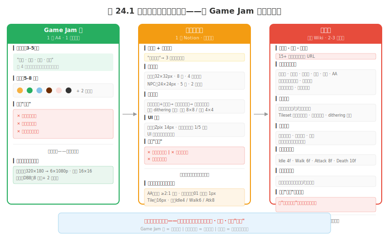
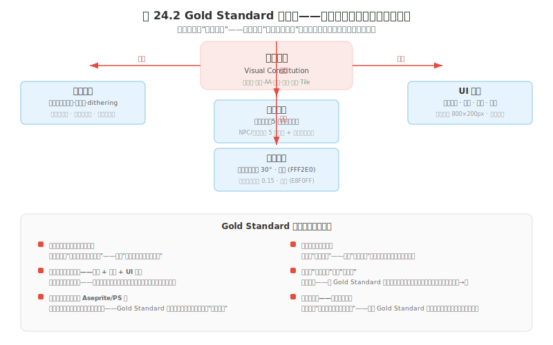

# 风格04 视觉风格文档：你的视觉宪法

### 4.0 这一章解决什么问题

风格03 给了你"约束清单 → 反向决策 → MVP → 混血三原则"的完整选择流程。你现在有了一个像素子风格的选择——四代中的哪一代（风格01）、分辨率是 16/32/64 的哪一档、调色板是几色用哪套固定板（风格02）。但"心里选定了"和"三个月后还能执行"之间有一道巨大的鸿沟——这道鸿沟的名字叫"风格漂移"（Style Drift）。

风格漂移是这样发生的：你在第 1 天从 Lospec 导入了主色板（暖色、低饱和、16 色）。你在第 5 天画了第一棵树（这时候你的"审美感觉"还是暖色的）。你在第 15 天画了第三个场景——但这时候你昨天刚玩了一个冷色调的像素游戏，你的"审美感觉"被污染了——你画出的天空是偏冷的，而且不知不觉多用了 2 个色板外的色。第 45 天你画了第 8 个敌人——这时候你已经不记得第 1 天的 16 色板里哪个色号是"阴影色"、轮廓该用练手01 五种里的哪一种了。第 90 天，你的游戏里有 50 个资产，但它们的色板条目、明度范围、AA 用法、轮廓粗细像"15 个人在不同时间做的"——因为确实是这样：那个"15 个人"就是你自己的 15 个不同的"审美状态"。

**你需要的不是更好的记忆——你需要一份在你每次做视觉决策时都能参照的文档。** 这文档不是"参考图合集"——参考图合集告诉你"大概长什么样"。风格文档告诉你"这个颜色在不在色板里"、"这个 AA 用得对不对（练手08）"、"这个轮廓类型是不是练手01 里锁定的那种"、"这个不做"。

**本章核心承诺：** 你将学会创建三种体量的像素风格文档（Game Jam 版 / 小型项目版 / 完整版）——哪一种体量取决于你的项目规模和团队规模。你将理解 Gold Standard 概念图的心法——它不是最好看的图，是最能代表你游戏"日常画面"的那张引擎截图。你将拥有一份"像素规格清单"——分辨率、调色板、AA 策略、轮廓类型、抖动策略、动画帧预算、Tile 尺寸——这七项是像素风格文档比通用风格文档多记的东西，每一项都回溯到前几章的决策。你将拥有一套"做完对照"的习惯——不是做好了再看，是做之前看、做之中看、做之后对照。

---

### 4.1 核心工作流

#### 4.1.1 风格文档不是美术参考图合集——它是决策记录

很多开发者在被问到"你的游戏风格是什么"时会打开一个 Pinterest board 或者一张截图的拼贴——"大概是这种感觉"。这种感觉的传达在一开始是有用的（情绪板 Mood Board）——但它不能替代风格文档。

**风格文档和参考图合集的核心区别：**

参考图合集是"输入的"——它告诉你"我想做成这样"。风格文档是"输出的"——它告诉你"你做出来的东西应该符合这些参数"。一个是灵感池，一个是约束集。但约束集不是限制创意——它在保护你的视觉一致性。

类比：API 文档不是你写 API 时的灵感来源——它是在你调用 API 时告诉你可以传什么参数、不可以传什么参数、返回什么类型的记录。风格文档就是你的游戏视觉 API 文档——你不凭记忆"调用"你的审美；你查文档"我要画一个角色——它的色板条目是什么？头身比是多少？明度范围在哪？轮廓是练手01 的哪一种？"

风格文档的三个核心功能：

1. **决策日志（Decision Log）：** 记录你"为什么"选了某个颜色、某个分辨率、某种轮廓。三个月后你翻开文档——你知道当时不是因为"好看"选了 32×32，是因为"32×32 的面部画布有约 192 像素，表情可读"（风格02 2.1）；不是因为"好看"选了 DB16，是因为"16 色在五种背景色下都能清晰看到角色"。
2. **约束集（Constraint Set）：** 明确定义"能做什么"和"不能做什么"。例如："禁止使用纯黑色（#000000），最暗色为 #2C3E50"——这不是审美偏好，这是技术约束（纯黑在低明度场景中变成隐形）。又如："禁止非整数缩放"——这是像素的硬约束（风格01 踩坑四）。
3. **比对标准（Comparison Standard）：** 每次你在引擎中完成一个新资产——放在风格文档的 Gold Standard 概念图旁边——"这个新做的门和这张基准图看起来是同一个游戏的吗？"如果答案是"不太像"——不是 Gold Standard 错了，是你做偏了。

> **程序员类比：** 风格文档 ≈ 项目的 `.editorconfig` + `tsconfig.json` + `stylelint.config.js` 三个文件的组合。`.editorconfig` 约定了缩进是 tab 还是 space（= 轮廓/线宽规则，练手01）。`tsconfig.json` 约定了你的代码能用什么语法（= 色板限制，练手05/风格02）。`stylelint.config.js` 约定了你的 CSS 风格必须统一（= AA/抖动策略，练手08/练手06）。没有这三个文件，团队 5 个人会写出 5 种风格的代码。同样，没有风格文档，你一个人会在 3 个月内画出 6 种视觉风格的游戏——因为人在不同审美状态下的大脑模式不同。

---

#### 4.1.2 像素风格文档比通用风格文档多记什么

在讲三模板体量之前，先说清楚一份**像素**风格文档和一份通用风格文档的差别。通用风格文档记的是"色温/光照/材质/构图"这一层；像素风格文档在这一层之下还多记一层"像素规格"——因为这些规格一旦漂移，重画成本是全部资产级别的（风格02 开头讲过：分辨率和色数是"改一次 = 全部重画"的地基级参数）。

像素风格文档必须捕获以下七项规格，每一项都回溯到前几章的决策：

| 规格 | 记什么 | 回溯到 |
|---|---|---|
| 分辨率 | 基础画布尺寸 + 角色分辨率（16/32/64）+ 整数缩放倍数 | 风格02 2.1 / 制作07 |
| 调色板 | 色数 + 哪套固定板（PICO-8/DB16/Sweetie16…）+ 各色职责标签 | 风格02 2.2 / 练手05 |
| AA 策略 | 用还是不用、用在哪、过度 AA 的红线（避免"糊边"） | 练手08 |
| 轮廓类型 | 练手01 五种轮廓里选哪一种（无轮廓/内轮廓/外轮廓/双色/破碎） | 练手01 |
| 抖动策略 | 用不用 dithering、用哪种模式、动画场景的"闪烁红线" | 练手06 |
| 动画帧预算 | Idle/Walk/Attack/Death 各状态的最小最大帧数 | 制作05 |
| Tile 尺寸 | Tile 边长（16/24/32）+ 与角色尺寸的匹配关系 | 制作03 |

**这七项是像素风格文档的"骨架字段"——三种体量的模板都围绕它们展开，只是完整度不同。** 一份空白的填入模板（含每一项的填写示例和检查问题）见**附录E 像素风格文档模板**——本章教原则，附录E 给空表。你现在读的这一章回答"为什么要写、写多详细、怎么用"；附录E 回答"每一栏具体填什么"。

---

#### 4.1.3 三种体量——选择一个你做得起且够用的

风格文档的致命幻觉是"我要写一份像大厂那样的完整美术文档"。你不做 AAA 大作。你的文档体量应该和你的项目规模成正比——而不是和你的野心成正比。

*图 风格04.1：三种体量风格文档对比。左：Game Jam 版——1 页 A4，一个小时做完。中：小型项目版——1 页 Notion，半天做完。右：完整版——多页 wiki，2-3 天做完。体量越大约束越细——但起点都是这三项：关键词 · 色板 · 三条"不做"；像素规格七项随体量逐级补全。*

**体量一：Game Jam 版——"一页 A4 能折进口袋"**

适合项目周期 < 72 小时的快速原型。你的目标不是"完整的视觉体系"——你的目标是**在 72 小时内不跑偏**。

**最小内容：**
- **3-5 个关键词：** 不是句子——是词。例如："温暖 · 简洁 · 童趣 · 秋天"。这 4 个词定义了你的游戏视觉世界的基本情绪。所有视觉决策在落地前都要问："这个决策符合这 4 个词吗？"
- **5-8 色板：** 即使 Game Jam 版也建议写 HEX/RGB，避免取色漂移——就拿色块贴在文档上。选色逻辑：从 Lospec 找一个现成的 5-8 色板直接导入（PICO-8/DB8 都行，见风格02 2.2 固定板清单）。**这是七项里 Game Jam 版必须锁的两项之一：调色板。**
- **三条"不做"：** 这是 Game Jam 版最重要的部分——因为 Game Jam 的资产时间是极度紧张的，"不做"防止你把有限的时间花在"看起来酷但不需要"的东西上。例如："不做纹理贴图"、"不做写实光照"、"不做高饱和颜色"。像素向加一条："不做 dithering"（72 小时内 dithering 的动画闪烁风险不值得，见练手06）。
- **分辨率一行：** Game Jam 版的七项里只需锁两项——调色板（上面）和分辨率。写一行："基础画布 320×180，角色 16×16，整数 6× 到 1080p"。分辨率锁定是像素的第一约束（风格01 踩坑二）——哪怕 Jam 也不能中途改。

**做 Game Jam 版的时间预算：1 小时。** 在 Game Jam 的第一个小时内填完——在画第一像素 / 建第一面之前。

**体量二：小型项目版——"一页 Notion，能共享给一个合作者"**

适合项目周期 3-12 个月，可能有 1-2 个合作者。你需要比 Game Jam 版更能"团队共享"的文档——合作者不能靠"看到你画的第一个角色"来理解风格约束。

**除 Game Jam 版三项之外增加：**
- **参考截图（3-5 张）：** 锚定"画面长什么样"的视觉参照。不是"我想做成这样"——是"你在这 3-5 张图之间找到的那个共同点是我们的风格锚"。附来源，方便合作者溯源（参考源见观察04 视觉食谱）。
- **像素规格七项的完整版：** 分辨率 + 调色板已锁；补齐 AA 策略（练手08）、轮廓类型（练手01 五种里选一种并贴示例）、抖动策略（用/不用 + 用哪种模式）、Tile 尺寸（与角色尺寸匹配，见制作03）、动画帧预算（Idle/Walk/Attack 各几帧，见制作05）。这五项在小型项目版里各写一行就够——不需要展开成规格表。
- **角色规格：** 主角尺寸（px）+ 头身比 + 主色板 + 与其他角色的比例关系。NPC（一个定义 + 一个示例）。敌人类型（一个定义 + 三个示例变体，通过 palette swap 区分——像素的换色优势见风格01 1.9）。
- **环境层级：** 前景 → 中景 → 远景的参数定义（三层叙事详见制作03）。特别是各层的对比度参数——确保角色在前景 / 中景 / 远景背景下都能被清晰看到。
- **UI 规则：** 字体名 + 字号 + 颜色。UI 色板是否独立于场景色板？对话框尺寸和屏幕位置。像素 UI 的可读性陷阱（中文最小 15-16px）见风格01 1.5 与制作04。
- **6 条"不做"（比 Game Jam 版多 3 条）：** 包含更具体的约束——"不做粒子特效"、"不做多光源场景"、"不做透明叠加效果"。

**做小型项目版的时间预算：半天。** 在项目的前两周内完成——不要在开发中途插队。

**体量三：完整版——"多页 wiki，是你的团队宪法"**

适合项目周期 12 个月以上，或者有 3 人以上合作团队。这份文档是全团队视觉决策的**唯一事实来源**（Single Source of Truth）。

**小型项目版的基础上增加：**
- **情绪板（Mood Board）：** 15-20 张参考图 + 每张图的"我们在这张图中提取什么"的标注。不是"这张图好看"——是"这张图中的角色比例我们采用"或"这张图中的色彩温度我们采用"或"这张图中的光照方向我们采用"——提取具体的、可执行的视觉基因。
- **像素规格七项的规格表化：** 每一项从"一行"升级为"一张表"——分辨率表（基础画布/角色/Tile/头像各多少，含视觉分辨率双轨方案，见风格02）、调色板表（每个色号的职责标签 + palette swap 方案）、AA 策略表（哪些资产用 AA、哪些禁用、过度红线）、轮廓表（每种角色类型的轮廓 + 线宽）、抖动表（每种场景的 dithering 模式 + 动画禁用区）、帧预算表（每类角色 × 每个状态的帧数）、Tile 表（每种 Tileset 的边长 + 相邻匹配规则）。这就是附录E 空白模板要填满的形态。
- **完整的角色规格表：** 所有角色类型的色配额、帧预算、尺寸、头身比、与其他角色的精确比例。含换色方案（每套换色的色号）。
- **环境规格：** 每个场景类型的前/中/远景参数。Tileset 自动拼接规则（相邻匹配规则 / 边界处理 / 变体防重复逻辑，见制作03）。光照预设文件路径（如果引擎支持）。
- **光照规范：** 主光源角度 + 颜色 + 强度的精确值。补光的精确值。环境光的颜色和强度。像素的光照是用色板条目模拟的（练手04 三点光照 + 练手06 抖动）——记清楚"亮面用色板第几色、暗面用第几色"。
- **动画帧数标准：** 每类角色 × 每个状态的最小和最大帧数。Idle 最少 2-4 帧。Walk 最少 4-6 帧。Attack 最少 6-12 帧。Death 最少 8-12 帧——根据重要性分配帧预算（完整管线见制作05）。
- **音画配合节奏：** 关键帧触发点对应的音效/音乐变化——例如"角色攻击帧第 4 帧触发挥砍音效"。"Boss 出现前 2 秒触发气氛变化"。
- **"不做"清单的拓展版：** 每一条"不做"附带"为什么不做"的理由——不是"我决定不做"——是"不做这段的理由是基于什么技术/审美/性能约束"。这防止团队在 3 个月后忘记"为什么不做"而对你的约束进行"修正"——然后又把同样的东西加了回来。

**做完整版的时间预算：2-3 天。** 在项目的第一个月内完成——这是团队基础建设的投入，不是浪费的开发时间。

---

#### 4.1.4 Gold Standard 概念图——你的"日常画面"参照物

*图 风格04.2：Gold Standard 概念图（Gold Standard Concept Art）——不是你的"宣传片画面"，是你的"日常画面基准"。它校准所有视觉输出——因为所有输出都在它旁边对照过。四个方向的约束都是像素规格的具象化：色板条目、分辨率/dithering、UI 像素字体、光照用色板模拟。*

风格文档里最重要的一张图——不是最漂亮的那张，是**最能代表你的游戏日常画面的那张**。它叫 Gold Standard 概念图——因为它是你的"黄金标准"。

**Gold Standard 的四条铁律：**

**铁律一：不是最好看的，是平均水平的。**
如果你游戏里 80% 的画面都是中景行走场景——Gold Standard 就是一张中景行走场景的引擎截图。不是 Boss 战的特效爆发。不是开局动画的震撼景深。不是结局时角色站在夕阳下的美丽背影。是——最普通的、玩家会看最久的画面状态。

为什么？因为你会用这张图来校准所有新资产。新做的门——放在 Gold Standard 旁边，"它看起来属于同一个游戏吗？"如果你用一张"最好看的画面"作为 Gold Standard，你会不断否决你的普通资产——"这个门没有达到宣传片的水平"——然后陷入无限修改。

**铁律二：它不是一张图——是一套图。角色 + 场景 + UI 同框。**
如果你的 Gold Standard 是一张没有 UI 的"纯画面"——你在做 UI 时会失去校准。如果你的 Gold Standard 是一张没有角色的"场景图"——你在做敌人时会失去校准。Gold Standard 至少包含一张带角色 + 场景 + UI 的引擎截图——三者同时出现，你看到三者的互动关系，才能判断一致性。

**铁律三：用引擎抓帧，不要用 Aseprite/PS 画。**
这是最重要的铁律——也是最容易被忽视的。你在 Aseprite / Photoshop / Blender 中画的"概念图"和它在引擎中实际渲染出来的画面——是两回事。整数缩放是否到位（制作07）、UI 叠加是否遮挡、色板在引擎光照下是否还准——这些只有在引擎截图里才看得见。Gold Standard 必须是你的引擎中截图的实际画面——否则你是在用一个"不存在的画面"来校准真实产出的资产。

程序员——这就像你在开发环境中写的单元测试全是过的那一套绿色 pass，但你的代码部署到生产环境中失败——因为环境不同。用引擎截图校准引擎输出，这是常识。

**铁律四：做完第一版就更新它。**
Gold Standard 不是"最终目标"——它是"当前标准"。你的第一个角色做完后，截图放进 Gold Standard。第二个角色做完后——对着 Gold Standard 比对。你的第一个场景做完后——更新 Gold Standard。不是因为第一个角色就是"最好"的——是因为第一个角色是你的"基准"。后续所有资产都锚定在这个基准上。

---

### 4.2 常见踩坑

**踩坑一：把风格文档当"一次性写完就锁死"。**

风格文档是**活的**——不是死的。你在开发过程中会发现新的约束需求（"哦，我需要定义树和树之间的距离标准"），或者发现某些约束不适用（"我们之前说的'不做多光源'现在在这个场景中需要被打破"）。

更新风格文档和改代码是一样的——每次你有新的发现，不要"在心里记住"——去写进文档。文档是你唯一的视觉记忆。你没有视觉记忆——你需要文档来当你的记忆。

**踩坑二：Gold Standard 一直在"重画"但永远不锁定。**

Gold Standard 锁定在你的**第一个可玩的版本**完成后。不是 MVP 完成——是你的第一个角色 + 第一个场景 + 第一个 UI 面板同框后的 24 小时内。如果你反复修改 Gold Standard——它就不再是标准——它变成了另一个参考图。

**踩坑三：文档里只有"做什么"没有"不做什么"。**

三条"不做"是风格文档的核心部分——不是装饰性的附录。游戏中"错误的东西"往往比"正确的东西"更容易被做出来——因为"错误的东西"往往看起来"酷"或者"做起来快"。"我不做纹理"不是审美偏好——它是时间预算保护装置。你在文档里写了"不做纹理"——当你在第 45 天想"要不给这棵树的树皮贴点纹理？"的时候，文档里的"不做纹理"会在那个瞬间让你停下来问自己：这个纹理真的需要吗？它不在了——你省下了 2 小时。像素向同理："不做 dithering"、"不做非整数缩放"、"不做 32 色对齐"——每条都是一道时间/质量防线。

**踩坑四：风格文档太模糊——"颜色是温暖的"。**

"温暖"不是一个可操作的标准。什么叫"温暖"？是色温在 3000K-4000K 之间？是 RGB 值偏黄和偏红？是饱和度 > 40%？当你的合作者（或三个月后的你自己）看到"颜色是温暖的"，他们不知道十六进制的色码应该落在哪个区间。写出**可执行**的标准：用一个色板的色号（练手05/风格02 的固定板）。用一个明度范围（练手04）。用"AA 只用在曲线斜率 > 2:1 的边上"（练手08）。用"轮廓用练手01 第三种、线宽 1px"。

一个测试：如果你把你的风格文档给一个完全不知道你的游戏的人看——他能照着你的文档画出一个"看起来属于你的游戏"的资产吗？如果能——文档够精确。如果不能——文档太模糊。附录E 的空表就是逼你把每一栏填到"陌生人能复现"的程度。

---

### 4.3 检查点

在开始画任何资产之前，检查：

1. **我的风格文档体量对吗？** Game Jam 版（< 72 小时）→ 1 页 A4。小型项目版（3-12 月）→ 1 页 Notion。完整版（> 12 月，多团队）→ 多页 wiki。
2. **我的关键词是否在 3-5 个以内？** 不是"15 个形容词"——是 3-5 个最核心的词。所有视觉决策都通过这 3-5 个词过滤。
3. **我的色板是从 Lospec 拿现成的吗？** 优先从成熟色板起步（PICO-8/DB16/Sweetie16，见风格02 2.2）；有明确理由时再自建。
4. **我的像素规格七项都填了吗？** 分辨率 / 调色板 / AA 策略 / 轮廓类型 / 抖动策略 / 动画帧预算 / Tile 尺寸——小型项目版起每一项至少一行，完整版每一项一张表（空表见附录E）。
5. **我的三条"不做"是否足够具体？** "不做纹理"、"不做 dithering"、"不做非整数缩放"——每条"不做"对应一个你做不起的方向。
6. **我的 Gold Standard 概念图是引擎截图吗？** 不是 Aseprite/PS 中画的美术幻想——是引擎中的实际渲染画面（铁律三）。
7. **我的 Gold Standard 包含角色 + 场景 + UI 三元素同框吗？**（铁律二）
8. **我是否把风格文档放在了每次画新资产时都能看到的位置？** （桌面快捷方式、第二屏幕、打印贴墙）
9. **我的合作者（如果有）是否读了风格文档，并且能用文档中的色号/参数做出一件一致的资产？**
10. **我是否在文档中记录了三个最重要的"为什么"——为什么选这个分辨率（风格02 2.1）？为什么用这套色板（风格02 2.2）？为什么不做 dithering（练手06）？**

---

### 4.4 上手行动

风格03 的三步上手行动（约束清单 + 反向决策 + MVP）的产出，是本章风格文档的核心输入。这一节教你把那些产出写成文档。

**第一步 · 起一张 Game Jam 版（30 分钟）。** 不管你的项目多大——先用 Game Jam 版起步。5 个关键词 + 5-8 色板（从 Lospec 选）+ 3 条"不做" + 分辨率一行。贴在屏幕旁边。这是你能做的最小的、具有最大视觉一致性的投入。合格标准：陌生人看这一页能说出你游戏的情绪和色板。

**第二步 · 升到小型项目版（半天，项目前两周内）。** 在 Game Jam 版基础上补齐像素规格七项的完整版（各一行）+ 角色规格 + 环境层级 + UI 规则 + 6 条"不做"。合格标准：七项每一项都能回溯到前几章的决策（分辨率→风格02、调色板→练手05/风格02、AA→练手08、轮廓→练手01、抖动→练手06、帧预算→制作05、Tile→制作03），不是凭空填的。

**第三步 · 锁定 Gold Standard（第一个可玩版本后 24 小时内）。** 第一个角色 + 第一个场景 + 第一个 UI 面板同框——在引擎里截图，贴进文档。合格标准：它是引擎截图不是 Aseprite 截图（铁律三）；它包含三元素（铁律二）；它是"日常画面"不是"宣传片画面"（铁律一）。锁定后不要反复重画（踩坑二）。

> **注意：这三步必须在"画第一批资产"之前完成到第二步。** 风格03 的错误 3 讲的就是"先开始画，边画边决定"的灾难——风格不会"浮现"，风格是被**写下来**的。把这三步的产出贴在屏幕旁边，后续制作01-09 的所有资产都回溯到这份文档。

---

### 4.5 本章小结

风格文档不是你做完所有思考之后的"总结报告"——它是你**在思考过程中**逐渐沉淀下来的决策记录。它的重心不在于"写了什么"——在于"每次你做视觉决策时，你有没有对照文档的习惯"。对像素向的项目，这份文档比通用风格文档多记一层"像素规格七项"——分辨率、调色板、AA 策略、轮廓类型、抖动策略、动画帧预算、Tile 尺寸——因为这七项是"改一次 = 全部重画"的地基级参数，必须落在纸上，不能留在脑子里。

程序员——你有一个 `package.json` 锁定依赖版本，因为你知道依赖的漂移会让你的项目在半年后跑不起来。同样，你的风格文档锁定你的视觉依赖（分辨率/色板/AA/轮廓/抖动/帧数/Tile）——因为视觉漂移会让你的游戏在三个月后看起来像三个不同的项目拼接的产物。附录E 是那份锁定文件的空表。

**最小可执行方案：** 如果你今天没有时间写完整版的风格文档——这不是借口不做。花 30 分钟做一个 Game Jam 版：5 个关键词 + 5 色块 + 3 条"不做" + 分辨率一行。把它贴在屏幕旁边。30 分钟——现在就可以做。

> **如果只记住一句话：** 风格文档不是写完就锁在抽屉里的"项目交付物"——它是每一次你打开 Aseprite、画出第一个像素、建出第一个面之前必须看的那一页。风格漂移不是"画不好"——是"画的时候没有参照"。

---

### 4.6 扩展阅读

1. **[Lospec — Palette List](https://lospec.com/palette-list)** — 超过 2000 个像素色板数据库，按色数、色调、用途分类。**为什么推荐：** 你的风格文档中的调色板那一栏应该从 Lospec 选——不要自己建。工业验证的色板比你从零设计的更"能用"。色板决策的完整策略见风格02 2.2。
2. **[Coolors.co](https://coolors.co/)** — 在线色板生成器——生成、锁定、导出。**为什么推荐：** 如果你在做非像素游戏——Coolors 的速度极快。像素向优先用 Lospec（整数色板 + Aseprite 直导）。
3. **[Gurney, James. 《Color and Light》](http://jamesgurney.com/)** — "色彩与光线——写实主义画家的指南"。**为什么推荐：** 如果你的风格文档需要一个光环境参数的定义——Gurney 的书是最权威的色彩与光源交互的参考。像素用色板模拟光照（练手04 + 练手06），Gurney 给你光环境的物理基准。
4. **[Notion / Obsidian — 知识库工具](https://www.notion.so/)** — 用作风格文档的写作平台。**为什么推荐：** 风格文档是活的、会被更新的——Notion/Obsidian 的 wiki 结构比一个静态 PDF 更适合"生长中的文档"。
5. **附录E 像素风格文档模板** — 本章教"为什么要写、写多详细、怎么用"；附录E 给"每一栏具体填什么"的空表 + 填写示例 + 检查问题。两者配套使用。
6. **风格01 / 风格02 / 风格03** — 风格文档的输入源。风格01 给四代像素与子代选择，风格02 给分辨率/调色板两张决策表，风格03 给约束清单/反向决策/MVP/混血三原则——本章三步上手行动的产出全部来自风格03。
7. **[The Gamer's Brain — Celia Hodent](https://www.gamasutra.com/)** — 认知心理学对游戏设计的影响。**为什么推荐：** 风格文档中的"不做"清单部分可以借着 Hodent 的认知过载理论找到更深的理由——大脑同时处理多种视觉风格时的认知成本。

---

### 4.7 本章引注

[^1] Hodent, Celia. 《The Gamer's Brain: How Neuroscience and UX Can Impact Video Game Design》, CRC Press, 2018. 特别是关于视觉一致性和认知流畅度的讨论——提供了"为什么风格漂移对玩家体验有害"的认知科学基础。

[^2] Gurney, James. 《Color and Light: A Guide for the Realist Painter》, Andrews McMeel, 2010. 关于光环境参数定义——为 Gold Standard 概念图中的光照校准提供科学基础。

[^3] Lospec Palette Library. https://lospec.com/palette-list — 超过 2000 个工业验证的像素色板，是本章"调色板那一栏从 Lospec 选"论点的数据库基础。

[^4] 风格02《分辨率与调色板决策》2.1/2.2 — 本章像素规格七项中"分辨率"与"调色板"两项的决策表来源。

[^5] 练手01《线条》五种轮廓 / 练手05《色彩》调色板 / 练手06《质感》抖动 / 练手08《像素专属技法》抗锯齿 — 本章像素规格七项中"轮廓/调色板/抖动/AA"四项的底层技法来源。

[^6] 制作03《环境与 Tile》/ 制作05《动画与特效》/ 制作07《上引擎》— 本章像素规格七项中"Tile 尺寸/动画帧预算/整数缩放"三项的应用管线来源。

[^7] Robinson-Yu, Adam. A Short Hike 开发日志。https://ashorthike.com/ — 独立开发者如何在单人项目中维护视觉一致性的实际案例。

---

> **第三部结束。** 从风格01 的像素全景与四代，到风格02 的分辨率/调色板决策表，到风格03 的约束清单/反向决策/MVP/混血三原则，到本章风格04 的视觉宪法——你拥有了"选哪个像素子风格 + 用什么参数 + 把参数写成可追溯文档"的完整决策链。你现在已经是一个"能为自己的游戏选对像素风格并且将风格锁定为可执行的视觉宪法"的独立开发者了。**第四部开始——制作：从素材到游戏。**
