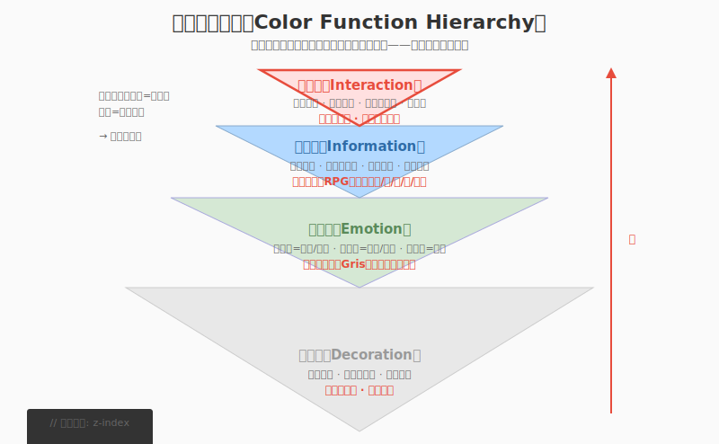
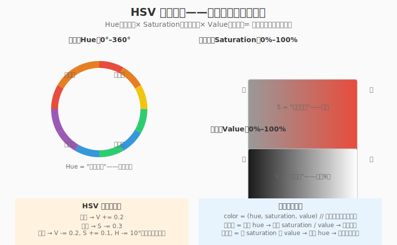
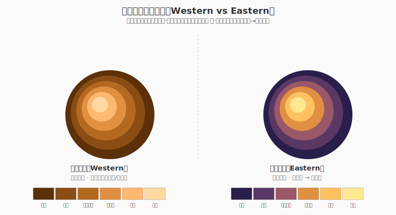
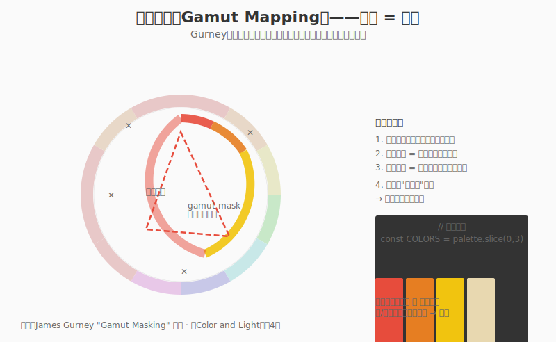
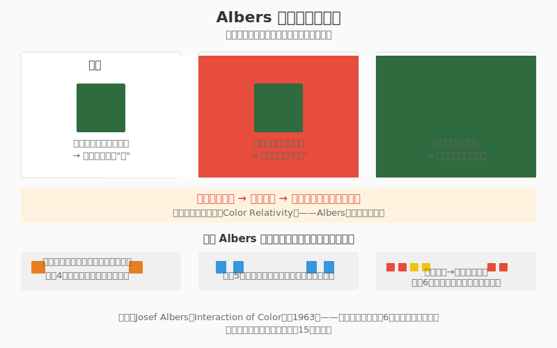
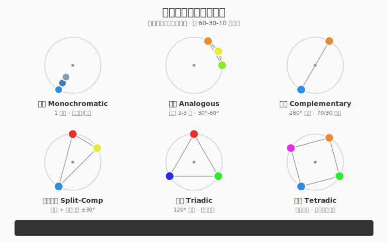
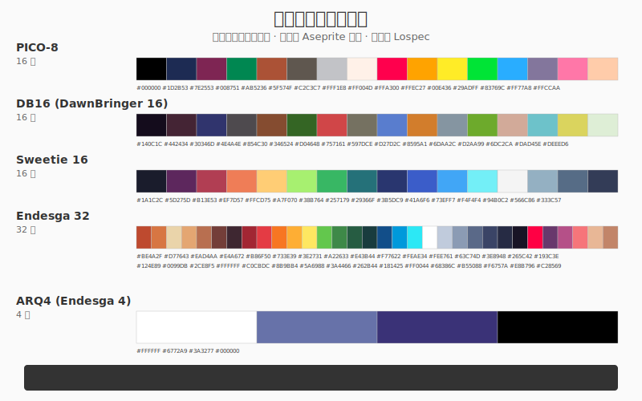
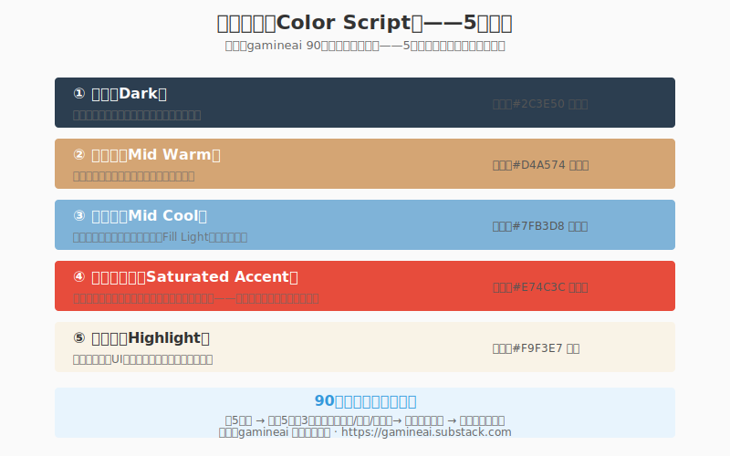
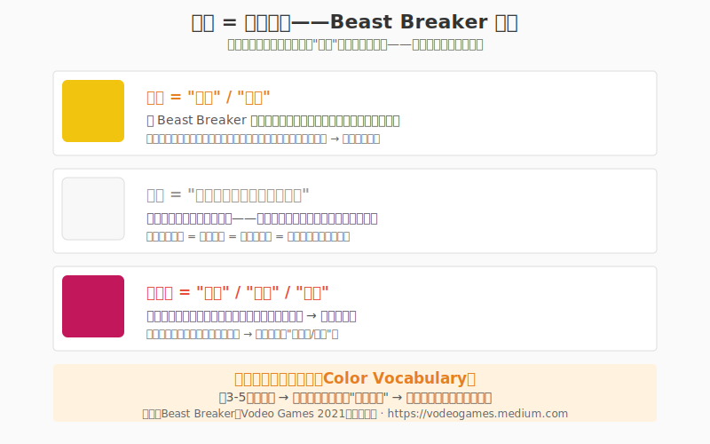
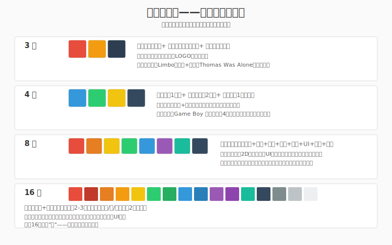

# 练手05 色彩：少即是多

### 5.0 这一章解决什么问题

练手04 你给贯穿角色建好了明度骨架——存成 `character-v03-value.aseprite`，去色后焦点还在、层次还清。可一旦你想给它穿衣服（上色），新的困惑立刻冒出来：调色板怎么选？阴影是直接加黑还是偏个色？为什么你精心挑的"好看的蓝紫色"涂上去画面就变脏？这一章解决的就是**从明度骨架到彩色皮肤的过渡**——在明度之上，怎么系统化地选色、限色、配色、控色。

观察02 把"色彩"列为八种数据类型之一：色相/饱和度/明度三者组合的系统，并给了你一条黄金规则——**色彩在游戏中的第一作用是信号，第二作用才是装饰。**《蔚蓝》冷紫标危险、暖橙标安全；《星露谷》靠黄昏暖色建立怀旧情绪。这一章把这条规则彻底拆开：色彩为什么是信号、为什么"少即是多"、HSV 为什么是你的原生语言、东西方着色有什么本质区别、六种和谐方案怎么用、经典调色板怎么直接拿来用。

本章把色彩知识拆成两条线：决策框架线——功能金字塔、HSV、色域遮罩（Gurney）、Albers 相对性、90 分钟色彩脚本、色偏阴影、色盲三规则；实操技法线——色彩基础、东西方着色两流派、色彩斜坡、色相偏移、六种和谐方案、调色板管理与经典调色板。两条线拼成一条流水线：**功能分层（定优先级）→ HSV 三轴（定语言）→ 东西方选流派（定着色法）→ 色域遮罩/和谐方案（定范围）→ 经典色板（拿来即用）→ 色偏阴影/脚本（落地）**。

> **贯穿式角色项目（续）：** 练手01 你画了 `character-v01-outline.aseprite` 的剪影/线稿；练手02 L1 长出体积存成 `character-v02-volume.aseprite`；练手03 练场景；练手04 L1 用明度思维重打光存成 `character-v03-value.aseprite`。**本章 L1 给这个角色正式上色**——套一套有限调色板 + 色相偏移着色，存成 `character-v04-color.aseprite`。它将在**制作02（像素角色工作流）**收口成可导入引擎的完整角色。所以 L1 你画的不只是练习，是给你贯穿角色穿上"色彩皮肤"。

你只需要 Aseprite，加一台能去色的眼睛。

---

### 5.1 程序员视角：色彩的功能分层

当你给一个 UI 按钮上色时，你在做什么？如果答案是"让它好看一点"，那你漏掉了最重要的东西。色彩在游戏中的第一身份是**功能载体**，第二身份才是审美装饰。这个认知是你从"会调色"到"会设计色彩"的分水岭。

把游戏里每一个颜色按功能归类，你会得到一个金字塔——从最关键的交互信号到最次要的环境装饰：

- **交互层（Interaction）——最高优先级**：危险提示（红闪）、选中状态（黄框）、可交互高亮（白晕）、禁用状态（灰）。《蔚蓝》用冷紫标危险区、暖橙标安全平台，玩家不读任何文字就懂。
- **信息层（Information）**：阵营识别（红队/蓝队）、稀有度（白/绿/蓝/紫/橙）、属性类型（火=红、冰=蓝）、状态标识（中毒=绿框）。
- **情绪层（Emotion）**：暖色调→安全/怀旧，冷色调→孤独/危险，低饱和→沉重/回忆。《Gris》每章一个主色定情绪，色彩弧线即情绪弧线。
- **装饰层（Decoration）——最低、最可被覆盖**：天空色、草木色、环境氛围色。当三层功能都要这个色时，装饰层是第一个被牺牲的。

*图 练手05.1：色彩功能分层（交互 > 信息 > 情绪 > 装饰）。越往上优先级越高、越不可出错；装饰层是第一个被牺牲的。*

> **程序员类比 #1：** 色彩功能分层 = 代码的**优先级（Priority）/ z-index** 系统。交互层是 `z-index: 9999` 的最顶层，必须覆盖所有其他颜色决策；信息层是 `struct`/`enum`，定义系统基础语义；情绪层是 `theme`；装饰层是 `style`。如果你把装饰层的需求摆到交互层之上——等于让 CSS 覆盖了核心业务逻辑的输出。画面会好看，但玩家不知道怎么玩。

#### 少色原则——最小权限

如果 4 个色能表达清楚一个场景，用 16 个就是过度设计。这不是猜的，是游戏美术史反复验证的：Game Boy 4 级灰度做出了《宝可梦》；8-bit 有限色板做出了《超级马力欧》（蓝的天、绿的管、红的马力欧，三主色全球通识）；现代独立像素通常 8–16 色一个场景，超过 16 色容易"脏"——颜色之间开始互相干涉。每加一个色你要付三个成本：**注意力成本**（新色"发声"，主角信号被稀释）、**和谐成本**（色越多越难协调）、**维护成本**（多场景多光照下一致性难保）。

> **程序员类比 #2：** 少色原则 = **最小权限原则（Principle of Least Privilege）**。一个函数只应拥有完成任务所需的最小权限，一个画面只应拥有表达信息所需的最少颜色。每多一个色就多一个潜在"权限滥用"——它可能干扰其他色的信号、破坏明度结构、让画面变脏。

---

### 5.2 色彩理论最小集：RGB / hex / HSV

#### RGB 与十六进制——屏幕颜色的底层表示

屏幕颜色由红/绿/蓝三种色光混合，每种强度 0–255。十六进制（hex）用一个六位代码描述：`#FF5733` → R=FF G=57 B=33。`#FF0000`=纯红、`#00FF00`=纯绿、`#0000FF`=纯蓝、`#000000`=黑、`#FFFFFF`=白。Aseprite 状态栏会显示当前色的 hex。这套表示是"机器友好"的——它是颜色的内存地址，但不适合"人选色"。

#### HSV——程序员的原生语言

HSV（Hue-Saturation-Value）把颜色拆成三个可独立操控的轴，这才是你选色该用的模型：

- **色相（Hue）**：0°–360°，这是什么颜色。红=0°、黄=60°、绿=120°、青=180°、蓝=240°、紫=270°、洋红=300°。
- **饱和度（Saturation）**：0%–100%，有多"纯"。100%=纯色，0%=灰度。降低饱和度是"让颜色变灰"的唯一正确方式——不是加白（那是提高明度），也不是加黑（那是降低明度）。
- **明度（Value）**：0%–100%，有多亮。0%=纯黑，100%=纯白——这就是练手04 的全部内容。

*图 练手05.2：HSV 三轴。色相绕环、饱和度由内向外、明度由下往上。三个参数可独立操控，是程序员的色彩超能力。*

三个参数的独立操控是你的超能力：

- **换颜色而保持结构**：只改 H，不动 S/V。画面情绪变了，明度骨架和强度感不变。
- **调氛围**：不改 H，整体降 S + 调 V。颜色还是那些，但"褪色"（怀旧）或"增强"（高潮）。
- **做阴影**：V − 20%，S + 10%，H 向冷色偏移 5–15°——比直接加黑自然得多（5.8 展开）。

> **程序员类比 #3：** RGB/hex = 颜色的**内存地址（指针）**，HSV = 颜色的**语义化字段（struct {hue, sat, val}）**。你调试时不看指针看字段——选色也一样，用 HSV 三轴思考"我要更冷一点 / 更灰一点 / 更亮一点"，比手调三个 0–255 通道直观一个量级。

---

### 5.3 东西方着色两流派 + 色彩斜坡

这是两本书最大的差异点，也是像素艺术圈最常被争论的一对流派。同一个物体，从亮面到暗面，你怎么过渡颜色？有两种哲学：

#### 西式方法（Western）——逐级明度阶梯

保持色相不变，只通过加减明度（加黑/加白）调节深浅。简单直接，适合初学者。一个橙色球：高光 `#FFD9A0` → 亮面 `#FFB870` → 中间调 `#E09040` → 暗面 `#B56820` → 阴影 `#7A4010`——**全是同一个橙色相，只是 V 在变**。

#### 东式方法（Eastern）——色相偏移（Hue Shifting）

在调明度的同时**改变色相**：高光往暖色（黄/绿方向）偏，阴影往冷色（红/紫/蓝方向）偏。同一个球：高光 `#FFE890`（暖黄）→ 亮面 `#FFC060`（暖橙）→ 中间调 `#E09040`（橙）→ 暗面 `#9A5868`（紫红）→ 阴影 `#5A3866`（冷紫）。色相沿着色轮从黄滑向紫。许多专业像素艺术家偏好东式，因为它产生更丰富、更有生命力的色彩。

*图 练手05.8：同一球体两种着色法。左·西式逐级明度（色相不变，只调 V）；右·东式色相偏移（暖高光 → 冷阴影，H 沿色轮滑动）。下方是各自的色彩斜坡（ramp）。*

#### 色彩斜坡（Color Ramp）

色彩斜坡是一组按明度排列的颜色，从亮面到暗面的过渡，每个梯级叫一个"色板"（Swatch）。一个好的 ramp 通常 4–6 个梯级。上面两个球的 5 个色就是一个 ramp。创建 ramp 的步骤：选基色 → 复制到相邻色板 → 调明度和色相 → 在两端之间生成过渡。这是你给任何物体上色的标准数据结构。

> **程序员类比 #4（本节核心，hue-shift 类比）：** 色相偏移 = **给 ramp 加一个 HSL 空间的曲线插值函数，而不是线性灰阶插值**。西式 ramp 是 `lerp(light, dark, t)`——只在线性 V 空间取值，结果是一串同色相的灰阶；东式 ramp 是 `lerp_hsl(warmHighlight, coolShadow, t)`——在 HSL 三维空间里走曲线，V 降的同时 H 向冷色偏、S 微调，**像给数值加了一个相位偏移（phase offset）**。暗部往冷色偏、亮部往暖色偏，模拟的是真实光的环境散射（蓝天反射填冷光进阴影），所以看起来"有空气感"而不像在煤灰里滚过。一个 ramp = 一条一维颜色数组；色相偏移 = 这条数组不是直线，是 HSL 空间里的一段弧线。

实操公式（东式阴影）：`阴影色 = 基础色 + V 降 15-25% + S 略升 5-10% + H 向冷色（蓝紫方向）偏 5-15°`。高光反向：`H 向暖色（黄方向）偏 5-10°`。这是本章最该背下来的一个公式——它和 5.8 的色偏阴影是同一件事的两种说法。

---

### 5.4 色域遮罩（Gamut Mask）——类型系统的约束

James Gurney 的色域映射是独立开发者最值得学的色彩框架：在完整色相环上选一个三角形（或四边形）作为"可用色域"。三角形内的高饱和色可自由用，三角形外的色要么不用、要么以极低饱和（灰化）出现。比如画秋天：gamut mask 覆盖红-橙-黄，画面所有高饱和色都来自这三个色相；你仍可用蓝——但只能是灰蓝（低饱和）做天空淡化。结果：整张画由暖色"家族"主导，和谐而有力。

常见 mask 类型：**类比色 mask**（三角形覆盖相邻 2–3 色相，最和谐，适合宁静场景）、**互补色 mask**（跨 180°，如蓝+橙，高张力，适合"弹出"）、**三角形 mask**（三色均布，活泼平衡，适合卡通）。

*图 练手05.4：色域遮罩。在色相环上画一个三角形作为可用色域——域内高饱和自由用，域外只能灰化。限制色相范围自动获得和谐。*

> **程序员类比 #5：** gamut mask = **类型系统（Type System）的约束**。你把可用色限定在色相环的一个子集内，就像把变量限定在一个 enum 内。外面当然有更多可能的值——但约束反而让代码（画面）更安全、更可预测、更一致。Gurney 证明了限制色相范围让画面更和谐，就像静态类型检查让代码更稳定。它和 5.6 的六和谐方案是同一思想的两面：和谐方案告诉你"取哪些色"，gamut mask 告诉你"禁止哪些色"。

---

### 5.5 Albers 色彩相对性——颜色不能孤立选择

Josef Albers 在《Interaction of Color》（1963）里用一系列实验证明了一个颠覆常识的事实：**同一个颜色在不同背景下看起来完全不同。** 一个墨绿在白底上显得深、在红底上偏蓝、在同色底上几乎消失。这不是眼睛的问题，是大脑——大脑不是绝对色彩计，而是相对色彩比较器。

*图 练手05.5：Albers 实验。同一个中间色，放在不同明度/色相/饱和度的背景上，看起来截然不同。颜色永远在和邻居"对话"。*

对游戏开发的直接影响：**你不能孤立地选一个颜色，必须在它最终出现的背景上测试。** 一个在灰色调色板里完美的血条红，放到绿色草地上可能完全不对——红绿并置让两色都"更鲜艳"（同时对比效应）。这也是练手04"先建明度骨架"的延伸：骨架是相对关系，色彩也是相对关系。

Albers 实验清单（L1 的表单，屏幕上做就行）：①同一色在不同明度背景上的明度变化；②同一色在补色背景上的色相偏移；③同一色在同色背景上的同化效应；④同一色在不同饱和度背景上的饱和度变化；⑤同一色在冷暖背景上的冷暖偏移；⑥两色交替排列产生第三色视错觉。

> **程序员类比 #6：** 颜色相对性 = **变量值依赖上下文（context-dependent evaluation）**。一个颜色的"表现"不是它自身的绝对 hex 值，而是 `color - neighbor_color` 的差值——就像一个变量的可读性取决于它周围代码的命名风格。孤立选色 = 不看作用域直接定义常量；在背景上测试 = 在真实调用点验证语义。

---

### 5.6 六种色彩和谐方案 + 60-30-10 法则

有了颜色和 ramp，下一个问题是：**怎么把不同颜色组合在一起还好看？** 这就是色彩和谐（Color Harmony）。色轮是导航工具，不同取色规律产生不同效果。

*图 练手05.9：六种和谐方案。每个小色轮标出取色位置与几何关系——单色（同色相多明度）、类比（相邻 2-3 色）、互补（180°）、分裂互补（主色+补色两侧）、三角（120°均布）、四角（两组互补）。*

| 方案 | 色相数 | 对比度 | 和谐度 | 上手 | 推荐用途 |
|------|--------|--------|--------|------|---------|
| 单色 Monochromatic | 1 | 极低 | 极高 | ★ | 入门、氛围统一、小精灵 |
| 类比 Analogous | 2–3 | 低 | 高 | ★★ | 环境/背景/场景 |
| 互补 Complementary | 2 | 极高 | 中 | ★★★ | 角色突出、UI 强调 |
| 分裂互补 Split-Comp | 3 | 中高 | 高 | ★★★★ | 精致插画、游戏场景 |
| 三角 Triadic | 3 | 中 | 中 | ★★★★ | 多彩角色、幻想题材 |
| 四角 Tetradic | 4 | 极高 | 低 | ★★★★★ | 复杂场景（高级） |

要点：**互补色永远不要五五开**——用 70/30 或 90/10，主色占大头、补色只做点缀（蓝角色配一个橙色腰带扣）。分裂互补天然适配 60-30-10：两个类比色铺色、一个互补色点缀。四角最难控制——降低其中两色饱和度以减冲突。

**60-30-10 法则**（来自服装设计，像素画同样有效）：**主导色 60-70%**（角色皮肤/衣服、背景主调）+ **辅色 20-30%**（次要元素、辅助角色）+ **点缀色 5-10%**（高光、UI 重点、魔法特效、眼睛）。不管用哪种方案，都要有"主/辅/点缀"的官阶区分。

> **程序员类比 #7：** 和谐方案 = **色轮上的取色算法**（几何约束决定取哪些 enum 值）；60-30-10 = **面积权重配比**（主色/辅色/点缀色的渲染优先级）。方案管"取什么色"，比例管"各色占多大画面"——两者合起来才是一套完整的色彩配置。

---

### 5.7 经典调色板与调色板管理——拿来即用

无需从零配色调板。社区已经积累了经过验证的经典调色板，直接在 Aseprite 导入即可用：

*图 练手05.10：五套经典像素调色板。PICO-8（16）/ DB16（16）/ Sweetie 16（16）/ Endesga 32（32）/ ARQ4（4），hex 标于色条下方。更多见 Lospec Palette List。*

- **PICO-8（16 色）**：复古游戏标准色板，每种色都精心选过。
- **DB16 / DawnBringer 16（16 色）**：极受推崇的 16 色板，色彩平衡极好。
- **Endesga 32（32 色）**：适用性极广，适合大多数像素画项目。
- **Sweetie 16（16 色）**：色彩明亮柔和，适合可爱风格（TIC-80 默认色板）。
- **ARQ4（4 色）**：ENDESGA 的极简 4 色板（白/中蓝/深紫蓝/黑），适合限制练习。

访问 [Lospec Palette List](https://lospec.com/palette-list) 可下载数百个现成调色板。

#### 调色板管理（Aseprite）

- **创建自定义**：在颜色选择器选色 → 点前景色旁的红色感叹号添加 → 删掉不要的默认色 → Options → Save Palette（`.ase`）。
- **从图像提取**：打开精灵 → Options → Create Palette from Current Sprite，提取该图所有颜色。
- **设为默认**：Options → Save as Default Palette。
- **限制色板练习**：16 色（宽松）/ 8 色（需规划每色用途）/ 2 色（极端，靠抖动创层次）。

#### 调色板替换（Palette Swap）

只换调色板里的颜色，同一个精灵就能变成完全不同的角色（敌人变体），或同一场景呈现白天/黄昏/夜晚的不同氛围。这是游戏开发里极高效的技巧——一套素材，多套皮肤。

> **程序员类比 #8：** 经典调色板 = **社区维护的 enum 常量库**，导入即用，省去手调 HSV；调色板替换 = **运行时换一个 enum 实例**，精灵的"索引"不变、只换索引指向的颜色值，就像换一套主题配置而 UI 结构不动。这也是为什么限色作品更好做 palette swap——颜色少，替换关系清晰。

---

### 5.8 色偏阴影（Color-Biased Shadows）——别再加黑了

初学者画阴影的方式：选物体色 → 加黑色。这是错的。自然界中的阴影几乎从不是"加黑"——阴影区被环境光（天空、地面反射）填充，而环境光通常带**冷色调**（蓝天反射的蓝光）。所以阴影不是"变黑"，而是"变冷 + 略暗"。这和 5.3 东式方法里的色相偏移是同一件事：阴影向冷色偏就是 hue-shifting。

Gurney 的色偏阴影原则：**暖光（阳光/灯光）→ 冷影（加蓝/紫偏移）；冷光（阴天/荧光灯）→ 暖影（加橙/棕偏移）。** 实操公式：`阴影色 = 基础色 + V 降 15-25% + S 略升 5-10% + H 向冷色偏 5-15°`。你会发现阴影立刻有了"空气感"——这不是魔法，是大气散射的物理。

> **程序员类比 #9：** "加黑做阴影" = **只减 V 值的 naive 实现**；色偏阴影 = **同时调 V、S、H 三个字段的正确实现**。前者把阴影当成"亮度衰减"，后者把阴影当成"环境光的二次着色"——阴影颜色 = 物体色 × 环境光色（类似乘法混合模式）。物理对了，画面才有空气感。

---

### 5.9 色彩脚本——gamineai 90 分钟 5 色管线

gamineai（独立游戏美术布道师）提出了一个极实用的"色彩脚本"方法，专门为独立开发者设计 [1]：**在 90 分钟内，用 5 个颜色锁定你的游戏色彩身份。**

五个色的分工：①**暗色（Dark）**——最深色调，用于阴影/暗部/夜晚基调；②**中暖色（Mid Warm）**——中间调暖色，用于地面/皮肤/木质；③**中冷色（Mid Cool）**——中间调冷色，用于天空/水面/补光；④**饱和强调色（Saturated Accent）**——画面最饱和的色，用于交互元素/主角标识/特效；⑤**高亮色（Highlight）**——最亮的色，用于高光/UI 文字/光源指示。

*图 练手05.6：色彩脚本 5 色模板。暗/中暖/中冷/饱和强调/高亮——五色各司其职，90 分钟锁定游戏色彩身份。*

工作流：①选 5 色（10 分钟）；②用这 5 色画 3 个关键帧——开场/转折/结尾（30 分钟）；③检查色彩弧线：3 帧情绪变化是否连贯（20 分钟）；④从 5 色扩展为完整色板，每色衍生 2–3 个明度变体（30 分钟）。

> **程序员类比 #10：** 色彩脚本 = **先定义接口（5 个核心色 = 5 个 API），再写实现（扩展为完整色板）**。你先把"色彩身份"的契约钉死——哪 5 个色代表这个游戏——再让所有场景继承这套契约。这避免了"画了 50 个场景才发现主角色和天空色撞了"的返工。

---

### 5.10 色彩词汇表 + 有限调色板系统

#### 色彩 = 词汇——Beast Breaker / Portal 案例

Vodeo Games 的《Beast Breaker》给每个颜色赋予了明确的"功能词汇"，就像给变量起有语义的名字：**黄色 = "安全/归属"**（家园区/安全营地全用暖黄）；**白色 = "主角，与任何背景都好搭配"**（小白鼠明度最高，永远能从背景跳出）；**洋红色 = "腐败/危险/异类"**（洋红自然界几乎不存在，自动触发"这不自然"警报）。《传送门》（Portal）同理：橙=玩家传送门 / 蓝=系统传送门，暖=主动=玩家 / 冷=被动=系统。

*图 练手05.7：色彩词汇表。给每个核心色写一句"功能定义"——不是"这是蓝色"，而是"这个色在游戏里表示______"，并在整个开发中坚持。*

立刻能用：选 3–5 个核心色，给每个写一句"功能定义"——"这个色在游戏里表示______"。当有人说"加个紫色吧"，你检查：紫色在词汇表里代表什么？如果它已有语义（如"毒属性"），就不能被用于纯装饰。

#### 有限调色板系统——不同色数能做什么

*图 练手05.3：3/4/8/16 色调色板色谱与代表游戏。色数越多每色力量越弱——超过 16 色易"脏"。*

- **3 色（剪影+强调）**：1 背景 + 1 中间 + 1 高亮强调。范例：《Limbo》黑白灰、《Thomas Was Alone》纯色方块。适合极简、low-poly、文字冒险。
- **4 色（角色+背景）**：1 背景基调 + 2 角色 + 1 高亮。Game Boy 时代就是 4 色。适合最小原型、Game Jam、像素入门。
- **8 色（完整场景）**：天空 + 地面 + 角色（2）+ 植被 + 建筑 + UI + 暗部。2D 独立游戏的"甜蜜点"。《蔚蓝》单区域通常不超过此数。
- **16 色（丰富层级）**：每主色配 2–3 个明度变体 + 2 个中性灰。像素场景的上限——超过易"脏"。《空洞骑士》每区约 12–16 色。

> **程序员类比 #11：** 色彩词汇表 = **给 enum 值写语义注释 / docstring**；有限调色板系统 = **按项目规模选 enum 的大小**（3/4/8/16）。词汇表管"每个色什么语义"，色数管"系统多复杂"。两者合起来 = 一套有类型、有语义、有约束的色彩系统——这正是"少即是多"的工程化表述。

---

### 5.11 色盲无障碍三规则

全球约 8% 男性有某种色觉缺陷（最常见红绿色盲）。如果你的游戏完全靠颜色传关键信息，就自动排除了这部分玩家。三个原则让游戏对色盲玩家友好：

1. **不纯靠颜色区分**：红绿不能是区分"敌/友"的唯一方式。加不同形状（圆 vs 方）、不同图标（匕首 vs 盾）、不同动画（闪烁频率不同）。
2. **明度对比兜底**：即使颜色一样，明度不同色盲玩家仍能区分。把关键 UI 去色检查——它们还有区别吗？这就是练手04 去色检验法的又一个应用。
3. **形状/图标双重编码**："火=红、冰=蓝"不够——加火焰图标和雪花图标。颜色是主信号，图标是兜底。

> **程序员类比 #12：** 色盲三规则 = **不把全部状态编码进单一通道**。颜色是一个通道，明度是另一个，形状/图标是第三个。关键信息要冗余编码到多个独立通道——就像关键的系统状态不只在日志里写，还要发告警、还要写监控面板。单通道失败（色盲）时，其他通道兜底。最简检验法：UI 截图去色，"信息还在吗？"

---

### 5.12 练习

本章练习逐级递进，每级有明确"及格标准"——你不需要完美，达到标准就进下一级。三个练习建议分三天。

> **贯穿式角色项目（续）：** 练手04 你存了 `character-v03-value.aseprite`（明度骨架扎实、去色后焦点还在）。**本章 L1 给这个角色穿上色彩皮肤**——选一套有限调色板、用东式色相偏移着色、走完灰度→上色工作流，存成 `character-v04-color.aseprite`。这个角色将在**制作02（像素角色工作流）**收口成可导入引擎的完整角色。所以 L1 你画的不只是练习，是给你贯穿角色的"色彩层"。

#### L1 · 给贯穿角色上色（约 60-120 分钟）

**目标**：把练手04 的 `character-v03-value.aseprite` 从灰度骨架升级为彩色精灵——套一套有限调色板 + 色相偏移着色。

**你需要**：练手04 的 `character-v03-value.aseprite`、Aseprite、纸笔。

**步骤**：
1. **定色彩词汇表**：在纸上列出角色 5 种最重要的信息类型（如 主角本体 / 衣服 / 武器 / 头发 / 高光），给每种分配一个颜色，写一句"这个色表示______"（5.10）。
2. **选调色板**：从 5.7 的经典色板选一套作为起点——推荐 Endesga 32 或 Sweetie 16，删到 8 色以内用。或用 gamineai 5 色脚本（5.9）从零选 5 个色。
3. **定和谐方案**：在 5.6 六方案里选一个——角色推荐互补或分裂互补（让角色从背景弹出），背景推荐类比。写下你的选择和 60-30-10 比例。
4. **灰度→上色**：复制 `character-v03-value.aseprite`，新建 Overlay/Color 图层叠加颜色——**只改色相饱和度，不动明度结构**（练手04 的"先 HTML 再 CSS"）。
5. **色相偏移着色**：给角色的每个 ramp 用东式方法——高光向暖偏 5-10°、阴影向冷偏 5-15°、V 降 15-25%（5.3 公式）。这是本步核心，别只调 V。
6. **色偏阴影**：暗部用 5.8 公式（V 降 + S 升 + H 冷偏），不要加纯黑。
7. **Albers 检查**：把角色放进假设的背景色上看看颜色对不对——孤立选色必败（5.5）。
8. **去色验证**：按 Ctrl+Shift+U——新加的颜色有没有破坏练手04 建好的明度关系？焦点还在吗？保存为 `character-v04-color.aseprite`。

**合格标准**：
- [ ] 纸上写了色彩词汇表（5 色 + 功能定义）和所选和谐方案 + 60-30-10 比例。
- [ ] 调色板 ≤ 8 色，来自经典色板或 gamineai 脚本。
- [ ] 至少一条 ramp 用了东式色相偏移（高光暖、阴影冷，非纯 V 衰减）。
- [ ] 阴影无纯黑，用了色偏阴影公式。
- [ ] 最终去色后焦点仍在、层次仍清——练手04 的明度骨架没被颜色破坏。
- [ ] 文件存为 `character-v04-color.aseprite`，准备交给制作02 收口。

#### L2 · Albers 实验（15 分钟）

**目标**：亲身体验色彩相对性，建立"颜色不能孤立选择"的本能。

**步骤**：画三个 200×200 背景块——纯白、纯红（#E74C3C）、墨绿（#2E6B3E）；在每块中心放一个 60×60 的墨绿方块（完全相同色值）。对比三列：同一个墨绿，在白上最深最浓、在红上偏蓝偏冷、在绿底上几乎消失。再试变体：同一橙（#E67E22）放灰底 vs 蓝底（冷暖偏移）；同一蓝（#3498DB）放黑底 vs 白底（明度感变化）；红黄小方块交替排列（是否出现橙色视错觉）。

**合格标准**：你亲口说出"同一个色在不同背景上看起来确实完全不同"，并从此再不会在不考虑背景的情况下单独选色。

#### L3 · 经典色板提取 + 移植 + 换肤（1-3 小时）

**目标**：学会从经典色板和商业游戏中提取色板、分析结构、移植并换肤。

**步骤**：
1. **提取**：从 Lospec 下载 Endesga 32 导入 Aseprite，分析它的配色——哪些是类比？哪些是互补对？
2. **移植**：用 Endesga 32 给 L1 的 `character-v04-color.aseprite` 换一套色（palette swap，5.7）——观察角色情绪变化。
3. **限色重画**：只用 Endesga 32 的 **4 色**重画角色——逼自己用最小色数做最多的事。
4. **换肤对比**：再换 Sweetie 16 / DB16 各试一次，对比三套色板给角色的不同感觉。

**合格标准**：能说出三套色板的核心差异（冷暖倾向、饱和度、和谐方案），并成功用至少两套色板给角色"换肤"且明度结构未受损。**进阶思考**：如果你有 32 色，角色会比 8 色版更"好"吗？还是只是更"乱"？

#### 去色检验法（贯穿全章）

和练手04 同一个习惯，本章再加一条：**每加一个新色，按 Ctrl+Shift+U 去色检查一次。** 理想工作流：①灰度骨架（练手04 已完成）；②Overlay/Color 叠加颜色；③每加一色就去色验证有没有破坏明度关系。如果你发现彩色版去色后"全都没了"——说明新加的颜色明度和已有色撞了，回 5.6 查和谐方案、回 5.4 查 gamut mask。

---

### 5.13 常见错误与诊断

**错误 1：色彩过多导致"脏"。** 画面灰蒙蒙、说不出的不舒服，即使每个单色都挺好看。**原因**：自由选色用到了色相环所有方向，没有色相家族做主，画面变色彩"菜市场"。**修复**：回到 gamut mask，选一个三角形，域外色全降饱和或删除。记住——好画面的秘密往往不是"再加一个色"，而是"删掉三个色"。

**错误 2：交互信息被颜色淹没。** 玩家反馈"不知道点哪"。**原因**：交互元素颜色落到了装饰层以下，和周围装饰色太近。**修复**：交互元素必须用画面中饱和度最高或对比最强的色。主体暖色 → 交互用冷色饱和强调（反之亦然），《蔚蓝》原理：冷紫环境 → 暖橙交互，永远相反。

**错误 3：忽略背景对颜色的影响。** 调色板里选好的色放到场景里完全不对。**原因**：孤立选色，没考虑 Albers 相对性（5.5）。**修复**：永远在实际背景上测试。角色会出现在草地/雪地/沙漠三张图，就要在三张图上分别测。Beast Breaker 选白色做主角——白色在几乎所有背景上都保持可读。

**错误 4：直接"加黑"做阴影。** 阴影区很"脏"、很"死"、像在煤灰里滚过。**原因**：只降 V，没做 H 冷偏和 S 微调（5.8）。**修复**：阴影公式 = V 降 20% + H 向蓝紫偏 10° + S 升 5%。阴影立刻有"空气感"。

**错误 5：色盲不友好。** 红绿色盲玩家分不清"友军/敌军"或看不懂血条警告。**原因**：完全靠红/绿二分编码，没提供形状或明度兜底。**修复**：三原则——不纯靠颜色（加形状/图标）、明度兜底（去色后还能区分）、双重编码（颜色+标记）。最简检验：UI 截图去色，"信息还在吗？"

**错误 6：西式 ramp 画到底，画面"塑料感"。** 角色每个部分都是同色相的明度阶梯，看起来平、假、没生命力。**原因**：只用西式方法（5.3），没做色相偏移。**修复**：给 ramp 加东式 hue-shifting——高光暖偏、阴影冷偏。一个公式就能让画面从"塑料"变"有空气"。

---

### 5.14 小结

色彩在游戏中的首要身份是信号，其次才是装饰。你的调色板越大，每个色的力量就越小——少即是多。用色彩功能分层（交互 > 信息 > 情绪 > 装饰）排好优先级；用 HSV 三轴作为选色语言；用东西方两流派决定着色哲学（西式逐级明度 / 东式色相偏移）；用 gamut mask 限定色相范围自动获得和谐；用六种和谐方案 + 60-30-10 决定取色与比例；用经典调色板拿来即用；用色偏阴影让暗部有空气感；用 gamineai 5 色脚本在 90 分钟锁定游戏色彩身份；用色彩词汇表给每个色赋予功能语义。记住 Albers 的教导：颜色不能孤立选择——它永远在和邻居"对话"。

**记住五件事**：
1. **色彩首先是信号，其次才是装饰**——功能金字塔定优先级，交互层 z-index 最高。
2. **少即是多 = 最小权限**——色越少每色力量越大，3/4/8/16 按项目规模选 enum 大小。
3. **色相偏移 = HSL 空间曲线插值，不是线性灰阶**——东式着色的核心，让 ramp 有空气感。
4. **gamut mask = 类型系统约束，和谐方案 = 取色算法，60-30-10 = 面积权重**——三者合一套完整色彩配置。
5. **颜色不能孤立选择（Albers）**——在背景上测试，去色验证明度骨架没被破坏。

**如果只记住一句话：** 先用练手04 的明度骨架打底，再套一套有限调色板 + 东式色相偏移——明度是 HTML，色彩是 CSS，结构没塌之前别动样式；而色相偏移就是给 ramp 的灰阶插值换成 HSL 空间的曲线插值。

**上手行动**：今晚打开练手04 的 `character-v03-value.aseprite`，按 L1 给它上色——选 Endesga 32 删到 8 色、用东式 hue-shifting、存成 `character-v04-color.aseprite`。完成后按一次 Ctrl+Shift+U——如果去色后角色比练手04 那版更清晰、色彩又比西式版更有空气感，你的色彩直觉就长了一层。这个角色将在制作02 收口。

---

### 5.15 扩展阅读

1. **Josef Albers《Interaction of Color》（Yale University Press, 1963/2013）**——20 世纪最重要的色彩教育著作，50+ 视觉实验证明色彩相对性。中译《色彩构成》。Yale 有免费 iPad 应用含核心实验交互版。★★★★★
2. **James Gurney《Color and Light: A Guide for the Realist Painter》（Andrews McMeel, 2010）**——第 4-6 章（Color / Gamut Masking / Color Relationships）是本章色域遮罩和色偏阴影的直接来源。有中译本《色彩与光线》。★★★★★
3. **gamineai "90 Minute Color Script Pipeline"（Substack）**——本章色彩脚本模板的方法来源。https://gamineai.substack.com ★★★★☆
4. **Lospec Palette List（https://lospec.com/palette-list）**——数百个社区验证调色板，可下载 `.ase`/`.gpl` 直接导入 Aseprite。本章 5.7 五套经典色板均出自此。★★★★★
5. **Game Accessibility Guidelines（http://gameaccessibilityguidelines.com）**——色盲无障碍设计完整检查清单 + 色盲模拟器推荐。★★★★☆

---

### 5.16 引注

[1] gamineai "90 Minute Color Script Pipeline"，https://gamineai.substack.com —— 本章 5.9 色彩脚本 5 色管线的方法来源。

[2] Albers, J. (1963/2013). *Interaction of Color*. Yale University Press. —— 色彩相对性（5.5）与 Albers 实验清单的出处。

[3] Gurney, J. (2010). *Color and Light: A Guide for the Realist Painter*. Andrews McMeel Publishing. 第 4-6 章 —— gamut masking（5.4）与色偏阴影（5.8）理论的直接来源；"gamut masking tool" 见 https://gurneyjourney.blogspot.com/2008/01/gamut-masking-tool.html

[4] Lospec Palette List，https://lospec.com/palette-list —— PICO-8 / DB16 / Endesga 32 / Sweetie 16 / ARQ4 五套经典调色板的 hex 值来源（5.7、5.12）。

[5] Vodeo Games "The Colors of Beast Breaker" 开发日志，https://vodeogames.medium.com —— 色彩词汇表（5.10）案例来源。

[6] Celeste 色彩设计：Maddy Thorson & Noel Berry, GDC 2019 "Level Design in Celeste"；Portal 色彩设计：Kim Swift, GDC 2008 "Portal Team Postmortem" —— 色彩作为玩法信号（5.1、5.10）的案例来源。

[7] Game Accessibility Guidelines v3.0，http://gameaccessibilityguidelines.com —— 色盲无障碍三规则（5.11）的检查清单来源。
