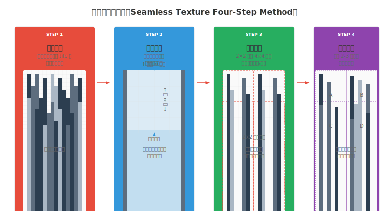
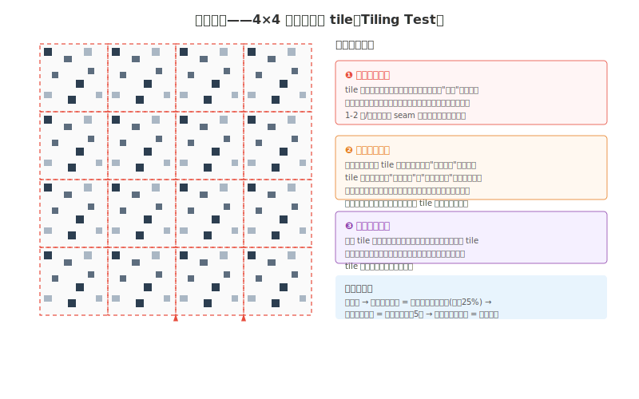
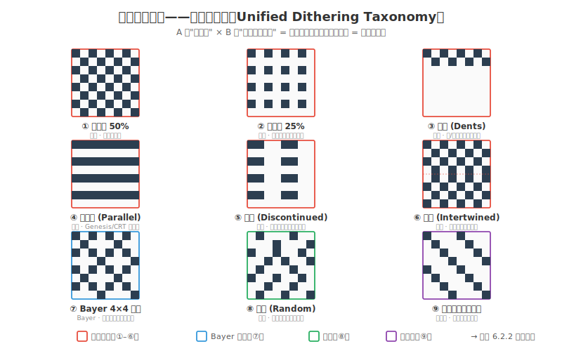
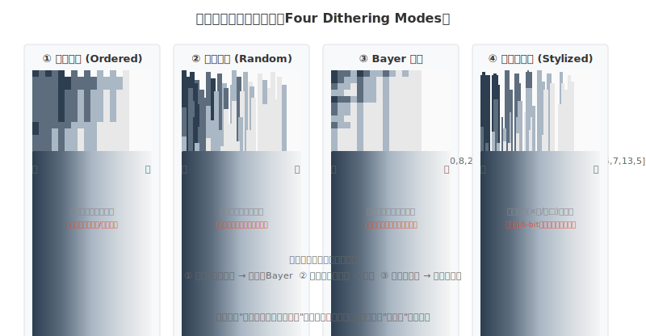
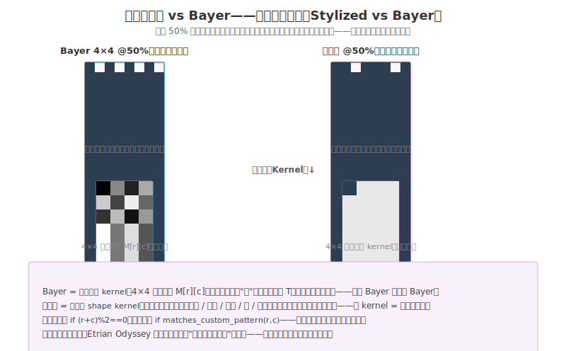

# 练手06 质感：让画面可以触摸

### 6.0 这一章解决什么问题

练手05 你给贯穿角色穿上了色彩皮肤——存成 `character-v04-color.aseprite`，明度骨架没塌、色相偏移有了空气感。可一旦你想让它"看起来像东西"，新的困惑立刻冒出来：为什么你的石头地面看起来像一块灰色方块？为什么你的水面没有"流动感"？为什么《星露谷物语》的泥土踩上去有颗粒感、你的泥土却像贴了一张纯色墙纸？这一章解决的就是**从"看起来像什么"到"摸起来像什么"的跨越**——在颜色之上，怎么用 tile 纹理和抖动给画面加一层触觉维度。

观察02 把"质感"列为八种数据类型之一，并给了你两条入口：**Tile 重复纹理**定义"地点的触感"（《星露谷》每块地都有自己的 tile），**抖动**（Dithering）定义"空气的触感"（《Hyper Light Drifter》靠抖动让末世空气"摸得到湿度"）。这一章把这两条入口彻底拆开：tile 为什么是"可平铺数组"、无缝为什么是"周期性边界条件"、抖动为什么是"离散采样模拟连续信号"、什么时候该用哪种抖动模式。

本章从两个角度拆开质感：框架角度——触觉维度（镜像神经元）、Tile=2D 数组、抖动=采样、无缝四步法、CSS `background-repeat` 类比；实操角度——棋盘格及变体（平行线/断线/凹痕/交织/随机）、风格化抖动、何时用/何时避免、抖动笔刷、Genesis/SNES 的硬件缘起。**关键合并**：框架里的"四抖动模式"（有序/随机/Bayer/风格化）和实操里的"棋盘格及变体"是同一个抖动谱在不同粒度下的描述——本章把它们统一成一套四家族九式的完整抖动体系，不重复讲两遍。

> **贯穿式角色项目（续）：** 练手01 你画了 `character-v01-outline.aseprite`；练手02 L1 长出体积存成 `character-v02-volume.aseprite`；练手04 L1 重打光存成 `character-v03-value.aseprite`；练手05 L1 上色存成 `character-v04-color.aseprite`。**本章 L1 给这个角色加质感层**——用抖动软化阴影过渡、给不同材质（金属/布料/皮肤）配不同的纹理处理，存成 `character-v05-texture.aseprite`。它将在**制作02（像素角色工作流）**收口成可导入引擎的完整角色。所以 L1 你画的不只是练习，是给你贯穿角色穿上"质感皮肤"。

你只需要 Aseprite（最好再加 Krita 做 L3 的无缝草地），加一双愿意"用眼睛摸"的眼睛。

---

### 6.1 程序员视角：质感到底是什么

#### 6.1.1 质感的"数据层"本质——同一个模型换不同 shader

质感是画面的**触觉维度**。一张截图放你面前，你不用伸手，大脑已经"摸"过了——石头地面让你想起粗糙，水面让你想起清凉，金属铠甲让你想起冷硬反光。这不是玄学：你看到粗糙石面时，负责触觉的脑区会被激活，就像你真摸到了石头 [1]。**视觉会调用触觉记忆**——质感不是装饰，它是调动玩家身体的开关。

如果你在 Unity 或 Godot 里给一个平面挂材质，你做了什么？你选了 Material，指定了 Albedo（基本颜色）、Normal Map（凹凸方向）、Metallic/Smoothness（金属度/光滑度）。这些参数合在一起告诉渲染引擎"这个表面该怎么和光交互"。光是亮区、影是暗区，而**质感就是亮与影之间的过渡方式**：光滑金属的过渡锐利（光到影几乎没有渐变），粗糙石头的过渡柔软（光到影有一大片毛茸茸的中间地带），玻璃的过渡里还夹着反射偏移。

在 2D 像素画里，你没有渲染引擎帮你算。你需要手动选择：用几个色阶做过渡？用什么模式分布这些色阶？tile 拼接时边界怎么处理？独立游戏中最常用的两条路是 **tile 重复纹理**（铺地砖的逻辑）和**像素抖动**（用 1px 间隔分布制造过渡幻觉）——它们不需要 3D 引擎、不需要 shader，纯靠你手里那把像素刷子。

> **程序员类比 #1：** 质感 = 同一个几何模型换不同 shader。漫反射、金属、玻璃——模型的形状和拓扑完全相同，但 shader 参数一变，视觉感受完全不同。你画的 tile 纹理就是那个 shader 表面参数；`background-repeat: repeat` 是 CSS 里的 tile 逻辑，和你在引擎里给地面贴 tile 纹理是同一种操作；像素抖动就是图像压缩里的 dithering 算法——用离散的像素值模拟连续过渡。

#### 6.1.2 Tile 本质：一个 2D 数组的周期性拷贝

Tile 纹理是游戏开发中最古老的质感方案。从《超级马里奥》的地面砖块到《星露谷物语》的泥土方块，核心逻辑都一样：你画一个 N×N 像素的方块，引擎把它在 X 和 Y 方向上无限复制。

**程序员思维：** 一个 tile 就是一个 `uint8_t tile[16][16]`。平铺就是 `for (x=0; x<map_w; x+=16) for (y=0; y<map_h; y+=16)` 把这个数组复制过去。但关键问题来了：如果你的 `tile[0][*]`（上边）和 `tile[15][*]`（下边）的像素值不连续，复制出来的两个相邻 tile 之间就会出现一条肉眼可见的**接缝线**（Seam）。这条线不是地图编辑器画的——它是**周期性边界条件不满足**导致的视觉故障。修复方法：保证 `tile[0][i]` 和 `tile[15][i]` 过渡平滑，`tile[i][0]` 和 `tile[i][15]` 同理。这就是"无缝纹理"的数学本质——让你的 2D 数组在 X 和 Y 方向上都满足**周期性边界条件**。

在 Aseprite 或 Krita 里用 **Wrap-around Mode**（环绕模式，Krita 按 W 键）可以在画 tile 的同时看到它在 2×2 或 4×4 重复排列中的效果——相当于给编辑器装了一个"周期性边界检查器"。

#### 6.1.3 抖动本质：离散采样模拟连续信号

假设你只有两种灰度——#333 和 #666，但你需要一个介于它们之间的"第三种灰"。调色板里没有 #499，但你可以把 #333 和 #666 以 50% 比例交错排列——每隔一个像素交替放置。站远了看，眼睛会自动把它们混合成一种中间灰。**这就是抖动的全部原理**：用离散量化值模拟连续信号的视觉错觉。它和图像压缩里的 dithering 是同一种算法——区别在于像素美术中你不写算法，你手动控制每个像素的"开/关"状态，让它们形成你想要的纹理。

抖动的历史可以追溯到早期计算机图形学：在硬件只能显示 2 色或 4 色的年代，抖动是扩展色彩表现力的核心技术。它今天虽不再不可或缺，但掌握它，你就多了一种表达手段——尤其在限色像素风格里，抖动几乎是"质感"的同义词。

---

### 6.2 理论最小集

这一节不讲 PBR 的 Cook-Torrance 公式，不讲 SDF 纹理采样，不讲 Substance Designer 节点图。只讲你在像素画里立刻能用的四样东西：无缝四步法、抖动全谱、何时用/避免、笔刷与混合。

#### 6.2.1 无缝纹理四步法

制作一个可以无痛平铺的 tile 纹理，按这四步走：

*图 练手06.1：无缝纹理四步法。种子→边界→检验→变化，每步是下一步的前置条件。*

**Step 1 · 种子单元。** 画一个 N×N 方块（16×16 就够），铺上基本纹理——石头的裂缝、草地的叶片、木头的年轮。这一步不管边界，释放画意。

**Step 2 · 边界处理。** 激活 Wrap-around Mode（Aseprite: View → Symmetry → Tile Mode；Krita: 按 W）。画布外的区域会被当前 tile 的"另一边"填充——顶连底、左连右。在接缝处画，画笔会同时出现在对面边上。你的任务是让四条边上的纹理密度和亮度一致。

**Step 3 · 重复检验。** 把 tile 复制成 2×2、再扩展成 4×4。眯眼看、缩放到 25% 看、盯 5 秒看——有接缝、网格线、亮度不一致吗？有就回 Step 2。

**Step 4 · 变化注入。** 如果 4×4 平铺后无缝但看起来像"同一张图贴了 16 次"，这就是**重复感**——人眼检测到了周期性图案。解法：创建 2-3 个 tile 变体（把裂缝往左挪 2px、换一片草的弯曲方向、加个小石头），在引擎里随机交替使用。2-3 个就够打破重复感。

*图 练手06.3：把 tile 重复 4×4 次，接缝和重复感会被放大 16 倍——这是最好的诊断工具。*

> **程序员类比 #2：** 无缝纹理 ≈ CSS `background-repeat: repeat`。贴片边缘必须能拼合，否则就像 tileset 里拼错了 sprite 的位置——浏览器会忠实地把那条接缝线重复铺满全屏。Wang Tiles（王砖）[7] 是这个问题的算法解：通过定义边匹配规则，让有限数量的 tile 产生几乎无限的组合，专门用来消灭大地图纹理的重复感。

#### 6.2.2 抖动全谱：四家族 × 九式——A 四模式与 B 棋盘格变体的统一

这是本章的合并核心。抖动可以分成"四模式"（有序/随机/Bayer/风格化），几何类抖动又可以细分成"棋盘格及变体"（棋盘格/平行线/断线/凹痕/交织/随机）。两套描述其实是在同一个抖动谱的不同粒度下看的——"有序抖动"是一个**家族**，棋盘格/平行线/断线/凹痕/交织是这个家族里的具体**子模式**。本章把它们统一成一套**四家族九式**的完整抖动体系，不重复讲两遍。

*图 练手06.4：抖动模式全集——四家族九式。边框颜色标家族：红=有序（①–⑥）、蓝=Bayer（⑦）、绿=随机（⑧）、紫=风格化（⑨）。这是 6.2.2 抖动全谱的可视化总览。*

**家族 A · 有序抖动（Ordered）——几何规律分布。** 像素以规则图案交替排列，均匀、平滑、无随机感。这是最大的一族，包含 B 列举的全部"棋盘格及变体"：

- **① 棋盘格 50% / ② 棋盘格 25%**：最基础形态，2×2 交替（50%）或稀疏化（25%）。每一行偏移一列避免形成线条。适合大面积天空、水面、光滑墙面——这些表面本身没纹理，抖动只为补色阶。
- **③ 凹痕（Dents）**：只有一/两行棋盘格，看起来像凹痕或牙齿。适合空间有限的窄区域纹理。
- **④ 平行线（Parallel Lines）**：横/竖方向的规则线条。常见于 Genesis/Mega Drive 游戏——在 CRT 电视上配合屏幕扫描线效果显著。
- **⑤ 断线（Discontinued Lines）**：平行线带缺口的变体，能显示更多梯度层次。
- **⑥ 交织（Intertwined）**：不同抖动区域彼此交织、反向重叠（如上下半区反向棋盘），创造复杂过渡。

**家族 B · Bayer 矩阵——数学阈值查表。** 一种特殊的数学矩阵（4×4 的 Bayer 矩阵含 16 个不同阈值），按阈值顺序决定点亮哪些像素。它比纯有序抖动更接近连续渐变，但仍有轻微结构感。适合低色数下的大面积渐变（比如只用 3 个灰度画一片雾气）。注意：Bayer 2×2 在 50% 阈值时就是棋盘格——Bayer 是"按阈值查表的有序抖动"，可视为有序家族的数学升级版。

**家族 C · 随机抖动（Random）——无几何规律。** 像素位置随机分布，有自然的"颗粒感"。适合石头、树皮、地面——这些表面本身就有不规则纹理，随机抖动可同时完成"过渡"和"质感暗示"。**警告**：随机抖动最容易看起来"脏"，需手动精修，不要在空白区大面积撒点。

**家族 D · 风格化抖动（Stylized）——自定义采样形状。** 用小形状（×、/、□、○、小短线、人字纹）代替纯点来做抖动。比如用 `/////` 图案从暗过渡到亮，或用交叉线 `×××` 制造编织感。适合 16-bit 时代复古风格、装饰性区域——它用图案语言而非纯数学模式，可以承载视觉风格信息。《超级马力欧世界 2：耀西岛》是风格化抖动的典范，背景大量用各种纹理图案创造手绘质感。

*图 练手06.2：四家族在同一灰度渐变下的视觉对比。有序/Bayer 均匀、随机有颗粒、风格化有形状语言。*

*图 练手06.5：同一 50% 密度，Bayer 用固定阈值矩阵（点），风格化用自定义斜线核（形状）——采样核不同，纹理语言就不同。*

> **程序员类比 #3（风格化抖动核心类比）：** 风格化抖动 = **自定义采样核（custom convolution kernel）**，不是固定的 Bayer 矩阵。Bayer 是 `固定查表 kernel`：4×4 阈值矩阵 M[r][c]，采样形状恒为"点"，你只改阈值 T（亮暗），几何不变——所以 Bayer 永远像 Bayer。风格化是 `自定义 shape kernel`：像自定义卷积核——你定义采样的形状（斜线/人字/十字/圆/小短线），抖动像素就按那个形状分布，换 kernel = 换纹理语言。普通抖动是 `if (r+c)%2==0`，风格化是 `if matches_custom_pattern(r,c)`——前者调参数，后者写形状函数。耀西岛的手绘斜线、Etrian Odyssey 的网格点，都是"自己定义采样核"的产物。

**选择规则（一条记牢）：** 大面积均匀过渡 → 有序或 Bayer；自然有机物表面 → 随机；风格化需求 → 自定义图案；不确定的时候，**随机抖动最安全**——大自然里没有棋盘格。

#### 6.2.3 何时用抖动 / 何时避免

抖动是工具不是义务。这张取舍表值得背下来：

| 适合用抖动 | 原因 | | 不适合用抖动 | 原因 |
|---|---|---|---|---|
| 大面积渐变 | 天空/背景需平滑过渡 | | 小精灵（<32×32） | 抖动让小精灵粗糙模糊 |
| 极限颜色限制 | 8 色或更少时几乎必须 | | 动画角色 | 抖动在动画中会闪烁 |
| 纹理表现 | 模拟粗糙表面质感 | | 高颜色数 | 有足够色时平涂更清晰 |
| 特殊复古风格 | 刻意追求的复古感 | | 需要清晰轮廓 | 抖动破坏边缘锐利度 |

> **核心原则：能不用抖动就不用。干净的平涂配色永远优于粗糙的抖动。** 抖动是"颜色不够时的补丁"，不是"加了就更好"的调料。

#### 6.2.4 抖动与色彩混合 + 抖动笔刷

**混合平涂着色。** 即使你有无限颜色，抖动仍能派上用场——在平涂着色中加入小范围抖动，可以模拟柔和渐变。这是"高色数下用抖动做质感点缀"的用法，不是"低色数下用抖动救命"。

**混合两种颜色。** 在颜色限制下，抖动可以帮助混合两种差异较大的颜色（视觉上产生"第三色"）。但在现代像素艺术中，这种用法已很少见——你有足够色时直接取中间色更干净。

**抖动笔刷（Aseprite）。** 不要一个个像素手点，用自定义笔刷加速：①先画好一个抖动图案（比如一小块 4×4 棋盘格）；②选中它按 **Ctrl+B** 创建自定义笔刷；③在需要抖动的区域直接拖拽填充。**但笔刷只是加速工具，最终仍需手动精修**——像素艺术的核心在于对每个像素的控制，笔刷铺出来的均匀图案往往需要你在结构线周围手动调整密度和方向。

> **程序员类比 #4：** 抖动笔刷 = **代码 snippet / 宏展开**。你把一段反复要写的图案封装成笔刷（宏），在需要处一键展开，再就地微调（修改变量）。它不替你思考，只替你重复劳动。

#### 6.2.5 抖动的历史与复古硬件意义

在透明图层普及之前（Super NES 早期），游戏机用抖动来模拟透明和半透明效果——因为硬件不支持 alpha 混合，只能靠像素图案让眼睛"自己混合"。**Sega Genesis/Mega Drive 尤其依赖平行线抖动**来创造颜色混合效果：Genesis 的色板比 SNES 小，平行线抖动配 CRT 扫描线，能在视觉上"无中生有"地造出更多颜色。SNES 则更多用风格化抖动（耀西岛）追求手绘质感，而非纯硬件补色。

抖动作为一项技术在今天已不像过去那样不可或缺，但了解它的硬件缘起能帮你做风格决策：如果你做 Genesis 风格，平行线抖动是签名；如果你做 SNES 16-bit 风格，风格化抖动是签名；如果你做现代高色像素，抖动退化为"质感点缀"而非"补色手段"。

#### 6.2.6 质感的"情绪值"

质感不只是技术。表面光滑到什么程度、粗糙到什么程度，传递的情绪不一样：

- **高光滑度**（金属盔甲、玻璃窗、水面）：科技感、冷感、距离感。光锐利、反光、不可接近。
- **中度粗糙**（木头、织物、纸张）：温暖、亲切、手工艺感。光在表面温柔散开。
- **极粗糙**（岩石、树皮、废墟墙面）：重量、古老、危险。光被吞噬，没有反光。

设计场景时，先想"这里是什么触感"，再决定用什么 tile 纹理、用多少色阶过渡、用不用抖动。质感是情绪工具——不要给所有东西都加质感，质感密度本身也要服从构图和风格，否则会抢焦点。

---

### 6.3 练习

本章练习逐级递进，每级有明确"合格标准"。三个练习建议分三天。

> **贯穿式角色项目（续）：** 练手05 你存了 `character-v04-color.aseprite`（彩色皮肤、明度骨架未塌）。**本章 L1 给这个角色加质感层**——用抖动软化阴影过渡（暗部用棋盘格抖动代替硬边）、给不同材质配不同纹理处理（金属高光锐利无抖动 / 布料随机颗粒 / 皮肤轻微有序抖动），存成 `character-v05-texture.aseprite`。这个角色将在**制作02（像素角色工作流）**收口成可导入引擎的完整角色。所以 L1 你画的不只是练习，是给你贯穿角色的"质感层"。

#### L1 · 给贯穿角色加质感层（约 45-90 分钟）

**目标**：把练手05 的 `character-v04-color.aseprite` 从平涂彩色升级为有质感过渡的精灵——用抖动软化阴影、给不同材质配不同抖动模式。

**你需要**：练手05 的 `character-v04-color.aseprite`、Aseprite。

**步骤**：
1. **材质清单**：在纸上列出角色 3-4 种材质区域（如 金属武器 / 布料衣服 / 皮肤 / 头发），给每种定一个抖动策略——金属：高光滑→**不用抖动**，硬边高光；布料：中度粗糙→**随机抖动**软化阴影；皮肤：柔软→**有序棋盘格**轻微过渡；头发：顺滑→**平行线**暗示发丝方向。
2. **复制备份**：复制 `character-v04-color.aseprite` 为 `character-v05-texture.aseprite`，在新文件上改。
3. **抖动阴影过渡**：找角色每个 ramp 的暗面→中间调边界，用 1px 铅笔在该边界做对应模式的抖动（6.2.2 选择规则）。注意抖动要有方向性（顺结构走）、有密度梯度（暗面密、亮面疏），不要均匀撒。
4. **自定义笔刷加速**：把 4×4 棋盘格存成笔刷（Ctrl+B），在阴影区拖拽铺底，再手动精修边缘（6.2.4）。
5. **金属区克制**：金属高光区**不加抖动**，保持锐利硬边——质感对比来自"有的抖有的不抖"。
6. **去色验证**：按 Ctrl+Shift+U——抖动加完，明度骨架还在吗？焦点还在吗？如果抖动把暗面"撒脏了"，回 6.2.2 查模式选错没有（随机抖到金属上 = 脏）。
7. 保存为 `character-v05-texture.aseprite`。

**合格标准**：
- [ ] 纸上写了材质清单（≥3 种材质 + 各自抖动策略）。
- [ ] 至少两个 ramp 的阴影过渡用了抖动（不是硬边跳变）。
- [ ] 金属/高光区克制未加抖动（质感有对比）。
- [ ] 抖动有方向性和密度梯度，不是均匀撒点（不"脏"）。
- [ ] 去色后焦点仍在、练手04 明度骨架没被抖动破坏。
- [ ] 文件存为 `character-v05-texture.aseprite`，准备交给制作02 收口。

#### L2 · 16×16 石头 Tile + 抖动过渡（约 30-60 分钟）

**目标**：用 Aseprite 画一个 16×16 石头地面 tile，只用 2-3 种灰度，用抖动暗示粗糙面，且能无缝平铺。

**步骤**：
1. 新建 16×16 文件，调色板限为 2-3 种灰度（如 `#4A4A4A` 暗面 / `#7A7A7A` 中间调 / `#AAAAAA` 亮面可选）。
2. **Step 1 种子**：用色 1、色 2 画石头裂缝和块面，不管边界，裂缝 2-3 条就够。
3. **Step 2 边界**：View → Symmetry → Tile Mode 进环绕模式，在接缝处画，保证对边像素对齐。
4. **Step 3 检验**：复制 tile 成 4×4 排列，检查有无接缝。
5. **Step 4 抖动注入**：用色 2 和色 1 在裂缝边缘、石头表面做**随机抖动**——1px 铅笔不规则点出"颗粒感"，均匀分布是关键，别在同一处点太多。
6. 导出 4×4 排列图，保存。

**合格标准**：
- [ ] 4×4 平铺后无明显接缝（眯眼看无"网格线"）。
- [ ] 石头裂缝自然（不全是直线或同方向）。
- [ ] 抖动颗粒均匀分布，无"聚集块"。
- [ ] 远处看（缩放 25%）像石头地面而不是灰色棋盘。

#### L3 · 无缝草地纹理（约 1-3 小时，Krita）

**目标**：用 Krita 的 Wrap-around Mode 画一个无缝草地纹理，保证上下左右拼接无边界感。

**步骤**：
1. Krita 新建 64×64 或 128×128 画布（草地需更大单元容纳"丛状"结构），按 **W** 激活 Wrap-around Mode。
2. 用笔刷分层画：层 1 底色铺满（草绿）；层 2 稍深绿画草阴影层（方向随机，从底往上扫）；层 3 稍亮黄绿画草亮面（细笔触在草尖方向轻扫）；层 4 土棕色在草下半部加泥土暗示。
3. **全程保持 Wrap-around 打开**——笔刷刷到边缘会从对面出现，意味着你画任何一群草时对面边界已自动对齐。
4. 画完按 W 关闭预览，手动检查四条边有无突变。
5. 复制成 4×4 排列眯眼检查，确认无缝后导出。

**合格标准**：
- [ ] 4×4 排列中无法用肉眼定位单个 tile 的边界（真正"无缝"）。
- [ ] 草的密度均匀——没有某块 tile 的草特别密或疏。
- [ ] 色彩过渡自然——单块 tile 内无明显明暗渐变（否则拼接后出棋盘格效应）。
- [ ] 整体看起来像"一片草地"而不是"16 块草皮拼起来"。

---

### 6.4 常见错误与诊断

**错误 1：接缝线可见 → 边界处理不充分。** 平铺后能看见横竖线把画面切成方块。**原因**：tile 对边像素不连续，画时没开环绕模式。**修复**：开环绕模式，在四个边界逐像素检查边界像素和"对边邻居"颜色是否一致，至少不要从 #333 直接跳 #AAA；发现突变在对边加同等密度细节。

**错误 2：网格感强烈 → tile 内部特征形成周期性。** 无接缝但能"感觉"到网格，眼睛在追踪"那块石头又出现了"。**原因**：tile 内有高对比特征（特别亮的石头/特别深的裂缝），重复 16 次被大脑提取成"地标"。**修复**：降低该特征对比度或挪到不规则位置；创建 2-3 个 tile 变体交替使用，只改排列不改颜色/笔触。

**错误 3：棋盘格亮度不均 → tile 内部有方向性渐变。** 平铺后有些 tile 比周围亮/暗，形成规律棋盘格。**原因**：画时潜意识在 tile 内制造了左→右或上→下渐变，相邻 tile 的"左暗"紧挨"右亮"就明暗交替。**修复**：检查 tile 四边平均明度是否一致，把偏暗的边调亮，让明度中心回到几何中心。**记住：无缝是"每条边在任何位置亮度一致"，不是"整个 tile 亮度均匀"。**

**错误 4：过渡抖动用过度 → 画面发"脏"。** 抖动做完退远看不是"有质感的粗糙"而是"脏了的模糊"。**原因**：抖动颗粒没对应表面实际结构，在空白区随意撒点被解读为"脏污"。**修复**：只在结构线周围加颗粒（石头裂缝、草的叶脉、木头年轮）；颗粒方向对齐结构走向；密度有梯度（裂缝边密集、远处稀疏）。没有梯度的颗粒 = 均匀噪声 = 脏。

**错误 5：打破 tile 重复用了错误方法 → 风格断裂。** 创建了变体但换了完全不同颜色或笔触，不同 tile 像不同画风。**原因**：变体目的是打破周期性，不是改变质感类型。**修复**：复制原 tile 在其基础上改，只改一个参数（挪裂缝/加小石头/翻草簇方向），颜色、笔触方向、对比度、抖动模式必须和原 tile 完全一致。

---

### 6.5 小结

质感是画面里最容易被忽视也最能提升完成度的维度。没有质感，你的石头像灰色方块、草地像绿色地毯、金属像塑料；有质感，同样一个形状会获得完全不同的心理重量。在 2D 像素游戏中你不需要 PBR 渲染管道，你只需要两样工具：**无缝 tile 纹理的边界处理**（保证周期性连续）和**抖动**（用 2-3 个灰度制造 8 级过渡的幻觉）。

**记住五件事**：
1. **质感 = 触觉维度 = 同模型换 shader**——视觉调用触觉记忆，你画的 tile 纹理就是 shader 的表面参数。
2. **无缝纹理 = 满足 X/Y 方向周期性边界条件**——边对边像素连续，本质是 `background-repeat: repeat` 要的拼合性。
3. **抖动 = 离散采样模拟连续信号**——四家族九式：有序（棋盘格/凹痕/平行线/断线/交织）、Bayer（阈值查表）、随机（颗粒感）、风格化（自定义形状）。
4. **风格化抖动 = 自定义采样核**——Bayer 是固定查表 kernel（形状恒为点），风格化是你写 shape kernel，换 kernel = 换纹理语言。
5. **能不用抖动就不用**——干净的平涂永远优于粗糙的抖动；抖动是"颜色不够时的补丁"，加了必须服从构图，否则抢焦点。

**如果只记住一句话：** 质感就是亮与影之间的过渡方式——无缝 tile 保证过渡在拼接处不断（周期边界条件），抖动用离散像素假装连续过渡（离散采样模拟连续信号），而风格化抖动不过是把采样核从"固定点"换成"自定义形状"。

**上手行动**：今晚打开练手05 的 `character-v04-color.aseprite`，按 L1 给它加质感层——金属区克制不抖、布料区随机抖动、皮肤区有序棋盘，存成 `character-v05-texture.aseprite`。完成后按 Ctrl+Shift+U 去色——如果明度骨架还在、不同材质区靠抖动密度就能一眼区分，你的质感直觉就长了一层。这个角色将在制作02 收口。

---

### 6.6 扩展阅读

1. **Aseprite Tile Mode 官方教程**——Aseprite 帮助文档 "Tile Mode" 章节，详解环绕模式工作原理和快捷键（View → Symmetry → Tile Mode X/Y/XY）。画无缝 tile 的第一步。★★★★★
2. **《Pixel Logic》— Michafrar，第 6 章 "Textures and Dithering"**（https://michafrar.com/）——像素美术社区公认最佳入门书，第 6 章专讲纹理制作和抖动策略，含大量 A/B 对比图。本章 L2/L3 的直接技术指导。★★★★★
3. **Krita Wrap-Around Mode 教程**（YouTube 搜 "Krita seamless texture tutorial"）——Krita 环绕模式比 Aseprite 更强大，支持多层和滤镜实时预览，适合 L3 草地练习。★★★★☆
4. **Dithering in Pixel Art — Sadface_RL 教程（YouTube）**——逐像素慢速展示构建不同抖动模式的过程，对"该在哪放抖动的点"不确定时看一遍很有帮助。★★★★☆
5. **《Color and Light》— James Gurney，第 9 章 "Surface and Texture"**——传统绘画对"表面如何与光交互"的物理分析，质感理论基石。原理在像素画中依然适用。★★★★★

---

### 6.7 引注

[1] Rizzolatti, G., & Craighero, L. (2004). "The Mirror-Neuron System." *Annual Review of Neuroscience*, 27, 169–192. https://www.annualreviews.org/doi/10.1146/annurev.neuro.27.070203.144230 —— 镜像神经元经典论文，解释"看到粗糙表面"为何产生触觉想象（6.1.1 触觉维度）。

[2] Ware, C. (2012). *Information Visualization: Perception for Design* (3rd ed.). Morgan Kaufmann. 第 5 章 —— 视觉纹理的"预注意处理"（Preattentive Processing），解释 tile 接缝线和重复图案为何如此刺眼。

[3] Foley, J. D., van Dam, A., Feiner, S. K., & Hughes, J. F. (1995). *Computer Graphics: Principles and Practice* (2nd ed.). Addison-Wesley. 第 17 章 —— Dithering 算法完整数学推导（从有序抖动到 Floyd-Steinberg 误差扩散），理解 Bayer 矩阵阈值排列的底层逻辑（6.2.2）。

[4] Michafrar, *Pixel Logic: A Guide to Pixel Art*. 第 6 章 "Textures and Dithering". https://michafrar.com/ —— 四种抖动模式视觉对比与适用场景（6.2.2 抖动全谱）的实战参考。

[5] Gurney, J. (2010). *Color and Light: A Guide for the Realist Painter*. Andrews McMeel Publishing. 第 9 章 —— 表面质感与高光形状，为"质感 = 过渡模式"提供传统绘画理论支撑（6.2.6 情绪值）。

[6] Blinn, J. F. (1978). "Simulation of Wrinkled Surfaces." *ACM SIGGRAPH Computer Graphics*, 12(3), 286–292. https://dl.acm.org/doi/10.1145/965139.507101 —— 凹凸贴图论文，"用灰度值编码表面法线扰动"与像素抖动"用离散像素模拟表面凹凸"逻辑同构。

[7] Kopf, J., Cohen-Or, D., Deussen, O., & Lischinski, D. (2006). "Recursive Wang Tiles for Real-Time Blue Noise." *ACM Transactions on Graphics*, 25(3). https://dl.acm.org/doi/10.1145/1141911.1141916 —— 王砖（Wang Tiles）通过边匹配规则让有限 tile 产生几乎无限组合，解决大地图纹理重复感（6.2.1）。
