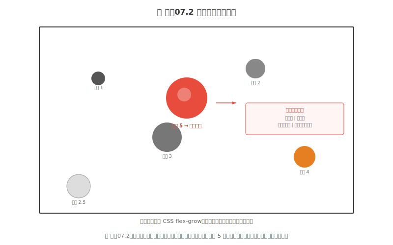
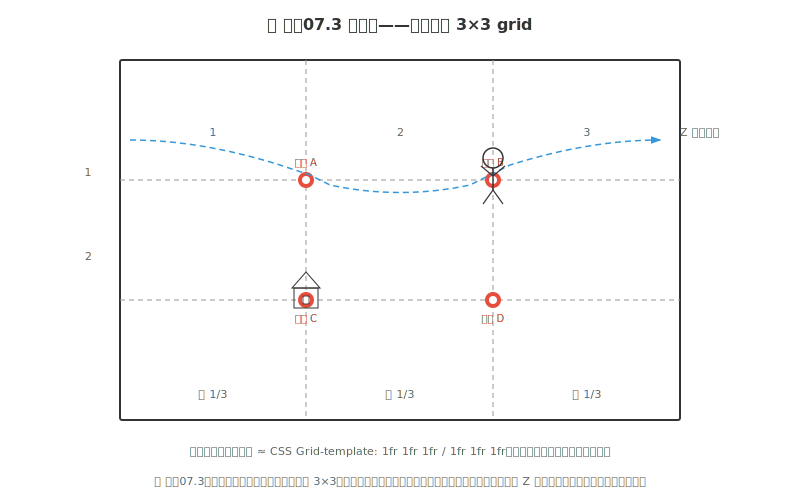
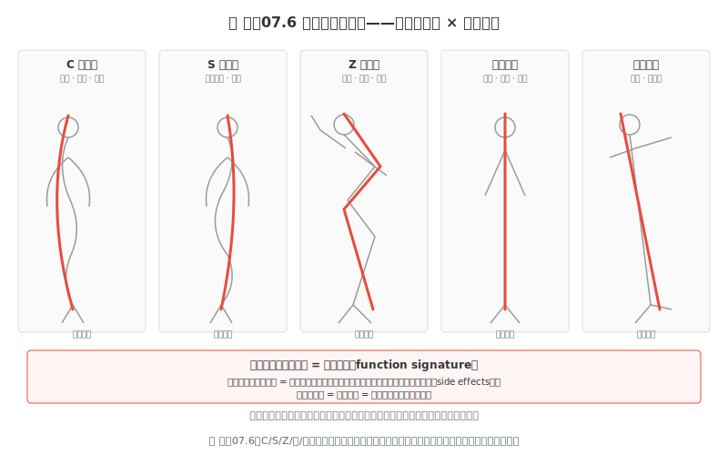
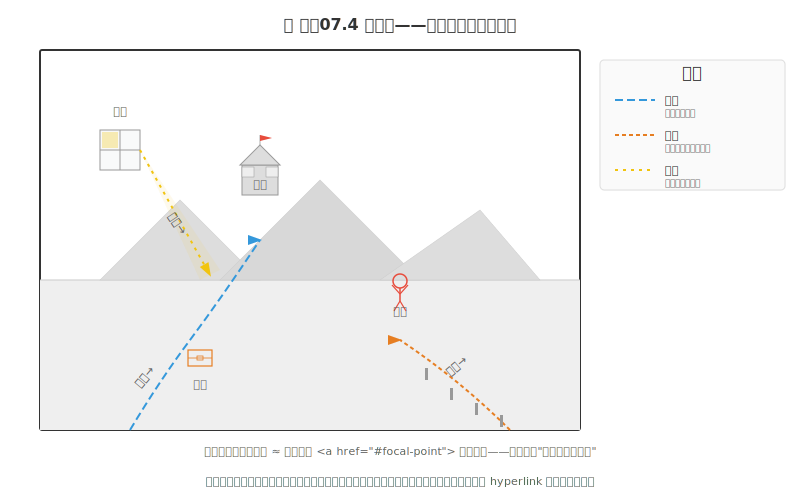
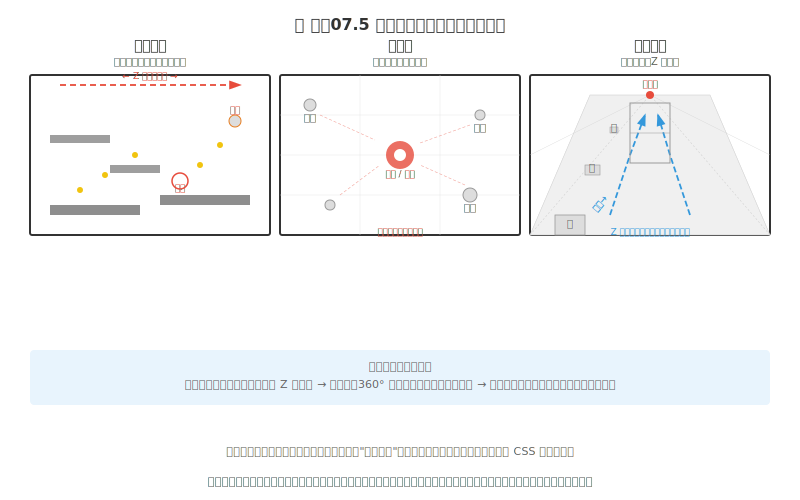

# 练手07 构图：观众的眼睛跟着你的设计走

### 7.0 这一章解决什么问题

练手06 你给贯穿角色穿上了质感皮肤，金属硬边、布料颗粒、皮肤棋盘格各就各位。可一旦你想把它放进一个场景——一棵树、一块石头、一片天空——新的困惑立刻冒出来：为什么你的角色单独看挺好，放进场景里就"找不到"了？为什么观众第一眼看的是背景里那块亮石头而不是你的主角？为什么《空洞骑士》每一帧截图都有一个明确的视觉重心，你的画面却像一张"所有东西都一样重要"的说明书？

这一章解决的就是**从"画好单个元素"到"组织整个画面"的跨越**。分三层递进——先学会用工具画出焦点，再用系统控制整个画面，最后让构图经得起游戏实际运行环境的考验。

---

### 7.1 构图基础模型——能画出来

这一层是草图阶段就能用的工具。你会五种基本操作——组合使用，任何一个画面都有焦点和方向。

#### 7.1.1 焦点——画面只能有一个"第一名"

一个画面必须只有一个元素的视觉权重显著高于所有其他元素。不是"主角最重要"——是"主角比第二重要的元素重至少两倍"。确定焦点后，用下面工具把权重堆到它身上。

#### 7.1.2 视觉权重

视觉权重不是主观感觉。五条核心规则，每条都是一个你可以独立调节的"注意力旋钮"：

**① 亮度。** 暗背景上亮的物体权重最大；亮背景上暗的物体权重最大。是相对值不是绝对值——一片全亮画面中那个唯一的暗点比太阳还显眼。

**② 饱和度。** 高饱和暖色（红、橙、黄）比低饱和冷色更吸引注意。红色是视觉系统中最强的注意力捕获色之一。

**③ 尺寸。** 大比小权重高。但这个规则会被对比度放大或抵消——一个巨大灰色圆可能比一个小的红色圆点权重还低。

**④ 人脸优先。** 人脸——尤其是眼睛——是自动检测的最高优先级目标。一个画面中只要有面部，哪怕远处一个小脸，它就会抢夺焦点。

**⑤ 复杂度。** 细节密集的区域比平坦区域更吸引注意——眼睛天然会被"信息密度高"的地方吸引。

**两条补丁：** ⑥ 独立性——单独一粒棋子比棋盘中任意一粒更显眼（这就是负空间的力量）。⑦ 边缘力矩——画面边缘的元素比中心元素有更长的视觉力矩，一个小物体放在极边缘可以平衡中心区的大物体。

*图 练手07.2：视觉权重不是绝对值——是相对值。红色的高权重圆点先被看到，灰色小圆最后。*

**关键操作——不是加法，是减法。** 你不一定能直接增大焦点元素的权重（也许它已经画好不能改了），但你总可以**减小周围元素的权重**。把背景变暗、把次要元素对比度降低——减法比加法的使用频率高得多。

#### 7.1.3 三分法——先画线再画物体

把画面横竖各切两刀，分成 3×3 网格。四个交点——不是画面正中心——是自然视觉中最舒适的主体位置。正中心 = 最静态（适合证件照，不适合讲故事）。交点 = 有方向感——观众视线有理由移动。

在 64×64 的像素画布上，四个交点约在 (21,21)、(21,43)、(43,21)、(43,43) 像素位置。交点不是精确坐标——是区域，交点周围有一个约 1/8 画面宽度的"舒适区"。

*图 练手07.3：三分法把画面切成 3×3。四个交点是最佳的主体位置。*

#### 7.1.4 动作线——角色姿态的主干向量

动作线是贯穿角色身体的一条看不见的曲线或折线，传达角色的动作趋势和能量。**错误做法：** 先画好一个直立角色，然后想让它"看起来在奔跑"——不可能，因为垂直动作线已经锁死了角色。**正确做法：** 动笔第一件事是画动作线，然后沿动作线搭建几何体，最后加细节。

五种动作线形状：

- **C 形曲线**：柔和前倾、女性角色。有机、柔软。
- **S 形曲线**：优雅站姿、舞蹈动作。极度灵活。
- **Z 形折线**：攻击动作、机械角色。力量、冲击。
- **垂直直线**：守卫、雕像。静止、庄严。
- **倾斜直线**：奔跑、即将跌倒。动势、不稳定。

*图 练手07.6：五种动作线形状叠加在简化角色姿态上。先定线再画人——动作线是姿态的 signature，细节是 implementation。*

动作线之外，角色的重心应该在支撑面（双脚之间的区域）上方。出拳时重心在靠前的脚上，后撤时重心在后面的脚上——这就是"落地感"。

#### 7.1.5 引导线——画面的 hyperlink

引导线是构图里的"锚点链接"——道路指向城堡、栏杆指向角色、光线从窗口打到宝箱。你不是"画了一条线"，你是**设计了一条视线路径**。

有效的引导线形状：直线（道路、铁轨——最快被处理）、曲线（弯曲小路——有探索感）、隐含线（角色目光方向——无实际线条但眼睛本能跟随）、边缘线（建筑轮廓——形成视觉通道）。

*图 练手07.4：三种引导线——道路指向远景、栏杆指向角色、光线指向宝箱。*

**致命陷阱：** 引导线指向画面外 = 视线被放逐，不会再回来。每条引导线的终点必须是画面内的某个元素。

---

### 7.2 构图系统设计——能控制画面

有了基础工具，这一层教你用系统思维把工具组合起来——不再是一个个独立操作，而是整体的"视线管理策略"。

#### 7.2.1 两种视线引导机制——对比 vs 线条

基础层给出的引导线是"线条引导"——物理方向上指哪看哪。但它有一个搭档：**对比引导**——不靠线、靠"这片区域比周围都亮/都鲜艳/都细密"把眼睛吸过去。

| | 对比引导 | 线条引导 |
|---|---|---|
| **机制** | 明度/饱和度/细节密度的差异 | 物理方向——直线、曲线、隐含线 |
| **作用** | 决定"第一眼看哪" | 决定"接下来沿什么路径看" |
| **工具箱** | 明度对比、饱和度对比、细节密度 | 道路、栏杆、光线、目光方向 |

画面设计顺序：先用对比引导锁定焦点（把最大对比堆在主角身上），再用引导线从焦点出发铺视线路径。三种对比工具组合使用最强：**高对比度 + 高饱和度 + 高细节密度**同时集中在一个区域 = 无可争议的视觉焦点。

#### 7.2.2 平衡——对称 vs 不对称

算完每个元素的权重分数，接下来是排列。两种平衡模式：

**对称平衡：** 左右元素重量相同——安静、稳定、庄严。适合建筑、徽章、Boss 特写。

**不对称平衡：** 左侧一个"重"元素 + 右侧多个"轻"元素靠边缘力矩配平。比对称平衡更有张力，适合动作场景。实用方法：想象画面中心有支点，左侧大角色（重），右侧放小道具+亮色高光（轻但靠外）来平衡。

#### 7.2.3 负空间 + 古典法则速览

几条从古典绘画传下来的法则，每条一句话就够：

- **对角线构图。** 关键元素沿对角线排列——左下到右上 = 上升感，左上到右下 = 舒缓感。战斗场景加一条剑锋斜线，立刻有动感。
- **取景（Framing）。** 用前景元素（树枝、拱门、窗口）形成框，把视线锁在框内主体上——逻辑是 `overflow: hidden`。
- **黄金比。** 约 1:1.618。不精确计算——记住：主体占画面 1/3 到 1/2 最舒服。
- **负空间。** 画面中未被主体占用的区域。在角色移动方向/视线方向留出更多空间——角色面向右侧，左边空间小于右边。负空间的形状应该**有意设计**，不是"剩下的地方"。

#### 7.2.4 场景分析——战斗 vs 平静

同一个工具箱，不同情绪用不同配方：

**战斗场景：** 对角线构图 + 引导线（剑尖指向敌人）+ 明度引导（脸和剑最亮）+ 不对称平衡——高对比、有冲突感。

**平静场景：** 三分法 + 对称平衡 + 低对比（全画明度范围窄）+ 大量留白——宁静空旷。

构图没有"对的"构图，只有"对当前叙事意图有效的"构图。

#### 7.2.5 构图清单

画完一个场景后自查：

1. □ 观众视线第一时间落在哪里？是我想要的地方吗？
2. □ 焦点用了至少两种对比工具堆权重吗？（明度/饱和度/细节密度）
3. □ 至少一条引导线指向焦点吗？
4. □ 主角面向/移动方向有足够的负空间吗？
5. □ 画面左右平衡吗（对称或不对称都可以——但不能"不知道"）？
6. □ 角色动作线传达了我想要的姿态吗？
7. □ 去色后焦点还在吗？

---

### 7.3 游戏构图工程化——能上线

基础层和应用层讲的是"画面怎么设计"。这一层讲的是"画面进了引擎以后怎么办"——静态画的构图可以精确到像素，但游戏画面在运动、被 UI 遮挡、在不同分辨率上显示。你的构图必须经得起这三项考验。

#### 7.3.1 鲁棒性——构图的三个"不稳定因素"

**① 焦点会移动。** 主角在屏幕中间跑、跳、攻击——构图焦点不停改变。解法：保持一个高对比度的视觉锚点（主角轮廓、武器亮光），锚点跟着主角移动；同时确保环境元素不形成比主角更强的新焦点。

**② UI 会遮挡。** HUD 压在画面上层——不参与构图又无法忽略。解法：构图时画出 UI 占位的灰色方块，只在非 UI 区域里做构图。有效的游戏构图 = 画面空间 - UI 占用面积。

**③ 分辨率会变化。** 玩家屏幕可能是 1080p、1440p、720p。解法：关键信息不放画面绝对边缘，给焦点留至少 10% 的安全边距——无论画面怎么裁，焦点在安全区内。

#### 7.3.2 三种游戏类型的构图策略

不同游戏类型的视线模式完全不同。一种游戏的解决方案可能是另一种的构图毒药。

*图 练手07.5：三种游戏类型的构图策略完全不同。*

**① 平台跳跃（横向 Z 型扫描）。** 相机向右跟随——视线路径左上→右上→左下→右下。策略：左上放 HUD、右中放前方方向（留出视线空间）、右下放玩家角色。《蔚蓝》《空洞骑士》是典型案例。

**② 俯视角（全局均衡，中心锚定）。** 相机俯视，视线从中心向四周辐射再回收。策略：中心恒定为最高视觉权重，四周信息均衡，环境标志物诱导方向。《星露谷物语》《以撒的结合》是典型案例。

**③ 第一人称（Z 轴纵深）。** 相机即眼睛，焦点由深度决定。策略：远处焦点放在画面消失点附近，Z 轴中间放置引导元素牵引视线从近到远。《守望先锋》《生化奇兵》是典型案例。

---

### 7.4 练习

本章练习逐级递进，每级有明确"合格标准"。三个练习建议分三天。

> **贯穿式角色项目（续）：** 练手06 你存了 `character-v05-texture.aseprite`。**本章 L1 给这个角色定动作线 + 构图场景**——先用一条动作线重新摆姿态，再把它放进一个简单场景，用三分法+引导线+视觉权重组织画面，存成 `character-v06-pose.aseprite`。

#### L1 · 给贯穿角色定动作线 + 构图场景（约 60-120 分钟）

**目标**：把练手06 的 `character-v05-texture.aseprite` 从"直立站着"升级为"有动作线的姿态 + 有构图的场景"。

**步骤**：
1. **选动作线**：在纸上画出五种动作线（C/S/Z/竖/斜），选一条最适合角色性格的。在 Aseprite 新建图层用 1 像素宽的线条画出。
2. **沿动作线摆姿态**：复制 `character-v05-texture.aseprite` 为 `character-v06-pose.aseprite`。沿动作线调整姿态，重心在支撑面上方。
3. **加场景三元素**：一棵树 + 一座远处建筑 + 一片天空。限制三个——保证构图清晰。
4. **三分法落位**：角色放在一个三分线交点上（不要正中心），树和建筑放其他交点上或作为引导线元素。
5. **引导线设计**：至少一条指向角色——地面路径、栏杆、或光线。
6. **视觉权重排序**：角色是不是最大/最亮/最饱和/有人脸？如果不是，降环境元素的对比度和饱和度。
7. **去色验证**：Ctrl+Shift+U——去色后焦点还在角色身上吗？
8. 保存为 `character-v06-pose.aseprite`。

**合格标准**：
- [ ] 纸上画了五种动作线并选了一种（能说出为什么）。
- [ ] 角色姿态沿动作线摆放，重心在支撑面上方。
- [ ] 角色在三分线交点，至少一条引导线指向角色。
- [ ] 视觉权重排序后角色是第一焦点（去色验证通过）。
- [ ] 文件存为 `character-v06-pose.aseprite`。

#### L2 · 黑白灰构图——控制视线路径（约 15-30 分钟，纸笔）

**目标**：只用黑白灰，画一个简单室内场景，标注预期视线路径，找一个人验证。

**步骤**：
1. 白纸+铅笔。画室内场景——一张桌子、一把椅子、一扇窗户、一扇门、一个人（火柴人即可）。限制 5 个元素。
2. 确定焦点——用最重的线把它画出来。
3. 用箭头标视线路径：①→②→③。
4. 找一个人看 3 秒后盖住，问"你第一个看到的是什么？"
5. 他说的和你的焦点一致 = 构图有效。不一致 = 去看什么东西比你的焦点更亮/更大/更有对比。

**合格标准**：
- [ ] 有可辨识的焦点（不是"整张图都是焦点"）。
- [ ] 标注了明确视线路径（至少 3 步）。
- [ ] 测试对象的第一个注视点和你的焦点一致。
- [ ] 没用颜色——纯靠明度和构图控制视线。

#### L3 · 同一场景的 3 个构图变体（约 1-3 小时）

**目标**：画同一场景的三个构图变体，只改构图——场景内容不变。

> **景别五型——给你正在做的练习一个名字。** 电影语言按"主体在画面中的占比"分五级：
> - **远景（WS）**：角色 < 画面 10%。你的变体 A——渺小、孤独。
> - **全景（FS）**：角色完整出现，约 20-30%。你的变体 B——观察、叙事。
> - **中景（MS）**：角色腰部以上，约 40-50%。对话场景。
> - **近景（CU）**：仅面部/关键部位，约 60%+。你的变体 C——紧张、亲密。
> - **特写（ECU）**：单个眼睛/道具/文字。每一个像素都在说话。

**步骤**：
1. 选定场景：一个角色 + 一棵树 + 一座远处建筑。总共三个元素。
2. 画三个变体：
   - **变体 A · 远景**：角色 < 10%。用三分法+大量负空间——"渺小"。
   - **变体 B · 中景**：角色 20-30%。用三分法+引导线——"叙事"。
   - **变体 C · 近景**：角色 40-60%。用对角线+高对比+不对称平衡——"紧张"。
3. 每个变体标注用的构图工具和动作线形状。
4. 三张并排放，观察：同一个场景的三个构图是否真的传达了三种情绪？

**合格标准**：
- [ ] 三个变体场景元素相同，仅构图改变。
- [ ] 变体 A 空旷、B 叙事、C 逼近——情绪有梯度变化。
- [ ] 每个变体标注了构图工具和动作线形状。

---

### 7.5 常见错误与诊断

**错误 1：焦点模糊 → 没有明确视觉重心。** 观众说不出哪个是主角。**原因**：每个元素花了同样的心力——投入被"平均化"了。**修复**：确定唯一焦点，花 50% 时间在它上面；其余元素减半处理；画面缩到 10% 大小，只看谁能抢到第一个注意力。

**错误 2：视线被截断 → 引导线指向画面外。** **修复**：检查每条引导线的终点是否在画面内。指向边缘的——弯折让它在碰边前转向焦点，或在尽头放一个"缓冲器"接住视线。

**错误 3：信息过载 → 视觉拥堵。** **修复**：给画面留"空白区"——低纹理、低对比度的区域（均匀天空、水面、简单墙面）。空白区是视觉休息区。

**错误 4：无法兼容 UI → 焦点被遮挡。** **修复**：草稿阶段画出 UI 占位灰色矩形，只在非 UI 区域里设计焦点。让 UI 用硬边、高对比——视觉系统把它们识别为"界面层"和"世界层"分开。

**错误 5：动作线锁死 → 姿态没有生命力。** 先画了直立站姿再想让它"在奔跑"——不可能。**修复**：动作线是第一笔。先定线再画人。

**错误 6：只使用一种构图工具 → 画面单调。** 每张图都把主角放在右上交点——太可预测。**修复**：偶尔刻意违反三分法，体会不同位置的情绪。组合工具——三分法 + 框景 + 引导线——三种合力远大于单个。

---

### 7.6 小结

构图是**视觉信息流设计**。你不是在"画画"，你是在决定观众的注意力分配——什么看第一、什么看第二、什么只看一眼、什么直接被忽略。

三层递进：
1. **基础层——焦点 + 权重五规则 + 三分法 + 动作线 + 引导线。** 这五个工具组合使用，任何一个画面都有焦点和方向。
2. **系统层——对比 vs 线条引导 + 平衡 + 负空间 + 古典法则。** 把工具组合成整体的视线管理策略。
3. **工程层——UI 鲁棒性 + 三游戏类型构图 + 分辨率适配。** 让构图经得起游戏实际运行环境的考验。

**如果只记住一句话：** 构图就是手动扮演布局引擎——用视觉权重算分量，用引导线铺链接，用动作线定姿态，用鲁棒性保证不同屏幕上都有效。

**上手行动**：今晚打开练手06 的 `character-v05-texture.aseprite`，按 L1 定一条动作线、摆一个有能量的姿态、放进一个三分法构图的场景，存成 `character-v06-pose.aseprite`。完成后去色——如果焦点还在角色身上、动作线一眼可读、环境元素没有抢戏，构图直觉就长了一层。

---

### 7.7 扩展阅读

1. **《Framed Ink: Drawing and Composition for Visual Storytellers》— Marcos Mateu-Mestre** — 黑白分镜讲构图的实战书。把元素画成剪影，只调位置和大小来控制焦点——和独立开发者在缩略图阶段做构图决策的方式完全一致。★★★★★
2. **《Drawing Basics and Video Game Art》— Chris Solarski，第 3-4 章** — 少数直接讨论"游戏 × 古典构图"的书。★★★★★
3. **"The Rule of Thirds" — Cambridge in Colour**（cambridgeincolour.com）— 纯讲三分法视觉逻辑的摄影网站。★★★★☆
4. **Polycount Wiki: Composition**（wiki.polycount.com）— 游戏美术社区的构图条目，含 checklists。★★★★☆
5. **"Composition for Game Artists" — YouTube ModernDayJames** — 把古典绘画构图叠在游戏截图上的对比分析。★★★★☆

---

### 7.8 引注

[1] Solarski, C. (2012). *Drawing Basics and Video Game Art*. Watson-Guptill. —— 第 3 章直接讨论了古典构图在游戏中的迁移应用。

[2] Livingstone, M. (2002). *Vision and Art: The Biology of Seeing*. Harry N. Abrams. —— 第 8 章揭示了红-绿色对立通道在视觉中的轰击效应。

[3] Kanwisher, N., et al. (1997). "The Fusiform Face Area." *Journal of Neuroscience*, 17(11). —— FFA 奠基性发现：大脑颞叶有专门区域对面孔进行高速处理——"人脸优先"不是美学规则，是神经硬件。

[4] Hubel, D. H., & Wiesel, T. N. (1962). "Receptive Fields in the Cat's Visual Cortex." *Journal of Physiology*, 160(1). —— 初级视皮层中有方向选择性神经元：有些只对水平线放电、有些只对垂直线放电——为"引导线对人眼有效"提供了神经生物学依据。

[5] Ware, C. (2012). *Information Visualization: Perception for Design* (3rd ed.). Morgan Kaufmann. —— 视觉系统在 200-250ms 内完成第一轮注意力分配——构图只有四分之一秒决定"观众先看哪"。

[6] Mateu-Mestre, M. (2010). *Framed Ink: Drawing and Composition for Visual Storytellers*. Design Studio Press.
