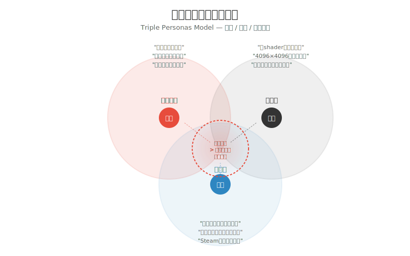
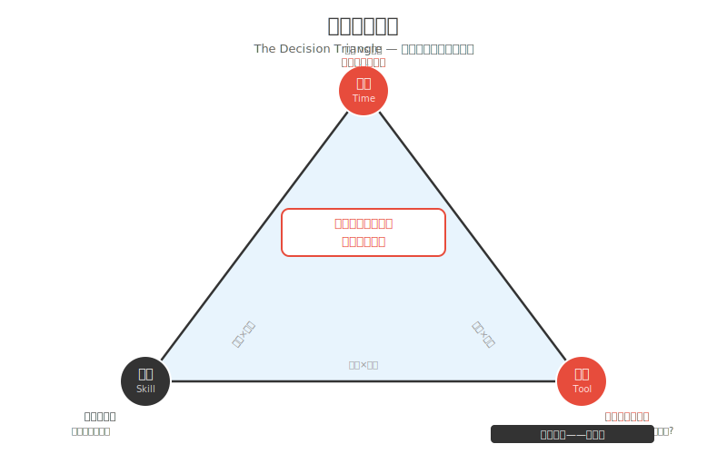
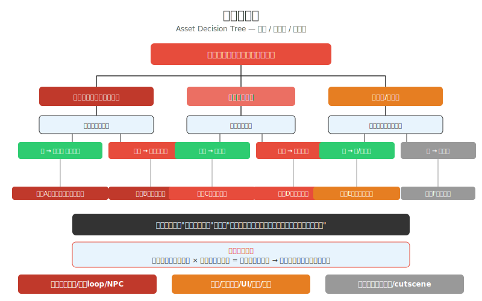
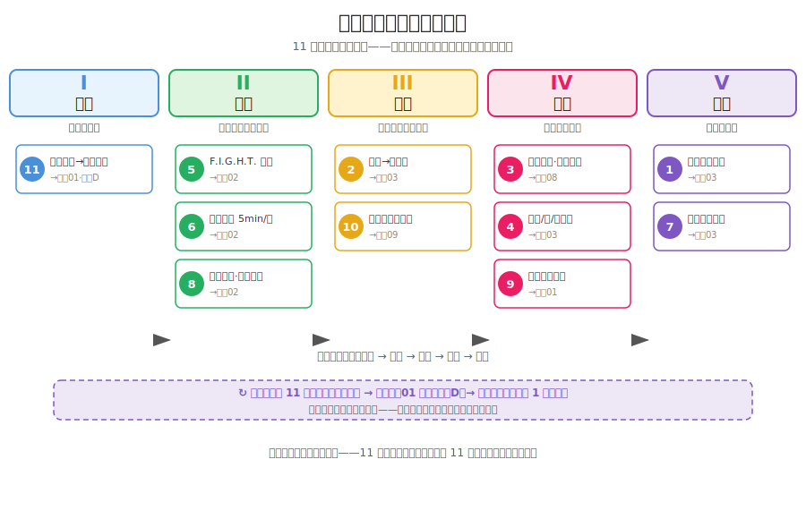

# 继续03 一个人的艺术指导

### 3.0 这一章解决什么问题

继续02 给了你一个"不停下来"的习惯系统——F.I.G.H.T. 循环、最低承诺、月度重画。但停下来做选择的那一刻，才是独立开发者真正孤立无援的时刻：没有老师告诉你"这张该改哪里"，没有 art director 替你拍板"这个方向不对"，没有同事帮你权衡"再加一帧动画值不值"。你一个人背着三个角色的决策权重，却只能自己跟自己开会。这一章解决的就是：**没有人给你 brief、没有人给你 feedback 的时候，你如何自己做视觉决策。**

**艺术指导不是你画画多厉害，是你能在多个方案中做出正确选择。** 这句话不是安慰你画不好。这是一个被独立游戏行业反复验证的事实。真正的 Art Director 每天大量时间都在删东西——不是加东西。本章教你做减法。

Lucas Pope 在开发《Papers, Please》时不是一个人——但他的美术资源是一个人完成的。他选择了一个极其特定的视觉风格：像素化的东欧官僚主义美学，灰黄色调为主，所有人脸都是低分辨率头像。这不是因为他画不出更好的——而是因为他做出了一个**艺术指导级别的决策**：这个游戏的视觉应该让玩家感到压抑、沉闷、没有出口。如果他把角色画得太精致太可爱，那种"你是这个冷酷体制里一颗螺丝钉"的体验就被破坏了。

Thomas Happ 在开发《Axiom Verge》时，大部分时间是一个人。游戏的视觉风格——那种诡异的、有机体与机械融合的生物设计——不是由一个大团队的 art director 拍板的。是 Happ 一个人反复问自己："这个画面，放在《Axiom Verge》的世界里，成立吗？"

这就是本章要教你的最后一项能力：**做自己的艺术指导。** 当没有人给你 brief（任务简报），没有人给你 feedback，没有人告诉你"这个方向不对"——你如何自己给自己这些？

本章不教具体画法。它教你**判断力**。教你如何在有限的技能、时间和工具下，做出让你的游戏看起来最好的选择。这比画好一张图更难，也比画好一张图更重要。

---

### 3.1 独立开发者的三重人格——如何不让他们打架

*图 继续03.1：独立开发者的三重人格（Triple Personas Model）——美术 / 程序 / 项目管理三个圆各执一词，中心重叠区以"成品体验 > 三者各自的完美主义"为唯一裁判。*

独立游戏开发者的真正难题不是"我不会画画"或"我不会写代码"。是你一个人背着三个角色的决策权重。

当你做任何一个视觉决策时——角色该多大、UI 该放哪里、特效该不该加——你脑子里有三个声音：

**美术人格**："这个颜色不够好看。阴影可以再加一层。这个动画还缺一帧过渡。能不能再给我两天时间？"

**程序人格**："这些分辨率的素材混在一起，draw call 会增加不少。这个特效粒子数太多了移动端跑不动的。这个 UI 布局在不同分辨率下会炸。"

**项目管理人格**："已经超了原定美术排期两周了。Steam 页面下周就要提交截图的。这个效果做到 60 分和做到 90 分对销量影响不大，先上线。"

三个声音都**对**。三个声音在互相**打架**。而你是那个必须打断它们的仲裁者。

#### 用一个标准统一三个声音

这三个声音不可能同时满意。你必须给它们一个共同的标准。这个标准是：

**"什么对这个游戏的成品体验最重要？"**

不是"什么最好看"，不是"什么技术最优雅"，不是"什么最快做完"。是"对成品体验最重要"。

举个例子：你的游戏是一个快节奏的平台跳跃游戏。美术人格说"角色的跳跃动画可以加个蓄力特效"。程序人格说"粒子系统在移动端要加一个单独的实现，时间成本很高"。项目管理人格说"我们只剩三天了"。

用标准来判断：蓄力特效对这个平台跳跃游戏的成品体验有多重要？
- 玩家在跳跃时眼睛在看角色的脚还是角色的头顶特效？
- 如果没有特效，玩家会跳不准吗？
- 有没有比加特效成本更低的方式——比如角色的 squash-and-stretch（压缩与拉伸）变形——来传达同样的"蓄力"信息？

答案是：平台跳跃游戏中，角色的 squash-and-stretch 比粒子特效更能传达跳跃的物理感，而且实现成本几乎为零（只改精灵的 scale 值）。所以——砍掉特效方案，用变形方案。三个声音都没赢，但成品体验赢了。

> **程序员类比**：这就像你做技术选型时的标准——不是"用最新的框架"，不是"用最安全的老技术"，是"什么对这个产品的核心功能最合理"。一个只有 100 个用户的内部工具不需要 Kubernetes。同样，一个快节奏平台跳跃游戏的角色不需要 8 方向 4K 精灵图。**技术选型的原则和视觉选型的原则，底层是同一个：找到那个刚好满足核心体验的最简单方案。**

#### 三重人格议事规则

为了让三个人格不陷入无限争论，你需要一个固定的"会议机制"——这就是三人格治理的核心：

1. **视觉决策必须由"成品体验"来判断，不能由三个声音投票决定。** 因为三个声音各占一票，而美术人格永远是少数——它会永远被程序和管理联手压倒。
2. **在项目初期，多听美术人格。** 在你还不知道这个游戏具体长什么样的时候，美术人格的"感觉"和"直觉"比程序员和管理者的"可行性分析"更珍贵。可行性可以在确定方向后调整。但如果初期方向被程序和管理主导，你会得到一个"技术上完美但没人想看一眼"的游戏。
3. **在项目后期，多听项目管理人格。** 当视觉风格已经确定、核心资产已经完成，美术人格继续要"再加一层"的冲动就需要被管理人格拉住了。此时"更好"是"完成"的敌人。
4. **程序人格拥有客观约束否决权——但只限于"物理上做不到"。** "Switch 跑不动 30fps"是合法否决。"我懒得写"不是。"这样做会很麻烦"也不是。程序人格只能否决客观约束，不能否决主观偏好。

> **真正成熟的独立开发者，并不是消灭其中任何一个人格，而是知道什么时候该让谁主持会议。** 如果三个人格争论超过 30 分钟——问题已经不是"继续讨论"，而是"先做一个最小可验证版本"。做出来，看着它，比三个声音在自己脑子里开会有效得多。

---

### 3.2 在预算内做最好的决策

*图 继续03.2：三维决策三角（The Decision Triangle）——时间 / 技能 / 工具三个约束顶点围成三角形，所有视觉决策都必须落在三角形内；"不是妥协——是设计"。*

独立开发者的"预算"不是钱。是三个硬约束：**时间（Time）、技能（Skill）、工具（Tool）。** 你能做的所有视觉决策，都必须落在这三个约束围成的三角形里。

这个三角形最重要的用法：**当你面对两个方案纠结时，把它们放进这个三角形里看。** 哪个方案更"贴"三角形的边界——更"贴"意味着它不超出你的任何一个约束。

#### 时间约束

"你有多少时间？"这是三角形顶点上第一个要回答的问题。

- 如果你有 6 个月全职：你可以尝试使用中等复杂度的风格（手绘风格的逐帧动画，中等分辨率的像素艺术）。
- 如果你只有周末和晚上：你的风格必须更保守。几何极简或低像素。
- 如果你在做 Game Jam（48 小时）：风格必须是"你现在就能画的"，不能是"你还想学一下再画的"。

时间约束逼出的一个好决策：**减少动画帧数但提高每一帧的画工。** 一个精致的 4 帧动画比一个粗糙的 8 帧动画看起来更专业。因为玩家的眼睛首先看到的是单帧的质量，然后才注意到帧数。

#### 技能约束

"能画到什么程度"是这个三角形最诚实的那个顶点。你必须面对它，不能绕过它。

但面对技能约束的方式不是"那我画不了，算了"。是**根据技能约束选择风格**——这正是艺术指导的核心工作。**艺术指导不是最大化自己的能力，而是最大化最终体验。** 你不是在"弥补不会的"，你是在"寻找你不会的恰好不重要的那个方案"。

风格03 已经详细讲过"约束隐藏缺陷"的概念——这里不再重复教学。本章重点答的是：**艺术指导什么时候使用它？** 答案是：在决策三角里，当"技能"这一项接近 0 的时候——不是硬学，是换方案。

> **程序员类比**：你第一次做 web 开发时，你也不知道怎么写复杂的 CSS 动画。所以你选了一个极简的 UI 框架，一切靠排版撑起来。后来你回头看那个项目，居然觉得它比你现在"什么都会"后做的那些花里胡哨的东西更好看。为什么？因为约束让它有了统一的品味。视觉同理。不会画的东西不画，比勉强画出来更像一个完整的风格。

#### 工具约束

你用什么设备？这个问题看起来无关紧要，但它会直接影响所有视觉决策。

- 只有鼠标 → 矢量/几何风格更容易。画有机曲线极其困难。
- 有手绘板 → 有机手绘风格成为可能。
- 只有手机 → 可以考虑纸笔画→手机扫描的混合工作流。
- 只有触控板 → 像素艺术是最佳选择。

工具约束是最好解决的一个——一块入门手绘板（Wacom One 或国产替代）不到 500 元。但它仍然存在，而且如果你没有，就不能假装有。

#### 三者博弈

这三个约束不是固定的。它们会互相博弈：
- 如果"时间"很充裕，你可以用时间弥补"技能"的不足——慢慢画，画到满意为止。
- 如果"技能"很强，你可以弥补"工具"的不足——用鼠标也能画出好东西。
- 如果"工具"很顺手，你可以弥补"时间"的不足——效率工具让你在更短时间内做出更多。

**三角形的核心原则**：所有的决策质量 = 你在三个约束内找到的方案有多"吻合"。**不是妥协——是设计。** 一架战斗机在设计时就知道自己的最大速度、载弹量、航程。设计师不会说"我很遗憾它没有轰炸机的载弹量"——它在它的约束内做到了最优。你的游戏也一样。

> **方案可行性 = 时间 × 技能 × 工具。** 任何一项接近 0，整个方案接近 0。你有充足的时间和好工具但完全不会某种画法——这项就是 0。你不是在"补短板"，你是在找三项乘积最大的方案。

---

### 3.3 什么时候该外包、买资产、找合伙美术

*图 继续03.3：资产决策树（Asset Decision Tree）——以"体验权重 = 可见度 × 时长"为根，分支到自己做 / 买素材 / 外包 / 跳过四条路径。*

"一切都要自己做"是一种浪漫的想法。它在你时间无限、技能无限时成立。在你只有一个人的情况下，它不成立。

**诚实面对能力边界，本身就是艺术指导的职责。** 你不是在认输，你是在做资源分配。

#### 量化判断标准

面对任意一个资产需求，回答两个问题：

**问题 1：这个资产对玩家的体验有多重要？**
- 高重要性：玩家在游戏中频繁看到/互动（主角、核心 UI、主要敌人）
- 中重要性：玩家偶尔看到（背景元素、次要 NPC、装饰物）
- 低重要性：玩家可能根本不会注意到（设置菜单的小图标、过场动画中的背景路人）

**问题 2：这个资产的"体验权重"有多高？**

"体验权重" = 资产对玩家的可见度 × 玩家看到的时长

- 主角：永远在屏幕上，玩家全程看着 → 体验权重极高 → **原则上应该由你主导**（你掌握最终风格方向；具体的逐帧绘制可以外包，但最终风格决定权必须在你手里）
- 最终 Boss：整个游戏只出现一次但出现很久 → 体验权重高 → **自己做或找合伙美术**
- 主菜单背景：每个玩家都看但只看到 5 秒 → 体验权重中 → **可以买素材或外包**
- 一个杂兵：出现很多次但玩家不关注 → 体验权重中低 → **买素材包或用免费素材**
- 某关的背景建筑：玩家跑过去的时候根本不会看 → 体验权重低 → **用免费素材或简化**

#### 三种选择的适用场景

**自己做**
适用：高体验权重的核心资产。
条件：你在技能上能够胜任，或者在时间上能够通过练习胜任。
记住：核心资产如果外包了，你的游戏就失去了一部分"是你做的"的属性。这是你作为独立开发者的签名。

**买资产/用免费素材**
适用：中等体验权重的通用资产。
常见来源：
- itch.io → 大量独立风格的像素/手绘素材包
- OpenGameArt → 免费游戏素材（质量参差不齐，需要筛选）
- Unity Asset Store → 商业素材，质量较高但需要调风格统一
- CraftPix → 专门卖 2D 游戏素材的网站

使用时的关键工作：**买来的素材必须经过"统一化处理"**。不是直接拖进游戏。而是——调整色板让它和你的游戏一致、统一描边粗细、统一阴影方向。买素材省的是"从零画的成本"，不是"让它匹配你游戏的成本"。

**外包/找合伙美术**
适用：高体验权重但你技能不够的资产。
判断标准：如果这个资产你反复画了 3 版还是不满意，且它在体验权重上很高——考虑外包。
两种情况：
1. **找合伙美术**：你认识一个画得不错的人，你出程序 Ta 出美术。长期的合作关系。好处是美术对你的游戏有 ownership（所有权感），会主动为风格负责。坏处是你需要分收入或找到愿意用爱发电的人。
2. **委托外包（Commission）**：你花钱请人画一张或一组图。Fiverr、Sketchmob、微博/小红书上的自由画师。好处是你完全控制方向，且不需要分收入。坏处是沟通成本高——你需要清楚地告诉对方"我要什么"，这对很多程序员来说比写文档还难。

**外包沟通的要点**：不要发给画师"你看着办"。发一个完整的 brief：
- 角色名/物品名
- 游戏风格描述（附 2-3 张参考图）
- 画布尺寸/用途（头像/全身/场景）
- 调色板（或颜色偏好）
- 必须包含的元素和禁止的元素
- 你愿意付多少钱（诚实报价）

> **程序员类比**：外包和买资产的区别就像用开源库和雇人写定制代码的区别。开源库（素材包）便宜、立即可用，但不一定完全符合你的需求。雇人写（外包）贵、需要沟通，但产出的是完全定制化的。**好的艺术指导知道什么该用开源、什么该定制。**

---

### 3.4 "约束隐藏缺陷"——艺术指导的终极思维

JSLegendDev 的这个概念值得单独成节。因为它彻底扭转了"独立开发者永远在弥补短板"的思维模式。

传统思维：我不会画阴影 → 我要学画阴影 → 我没时间学 → 我的画面永远缺阴影 → 我很挫败。

约束思维：我不会画阴影 → 那我选一个不需要阴影的风格 → 扁平化设计（Flat Design）本来就不要阴影 → 我的画面干净、有设计感、而且和那些硬画阴影的画风不一样 → 这是我的风格。

这个思维转换的意义怎么强调都不为过。**它把你从"弥补缺口"的无限循环中解放出来，让你进入"设计解决方案"的主动模式。**

几个经典的"约束→风格"映射：

| 你不会的    | 你选的风格       | 这个风格的代表                |
| ----------- | ---------------- | ----------------------------- |
| 画人体/解剖 | 几何极简、剪影   | Thomas Was Alone, Limbo       |
| 画阴影/体积 | 扁平化设计       | Alto's Adventure (早期原型)   |
| 配色        | 单色/双色调      | Downwell, Nidhogg             |
| 画透视/空间 | Tile-based 2D    | 绝大多数独立像素游戏          |
| 做复杂动画  | 4 帧极限动画     | Celeste (madeline 的基础动画) |
| 画复杂 UI   | 极简 UI/文字为主 | Reigns, A Dark Room           |

关键：**你的风格不是由"你会什么"决定的，是由"你敢不画什么"决定的。** 敢不画就是艺术指导的勇气。

---

### 3.5 常见踩坑——一个人做艺术指导最容易犯的三个错误

**症状 1：永远觉得自己画得不够好，无限打磨。** 你画了一版角色，觉得还行，但"再改一版会更好"。你改了五版，每版都只改了一点点。两个月过去了，你还在改主角的帽子角度。
**原因：** 没有项目管理人格的介入。当只有美术人格在工作时，它永远不会说"够了"。
**修复：** 给每一个视觉决策定一个截止线。不是"我觉得满意为止"，是"本周日下午 6 点前必须锁定，之后只改 bug 不改设计"。

**症状 2：买来的素材直接拖进游戏，不做统一化处理。** 你从 itch.io 买了一套像素 tileset，从 OpenGameArt 下了一套 UI 按钮。它们单独看都不错，但放在一起——tileset 是暖色调、UI 按钮是冷色调、描边粗细还不一样——画面看起来像一个拼凑的杂货铺。
**原因：** 你低估了"统一化处理"的重要性。买素材省的是"从零画的成本"，不是"让它匹配你游戏的成本"。
**修复：** 任何外部素材进入你的项目前，必须过三关：色板统一（替换成你的主色调）、描边统一（调整到和你的其他素材一致的线宽）、导出设置统一（文件格式、尺寸、像素对齐方式）。

**症状 3：外包时发给画师"你看着办"。** 你花了钱，但拿回来的东西完全不是你想要的——因为你的 brief 只有一句"帮我画一个可爱的猫角色"。"可爱"对不同人意味着完全不同的东西。
**原因：** 写清楚的视觉 brief 本身就是艺术指导的核心技能，而你跳过了。
**修复：** 外包 brief 至少包含以下六项：角色名/物品名、游戏风格描述（附 2-3 张参考图）、画布尺寸/用途、调色板或颜色偏好、必须包含的元素和禁止的元素、你的预算。

**症状 4：一直等能力提高再开始。** "等我学完人体再做游戏"、"等我练好配色再开新项目"。三年过去了，你还在等。**原因：** 以为能力是"准备好了才能开始"的东西，实际上能力是在项目里长出来的。**修复：** 艺术指导不是等能力配得上项目，而是让项目配得上能力。你现在能画到什么程度，就选择恰好匹配那个程度的风格——然后开始。项目会推着你的能力往前走，等待不会。

---

### 3.6 一个人的美术工作流总结——11 步映射到全书五部

让我们把全书的美术生产流程浓缩成一张工作清单。这是你一个人的开发中，"做自己的艺术指导"的完整步骤。这 11 步不是新东西——它们把全书五部（观察 → 练手 → 风格 → 制作 → 继续）里你已经学过的能力，串成一条可执行的工作流。每一步标注了它对应哪一章、属于哪一部：

*图 继续03.4：一个人的美术工作流总览——11 步映射到全书五部（观察 / 练手 / 风格 / 制作 / 继续），步骤号为工作流顺序，所在列为所属部；步骤 11 的发布反馈喂回观察01 自评，形成闭环。*

#### 项目启动阶段

1. **回答决策三角**：我有多少时间？我会什么？我有什么工具？（→ 继续03 · 属"继续"部）
2. **判断约束→风格**：我不会/没时间画什么？据此选风格。（→ 风格03 · 属"风格"部）
3. **列资产清单**：这个游戏需要多少张图？按体验权重分类。（→ 制作08 · 属"制作"部）
4. **做外包/买/自己做的决策树**（→ 继续03 · 属"制作"部）

#### 日常执行阶段

5. **F.I.G.H.T. 循环**：单点聚焦→快反馈→适中难度→保持动机→明确目标（→ 继续02 · 属"练手"部）
6. **最低承诺**：每天 5 分钟，每周 1 张稿，每月 1 次发布（→ 继续02 · 属"练手"部）
7. **三重人格议事**：关键视觉决策用"成品体验 >"标准判断（→ 继续03 · 属"继续"部）
8. **进步追踪**：每月同主题重画，存到专用文件夹（→ 继续02 · 属"练手"部）

#### 作品完成阶段

9. **赛后复盘**：视觉一致性 / 动画流畅度 / UI 清晰度 / 配色统一性四象限（→ 继续01 · 属"制作"部）
10. **风格执行度评估**：你选定的风格在成品中的执行度有多少分？如果低于 6 分，下次选更简单的风格或留更多时间。（→ 制作09 · 属"风格"部）

#### 游戏发布后

11. **从发布后的反馈中提取视觉改进方向**：玩家/评论者有没有提到视觉相关的问题？按频率排序，最高频的问题就是下一款游戏的视觉改进重点。（→ 观察01 自评 + 附录D · 属"观察"部）

这 11 步不需要每次都完整跑——它们是工具箱不是操作手册，卡住的时候回来翻对应章节。注意步骤 11：它的输出不是一张画，而是一份"下一款游戏该改什么"的清单——这份清单喂回观察01 的三能力自评（附录D），让你的下一次决策三角站在更高的起点上。**工作流是闭环，不是直线**——从观察到练手到风格到制作到继续，再回到观察，每一款游戏都在上一款的反馈上长出来。

---

### 3.7 练习

**L1：做一次你自己的"约束→风格"决策（20 分钟）**

拿你当前（或计划中）的游戏项目，回答以下问题：

1. 列三样你**不会**画的（或不想花时间画的）——例如"我不会画写实的人脸""我不会画复杂的阴影""我不会画有机曲线"
2. 根据 3.4 的"约束→风格"映射表，找出至少一个**因为你不会而变得更适合你**的风格
3. 写一段话解释为什么这个风格在你的约束（时间/技能/工具）内是最优的

**怎么检验：** 把这段话发给另一个开发者看。如果 Ta 的回应是"有道理，这个风格确实适合你"——你的决策是自洽的。如果 Ta 说"但你可以试试另一种风格"——追问为什么，然后重新评估。

---

### 3.8 本章小结

做自己的艺术指导不是因为你一个人做游戏——是因为在独立开发中，没有人比你更清楚"你的游戏应该是什么样"。三重人格议事规则给了你一个停止内耗的机制：用"成品体验"统一三个声音。时间/技能/工具三角给了你一个做决策的框架：不是妥协是设计。约束隐藏缺陷（约束藏瑕）不是借口——是把你的弱点变成风格的起点。最后，知道什么时候自己做、什么时候外包、什么时候买资产，是艺术指导最诚实的时刻。

艺术指导不是一本书能教完的东西——它是在一个又一个项目中练出来的。本章给你的三重人格议事、决策三角、约束藏瑕，是你在下一个项目中做每一个视觉决策时可以调用的工具。它们不是教条，是你在孤立无援时能问自己的问题。

> **如果只记住一句话：** 艺术指导不是画得更好，是选得更对——用"成品体验"统一三重人格，在时间/技能/工具三角内做设计而非妥协，把你不敢画的东西变成你的风格。

### 3.9 扩展阅读

1. **《The Art of Game Design》— Jesse Schell（第 25 章 "设计通过迭代"）**：Schell 关于"设计是一个决策过程而非灵光一现"的论述，与本章的"艺术指导即决策"立场完全一致。特别是他对"设计师的尴尬时刻"（当你在多个可行方案中无法决定时）的讨论，与三重人格议事规则形成互补。
2. **Lucas Pope — "The Process of Papers, Please"**：Pope 在 GDC 和多个访谈中详细讨论了《Papers, Please》的视觉决策——为什么选择像素化、为什么用灰黄色调、为什么所有人物只做低分辨率头像。这些访谈是"约束→风格"思维的绝佳实证案例。搜索 "Lucas Pope Papers Please art direction" 找到相关资料。
3. **Thomas Happ — "Axiom Verge Postmortem"**：Happ 作为 solo 开发者（负责美术和程序的全部工作），在开发回顾中讨论了"什么时候该承认自己做不了、改方案而不是硬学"。这是"技能约束→风格选择"的直接实践案例。
4. **《Show Your Work!》— Austin Kleon**：一本极短的书，核心观点是"不是等做好了才展示，而是把过程展示出来"——与继续02 的持续输出系统及本章的自我管理密切相关。对独立开发者来说，公开发布作品是练习反馈接收能力的最佳方式。
5. **继续02《持续输出的习惯系统》** & **附录D 自评量表** ——**为什么推荐：** 11 步工作流的步骤 5-6、8 来自继续02 的 F.I.G.H.T./最低承诺/月度重画；步骤 11 的"发布反馈→重新自评"调用附录D 三能力自评。艺术指导是"怎么选"，习惯系统是"怎么不停下来"——两者缺一不可。

---

### 3.10 本章引注

[^1] Schell, Jesse. 《The Art of Game Design: A Book of Lenses》(3rd ed.), CRC Press, 2019. 第 25 章关于"设计迭代"和"决策过程"的讨论，为本章的艺术指导方法论提供了设计理论基础。
[^2] Pope, Lucas. Papers, Please 开发日志与访谈。关于"像素化东欧官僚主义美学"的视觉决策讨论，详见 GDC 相关演讲及 Pope 的公开访谈。
[^3] Happ, Thomas. Axiom Verge 开发后记。Happ 在多次访谈中讨论了 solo 开发中"技能约束倒逼风格选择"的实践经验。
[^4] Kleon, Austin. 《Show Your Work!: 10 Ways to Share Your Creativity and Get Discovered》, Workman Publishing, 2014. 关于"在创作过程中公开展示"的方法论，支持本章"持续输出 + 反馈接收"的自我管理模型。
[^5] Brown, Blain. 《Cinematography: Theory and Practice》(4th ed.), Routledge, 2021. 第 2 章关于"视觉决策的三大约束（预算/时间/技能）"的讨论，与本章的时间/技能/工具三角框架构成跨领域呼应。
[^6] JSLegendDev. "Constraints Hide Flaws." YouTube 及开发日志。独立游戏开发社区中关于"用约束隐藏缺陷"的论述，本章引用的"约束→风格"映射表的直接来源之一。

