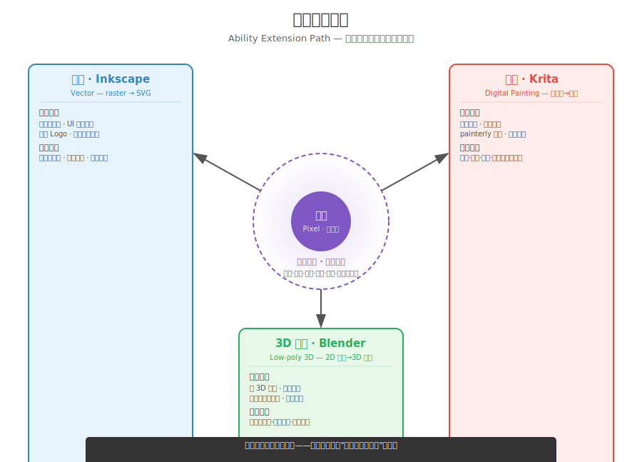

# 继续04 像素之后：向手绘与 3D 低模扩展

### 4.0 这一章解决什么问题

你已经有了一套完整的像素艺术能力：观察、练手、风格、制作、继续。但像素不是终点。本章只做一件事：**在你掌握像素之后，给你三条最自然的扩展方向——手绘数字绘画、3D 低多边形、矢量——以及每条的"何时转向"、"你的像素技能如何迁移"、各自的优缺点和代表作。**

这不是教你怎么画手绘、怎么建 3D 模型、怎么做矢量。这一章给你的不是深度，是**方向感**：让你知道下一个工具该往哪边走，以及你手上这套像素功夫在新工具里哪些能用、哪些要重学。

---

### 4.1 三条扩展路径——何时转向，什么会迁移

> **这三条方向不是同一级分类。** 手绘和矢量仍属于二维美术，只是表现媒介不同（像素=点阵，手绘=笔触，矢量=路径）；Low Poly 则进入了三维制作——这是维度升级，不是风格切换。本章按独立开发者最常见的扩展方向介绍，而不是严格按美术学类。

*图 继续04.1：能力扩展路径——像素（中心，已掌握）分叉到三条相邻方向。*

下面逐条展开。每条讲四件事：**什么时候该切过去**、**像素功夫哪些能搬过去**、**优点与缺点**、**代表应用**。

#### 方向一：数字手绘（Krita）

**何时转向。** 你的游戏需要像素给不了的东西——柔和的边缘、连续的渐变、笔触的温度、painterly（油画感）的整体氛围。像素的硬边和有限调色板是它的风格语言，但当你的下一款游戏想表达"温暖的手""流动的水""湿润的泥土"时，硬边会变成障碍。

**像素技能如何迁移。**
- **明度（练手04）**：去色之后才见真章——这条规则在手绘里更狠，因为手绘的渐变更容易把明度搞糊。三区四模板直接搬。
- **色彩（练手05）**：有限调色板的思维反而是优势——大多数初学者手绘的问题是"颜色太多太花"，你练过少即是多，起手就比他们克制。
- **构图（练手07）**：视觉权重、引导线、三分法——和工具无关，100% 迁移。
- **形状心理学（练手02）**：圆=友善、方=稳重、三角=危险——和你是用像素还是用笔刷画无关。

**什么要重学。** 笔触本身——压力、角度、流速的组合，这是新工具的语法。但语义（明度、色彩、构图、形状）你已经会了。

**优点：** 表现力跨度极大——从极简扁平到油画写实都能做；柔和的梯度过渡是像素永远做不到的；笔触的"手工人情味"能让画面看起来像画而不是算出来的。

**缺点：** 笔触控制的学习曲线不低——压感和手感需要几个月建立肌肉记忆；自由度高了反而容易画乱——没有网格替你兜底；和像素的"精确复制"不同，手绘同一角色画两遍轮廓会不一样，一致性是挑战。

**代表游戏：** *Hollow Knight*（手绘角色 + 手绘背景，极繁的细节密度）、*Cuphead*（1930 年代卡通风格的手绘逐帧动画）、*Spiritfarer*（柔和的手绘水彩风格，温暖的笔触感）、*GRIS*（水彩 + 手绘，每帧像一幅画）。

**工具。** Krita 是开源数字绘画的标准选择。很多人第一次接触 Krita，会把注意力放在两百多个笔刷上——但真正决定画面质量的，仍然是明度、形状、构图。Krita 增加的是表达方式，而不是替你解决设计问题。你只需要关注四个功能：图层管理（分部件导出）、Wrap-around 无缝平铺（画纹理）、Export Slices（批量切 UI）、索引色模式（如果你要做像素/手绘混血）。其余几百个笔刷先放一边。

#### 方向二：3D 低多边形（Blender）

**何时转向。** 你的游戏需要真正的 3D——可旋转的相机、可复用的多角度资产、物理交互、纵深透视。像素的 2D 网格在这些需求面前是维度的天花板。注意：如果你的需求只是"3D 当中间表示、最终产物还是 2D 像素 sprite"，那不是转向——那是**制作06 已经讲过的 3D→像素管线**，你不需要换方向。这一节说的转向是你下一款游戏**主风格就是 3D 低模**，像素不再是最终产物。

**像素技能如何迁移。**
- **有限调色板（练手05）→ 材料克制。** 现代低模有三条路线：顶点色（每面一个纯色）、小纹理 Atlas（一张小图铺给所有模型）、手绘纹理（UV 展开后描画）。无论哪条，你在像素里练过的"用最少的颜色做最多的事"都直接搬过来。
- **剪影（练手02）→ 3D 剪影可读性。** 剪影说了算——这条在 3D 里更严，因为玩家会从多个角度看你的模型。
- **约束藏瑕（继续03）→ 少面数是设计不是预算不够。** 你在像素里学过用 16×16 隐藏不会画解剖结构——低模里同样的逻辑变成用 300 面隐藏不会做高精度拓扑。

**为什么程序员反而容易学。** 很多程序员会发现 Blender 没有想象中陌生。物体、层级、坐标系、变换矩阵、实例（Instance）、父子关系——这些本来就是程序里的概念。真正新的不是逻辑，而是空间审美。

**什么要重学。** 摄像机、光照在三维空间里的布置、UV 展开（如果你用纹理路线）。这些是维度升级带来的新语法——但语义你已掌握。

**优点：** 一个模型可渲染出无限视角——同一角色前后左右上下全自动；3D 相机带来独特的空间感和纵深感；物理交互天然成立（碰撞、重力、遮挡）；动画效率远高于逐帧——骨骼动画修改关键帧即可。

**缺点：** Blender 学习曲线中等——界面初学者友好度偏低；3D 建模后渲染成像素风格的外观需要专门设置（制作06 的管线）；不做像素化直接渲染的光滑外观可能偏离"像素感觉"；调试 3D 场景的视觉节奏比 2D 场景慢（查看多个角度 vs 一个固定视角）。

**代表游戏：** *A Short Hike*（低多边形 + 像素化纹理，温馨的开放世界）、*Monument Valley*（极简低多边形 + 错觉几何，M.C. Escher 式空间）、*Untitled Goose Game*（低模角色 + 低模场景，幽默感的 3D 表达力）、*When the Past was Around*（低模 + 手绘纹理，情感叙事的 3D 力量）。

**工具。** Blender 是开源 3D 的标准。低模入门你只需要四个操作：编辑模式（Tab）、挤出（E）、环切（Ctrl+R）、缩入（I）。不需要学雕刻、不需要学 UV（纯顶点色路线）、不需要学 PBR。

#### 方向三：矢量（Inkscape）

**何时转向。** 你的游戏需要分辨率无关的资产——UI 图标、可缩放的 Logo、几何感强的图标系统、多分辨率适配的矢量图形。像素是位图（raster），放大就糊；矢量是路径方程，放大不糊。当你做一套要在 1080p 和 4K 上都清晰的 UI，或者一套要印到 T 恤上的 Logo，像素的网格反而成了累赘。

**像素技能如何迁移。**
- **形状心理学（练手02）**：矢量的核心是基本形状（圆、方、三角、路径）的组合——你在像素里练的形状心理学 100% 适用，而且矢量里你能更精确地控制形状（没有像素锯齿）。
- **硬边思维（练手08）**：像素艺术的硬边原则——边缘要干净、不要半透明亚像素——在矢量里是天然成立的（矢量路径本来就是硬边）。你练过的"边缘是视觉信息"的思维，在矢量里直接生效。
- **有限调色板（练手05）**：矢量 UI 同样受益于克制配色——一套图标用 2-3 个颜色比用 10 个颜色更专业。你的像素配色训练直接搬。

**什么要重学。** 路径编辑。矢量的"笔"是贝塞尔曲线——控制点、手柄、曲率。这和像素的"逐像素放置"是完全不同的操作模型。但"画什么"（形状、构图、配色）你已经会了。

**如果你喜欢组件化设计。** 如果你喜欢可复用、参数化、一处修改全局生效的思维方式，矢量会让你很有熟悉感。一个图标可以不断复用、缩放、组合——和程序里的组件思维非常接近。

**优点：** 任意缩放不模糊——同一 Logo 在 1080p 和 4K 上一样锐利；路径可随时调整；文件体积极小；非常适合 UI 系统。

**缺点：** 矢量天生的"光滑感"和手绘/像素的"粗糙感"气质不同；贝塞尔曲线的操作逻辑需要几周适应；不适合手绘风格。

**代表应用（注意：这些游戏本身不是矢量游戏，而是它们的 UI/图标系统大量使用矢量）：** *Hollow Knight* 的 UI 图标系统、*Into the Breach* 的矢量机甲和 UI、*Monument Valley* 的菜单和 Logo、*Celeste* 的草莓计数 UI。

**工具。** Inkscape 是开源矢量的标准选择。你只需要学：钢笔工具（画路径）、形状工具（调控制点）、布尔运算（合并/差集/交集形状）、导出 SVG/PNG。

---

### 4.2 四条路径对比——像素 + 三条扩展

> **⚠️ 不要因为遇到瓶颈就急着换工具。** 如果你只是觉得像素画不好——继续练像素。如果你只是做不好动画——继续练动画。如果你的目标仍然是像素游戏，重新学习另一套工具通常比你想象的花时间。只有当游戏真正需要另一种表现形式时——你要的是柔和的渐变（手绘）、3D 空间（低模）、或分辨率无关的 UI（矢量）——再考虑转向。换工具解决的是需求问题，不是技能问题。

| 维度 | 像素（你已经会的） | 手绘（Krita） | 3D 低模（Blender） | 矢量（Inkscape） |
|------|-------------------|--------------|-------------------|------------------|
| **核心单元** | 像素 | 笔触 | 多边形面 | 路径/曲线 |
| **缩放方式** | 整数倍（Nearest Neighbor） | 任意（模糊由分辨率决定） | 任意（3D 渲染分辨率） | 任意（数学缩放，永不模糊） |
| **学习曲线** | 低（你已经越过了） | 中（笔触肌肉记忆） | 中高（界面 + 3D 思维） | 低（2-3 天入门） |
| **风格跨度** | 像素子风格四代 | 极简 → 油画写实 | 低模 → 风格化 → 写实 | 极简几何为主 |
| **代表性的游戏** | Celeste / Dead Cells / Stardew | Hollow Knight / Cuphead / GRIS | A Short Hike / Monument Valley | Into the Breach / 各游戏的 UI 系统 |
| **动画成本** | 高（逐帧重画） | 中（可层叠+骨骼） | 低（骨骼动画，改关键帧） | N/A（主要用于静态 UI） |
| **最适合的场景** | 2D 平台/肉鸽/RPG | 叙事向/氛围向/手绘 2D | 开放世界/3D 平台/探索 | UI 系统/Logo/图标 |
| **像素技能迁移率** | 100% | ~70%（构图/色彩/明度全搬，笔触重学） | ~50%（剪影/配色/约束思维搬，3D 操作重学） | ~60%（形状/配色/硬边搬，曲线操作重学） |

**换工具 vs 换方向。** 如果你的下一款游戏主风格还是像素，你只是想用 3D 省动画工时——那不是转向 3D，那是在像素流水线上加工具（制作06）。真正的转向是你的**主风格**变了：最终产物不再是像素 sprite，而是手绘插画 / 3D 模型 / 矢量图形。换工具是增量，换方向是迁移。先想清楚自己要的是哪个。

---

### 4.3 元点：视觉思维的迁移

这一章最重要的不是三条路径的细节——是一个元点：

**像素只是训练场。真正迁移的不是像素技巧，而是视觉思维。** 观察、抽象、取舍、表达——你在每一张 16×16 的画布里反复练习的，是这个链条。有限调色板逼你取舍，低分辨率逼你抽象，硬边逼你做清晰的表达决策。这些能力不是像素专属——无论你以后画手绘、做 Low Poly、设计 UI，这套思维都会继续工作，只是输出媒介不同。约束只是训练方式。你以为你学的是像素，其实你学的是"在限制里做设计"——这才是终身可迁移的元技能。

这就是为什么像素是好的第一语言——它约束最硬，训练最狠。你从像素出发转任何一条路径，都会带着"我已经习惯在限制里思考"的优势。继续03 的"约束藏瑕"在这里升级：约束不只是藏缺陷的工具，约束是**所有视觉风格的生产方式**。选风格就是选约束。

---

### 4.4 练习

**L1：试一条路径，观察什么迁移（45 分钟）**

从三条路径里选一条你最感兴趣的，做一个最小的试验件，观察你的像素技能哪些直接能用、哪些要重学。

- **手绘方向**：Krita 新建 512×512 画布，用硬边圆笔刷画一个你在像素里画过的角色，但用压力笔刷画轮廓和阴影。观察：明度判断、配色、构图是不是直接生效？笔触控制是不是要重学？
- **3D 低模方向**：Blender 新建 Cube，用挤出 + 环切做一个你在像素里画过的道具（比如一个宝箱），给每个面指定顶点色。观察：剪影可读性、配色克制是不是直接生效？3D 空间操作是不是要重学？
- **矢量方向**：Inkscape 用钢笔工具画一个你在像素里画过的 UI 图标，导出 SVG。观察：形状心理学、硬边思维是不是直接生效？贝塞尔曲线控制是不是要重学？

**怎么检验。** 做完后写两句：①"从像素直接迁移过来的能力是___"②"必须从头学的新技能是___"。这两句话就是你下一步学习方向的起点。

---

### 4.5 小结

当你翻开第一章时，你可能连一条像素线都画不直。现在，你已经能独立分析作品、建立风格、完成资产、组织生产流程，也知道下一步可以走向哪里。像素只是开始，而不是终点。从今天开始，你不再只是"会画像素"——而是拥有了一套可以迁移到任何视觉媒介的设计能力。

- **三条扩展路径各有何时转向：** 手绘（需要柔和边缘/painterly）、3D 低模（需要真 3D 相机和物理）、矢量（需要分辨率无关）。转向的信号是"像素给不了这个东西"，不是"像素不好"。
- **像素技能的迁移是语义层、不是语法层。** 明度、色彩、构图、形状心理学、剪影、约束藏瑕——这些跨工具通用。要重学的只是"怎么画"的语法：手绘的笔触、3D 的空间操作、矢量的贝塞尔曲线。
- **换工具 ≠ 换方向。** 给像素游戏加 3D 工具是换工具（增量），把下一款游戏主风格改成 3D 是换方向（迁移）。
- **元点：你在像素里练的是"在约束下做决策"，这是通用艺术技能。** 像素是约束最硬的第一语言，所以它的训练迁移得最远。

> **如果只记住一句话：** 像素是你的第一语言，但不是唯一语言——你练出来的不是像素本身，是"在约束下做决策"的元技能，它在你转向手绘、3D 低模、矢量任何一条路径时都跟着你。

---

### 4.6 扩展阅读

1. **Krita 官方手册（Krita Manual）** —— 图层管理、Wrap-around、Export Slices、索引色模式。手绘方向的工作流入口。
2. **Blender 基础教程（Blender Fundamentals）** —— 建模、材质、渲染、动画。3D 低模方向的工作流入口。
3. **Inkscape 官方教程（Basic Tutorial + Boolean Operations）** —— 路径、形状、合并/差集/交集。矢量方向的入门。
4. **制作06《非手绘管线：3D、AI 与程序化》** —— Blender 3D→像素管线。如果你不是转向 3D 而是在像素流水线上加 3D 工具，回看那一章。

---

