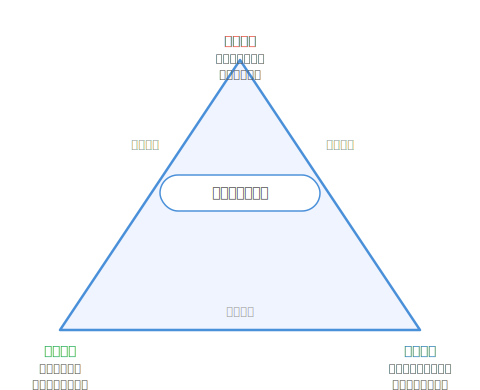

# 继续05 游戏美术路线全景

### 5.0 这一章解决什么问题

继续04 给了你三条工具扩展方向——手绘、3D 低模、矢量。但那些是"工具清单"。像素是你已经掌握的能力，但它不是独立游戏美术的全部。你下一款游戏不一定继续用像素——可能你需要更柔和的渐变，可能你需要 3D 空间，可能你根本没时间手绘任何东西。这时候，你需要的不再是"怎么画"——你需要的是**一个选择框架**：在所有可能的路线里，哪条最适合现在的你。

这一章把这个框架给你：**五条策略 + 一个能力三角 + 按背景的路线推荐。** 它不是继续04 那种"工具清单"，它是一张**地图**——让你在开始下一款游戏之前，先看清楚自己的位置和方向。

> **程序员类比：技术选型雷达。你在做一个新项目时，不会上来就写代码——你会先做技术选型：后端用什么语言？数据库用什么？部署到哪里？这些决策取决于你的团队背景、项目规模、性能要求、时间约束。独立游戏的美术路线选型是同一种决策：你不是在选"最美的风格"——你是在选"你的团队（可能只有你一个人）能在 deadline 前交付的视觉系统"。这一章就是你的美术技术选型雷达。

---

### 5.1 能力三角——三条轴决定你能走多远

把"美术能力"拆开。你以前可能以为美术能力是一条线——画得好就强，画不好就弱。但实际上它是**三条轴**的组合：




*图 继续05.1：能力三角——审美、表达、系统三条轴围成三角，任何视觉生产策略都是这三者的不同配比。*


- **审美能力**：你能判断什么是好看的。这条轴决定游戏视觉的**上限**。
- **表达能力**：你能把好看的做出来。这条轴决定**单件资产的质量**。
- **系统能力**：你能稳定、高效地做出一整套风格一致的资产。这条轴决定**你能不能做完一个游戏**。

你现在手上的像素能力，三条轴都有份——审美来自八概念和观察训练，你知道了什么是"对"的。表达来自练手部分和制作部分前半的工具操作，你能把"对"的画出来。系统来自制作部分后半的管线能力，你能把"画出来的"整合进游戏。下一步要做的事，是把这三条轴**重组**——根据新项目的需求和你自己的能力现状，找到一个新的平衡点。

**所有视觉生产策略，本质上都是能力三角的不同配比。** 审美强而表达弱的人，适合约束型策略——用设计能力填补手绘短板。表达强而系统弱的人，适合手绘少量高质量资产。系统强而审美弱的，用规则系统保证一致性。下面五种策略就是对这个三角的五种配比方案。

---

### 5.2 五种视觉生产策略

> **下面五种不是互斥道路，而是常见策略。一款游戏通常会同时采用其中 2-4 种。** 比如 Celeste：像素 + Shader + 风格约束 + 手绘概念。Hollow Knight：手绘 + Shader + 交互驱动。不要想着"我只能选一个"——策略是用来组合的。

#### 策略 1：传统美术路线 —— 手绘驱动

这就是传统的游戏美术，例如像素风格或手绘风格对应的路线。

**你在这条路线上做的是**：用你的手和笔刷，逐笔触地画出每一个资产。

**能力配比**：审美（高） + 表达（高） + 系统（低）

**你手上能迁移的像素功夫**：
- 明度（练手04）：去色之后见真章——这条在手绘里更狠，因为渐变多起来更容易把明度搞糊
- 色彩（练手05）：有限调色板的克制思维是手绘初学者的稀缺能力——大多数手绘新手的问题是"颜色太多太花"
- 构图（练手07）：视觉权重、引导线、三分法——和工具无关，100% 迁移

**要重学的**：笔触控制——压力、角度、流速的组合，需要几个月建立肌肉记忆。但语义（明度、色彩、构图）你已经会了。

**优点**：上限极高，任何风格都能做；资产直观，所见即所得。**缺点**：慢——每个资产是纯手工，你做 100 个角色和做 1 个角色的时间成正比；一致性靠人保证，不是靠系统保证。

**代表作**：*Hollow Knight*（手绘角色 + 手绘背景）、*Cuphead*（1930 年代手绘逐帧动画）、*Spiritfarer*（柔和的手绘水彩）。

**适合你，如果**：你有美术底子且愿意用时间换质量，或者你的游戏只需要少量高质量资产。

---

#### 策略 2：技术驱动路线 —— Shader / 程序化 / 规则系统

这就是制作06（非手绘管线）对应的路线——但不是那个章节里的"怎么用工具"，而是**选这条路作为一种视觉策略**。

**你在这条路线上做的是**：设计生成视觉结果的规则系统。火焰不是画出来的——是 noise + gradient + distortion。草地不是画贴图的——是 instancing + wind + variation。风格不是手绘定的——是 color ramp + lighting model。

> **核心转变：** 你不会"逐像素绘制"，但你可以"设计生成视觉结果的规则系统"。你不是画图者——你是**视觉规则设计者**。

**能力配比**：审美（高） + 表达（低） + 系统（**极高**）

**你手上能迁移的像素功夫**：
- 约束思维（练手08 + 继续03）：像素里你学会了在限制里做最优解——shader 里同样的逻辑变成"在 GPU 指令集和性能预算里做最优解"
- 色彩（练手05）：color ramp 替换平滑渐变——和你在像素里做的调色板管理是同一种思维，只是施加方式从"手指点像素"变成"数学函数映射"
- 明度（练手04）：光照模型的本质就是明度分配规则——你在九级明度阶里练的就是这个

**要重学的**：着色器shader原理和语法，或者节点编辑器操作逻辑（如果你从 Shader Graph 开始）。但好消息是你作为程序员，这个学习曲线比学手绘平得多——语法是新的，思维模型（函数、输入输出、数据结构）你本来就会。

**优点**：可复用、可扩展——一套 shader 用在整个项目；数学规则天然保证一致性；一次规则可以生成无限变化（用时间换规模）。**缺点**：如果规则设计不好，画面会非常"死"——程序化的反面是机械重复；审美被规则限制——你做不出规则没考虑到的东西。

**经典案例**——*No Man's Sky*：艺术家 Grant Duncan 在 GDC 2015 的演讲中回忆，当他告诉其他艺术家自己在做程序化美术时，收到的反馈是"Procedural art is a big pile of shit"。但 Hello Games 的解法不是让算法取代艺术家——而是**让艺术家设计规则，算法执行规则**。

**适合你，如果**：你是程序员背景，对数学和系统设计不排斥，想要"写一次规则，生成无限变化"的生产效率。

---

#### 策略 3：资源整合型 —— Asset Curation

继续04 没有直接覆盖这条路线——因为它不是"画"的技能，而是"选和改"的技能。但它是很多独立游戏实际发货的路线。

**你在这条路线上做的是**：从 Kenney、itch.io、Asset Store 等来源挑选现成资产，通过统一 shader、统一调色、统一后处理，让不同来源的资产看起来像一个游戏。

**能力配比**：审美（高） + 表达（**极低**） + 系统（中）

**你的像素功夫在这里全都能用**：
- 审美判断（第一至二部全部）：你从观察训练和八概念练手获得的分辨"好看"和"统一"的能力，直接用于评估第三方资产
- 调色（练手05）：通过全局 Color Grading / LUT 统一色调——和你在像素里对调色板的操作完全同源
- 一致性审计（制作09）：10 项 Lint 清单直接搬——同样的清单，只是检查对象从"你画的像素"变成了"你买的资产"

**避免"拼贴感"的关键技巧**：
1. **建立风格锚点**：选一个"风格基准资产"，所有其他资产以它为参考
2. **统一 Shader**：让不同来源的模型使用同一套材质（这是统一风格最有效的手段）
3. **统一后处理**：同样的 Bloom、Vignette、色调映射应用到所有场景
4. **写一份 Style Guide**：调色板、线宽规则、比例参考——和风格04 教的视觉风格文档是同一件事

**优点**：成本最低，见效最快；非常适合原型验证；可以把精力集中在核心玩法上。**缺点**：上限受限于资源质量；不一定能找到完全匹配你需求的资源。

**适合你，如果**：你现在最需要的是"让游戏能跑起来"，美术可以先妥协；或者你的游戏有大量通用资产（箱子、树木、石头）但只有少数核心资产需要独特风格。

---

#### 策略 4：AI 辅助路线 —— 视觉探索加速器

观察05（AI 美术私教）讲了用 AI 做**反馈**——把 AI 当 Linter，不是当画师。制作06 讲了一点 AI 生成作为非手绘管线之一。这条路线把 AI 的角色扩展到一个完整的**视觉生产加速层**。

**你在这条路线上做的是**：用 AI 做风格探索、概念生成、贴图产出——然后人工修整、统一、做一致性控制。

> **AI 不是替代美术，而是把"从 0 到 1"的探索阶段从数周压缩到数小时。** 你的角色从"画师"变成了"视觉总监"——你不再从空白画布开始，而是从 AI 生成的几十个变体里选择方向，然后花时间精修。

**AI 擅长的**：风格探索（10 种方向快速试）、贴图生成、氛围图/概念图、快速原型占位、营销素材。**AI 不擅长的**：统一系统化视觉（需要人类做一致性控制）、可动画化资产（sprite sheet 一致性仍是难点）、严格一致性（不同生成之间会有风格漂移）。

**AI 美术的最小可行流程**：

```
1. 定义约束（镜头角度 / 调色板 / 游戏可读性）
2. 生成 6-12 个变体 → 拒绝不符合 brief 的
3. 选定方向后，用第一个资产的输出作为后续生成的参考图
4. AI 出 70%，人工修 30%（在 Photoshop / Clip Studio / Aseprite 中精修）
5. 在实际游戏环境中以最终尺寸测试
6. 记录已批准的资产（prompt、日期、工具、编辑）
```

**优点**：视觉探索速度极快（数小时完成数天的工作量）；降低概念探索门槛。**缺点**：一致性仍是最大挑战；版权和商用合规需要仔细处理；可能产生"AI 感"（需要风格约束来掩盖）。

**适合你，如果**：你需要快速探索大量风格方向，或者你的游戏有大量贴图/概念图需求但手绘产能跟不上。

---
#### 策略 5：风格约束型 —— 不提升能力，降低表达空间

前面四种策略回答的是："资产从哪里来？"风格约束回答的是："这些资产为什么看起来像属于同一个游戏？"

**你在这条路线上做的是**：主动限制你能做的事情——颜色只准用 4 个、形状只准用基本几何体、光照只准用单光源——在受限空间内做到极致。

**能力配比**：审美（**极高**） + 表达（极低） + 系统（低）

> **核心洞察：当你把能力边界缩到很小，你的每一项投入都会在这个小空间里高度浓缩。** 这和你在像素里学到的"16×16 隐藏不会画解剖结构"是同一个逻辑——放到更大的尺度上，它变成了"不做光影就不需要学光照""不做透视就不需要练透视"。

**约束设计的五把刀**：

1. **颜色限制**：限定调色板（8-16 色，含高光和阴影）。所有 UI 颜色从游戏调色板中选取。
2. **形状限制**：只用基本几何体。如 Polylusion Games 所说："When you take detail off the table, what's left is shape and color. And shape and color are where the actual emotional content of an image lives."
3. **光照限制**：单光源或无光照（unlit shader），或静态烘焙所有光照。
4. **动画限制**：有限帧率（如 5fps 的"抖动"动画），刚性动画（1-2 个关节，无手指/面部骨骼）。
5. **纹理限制**：不用纹理，只用顶点色（无 UV 展开）；或极低分辨率纹理（如 64×64）。

**为什么这对程序员特别有效**：约束 = 接口。你在写代码时，定义清晰的接口边界是好事——它减少了 bug 的表面积，让测试覆盖变得可管理。风格约束就是你的"视觉接口"——你把能做的事情限定在一个清晰的边界内，然后在这个边界内做到极致。

**代表案例**：

| 游戏 | 约束策略 | 效果 |
|------|---------|------|
| *Downwell* | 黑白 + 红点三色 | 极简中最强视觉冲击 |
| *Limbo* | 纯剪影、单色 | 恐惧感满分，零光照系统 |
| *Return of the Obra Dinn* | 1-bit dithering | "不可能在其他游戏中看到"的风格 |
| *Among Us* | 极简形状 + 强色块 | 任何人都能画，辨识度极高 |
| *Dorfromantik* | 低多边形 + 顶点色系统 | 简单几何体 + biome 自动换色 |


Blendo Games 的 *Skin Deep* 提出了"80-20 规则"：80% 的资产保持平坦/无细节，20% 使用高密度细节。这既是为了生产效率，也是为了游戏性——让玩家的注意力集中在关键区域。

**优点**：极强一致性（限制本身就是风格）；低成本做出"风格感"；生产速度快。**缺点**：容易"风格固化"——面向下一款游戏时需要重新定义约束集；需要极强的审美判断力（约束下的选择比自由下的选择更难）。

所以，风格约束不是另一条路线，而是所有路线都会叠加的一层设计原则。

---

### 5.3 怎么组合——按你的背景

| 你的背景 | 推荐策略组合 | 理由 |
|---------|------------|------|
| 纯程序员（本书目标读者） | 策略 2（技术驱动）+ 策略 5（风格约束）+ 策略 3（资源整合） | 用技术补审美，用约束管质量，用资源保效率 |
| 有美术功底的程序员 | 策略 1（手绘）+ 策略 2（技术驱动） | 手绘做核心资产，shader 做全局风格化 |
| 零基础，一个人 | 策略 5（风格约束）+ 策略 3（资源整合）+ 策略 4（AI 辅助） | 最低入门成本——不要求画功，要求判断力 |

**程序员的默认最优路径**：技术驱动 + 风格约束 + 资源整合。Shader 把编程能力直接转化，风格约束保证不崩，资源整合保证效率。

---

### 5.4 能力三角自评

用三条轴各自打分（1-5）：

```
审美能力："我知道好看是什么样吗？"
  不够？→ 回第一部"观察"，多看多分析

表达能力："我能把好看的做出来吗？"
  不够？→ 用风格约束降低表达空间，
  或用技术驱动/Shader替代手绘

系统能力："同样质量，我能稳定产出 100 个资产吗？"
  不够？→ 资源整合+ 自动化管线
```

---

### 5.5 小结

- **独立游戏美术的本质不是"会不会画画"，而是"选对视觉生产系统"。** 五种策略是五种不同的"生产系统"——它们对审美、表达、系统三条轴的配比不同。
- **能力三角是选策略的底层框架**：审美（判断力）、表达（执行力）、系统（规模化能力）。你选路线，本质上是在选：用哪条轴做主力、哪条轴做辅助、哪条轴暂时放弃。
- **策略可以混合** 大多数上市发布的独立游戏是 2-3 条路线的组合。最重要的是：**诚实评估你现在的三条轴的能力，选一个你做得起的组合。**

> **如果只记住一句话：** 独立游戏美术不是"画得好 vs 画不好"的二元问题——它是一个"审美-表达-系统"三角的配比决策。你不是在选工具，你是在选你的视觉生产系统的架构。

> **上手行动：** 回到观察01 的自评量表，重新测一次——但这次不是在评估"我的像素能力"，而是在评估"下一款游戏的美术策略"。在三条轴（审美/表达/系统）上各自打分（1-5），然后对照 5.4 的"按背景推荐表"，写下你下一款游戏的第一路线和第二路线。这个决策不需要完美——只需要有一个明确的起点。

---

### 5.6 扩展阅读

1. **Grant Duncan, "No Man's Sky: How I Learned to Love Procedural Art"** (GDC 2015)
2. **《The Book of Shaders》**（免费在线）—— 如果你选了技术驱动路线
3. **Kenney.nl** —— 如果你选了资源整合策略
4. **继续04《像素之后》** —— 三条工具学习路径的具体入门指南
5. **制作06《非手绘管线》** —— 策略 2 和策略 5 的具体技术实现
6. **风格04《视觉风格文档》** —— 无论选哪条路线，你都需要一份视觉宪法


### **全书正文结束**

这本书没有让你成为艺术家。只是想帮你跨过了"不会画"这堵墙。

序章开头你打开 Steam，翻到自己游戏的商店页面——截图区那几张图让你迟迟不敢点"发布"。现在，你已经能独立分析一张截图为什么好看、能画出一套风格统一的像素角色、能把它们送进引擎跑起来、能用一致性审计保证五十个资产看起来像一家人。

但真正让你成长的，不是继续看书，而是继续做游戏。你不需要成为职业画师。你需要成为能独立完成游戏的人。选一条你做得起的路线，在约束里做设计，用一个像素一个像素的方式，把你的第一套游戏视觉做出来。

**不要追求完美，追求完成。最好的那条路，是你能走完的那条路。**

Go make something.