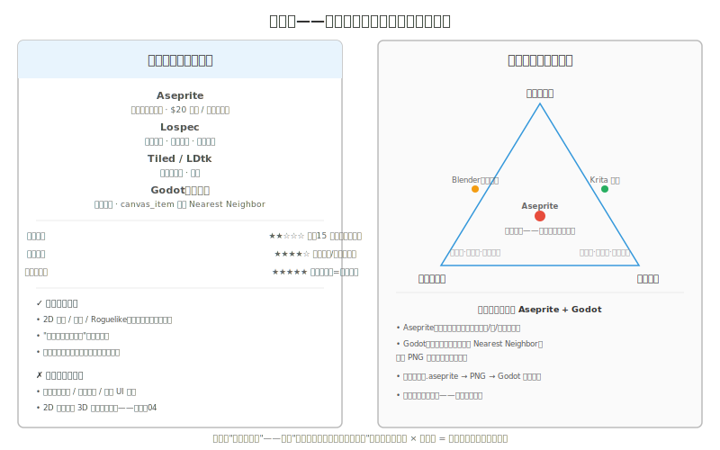
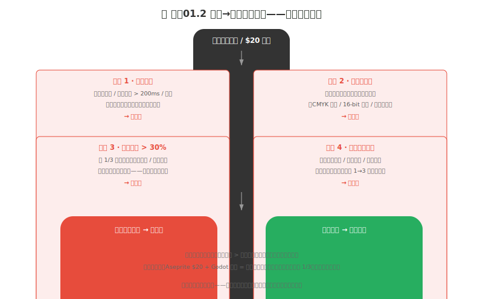
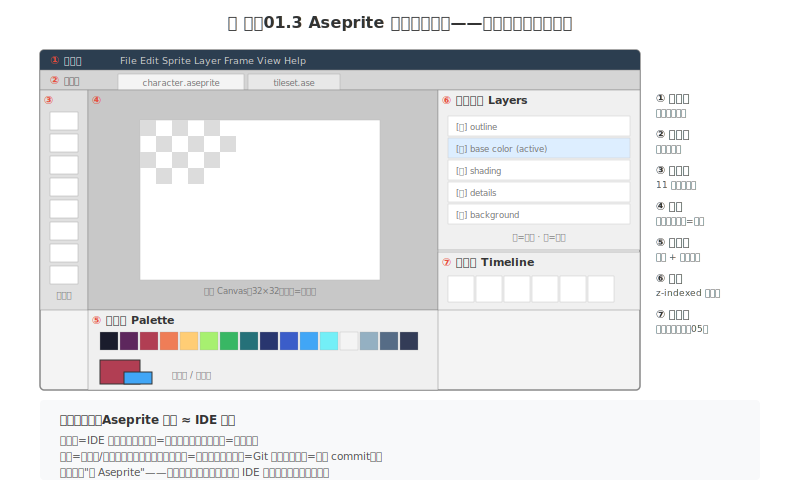

# 制作01 你的工具：Aseprite 与工具逻辑

### 1.0 这一章解决什么问题

第三部结束了。你现在有了一套观察词汇（观察02）、一套分析法（观察03）、一个喂眼睛的习惯（观察04）、一个反馈回路（观察05），还把八概念逐个练过一遍（练手01-09）并选定了自己的像素子风格（风格01-04）。但你练手时用的工具是"whatever 能画像素的东西"——可能是 Aseprite 试用版，可能是 Piskel 网页版，甚至可能是 Photoshop 的铅笔工具。

第四部「制作」要解决的是"从一张素材到一套游戏资产"的工程问题。这时工具不能再含糊：你的生产管线、命名、导出、动画、上引擎——每一步都依赖一个**固定**的工具栈。所以第四部的第一章必须先把"兵器"选定。

书 A 第 15 章《工具选择的底层逻辑》花了几十页论证三原则、对比三大工具栈、给出免费→付费拐点。但本书的定位已经替你做了这个选择：**像素向 + 独立开发者 + 程序员读者 = Aseprite + Godot**。所以这里不展开全文——把它坍缩成一段论证（1.1），压成"为什么这一对就是对的"的三十行，剩下的篇幅全给 Aseprite 实际操作（1.2-1.7）。

**本章核心承诺：** 你能在五分钟内说清"为什么是 Aseprite + Godot 而不是 Photoshop + Unity"——用入门成本/产出效率/天花板三原则论证。你能装好 Aseprite 并认出它的六个界面区域各管什么。你能掌握铅笔、墨线、填色、取色、图层、选区、镜像七个核心操作——并且每个都配一个程序员类比，让你用写代码的直觉驱动它们。你能完成你的第一个 32×32 精灵（七步练习），并存成 `.ase` 与 `.png` 两种格式各用其道。

---

### 1.1 为什么是 Aseprite + Godot：工具选择的工程论证

#### 1.1.1 三原则的不可能三角

选工具不是美术问题——是你和产出效率之间最直接的工程决策。书 A 第 15 章给了一个判断框架：任何工具都用三个指标打分 [^1]：

| 指标 | 定义 | 问自己 |
|------|------|--------|
| **入门成本（Entry Cost）** | 从零到产出第一张可用素材的时间 | "今晚打开，三小时后能不能有一张能用的图？" |
| **产出效率（Throughput）** | 熟练后每单位时间的可用成品数 | "做 10 个角色要多久？100 个呢？" |
| **天花板高度（Ceiling）** | 这套工具的表现力上限 | "1000 小时后能达到什么质量？够我的项目吗？" |

三者构成经典的**不可能三角**——你几乎不可能同时拿到"入门低 + 效率高 + 天花板高"。

> **程序员类比：选工具 ≈ 选编程语言的运行时复杂度。** 你不可能同时要"编译快 + 运行快 + 开发快"——C++ 编译慢运行快，Python 开发快运行慢，Rust 编译慢运行快但开发慢。你选的不是"哪个最快"，是"在我的项目规模上哪个最不慢"。工具同理：你不是在选"最好的绘画软件"，是在选"在我的项目规模和当前技能点上，哪个让我第一个月出东西的概率最高" [^1]。

#### 1.1.2 为什么本书锁定 Aseprite + Godot

第 15 章原本要对比三套工具栈——像素栈、2D 手绘栈、3D 低多边形栈——让你自己选。本书只讲像素，所以后两栈直接降为"继续04 像素之后"的简介。剩下的像素栈就是你的栈：

*图 制作01.1：像素栈（Aseprite + Lospec + Tiled + Godot）与三原则不可能三角。Aseprite 是稀有地"三项全占"的工具——入门低、效率高、天花板极高（像素上限=设计力，不是工具力）。*

- **Aseprite**：售价 $20（有免费试用，源码开放可自行编译 [^2]）。它是**专门为像素艺术写的**精灵编辑器——图层、逐帧动画、调色板管理、Tile 模式、索引色模式，这些操作在 Photoshop 里要绕 5-6 步，在 Aseprite 里是一键原生。PS 能做像素，但 PS 不是为像素做的；Aseprite 的每一行代码都是为像素写的。
- **Godot**：免费、开源、无版税。它的 `canvas_item` 纹理默认 **Nearest Neighbor** 过滤——导入的 PNG 不被抗锯齿平滑，像素边缘保持硬实。这是像素游戏引擎的**第一刚需**，Unity/Unreal 默认 Bilinear 需要手动改。Godot 4 的 `Sprite2D`、`TextureRect` 都对像素有专门开关（制作07 详讲）。

两者之间的管线极短：`.aseprite` → 导出 `PNG` → 拖进 Godot → 上线。没有中间格式地狱，没有订阅锁定，没有"我的 PSD 打不开了"。

#### 1.1.3 一条佐证与一个拐点

> **Respawn 验证：** 《泰坦陨落》《Apex 英雄》的开发商 Respawn 在 2023 年的独立孵化项目里，故意用零成本工具栈（Blender + Krita + GIMP）完成了从概念到导出的全流程视觉生产 [^1]。注意：Respawn 不是没钱——他们是 AAA 预算公司，故意验证免费栈可行。结论：免费/低价工具不是"勉强能用"，是"够独立游戏全流程"。

但这不意味着"永远不升级"。什么时候该从 $20 Aseprite 切到更贵的工具？第 15 章给了四个瓶颈信号：

*图 制作01.2：四个瓶颈信号——任一触发才考虑切付费。判断公式：切付费省下的时间 > 学新工具花的时间。对本书读者，Aseprite $20 + Godot 免费已是像素栈最优解，除非触发信号 1（性能）或 3（机械操作 >30%），否则无需升级。*

切付费的代价不是钱——是**重学一套工具的入门成本**，是你之前积累的快捷键肌肉记忆全部报废。所以默认不切。

> **如果只记住一句话：** Aseprite + Godot 是像素独立开发者在三原则下"最不慢"的解。你现在该做的不是继续研究工具，是打开 Aseprite 开始画。

---

### 1.2 Aseprite 安装与界面

#### 1.2.1 安装

访问 https://www.aseprite.org/ ，**Buy Now** 购买或 **Trial Version** 试用。试用版功能完整，仅不能保存——适合先体验。因为你会在本章就保存第一个精灵，建议直接购入 $20（一次性买断，非订阅）。源码在 GitHub 开放，可自行编译免费使用 [^2]，但编译环境配置的时间成本对初学者不划算——$20 买断是三原则下"入门成本最低"的选择。

#### 1.2.2 界面六区

首次启动，你看到的界面分成六个区域（图 制作01.3）。先认区域，再学操作——像你第一次打开 VS Code，先认出编辑区/侧边栏/终端/命令面板，操作直觉就来了。

*图 制作01.3：Aseprite 界面简化布局。六个区域各管一件事——画布画、工具栏选工具、调色板选色、图层管 z 顺序、标签栏切多画布、菜单栏兜底完整功能。时间轴留到制作05 讲动画时深用。*

1. **菜单栏（Menu）**：File/Edit/Sprite/Layer/Frame/View/Help——完整功能入口。
2. **标签栏（Tabs）**：多个 `.aseprite` 画布之间切换，像 IDE 的标签页。
3. **工具栏（Toolbar）**：左侧竖排 11 个绘图工具图标，部分图标下方隐藏多个工具（如铅笔下有喷枪）。
4. **画布（Canvas）**：你绘制的地方，灰色棋盘格表示透明区域。
5. **调色板（Palette）**：可用颜色的网格，下方是前景色/背景色色块。
6. **图层面板（Layers）**：管理图层可见性、顺序、锁定。

> **程序员类比：** Aseprite 界面 ≈ IDE 布局。菜单栏=IDE 顶部菜单；工具栏=左侧活动工具栏；画布=编辑区；图层=文件树（多文件并行）；调色板=命令面板/快捷键；时间轴=Git 时间线（每帧=一次 commit）。你不需要"学 Aseprite"——把每个区域映射到你熟悉的 IDE 概念，操作直觉就来了。

#### 1.2.3 画布基础操作

**新建：** `File → New`，设宽高。本书建议从 **32×32** 起步——练手01 的贯穿角色就是这个尺寸。**保存：** `Ctrl+S`（macOS `Cmd+S`），**画过程文件用 `.ase`（保图层），成品导出用 `.png`**（无损、被引擎广泛支持）。养成频繁保存的习惯——这是防丢工作的第一道防线。**打开：** `File → Open`。

**缩放与平移：** 鼠标滚轮缩放；数字键 `1-6` 切换缩放级别；`H` 激活手型工具拖拽；中键拖拽临时手型；`Z` 显示缩放选项。**网格：** `Ctrl+'` 显示/隐藏网格（`View → Grid → Grid Settings` 调网格大小，32×32 画布配 8×8 或 16×16 网格合适）。网格帮你精确定位像素——练手01 讲的斜率规则在网格上看得最清楚。

---

### 1.3 硬件选择：鼠标还是数位板

像素艺术对硬件要求极低。普通鼠标完全可以胜任大多数创作：

| 工具 | 优势 | 劣势 |
|------|------|------|
| **鼠标** | 点击精确、适合精修和收尾、便宜 | 手绘长线条较困难 |
| **数位板** | 画线更自然、适合草图阶段 | 精确单击不如鼠标、需适应 |

本书的工作流几乎全是"单像素放置 + 短线段"——鼠标的精确单击优势比数位板的压感优势更重要。如果你只有鼠标，完全够用。如果你已有数位板，草图阶段用板、精修阶段切鼠标，是常见搭配。

> **程序员类比：** 鼠标 vs 数位板 ≈ 键盘 vs 触控板写代码。你能用触控板写代码，但精确光标定位和快捷键组合，键盘永远更快。像素画的"精确单击"就相当于写代码的"精确光标定位"——鼠标（键盘）赢。

决定你作品质量的不是工具，是你在练手01-09 训练出的像素控制力。

---

### 1.4 核心绘图工具——每个工具的程序员类比

这是本章的重头。Aseprite 工具栏的每个工具，在程序员眼里都是一个**底层写操作**。理解了这个映射，你就不需要记"这个工具怎么用"——你知道"它在数据层面做了什么"。

| 工具 | 快捷键 | 程序员类比 |
|------|--------|-----------|
| 铅笔 Pencil | `B` | 单像素 setter：`grid[x][y] = color` |
| 橡皮 Eraser | `E` | 清零：`grid[x][y] = null`（写透明） |
| 油漆桶 Paint Bucket | `G` | flood fill BFS：从种子点扩散到边界 |
| 取色器 Eyedropper | `I` | 读像素值：`color = grid[x][y]` |
| 直线 Line | `L` | Bresenham/DDA 直线算法，一次性写一串 |
| 矩形/椭圆 Shape | （直线工具组下） | 批量填充：矩形=双重循环，椭圆=中点画圆 |

#### 铅笔（B）

最基础的工具。左键单击放一个像素，按住拖拽连续绘制。像素艺术的"画"本质上就是**一格一格往网格里写颜色值**——铅笔是最底层的写操作，所有其他工具都是它的批量封装。

> **程序员类比：** 铅笔 = `grid[x][y] = color`——最底层的单点写操作，像汇编的 `MOV`、C 的指针赋值。你用铅笔时，你就是直接在操作像素内存。练手01 讲的所有斜率规则、锯齿修复，都是"铅笔写出的序列要满足什么约束"。

#### 橡皮（E）

擦除像素。默认 8×8 大小，可在工具选项栏调小到 1×1——像素精修时几乎总是用 1×1。

> **程序员类比：** 橡皮 = `delete grid[x][y]` 或 `grid[x][y] = null`——写一个"透明"值，不是"没操作"。在带图层的文档里，橡皮擦的是当前图层的那一格，不是整张图。

#### 油漆桶（G）

用前景色填充封闭区域。**注意：如果轮廓线有缺口，填充会"溢出"到整个画布**——这是新手最常见的崩溃时刻。填色前先检查轮廓是否闭合（练手01 的轮廓策略在这里见效）。

> **程序员类比：** 油漆桶 = **flood fill BFS**。从你点击的种子点出发，用队列向四邻递归扩散，遇到边界（不同色或轮廓）停止，把所有连通的同色像素改成新色——`O(N)` 时间，N 是连通区域像素数。线条有缺口 = 连通区域漏到外面 = BFS 跑出了你预期的范围。所以"填色溢出"不是 bug，是算法忠实地执行了你的输入。

#### 取色器（I）

点击画布上已有的颜色，把它设为前景色。这是快速取色的利器——画到一半想用画面里某个现成的色，按 `I` 点一下就行，不用回调色板找。

> **程序员类比：** 取色器 = `color = grid[x][y]`——一次纯读操作，把目标格的颜色值赋给前景色变量。零副作用，纯函数。

#### 直线（L）

点击拖拽画直线。按住 `Shift` 锁定为水平或垂直。Aseprite 的直线工具底层跑的是整数网格上的直线光栅化算法——你拖出的端点确定 `(x0,y0)` 和 `(x1,y1)`，工具替你算出中间该点亮哪些像素。

> **程序员类比：** 直线工具 = **Bresenham 直线算法**（练手01 已提过）。它用整数运算在离散网格上选出一条视觉最平滑的路径——每一步在两个候选像素里选误差更小的那个。你拖直线时，工具替你跑了 Bresenham；你手动画斜线时，你得自己用人脑跑 Bresenham（这就是练手01 的斜率规则）。

#### 矩形/椭圆形状

直线工具图标下方隐藏矩形工具组：矩形、填充矩形、椭圆、填充椭圆。按住 `Shift` 画时矩形变正方形、椭圆变正圆。

> **程序员类比：** 矩形 = `for x, for y` 双重循环批量写；填充椭圆 = **中点画圆算法**（Bresenham 的圆形版）。形状工具 = 铅笔的批量封装函数——你本来要一格一格点一百下，现在调一个函数搞定。

---

### 1.5 图层、选区、镜像——三种结构操作

单点写、批量写之外，还有三种"结构级"操作：图层管 z 顺序、选区管作用域、镜像管几何变换。它们对应你写代码时最常用的三种抽象。

#### 1.5.1 图层（Layers）

图层是计算机绘图相对于纸笔的最大优势。把图层想象成叠在一起的透明纸：在不同层上画不同元素，叠加成最终画面。图层面板里：**眼睛图标**切换可见性、**锁图标**防误改、**图层名**默认 "Layer 1"（建议重命名，像变量重命名一样）。

操作：新建 `Shift+N` 或 `Layer → New Layer`；调序在面板里拖拽上下；删除选中后点删除按钮。

> **程序员类比：图层 = z-indexed 的画布栈**，像 Photoshop/GIMP 的图层，也像 CSS 的 `z-index`。每个图层是一个独立 buffer，最终画面是按 z 顺序 alpha 合成的。眼睛图标 = `display: none`；锁图标 = `readonly`；调序 = 改 `z-index` 值。新建图层 = 新建一个变量，避免污染原 buffer。

**实际应用：** 给一个角色设计多套服装——身体画一层，每套服装各画一层，换装时切服装层可见性即可，无需重画整个角色。这相当于"用配置切换皮肤"而不是"复制粘贴整份代码"。

> **保存陷阱：** 工作过程存 `.ase`（Aseprite 原生格式，保图层）；成品导出 `.png`（会合并所有图层）。**不要把过程文件存成 PNG**——下次打开图层全没了，像把带注释的源码存成了压缩混淆版。

#### 1.5.2 选区（Selection）

**矩形选区 `M`** 选一块矩形区域，可移动、复制、变换。选区边缘有白色方块，拖拽可调形状。圆形选区在同组工具下。基本编辑：撤销 `Ctrl+Z`、重做 `Ctrl+Y`、剪切 `Ctrl+X`、复制 `Ctrl+C`、粘贴 `Ctrl+V`。

> **程序员类比：选区 = mask 矩阵**，定义后续操作的作用域——一个布尔二维数组 `selected[x][y]`，只对 true 的格子生效。这像 SQL 的 `WHERE` 子句限定 `UPDATE` 的范围：没有选区时操作作用于全画布，有选区时只作用于选区内。复制粘贴 = 把选区 buffer 存到剪贴板再写回新位置。

#### 1.5.3 镜像翻转（Mirror/Flip）

对称图形（角色、敌人）只需画一半，复制并水平翻转得另一半。步骤：矩形选区选中半侧 → `Ctrl+C` 复制 → `Ctrl+V` 粘贴 → 拖到对称位置 → `Edit → Flip Horizontal`（或 `Shift+H`）水平翻转。

> **程序员类比：镜像 = 几何变换矩阵 `(sx, sy) = (±1, ±1)`**。水平翻转 = `x' = -x`（关于纵轴反射），垂直翻转 = `y' = -y`。对称绘制 = 同时写原图和变换后的副本——你画左半，工具/复制翻转帮你写右半 `grid[W-x][y] = grid[x][y]`。练手01 讲过"善用复制翻转"画对称曲线——这是它的工具实现。

---

### 1.6 颜色与调色板

调色板区域：左键点一种颜色设为**前景色**（绘制时用的色），右键设为**背景色**。两个色块显示在窗口左下角，点开有更精确的颜色选择器。

> **程序员类比：调色板 = 枚举常量库**。像素值在 Aseprite 里可以是**索引**（指向调色板第几号色）而非直接 RGB——像 8-bit 索引色（GIF/PNG8 的调色板模式）。改调色板第 5 号色的 RGB，所有用第 5 号的像素一起变——这就是 **palette swap**（换色即新怪）的原理，风格01 讲过的像素换色优势落地在这里。

调色板管理的完整策略（选哪套固定板、Lospec 怎么导入、色数决策）在**练手05（色彩）**和**风格02（分辨率与调色板决策）**深讲。本章你只需要会用左/右键选色、会用取色器 `I` 抓现成色——够画第一个精灵了。

---

### 1.7 快捷键与上手行动

#### 1.7.1 这里只提几个关键快捷键

完整速查表见**附录G Aseprite 快捷键**——这里只列你现在就该肌肉记忆的几个：

| 操作 | 快捷键 |
|------|--------|
| 铅笔 / 橡皮 / 油漆桶 / 取色器 / 直线 / 矩形选区 | `B` / `E` / `G` / `I` / `L` / `M` |
| 保存 / 撤销 / 重做 | `Ctrl+S` / `Ctrl+Z` / `Ctrl+Y` |
| 新建图层 | `Shift+N` |
| 水平翻转选区 | `Shift+H` |
| 显示网格 / 手型 / 缩放选项 | `Ctrl+'` / `H` / `Z` |
| 缩放级别 | 数字 `1-6` |

其余的（剪切/复制/粘贴、喷枪、椭圆、魔棒、时间轴操作等）随用随查附录G——不要一开始就背全表，背了也忘。先用这十几个把第一个精灵画出来，肌肉记忆自然会要更多。

#### 1.7.2 上手行动：你的第一个精灵（七步）

这是书 B 第 1 章的入门练习，按本书的 L1/L2/L3 分级改写。**L1 是你今天必须完成的**，L2/L3 是加码。

**L1 · 七步出第一个精灵（30-60 分钟）**

1. 新建一个 **32×32** 画布（与练手01 贯穿角色同尺寸）。
2. 用铅笔 `B` 画一个简单图形——星星或心形起步，别上来就画角色。
3. 用油漆桶 `G` 填色（填之前检查轮廓闭合，防 1.4 讲的溢出）。
4. 用取色器 `I` 抓画面里已有的色来修改细节——不要回调色板，练就地取色。
5. `Shift+N` 新建图层，在新层上加 2-3 处细节（高光、点缀）——练图层叠加。
6. 用矩形选区 `M` 选中一部分，`Ctrl+C`/`Ctrl+V` 移动到新位置——练选区。
7. 存 `.ase`（保图层），再 `File → Export` 另存 `.png`（成品）。

**合格标准：** 一个 32×32 的 PNG，能在文件管理器预览里认出你画的是什么；`.ase` 重新打开图层还在。

**L2 · 镜像对称（加 15 分钟）**

在 L1 基础上，画一半图形（半颗星/半颗心），用 1.5.3 的镜像翻转补另一半——验证对称绘制比两边分别画更快更准。

**L3 · 落到贯穿角色（30-60 分钟）**

如果你还没开始练手01 的贯穿角色——现在开始。新建 32×32，用铅笔落轮廓骨架，存成 `character-v01-outline.ase`。这个文件会在练手05 上色、制作02 做成完整可导入引擎的角色。如果你已经在练手01 画了——跳过 L3，直接进制作02。

> **程序员类比：** 这七步相当于你第一次 clone 一个新项目后的 "make it run"——不求理解每一行，先让它跑起来。跑起来之后，每个区域、每个工具才会从"界面上的图标"变成"你会用的功能"。

---

### 1.8 常见踩坑

**踩坑一：过程文件存成 PNG，图层全丢。** PNG 会合并所有图层。下次打开只有一个扁平层，没法再单独改服装层/细节层。**解法：** 工作过程一律 `.ase`，只在成品定稿时导出 `.png`。把 `.ase` 当源码、`.png` 当编译产物。

**踩坑二：油漆桶一填满全画布。** 轮廓线有 1 像素缺口，BFS 从缺口漏出去跑了整张图。**解法：** 填色前放大检查轮廓闭合；填完后 `Ctrl+Z` 撤销，补好缺口再填。练手01 的轮廓策略直接决定这里会不会漏。

**踩坑三：选区移动后原位置留空白。** 矩形选区拖拽移动默认是"剪切移动"——原位置清空。**解法：** 想要"复制移动"先 `Ctrl+C` 再 `Ctrl+V` 粘贴移动；想要"留原位"用 `Ctrl+Alt` 拖拽（参见附录G 的 M 键工具变体）。

**踩坑四：缩放后像素糊了。** 在 Aseprite 里用非整数缩放（如 150%）看画布，像素边缘会被软件抗锯齿柔化——但这只是**显示**问题，数据没坏。**解法：** 永远用数字键 `1-6` 的整数倍缩放看画布。真正的"糊"发生在引擎里——那才是制作07 要解决的 Nearest Neighbor 问题。

---

### 1.9 检查点

1. **我能用三原则说清为什么是 Aseprite + Godot 吗？**（入门低×效率高×天花板高，且 Godot 默认 NN。）
2. **Aseprite 装好了吗？** 试用版或 $20 买断都行——能保存即可。
3. **我能指出界面六区各管什么吗？** 菜单/标签/工具栏/画布/调色板/图层（图 制作01.3）。
4. **每个核心工具我都能说出程序员类比吗？** 铅笔=setter、油漆桶=flood fill、直线=Bresenham、图层=z-index、选区=WHERE、镜像=变换矩阵、调色板=索引色。
5. **我的第一个 32×32 精灵画出来了吗？** 存了 `.ase` 和 `.png` 两份。
6. **我知道过程用 `.ase`、成品用 `.png` 吗？**（踩坑一。）
7. **我知道完整快捷键在附录G 吗？** 不背全表，先用本章这十几个。

---

### 1.10 本章小结

入门成本/产出效率/天花板三原则的不可能三角下，Aseprite + Godot 是像素独立开发者"最不慢"的解——Aseprite 三项全占、Godot 默认 Nearest Neighbor 管线最短。剩下的篇幅全给了 Aseprite 操作：六个界面区域、七个核心工具——每个都映射到一个你熟悉的编程概念（单像素 setter、flood fill BFS、Bresenham 直线、z-indexed 画布栈、mask/SQL WHERE、几何变换矩阵、索引色调色板）。

你不需要"学 Aseprite"——你需要的是把每个工具翻译成你写代码时的底层操作，然后用程序员的直觉驱动它。你的第一个 32×32 精灵已经在 L1 出来了；贯穿角色的轮廓也落到了 `.ase` 里。下一章制作02 就从这个轮廓出发，走完整的像素角色工作流。

> **如果只记住一句话：** Aseprite 的每个工具都是你已知的某个编程概念——铅笔是单像素 setter，图层是 z-index，选区是 WHERE 子句。用写代码的直觉画画，不用"艺术家的手感"。

---

### 1.11 扩展阅读

1. **[Aseprite 官方文档 — Tutorials](https://www.aseprite.org/docs/)** — Getting Started / Animation / Export 三个教程覆盖 90% 日常操作。**为什么推荐：** 选了像素栈，这是你第一个要通读的文档——不是"需要时再查"，是前三个教程必须一次性学完。
2. **附录G Aseprite 快捷键** — 完整速查表。**为什么推荐：** 本章只给了十几个核心键，剩下的随用随查这里。
3. **[Lospec — Palette List](https://lospec.com/palette-list)** — 像素调色板库，一键导入 Aseprite。**为什么推荐：** 1.6 讲的"调色板=索引色枚举"，选哪套板在练手05/风格02 决策，这里先浏览理解逻辑。
4. **[Godot 官方文档 — 2D](https://docs.godotengine.org/)** — Godot 的 2D/像素渲染设置。**为什么推荐：** 1.1 提到的 Nearest Neighbor 默认、`canvas_item` 纹理设置，在制作07 上引擎时深用；现在先知道 Godot 对像素友好即可。
5. **练手01《线条》** — 本章铅笔/直线工具的斜率规则与锯齿修复都来自练手01。**为什么推荐：** 工具会用了，画出来的线平不平顺取决于练手01 的训练。
6. **书 A 第 15 章《工具选择的底层逻辑》** — 本章 1.1 坍缩的完整原版。**为什么推荐：** 如果你将来要做非像素项目（继续04），第 15 章的三大工具栈对比与免费→付费四信号是完整的决策框架。

---

### 1.12 本章引注

[^1] 书 A 第 15 章《工具选择的底层逻辑》——三原则（入门成本/产出效率/天花板）、不可能三角、编程语言运行时类比、三大工具栈对比、Respawn 零成本工具栈验证、免费→付费四信号。本章 1.1 是它的精简重定向版（删去 2D 手绘栈与 3D 低模栈，降为继续04）。

[^2] Aseprite 官方文档与 GitHub 源码. https://www.aseprite.org/docs/ — Aseprite 付费 $20 一次性买断，源代码在 GitHub 开放（GPL），可自行编译免费使用。包含完整功能列表、脚本 API 与社区脚本库。

---

> **下一章：制作02 像素角色工作流。** 工具到位了——现在从练手01 落下的那个角色轮廓出发，走完整的"草图 → 像素 → 平衡 → 边缘 → 上色 → 导出"管线，把 `.ase` 变成能拖进 Godot 的活物。
