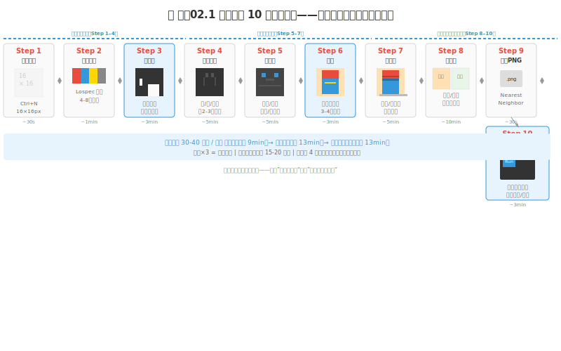
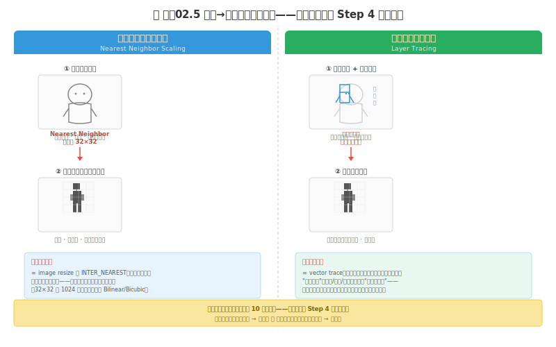
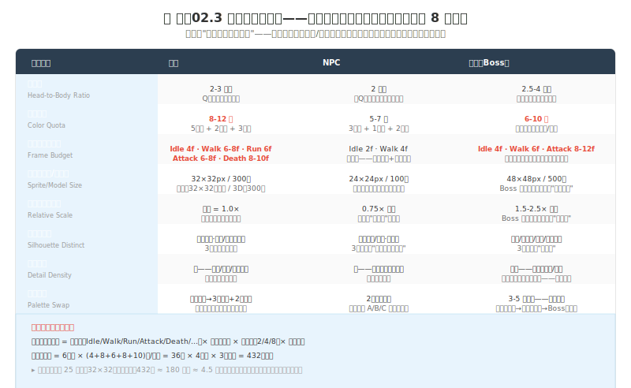
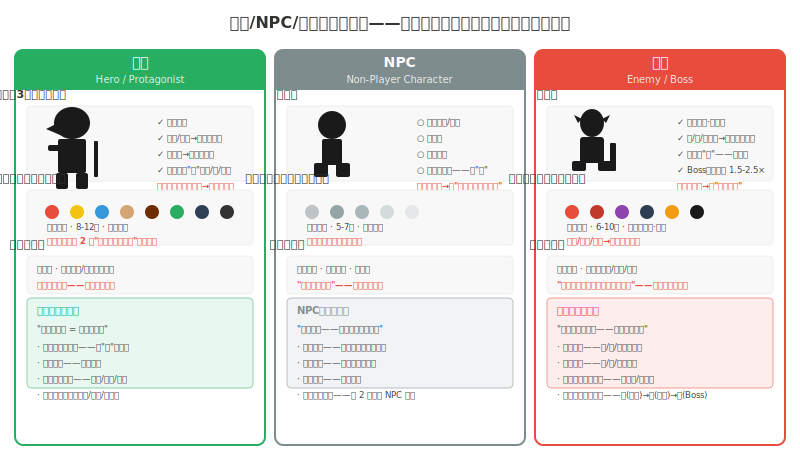

# 制作02 像素角色工作流：从概念到活物

### 2.0 这一章解决什么问题

第四部第一章（制作01）你把兵器选定——Aseprite 装好、七个核心工具各映射到一个编程概念、第一个 32×32 精灵跑通。但那个精灵是"练手用的一次性产物"，不是"能拖进 Godot 跑起来的游戏资产"。这一章解决的是**从一个 `.ase` 文件到一套可导入引擎的角色资产**的完整工作流——而且它要收口一个从练手01 起就在长大的贯穿角色项目。

更重要的是：这一章是**贯穿角色项目的终点站**。练手01 你起了 `character-v01-outline.aseprite` 的轮廓骨架；练手02 长体积存 `v02-volume`；练手04 重打光存 `v03-value`；练手05 上色存 `v04-color`；练手06 加质感存 `v05-texture`；练手07 定动作线存 `v06-pose`；练手08 做 AA 打磨存 `v07-aa`（外加一个等距版 `v07-iso`）。七个版本迭代下来，你的角色已经在线条、体积、明度、色彩、质感、构图、像素质检七层各过了一遍——但它们都是"练习态"，还没走完"变体 → 导出 PNG → 引擎验证"这最后一段。本章 L1 把 `v07-aa` 接进来，跑完 10 步管线的最后三步，存成 `character-final.aseprite` + `character-final.png`——你的第一个引擎就绪角色资产。

> **"Pixels are negotiated, not drawn."** —— JSLegendDev [^1]

这句话是像素艺术最重要的认知更新。16×16 画布只有 256 个像素——每一个像素都要"挣"它的位置。你不能随手画一笔然后擦掉，每一笔都在占据空间、消耗色数、改变辨识度。像素艺术的核心不是"画画"，是**在极端约束下的设计谈判**——你和有限空间谈判、和有限色数谈判、和硬边缘做不了渐变这个物理事实谈判。这和写嵌入式代码一样——你只有 2KB RAM，每个变量都在"挣"内存位置。

**本章核心承诺：** 你能跑完一条 10 步的像素角色管线——从新建画布到引擎验证，每步输出明确、失败可回退。你能说清"四层楼方法"如何嵌进这条管线的第 3-6 步——剪影/结构/细节/色彩四层各有检验标准，不过关不上楼。你能用"草图优先"作为另一条入口路径——最近邻缩放或图层描摹把高分辨率草图转成像素，再接回管线第 4 步。你能填完一张 8 维角色规格表，并据此把主角/NPC/敌人在剪影/色板/细节三个维度上拉开。你会做水平翻转平衡检查、边缘细化、昼夜调色板替换这三件收尾工序。最后，你的贯穿角色从 `v01-outline` 走到 `character-final.png`——一个能拖进 Godot 的活物。

---

### 2.1 程序员视角：10 步管线是角色的 CI/CD

下面这条 10 步管线是像素角色制作的完整生产线。每一步都有明确的输入、操作和可验证的输出——不存在"差不多"的中间状态。你可以把每一步当作一个 commit，失败了回退到上一步即可。

> **程序员类比：10 步管线 ≈ 一条 CI/CD 流水线。** Step 1-4 是 build（构建剪影和结构），Step 5-7 是 test（着色验证），Step 8-10 是 deploy（变体 + 导出 + 引擎部署）。每步失败就回退——像素是不可逆的，一步改坏经常要回退三层。这和写代码一样——有 git 时你不会一口气改 500 行，有图层时你也不应该一口气删掉所有历史状态。

这条管线的第 3-6 步同时是**四层楼方法**的落点——"剪影 → 内部结构 → 细节 → 色彩"逐层可验证流程，本质上就是管线 build 阶段的内部质检。两者不是两套流程，是同一套流程的两个抽象层级：10 步是**操作序列**（你在 Aseprite 里点啥），四层楼是**验收序列**（每步做完该过什么检查）。把它们重叠看，你就不会在没验证剪影辨识度时跳去画面部细节——那等于在没编译通过的代码上加注释。

*图 制作02.1：像素角色 10 步操作流程。阶段一（结构，Step 1-4）≈ build；阶段二（着色，Step 5-7）≈ test；阶段三（导出验证，Step 8-10）≈ deploy。第 3-6 步同时是四层楼方法的落点——每层有自己的检验门。*

#### Step 1-2：建场与锁色板（基础设施层）

**Step 1 新建画布。** Aseprite `Ctrl+N`，尺寸 16×16 或 32×32（贯穿角色用 32×32）。颜色模式选 Indexed Color——索引色把调色板锁成一组有限颜色，每个像素只能从色板取值，你不会意外画出"色板外的颜色"。新手可先用 RGB + 自觉锁色板，熟悉后再开 Indexed 强约束。

**Step 2 锁定色板。** 去 Lospec（lospec.com/palette-list）找一个 4-8 色调色板。新手推荐 PICO-8（16 色，工业验证极好）或 AAP-64（64 色，过渡丰富）。Lospec 页面点 "Download .aseprite"，文件自动导入 Aseprite 色板面板。第一步操作是**把色板外的颜色清空**——心理上接受"这就是我的全部颜色"。

> **程序员类比：锁色板 = 锁定 enum 的取值集合。** 索引色模式下，色板就是你的 `enum Palette { SKIN, HAIR, ARMOR, ... }`，每个像素存的是一个 enum 值不是 RGB 三元组。色板外取色 = 编译错误。这层强约束是"少即是多"能落地的工程保障——练手05 讲过少色原则是最小权限，这里把它焊死在工具层。

#### Step 3：画剪影 = 四层楼第一层（辨识度测试）

选色板中最深的颜色（不是纯黑——用深棕/深蓝代替，让阴影有温度），用铅笔 `B` 画角色的纯色剪影——不画内部、不画细节，只看轮廓。画完做剪影测试：Aseprite "视图 → 填充遮罩"把角色全填黑，缩到游戏实际尺寸（2× 或 3×），问自己：**还能认出这是个角色吗？是主角、敌人还是 NPC？**

这是四层楼方法的**第一层·剪影（Silhouette）**——唯一检验标准是 3 米外（或眯眼模糊后）能区分主角/敌人/NPC。主角剪影最复杂（武器/披风/帽子构成外轮廓的"破"），敌人最尖锐（角/刺/利刃），NPC 最简单（圆头 + 简单身体，"不抢镜"）。这一层不过关，后面所有细节都是无意义的——像在语法错误的代码上加注释。

> **程序员类比：剪影测试 ≈ 编译器的语法检查。** 编译通过（剪影可识别）不代表程序正确（角色好看），但编译不通过（剪影不可识别）时后面所有操作都无意义。

#### Step 4：加内部结构 = 四层楼第二层（比例与解剖）

用比剪影亮 1-2 级的颜色，在剪影内部画**构造线**——不是细节，是身体大区域分界：眼睛在头上的位置（Q 版和像素角色在头部中线或以下，不是写实人体的上三分之一）、肩宽（约 1.5-2 头宽）、髋部位置、四肢分段、关节转折点（肩/肘/腕/髋/膝/踝）。目标是缩到 8×8 仍能看出基本结构。

这是四层楼**第二层·内部结构（Internal Structure）**——检验头身比、关节位置、空间关系是否正确。比例错误在视觉上**立刻被感知**——一只手臂比另一只长 3 像素，玩家看到的不是"3 像素偏差"，是"这角色哪不对"。人类大脑对面部和身体比例的识别是极快且无意识的。

> **程序员类比：内部结构 ≈ 软件分层架构里的数据模型层。** 你不会在没定义好 API 接口的模块上写实现——接口改动会让所有实现作废。同样，你不会在没验证比例的角色上画面部细节——比例改了，所有细节位置全部要重调。先定义接口（剪影），再写数据模型（结构），顺序不可逆。

#### Step 5：加细节 = 四层楼第三层（纹理、装备、特征）

用更亮的颜色加"让这个角色成为这个角色"的元素——眼睛形状（不是两个黑圆，是上睫毛弧度和眼角角度）、发型走向、衣领/袖口/下摆、盔甲铆钉、武器刃纹、疤痕/饰品。细节按视觉重要性分配：**面部 > 上半身 > 下半身；武器 > 服装；永远被看到的正面 > 偶尔被看到的背面**。在 16×16 上 1 像素 = 6.25% 画布宽，一个"小饰品"至少占 2-3 像素才看得见。原则：**细节不是越多越好，是刚好够辨识**——加细节前先问"这细节在游戏缩放尺寸下能被看到吗"，不能就不画。

这是四层楼**第三层·细节（Details）**——检验细节密度是否与同层级其他角色一致、信息最丰富区是否在面部和手、去掉最大特征后是否仍有辨识度、1× 分辨率下细节是否可见。

#### Step 6：着色 = 四层楼第四层（确定、约束、协调）

从色板选皮肤色（1-2 色）、服装主色（1-2 色）、装饰色（1 色），用油漆桶 `G` 逐区域填充。颜色数 ≤ 色板色数；超过 5 色考虑合并两个。这是四层楼**第四层·色彩（Color）**——四条核心规则：

- **5 主色原则**：皮肤/头发/上衣/下装/鞋五个主色区占视觉面积 80%+，强调色（红围巾/金勋章）不超过 2 个。
- **明度三步**：至少 3 个明度层（亮/中/暗）。没有亮色——暗背景中消失；没有暗色——亮背景中消失；没有中间色——角色"发平"。
- **色板不冲突**：主角的"身份红"不能出现在任何 NPC/敌人身上——你用颜色传递"归类"，玩家视觉上学习了这个归类，混淆归类 = bug。
- **多背景可辨**：把角色放森林（绿）/沙漠（黄棕）/雪地（白）/洞穴（黑灰）/UI（半透明）五种背景前，都要清晰可见；沙漠里棕色角色"隐形"了就补一个跳出背景的强调色。

> **程序员类比：第四层 ≈ UI 渲染层。** 前三层是接口/数据/业务逻辑，第四层把它们渲染成用户能看到的画面。5 主色 = 主题色变量；明度三步 = 对比度无障碍标准；色板不冲突 = 命名空间隔离，身份色是主角的私有命名空间；多背景可辨 = 跨浏览器/跨主题兼容性测试。

#### Step 7：加阴影（明度三步落地）

定光源方向——第一个角色用"顶前光"最通用。在暗面（光从右上时是下边缘和左边缘）用各区域暗色替换像素。三层阴影：**自投影**（头在身体上的投影，颈部下方 1-2 像素暗皮肤色）、**体量阴影**（身体侧面变暗，左边缘 1-2 列暗服装色）、**地面投影**（脚底 2-3 像素宽椭圆，角色"站在地面"的唯一视觉信号）。这一步是练手04 明度骨架在角色上的最终落地——去色后角色该有亮/中/暗三层分明。

#### Step 8-10：变体、导出、引擎验证（deploy 阶段）

**Step 8 做变体。** Aseprite 时间轴 `Alt+N` 新建帧：换色变体（红→蓝生成敌人/NPC）、朝向变体（侧视图/后视图，后视图最简单——只留剪影去面部）、动作变体（第二动作帧，详见制作05）。至少 1 个变体。换色变体直接对接 2.6 的昼夜调色板替换。

**Step 9 导出 PNG。** `Ctrl+Alt+Shift+S`。缩放设整数倍（3× → 48×48，4× → 64×64），缩放算法必为 **Nearest Neighbor**——绝不用 Bilinear/Bicubic，它们制造模糊混叠。格式 PNG（支持索引色 + 透明通道）。**绝对不用 2.5×/3.7× 非整数缩放**——像素在非整数缩放下无法均匀分配，会产生摩尔纹锯齿。

**Step 10 引擎验证。** 把 PNG 拖进 Godot 项目。选中 PNG → Import 面板 → Filter 设 "Nearest"，禁用 Mipmaps；Project Settings → Rendering → Textures → Default Texture Filter 设 "Nearest"（全局）。把角色放进场景和背景 tileset 对比——清晰可辨？颜色冲突？过于模糊就关纹理压缩，像素艺术承受不了 JPEG/DXT 压缩的损失。截一张图放大 400%——边缘是锐利方块就对了，是模糊过渡色就去改设置。导出与引擎适配的完整技术栈在**制作07（上引擎）**深讲，这里只过最短路径。

---

### 2.2 两条入口路径：剪影优先 vs 草图优先

2.1 的管线是"剪影优先"——Step 3 直接在像素网格上画纯黑剪影。这是像素艺术最正统的入口，因为它从一开始就在约束里工作。但它不是唯一入口。如果你已经有了一张参考草图（纸上画的、数位板画的、找来的参考图），你可以走"草图优先"路径——先把草图转成像素，再从 Step 4 接回管线。下面讲两种转换法。

*图 制作02.5：草图 → 像素的两种转换法。左：最近邻缩放——把草图降采样到目标像素尺寸，每个像素取最近源像素颜色。右：图层描摹——草图留底层，上层手动描线，完成后隐藏草图层。两种都从 Step 4 接回管线。*

**方法一：最近邻缩放。** 把草图缩放到目标像素尺寸（如 32×32），缩放算法选 Nearest Neighbor 保持硬边，然后在新尺寸上手工清理——把模糊的色块修成明确的像素决策。

> **程序员类比：最近邻缩放 = 图像缩略图算法里的最近邻插值。** 它把高分辨率草图降采样到像素网格，每个输出像素取最近源像素的颜色——不混合、不平均。这和你写代码做 image resize 时选 `INTER_NEAREST` 一个道理。注意：缩放后必然丢信息（32×32 只有 1024 像素，原图可能几十万像素），所以缩放只是起手，后面清理才是真活。**绝不用 Bilinear/Bicubic 缩放**——它们会平均出"色板外的中间色"，污染你的索引色约束。

**方法二：图层描摹。** 草图放底层（调低透明度），上层新建图层手动描线——沿着草图的轮廓一格一格落像素。完成后隐藏草图层，就像把描图纸变回普通纸。这个方法保留草图构图，换掉分辨率。

> **程序员类比：图层描摹 = vector trace（位图转矢量）的手动版。** 你保留草图的"路径数据"（构图/比例/姿态），换掉它的"渲染分辨率"——从连续笔触重采样成离散像素。描摹法比缩放法慢，但保留了你对每个像素的决策权——管线第 3 步"每个像素都要挣位置"的谈判从这一刻就开始。

两条路径怎么选？草图细节多、想保留构图 → 描摹法。草图只是粗略示意、想快速起型 → 缩放法。无论哪条，转完后都回到 Step 4 加内部结构——剪影已在草图转换中成型，你要验的是它的辨识度（四层楼第一层检验标准）。

#### 参考：连有经验的艺术家都用参考

别凭记忆画——你以为你知道苹果长什么样，但只有真正观察过才能画出足够多细节。参考素材来源：拍摄真实物体照片、收集你喜欢的游戏截图、Pinterest 建灵感板。对于复杂透视和光影，可以用 Blender 建简单白模，缩到像素尺寸当参考——一些游戏直接用缩小的 3D 模型做像素画基础。

> **程序员类比：3D 白模 = 占位 mock / stub。** 先搭个能任意旋转、打光、定视角的光影参考骨架，再手绘像素覆盖它——等于先写 stub 验证接口契约，再填实现。Dead Cells 就是用 3D 动画渲染成 2D 帧再手工像素化，这是制作06（非手绘管线）的主题。

#### 水平翻转平衡检查

创作过程中频繁水平翻转图像（Aseprite `Edit → Flip Horizontal`），能发现之前没注意到的平衡问题——一个看起来"还行"的角色翻转后可能明显向右倾斜。大脑对镜像更敏感——你盯着原图看久了会习惯它的不对称，翻转等于换一双眼睛。

> **程序员类比：水平翻转 = 代码 review 换个角度找不对称的 bug。** 你写完一段代码自己看三遍都看不出 off-by-one，让同事一眼看穿——翻转就是把"同事"请进来。大脑对熟悉的东西会自动脑补补全，对镜像没有这个补全，所以瑕疵暴露。每画 10-15 分钟翻转一次，是像素角色的"持续集成检查"。

---

### 2.3 角色规格表：8 维角色世界宪法

在画第一个角色的第一笔之前，你需要填完一张 8 维规格表——这不是"画着画着就知道了"，是在启动画之前就锁定的约束。否则你的第 1 个角色和第 12 个角色会在不同的宇宙中。

*图 制作02.3：角色规格表（Character Spec Sheet）——8 个维度 × 主角/NPC/敌人三列。帧预算那一行是"我能在截止日期前做完所有角色的所有动画吗"的核算基础。*

八维速览：

1. **头身比（Head-to-Body）**：2-3 头身最常见（Q 版可爱、易动画）。越小的头身比 = 身体越少像素 = 动画越快。是工程决策不是审美偏好。
2. **颜色配额（Color Quota）**：主角 8-12 色，NPC 5-7 色，敌人 6-10 色（强调色集中在武器/眼睛）。
3. **帧预算（Frame Budget）**：主角 Idle 4f + Walk 6-8f + Attack 6-8f + Death 8-10f ≈ 43-52 帧/方向。NPC 仅 Idle 2f + Walk 4f = 6 帧。**这个数必须在项目前锁定**——它是你算"432 帧 × 25 分钟/帧 ≈ 180 工时 ≈ 4.5 周全职"的基础。
4. **尺寸（Size）**：主角 32×32px，NPC 24×24，Boss 48×48。**项目中期改尺寸 = 重画一切**——碰撞框、动画帧、相对比例全部重做，这是像素游戏最严重级别的返工。
5. **相对比例（Relative Scale）**：主角 = 1.0×，NPC = 0.75-0.9×，小怪 = 0.6-1.0×，Boss = 1.5-2.5×。更大的东西 = 更大威胁，玩家视觉系统 0.2 秒内完成评估。
6. **剪影区分度（Silhouette Distinctness）**：量化"3 米测试"——剪影纯黑填充，退后 3 米或极度模糊，能否分清主角/敌人/NPC。
7. **细节密度（Detail Density）**：主角高（面部/服装/武器可见），NPC 低（纯色块面），敌人中高但集中在威胁区（眼睛/爪牙/刀刃）。给 NPC 鞋子画 20 分钟 = 浪费在玩家永远不会看的地方。
8. **换色方案（Palette Swap）**：独立游戏最大的生产力杠杆——一个敌人换 3-4 个颜色变 3-5 个"不同的"敌人（绿小怪/蓝精英/红 Boss），同帧同剪影同结构只换色。主角的核心识别色（红围巾）不该被覆盖——它是玩家识别"这是主角"的视觉锚点。

> **程序员类比：规格表 = 项目的接口契约 / 类型定义文件。** 它不是"一个角色长什么样"，是"所有角色共同遵循的规则"——`interface CharacterSpec { ratio: 2.5; colorQuota: 8; frameBudget: 52; ... }`。第一个角色是这份接口的实现 A，第十二个是实现 L，它们都满足同一份契约，所以才能放进同一个角色系统。没有契约 = 每个角色都是 ad-hoc 的 any 类型 = 一致性审计（制作09）必然失败。

---

### 2.4 主角/NPC/敌人的三层分化

规格表给的是数值约束，三层分化给的是**视觉层级策略**——让你的眼睛在第一秒被主角吸引，然后中景敌人，然后背景 NPC。这个吸引力不是随机的，是"复杂度"产生的。

*图 制作02.4：三层区分——在剪影/色板/细节密度三个维度上同步拉开主角、NPC、敌人。不是"画得不一样"，是"被视觉系统在不同处理速度上识别"（剪影 0.1 秒、色板 0.2 秒、细节 0.5 秒）。*

- **剪影层（0.1 秒，最快）**：主角最复杂（武器/披风/帽子，外轮廓"破"最多），NPC 最简单（圆头 + 简单身体，光滑不抢镜），敌人最尖锐（角/刺/利刃，指向性进攻性）。
- **色板层（0.2 秒）**：主角鲜艳高饱和 + 身份色，NPC 中性低饱和"背景的一部分"，敌人危险色系（红/紫/黑）触发本能威胁感。
- **细节密度层（0.5 秒，最慢但信息最丰富）**：主角高细节（玩家注视最久，回报视觉信息），NPC 中低纯色块面，敌人中高但**不对称集中**在威胁区（眼睛/武器高细节，身体低细节）——引导玩家注意力到威胁位置。

**总原则：不要只在一个维度上区分。** 只在剪影区分？远距离行，近距离失效。只在颜色区分？色盲玩家或不同显示器分不清。只在细节区分？快速动作时细节不可见。三个维度同步拉开，才能在所有距离、所有速度、所有色觉条件下保持层级清晰。

---

### 2.5 极简表达：最少像素传达最大情绪

"极简"不是"画得少"——是"画得每一点都是信息"。每个像素、每条线、每个色块都有它的"信息职责"。一个像素没有职责就删掉它，一条线没有结构职责就删掉它，一个颜色没有归类或引导职责就合并它。三条原则：

**原则一：一个元素，一种信息。** 别让一个元素承担两种以上信息。角色的眼睛同时表达"方向"（瞳孔左右移）和"情绪"（眉毛角度）——这两个信息在 4×4 像素区域里打架。解法是用不同信息通道：方向用身体朝向（整个身体的朝向比眼睛朝向在低分辨率下更可读），情绪用姿态（肩的倾斜、头的倾斜、手的开合）。不要把所有情感负载塞进一张 16×16 的脸——它承受不了这个信息密度。

**原则二：差异放大。** 极简角色表达不同状态时，需要的不是"微小调整"而是"夸张差异"。"站立"和"吃惊"的差异可能只有 4-5 个像素（眼睛放大 1、嘴张开 1、身体后仰 2）——这 5 个像素在玩家快速扫过时不可读。解法：放大差异——眼睛放大 2 像素，身体后仰 3 像素再加"向后退半步"的脚部位移。"吃惊"的整个身体姿态在 1× 分辨率下必须被感知到。

**原则三：表达层级分离。** 角色视觉信息有三层：常驻层（基本形状/核心颜色，任何状态不变）、状态层（Idle/Walk/Attack/Hurt/Death 各有独特姿态）、情绪层（开心/悲伤/愤怒，在微表情和姿态微调中表达）。独立游戏通常合并状态层和情绪层——你没有足够帧预算做独立两层。"愤怒地行走"= 行走状态 + 愤怒情绪，把愤怒编码在行走姿态里（更重脚步、更低重心、更快节奏），而不是面部（面部可能根本不可见）。

表情按预算分四级：**姿态表情**（极低分辨率，身体代替面部说话）→ **图标表情**（头顶 ! / 愤怒符号 / 爱心，高效但破沉浸）→ **关键帧表情**（4 个关键脸：普通/开心/愤怒/悲伤，瞬切不渐变，32×32+ 可行）→ **微表情**（64×64+，眉毛上移 2 像素=惊讶，嘴角下移 2=悲伤）。你的贯穿角色是 32×32，关键帧表情是甜点区。

---

### 2.6 边缘、立绘与昼夜调色板

**边缘细化。** 角色轮廓画完后做一次边缘质检——练手08 讲过抗锯齿（AA）和 Banding 清理，这里是它在角色资产上的最后一道工序。清除轮廓上所有锯齿，让转角柔和但不模糊。可选双线风格制造对比：外轮廓用粗线（2px），内部细节用细线（1px）——这种"纸雕风格"在游戏中常用于让角色从背景中突出。

**角色立绘（Portrait）。** 立绘是对话和状态界面用的角色头像，比游戏内小精灵更精细。制作要点：更大画布（64×64 到 128×128）、更丰富颜色（可比游戏精灵多几色）、通过眼睛和嘴巴细节传情感、风格与游戏精灵匹配。立绘是"角色在 UI 里的代言人"——制作04（UI 设计）会接上它的集成。

**昼夜调色板替换。** 同一个场景同一个角色，通过全局调色板调整就能呈现完全不同的氛围——白天变夜晚不需要重画。在 Aseprite 里用魔棒工具选相似颜色区域，全局替换为更暗的颜色，调容差控制选择范围。

> **程序员类比：昼夜调色板替换 = 换主题 CSS。** 同一个 sprite，换一套 palette index 的 RGB 值——白天版本把 `PALETTE[3]` 映射到 `#E74C3C`（亮红），夜晚版本把同一个 `PALETTE[3]` 映射到 `#7A1F1F`（暗红）。像素数据不变，只换色板查找表，白天/夜晚零额外绘制。这是练手05 调色板替换在场景层的应用——和换色变体（Step 8）是同一个机制，一个换角色身份色，一个换场景氛围色。配合 2.4 的换色方案，你用一套 sprite + 几套色板就能覆盖昼夜循环 + 敌人等级 + NPC 类别。

前景与背景的平衡也靠色板：前景角色轮廓更厚颜色更深，背景低饱和低对比度，越远的物体细节越少颜色越淡——这是练手03 空间纵深五层在角色场景里的落地。

---

### 2.7 Tileset 与帧时序：本章只点名

10 步管线只覆盖角色。一个完整的游戏还需要场景瓦片和动画——这两块各自是独立专章：

- **Tileset（瓦片 × 规则 × 变体）** 在**制作03（环境与 Tile）**深讲——16×16 vs 32×32 的选择、自动 Tile 的位掩码、3 种地形 × 3 变体 = 9 瓦片的 4×4 拼接验证。这里只记一条：**同一游戏所有瓦片必须同尺寸**，混用 16×16 和 32×32 = 碰撞体积和场景网格全乱 = bug 温床。你的角色 32×32，瓦片就锁 32×32。
- **帧时序（不等时播放）** 在**制作05（动画与特效）**深讲——接触帧 150ms、关键帧 100ms、中间帧 60ms（比例 2.5:1.7:1，不是等时），次级动画滞后、压缩拉伸、弧线运动。这里只记一条：**所有帧等时 = 机器人步**，真实运动的帧间时长不均等。Richard Williams《The Animator's Survival Kit》是这些原理的源头——像素动画的底层原理 = 传统动画原理 × 像素媒介约束。

---

### 2.8 贯穿角色项目收尾：从 v01 到 final

这是贯穿角色项目的终点站。从练手01 到现在，你的角色迭代了七个版本：

| 版本 | 出处 | 这一层做了什么 |
|------|------|----------------|
| `character-v01-outline` | 练手01 线条 | 轮廓/线稿/剪影骨架——能在黑色填充后仍被认出"是骑士/史莱姆/机器人" |
| `character-v02-volume` | 练手02 形状体积 | 五几何体光影长体积——纸片变成有厚度的东西 |
| `character-v03-value` | 练手04 明度 | 明度思维重打光——按模板和九级阶分配明度，去色后焦点还在 |
| `character-v04-color` | 练手05 色彩 | 有限调色板 + 色相偏移上色——穿上色彩皮肤 |
| `character-v05-texture` | 练手06 质感 | 抖动软化阴影 + 材质纹理——金属硬边/布料颗粒/皮肤棋盘 |
| `character-v06-pose` | 练手07 构图 | 动作线摆姿态 + 三分法场景——有构图意识的登场 |
| `character-v07-aa` / `v07-iso` | 练手08 像素专属 | AA 打磨 + Banding 清理（+ 等距版本）——上线前的像素质检 |

七个版本走下来，你的角色在线条/体积/明度/色彩/质感/构图/像素质检七层各过了一遍。但它们都是"练习态"——还没走完"变体 → 导出 PNG → 引擎验证"这最后三步。本章 L1 把 `v07-aa` 接进 10 步管线，跑完 Step 8-10，存成 `character-final.aseprite` + `character-final.png`——你的第一个引擎就绪角色资产。

> **程序员类比：v01 到 final ≈ 一个 feature 从 PoC 到上线。** v01 是 spike（验证想法能跑），每一版是一次 refactor 加一层抽象（体积/明度/色彩/质感/构图/AA），final 是经过 CI 全套（10 步管线）deploy 到生产（Godot 引擎）的 release。你不是一个晚上画完一个角色——你用了七个迭代周期把一个轮廓长成一个活物。这就是独立游戏角色生产的真实节奏。

#### L1 · 贯穿角色收尾：跑完 10 步管线最后三步（约 60-120 分钟）

**目标**：把练手08 的 `character-v07-aa.aseprite` 从"练习态"升级为"引擎就绪"——完成变体、导出 PNG、引擎验证，存成 `character-final.aseprite` + `character-final.png`。

**你需要**：练手08 的 `character-v07-aa.aseprite`、Aseprite、装了 Godot 的项目（没有就建一个空的）。

1. 复制 `character-v07-aa.aseprite` 为 `character-final.aseprite`。
2. **回溯校验四层楼**：快速过一遍第 3-6 步的检验标准——剪影 3 米可辨？比例关节对？细节密度一致？色彩 5 主色 + 明度三步 + 多背景可辨？七版迭代下来可能有漂移，发现就修。
3. **Step 8 变体**：至少做一个换色变体（敌人或 NPC 版）和一个朝向变体（后视图最简单）。时间轴 `Alt+N` 新帧。
4. **水平翻转检查**：`Edit → Flip Horizontal`，发现倾斜就调重心（2.2）。
5. **Step 9 导出**：`Ctrl+Alt+Shift+S`，缩放 3× 或 4× 整数倍，算法 Nearest Neighbor，格式 PNG。导出 `character-final.png`。
6. **Step 10 引擎验证**：PNG 拖进 Godot，Import 面板 Filter 设 Nearest、禁 Mipmaps，全局 Default Texture Filter 设 Nearest。放进场景截图放大 400%——边缘锐利就过了。
7. 如果你的 `v07-iso.aseprite` 也画了——一并导出，将来等距场景用得上。

**合格标准**：
- [ ] `character-final.aseprite` 存在，四层楼四层检验全过。
- [ ] `character-final.png` 导出，整数倍缩放、Nearest Neighbor、放大后边缘锐利。
- [ ] Godot 里角色清晰可辨、色彩正确、无混叠模糊。
- [ ] 至少 1 个换色变体 + 1 个朝向变体。
- [ ] 水平翻转后无明显倾斜。
- [ ] 8 维规格表填完（至少头身比/颜色配额/帧预算/尺寸四维），角色与规格表一致。

#### L2 · 最小角色包：主角 + NPC + 敌人 3 秒剪影测试（约 20 分钟）

用纯黑画三个角色剪影（主角/NPC/敌人，不画内部细节），并排放灰色背景上，退后两步眯眼看 3 秒——能分清谁是主角、谁最危险吗？不能就调剪影：主角加独特轮廓特征，敌人加威胁性轮廓。**检验**：找一个没看过你角色的人，看 3 秒问"哪个是你要操控的？哪个最危险？"——两次都答对就合格。这是 2.4 三层分化在剪影层的独立训练。

#### L3 · 规格表填充 + 换色方案实战（约 30-60 分钟）

为你的贯穿角色填完整 8 维规格表（2.3）。然后做换色方案：用同一个 `character-final.aseprite` 生成 3 套换色——基础（原色）、精英（冷色偏移）、Boss（暖色高饱和）。验证主角核心识别色（如红围巾）在三套里都不被覆盖。导出 3 个 PNG 并排看——是否一眼能区分等级？

---

### 2.9 常见踩坑

**踩坑一：从细节开始，不验剪影。** 先画完 100% 细节再回来看剪影是做反了。四层楼的顺序不能跨——跨过步骤就失去"低成本纠错"的机会。剪影改了所有细节位置全要重调，等于接口改了所有实现作废。

**踩坑二：角色和背景"融为一体"。** 亮背景前测试清晰，黑夜背景里暗色部分消失。解法：每个角色明度必须覆盖亮/中/暗三段——亮段保暗背景可见，暗段保亮背景可见，中段是常规可见段。只有两段就至少在一个常见背景里"隐形"。

**踩坑三：NPC 比主角还精致。** 心理来源是"做 NPC 时已经更有经验，自然画得比主角好"。解法：不重画前期主角，而是**升级 NPC 的质量限制**——NPC 细节密度最多 60-70% 主角。"精致"是主角专属，NPC 的视觉角色是"不抢镜"。

**踩坑四：所有帧等时 = 机器人步。** Aseprite 默认每帧 100ms，4 帧 = 400ms 均速行走循环。真实行走不是均速——接触地面减速、抬脚加速。解法：手动设帧 Duration（制作05 详讲），接触帧 150ms、关键帧 100ms、中间帧 60ms。**只改帧时长不改像素，动画提升立即可见。**

**踩坑五：用非整数缩放导出。** 16×16 缩到 40px 高用 2.5×——像素无法均匀分配，某些列 3px 宽某些列 2px，产生摩尔纹锯齿。解法：整数缩放（3× → 48×48）或改画布尺寸（20×20 ×2 或 10×10 ×4），不存在"16×16 缩到 40×40"的方案——这是数学约束不是引擎限制。

---

### 2.10 检查点

1. **我的贯穿角色从 v01 走到 character-final.png 了吗？** 七个版本迭代 + 10 步管线最后三步全跑完，Godot 里清晰可辨。
2. **我能说清 10 步管线和四层楼方法的关系吗？** 10 步是操作序列，四层楼是第 3-6 步的验收序列——同一流程两个抽象层级，不是两套。
3. **我的角色通过了四层楼四层检验吗？** 剪影 3 米可辨、比例关节正确、细节密度一致、色彩 5 主色 + 明度三步 + 多背景可辨。
4. **我的 8 维规格表填完了吗？** 至少头身比/颜色配额/帧预算/尺寸四维锁定，且角色与规格表一致。
5. **我的主角/NPC/敌人在剪影/色板/细节三个维度上同步拉开了吗？** 不是只在一个维度区分。
6. **我做了水平翻转平衡检查吗？** 翻转后无明显倾斜。
7. **导出是 Nearest Neighbor + 整数缩放吗？** 引擎里截图放大 400% 边缘锐利。
8. **我的 Godot 纹理过滤设 Nearest、关了 Mipmaps 和压缩吗？**
9. **我试过昼夜调色板替换了吗？** 同一 sprite 换色板出白天/夜晚两版，零额外绘制。

---

### 2.11 本章小结

- **10 步管线是角色的 CI/CD。** Step 1-4 build（剪影/结构），Step 5-7 test（着色），Step 8-10 deploy（变体/导出/引擎验证）。每步输出明确、失败可回退——像素不可逆，需要分层操作。
- **四层楼嵌在 Step 3-6。** 剪影（辨识度测试）→ 内部结构（比例解剖）→ 细节（纹理装备）→ 色彩（确定约束协调）。每层不过关不上楼——这和 CI 的 staged pipeline 一个逻辑，每层有自己的编译检查。10 步和四层楼不是两套流程，是同一流程的操作层和验收层。
- **草图优先是另一条入口。** 最近邻缩放（降采样，像 image resize 选 INTER_NEAREST）或图层描摹（手动 vector trace）把高分辨率草图转成像素，再从 Step 4 接回管线。两条入口都最终汇入同一条 10 步生产线。
- **规格表是角色世界的接口契约。** 8 维锁定头身比/色配额/帧预算/尺寸/比例/剪影区分/细节密度/换色——在第一笔之前填完，否则第 1 个和第 12 个角色在不同的宇宙。
- **三层分化在三个维度同步拉开。** 剪影（0.1 秒）+ 色板（0.2 秒）+ 细节（0.5 秒）——主角复杂鲜艳高细节，NPC 简单中性低细节，敌人尖锐危险色威胁区高细节。
- **极简不是画得少，是每一点都是信息。** 一个元素一种信息、差异放大、表达层级分离。32×32 角色的甜点区是关键帧表情（4 个关键脸瞬切）。
- **昼夜调色板替换 = 换主题 CSS。** 同一 sprite 换色板查找表，白天/夜晚零额外绘制——和换色变体同一个机制。
- **贯穿角色从 v01 到 final 走了七个迭代周期。** 线条 → 体积 → 明度 → 色彩 → 质感 → 构图 → 像素质检 → 引擎就绪。不是一个晚上画完，是七次 refactor 把一个轮廓长成一个活物——这是独立游戏角色生产的真实节奏。

> **如果只记住一句话：** 像素是谈判出来的不是画出来的——10 步管线是谈判流程，四层楼是每步的验收标准，你的角色从 v01 轮廓到 character-final.png 是七次谈判的累积结果。

---

### 2.12 扩展阅读

1. **[JSLegendDev — "Pixel Art 101" YouTube 系列](https://www.youtube.com/@JSLegendDev)** — "Pixels are negotiated, not drawn" 的出处。**为什么推荐：** 你会在视频里看到这句话的视觉呈现——每一笔操作都伴随一个明确理由（"我减这个像素是因为…"）。
2. **[Lospec — Palette List](https://lospec.com/palette-list)** — 像素调色板库，一键导入 Aseprite。**为什么推荐：** Step 2 锁色板的来源地；PICO-8 / AAP-64 / Endesga 32 都在这里。选哪套板在练手05/风格02 决策。
3. **[Pedro Medeiros — "Mini Pixel Art Tutorials"](https://www.patreon.com/saint11)** — Saint11 的教程以 GIF 逐帧示范。**为什么推荐：** 不用读文字，GIF 展示像素操作全过程，适合开着第二屏跟着做。
4. **[Richard Williams — 《The Animator's Survival Kit》](https://www.amazon.com/Animators-Survival-Kit-Richard-Williams/dp/086547897X)** — 传统动画圣经。**为什么推荐：** 帧时序、次级动画、压缩拉伸、弧线运动全来自这本书——像素动画底层原理 = 传统动画 × 像素媒介约束。制作05 深用。
5. **[Motion Twin — Dead Cells 开发日志](https://dead-cells.com/)** — 高比特像素的角色帧预算管理和帧间一致性。**为什么推荐：** 3D 动画渲染成 2D 帧再手工像素化的工业级案例（制作06 主题），以及规格表里帧预算那一行在真实项目里怎么核算。
6. **练手08《像素专属技法》** — 本章 Step 5-7 之间做 AA 打磨 + Banding 清理的源头。**为什么推荐：** 边缘细化是上线前的像素质检，练手08 是它的训练章。

---

### 2.13 本章引注

[^1] JSLegendDev. "Pixels are negotiated, not drawn" — 该引述来源于 JSLegendDev 在其 YouTube 频道像素艺术教学视频中对像素创作过程的反复论述。详见 https://www.youtube.com/@JSLegendDev

[^2] 10 步像素角色管线（新建画布/锁调色板/剪影/结构/细节/上色/阴影/变体/导出/引擎验证）、CI/CD 流水线类比、Lospec 调色板管理、Nearest Neighbor 导出。本章 2.1 的 10 步管线和 2.7 的 Tileset/帧时序点名均基于此框架。

[^3] 四层楼方法（剪影/内部结构/细节/色彩）、极简表达三原则、角色规格表 8 维、主角/NPC/敌人三层分化、表情四级。本章 2.1 的四层楼嵌入、2.3 规格表、2.4 三层分化、2.5 极简表达均基于此框架。四层楼与 10 步管线的统一是本章的设计。

[^4] 草图 → 像素两转换法（最近邻缩放/图层描摹）、参考素材与 3D 白模辅助、水平翻转平衡检查、边缘细化与双线风格、角色立绘、昼夜调色板替换。本章 2.2 的两转换法、2.6 的边缘/立绘/昼夜均基于此框架，并为每个概念补了程序员类比。

[^5] Godot 官方文档 — 2D 渲染与像素艺术纹理设置。https://docs.godotengine.org/ — Step 10 引擎验证的 Nearest 过滤、Mipmaps 禁用、Default Texture Filter 全局设置。完整导出与引擎适配在制作07（上引擎）深讲。

---

> **下一章：制作03 环境与 Tile。** 你的第一个引擎就绪角色 `character-final.png` 已经能拖进 Godot 站着了——但它站在空场景里。下一章给角色搭一个可信的世界：场景的三层叙事（前景/中景/远景）、模块化 tileset（瓦片 × 规则 × 变体）、自动 Tile 的位掩码、三光源设计、以及关卡视觉节奏。你的 32×32 角色将在 32×32 瓦片组成的场景里第一次"有地方站"。
