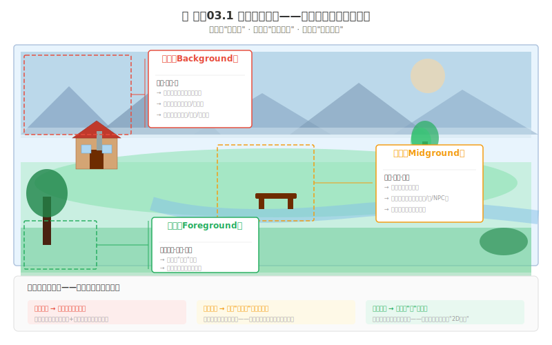
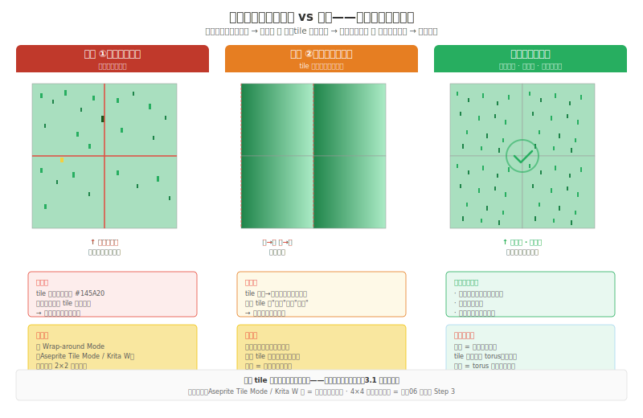

# 制作03 环境与 Tile：可信世界的搭建流程

### 3.0 世界搭建路线图

制作02 收尾时，你的贯穿角色 `character-final.png` 拖进了 Godot——但它站在空场景里。脚下没有地、头顶没有天、远处没有山。一个角色站在一片平坦的灰色背景前，还没有"世界"。环境与场景（Environment & Scene）是你游戏世界的"身体"——角色需要这个身体来承载，玩家需要这个身体来"相信"。

**如何搭建一个可信的世界。** 本章按一条连续的流程组织：先用三层叙事（前景/中景/远景）确定场景的信息结构，再用 Tile 模块化地实现这个世界——统一网格尺寸、画基础与变体 tile、处理地形过渡——接着统一光源方向和大气透视让世界有生命，最后用三元参数调控关卡视觉节奏、用调色板替换换季换时。每节对应一步，读完你能走完从概念到场景成品的完整流程。

---

### 3.1 为什么世界可信——三层叙事

场景不是一张"风景明信片"——它是一个叙事结构。



*图 制作03.1：三层叙事——前景给位置感，中景承载游戏性，远景暗示世界边界。*

#### 前景——"谁的眼睛在看？"

前景是离玩家眼睛最近的视觉层：近处物体（树、草丛、岩石边缘）、画面自然画框（从窗框看出去）。前景告诉你**你在这个场景中有位置**——一棵近处的树 = 你在树下；一个近处的墙壁 = 你站在墙后窥视。

前景的视觉参数：可高度模糊/暗/简化——角色是制造空间感不是传递信息；颜色偏暗创造"景深框"；不应遮挡核心游戏性信息。

#### 中景——"正在发生什么？"

中景承载游戏性。角色在这里走、跳、攻击。中景的视觉参数：**最高对比度**（中景对比度 > 前景和远景）；**最高细节密度**（玩家注视中景最久）；**主色板最强应用**在游戏性对象上（门/开关/宝箱需更高饱和度——视觉上说"点这里"）。

**游戏性信息永远优先于美感信息**——一扇门可以美学朴素，但必须显而易见可以打开。

#### 远景——"暗示什么？"

远景告诉你这个世界有多大多深——远处的城堡是未来要去的地方，远处的暗色森林是另一个关卡。远景承载**未来的承诺**——让玩家的想象力填充隐去的空间。

视觉参数：最低对比度、最低细节密度（远山 3 个色块就够）、**大气透视**——远景对比度降低、颜色向蓝灰色偏移、饱和度降低。不是所有游戏都需要"雾"——降低对比度 + 降低饱和 + 偏蓝，一样制造距离感。

---

### 3.2 用 Tile 实现世界

Tile 是可重复使用的小块像素画，通过拼接快速构建大型场景。从《超级马里奥》的地面砖块到《星露谷物语》的泥土方块，核心逻辑都一样：你画一个 N×N 像素的方块，引擎把它在 X 和 Y 方向上无限复制。

Tile 的三大优势： 

1. **节省工作量**：画 5 个 tile 就可以搭建一整个关卡（= 写 5 个组件拼出一个页面） 
2. **节省内存**：重复使用 tile 意味着文件极小（= 组件复用，不重复打包） 
3. **快速迭代**：修改一个 tile，整个场景中所有使用它的位置都会更新（= 改组件源码，所有引用处热更新）

#### 3.2.1 统一网格尺寸——这是唯一的硬约束

常见 tile 尺寸是 16×16 或 32×32。关键是整个项目**统一**一个值——混用不同尺寸会让场景网格和碰撞体积全乱。

**Tile 和角色尺寸不必完全一致。** 角色 32×48 + tile 16×16 是极其常见的组合（Celeste、许多横版平台游戏都这样）。规则是：**保持整数倍关系或明确的网格约定**——比如角色高度 = tile × 2 或 tile × 3，让碰撞检测和移动路径不出现半格偏移。

> 选定了 tile 尺寸后，再围绕它设计角色比例——而不是反过来。

#### 3.2.2 模块化三规则

**相邻匹配。** 一个 tile 的右边挨着另一个 tile——你的边界线必须和右边 tile 的左边界对齐。画 tile 时要考虑四个边的视觉信息：上/下/左/右各有什么？如果 tile A 的右边和 tile B 的左边不匹配——A 放在 B 旁边时玩家会看到一条"缝"。

**边界处理。**  两个不同地形类型（草地和沙地、水面和陆地）的边界需要"过渡 tile"。三种方式：**直线硬切**（仅适合几何化风格——平台跳跃的"方块天地"：草地 → 一像素黑线 → 沙地）；**渐变过渡**（dithering 或 alpha 混合创造 4-8 像素宽过渡区）；**混合过渡**（边界放独立物体如石头/灌木遮挡边界线）。

**变体防重复。**  只有 1 个草地 tile 铺满 100×100 场景 = 极其重复的"纹理壁纸"。你需要 2-3 个变体 tile（花朵位置不同、草疏密不同、砖块纹理微移），铺草地时随机选变体 1/2/3 制造"不重复的随机自然感"。**变体数量法则：** 3 个 = 基本防重复；5 个 = 大部分场景"自然感"达标；8+ 个 = 肉眼极难察觉重复——但意味着画 8 个 tile 而不是 1 个。

#### 3.2.3 无缝纹理

无缝纹理 = tile 的左右/上下边缘完美对接，看不出重复边界。数学本质是周期性边界条件——练手06 已给完整四步法（种子→边界→检验→变化），这里只补一条验收清单：无缝失败最常见的五个原因是——突出元素（单个石块太显眼）、内部渐变（左暗右亮的渐变重复成条纹）、高对比度（明暗太大）、元素集中（所有细节挤一角）、边缘强调（边界像素不连续）。



#### 3.2.4 地形过渡——3-Tile 与自动 Tile

从草地变到沙地，边界需要过渡 tile。**3-Tile 是最务实的方案**：一个对角线切割的过渡 tile + 水平翻转的副本 + 一个逆方向角落 tile。3 个 tile 处理两种地形之间的所有边界——工作量最小，大多数场景足够用。

更复杂的地形过渡（内角/外角/直线/端点），用 8-12 个 tile 实现——这种方案在工业界通常叫**自动 Tile（Auto Tile）或 Terrain Tile**——你只需要画好这些过渡 tile 放入 tileset，编辑器自动替你选择正确的 tile 填充地形边界。Godot 的 Terrain Set、Tiled 的 Automapping 都是这个机制。

> **Auto Tile 的思想：** 你定义好"草地→沙地边界该长什么样"，编辑器根据相邻格子的地形类型，自动替你选正确的 tile（内角用 tile #7、外角用 tile #5、直线用 tile #3）。你不是在手动拼每块 tile——你是在定义规则，编辑器替你执行。

#### 3.2.5 Tile 库与场景组装

在 Aseprite 里把每个 tile 的"原件"组成 tile 库，存为独立 `.ase` 文件。更工业化的做法是用 Tiled 或 LDtk 管理 tileset——把 tile 库作为 sprite sheet 引用，场景文件只存 tile 索引。

场景组装四步：① 基础 tile 填充整个区域打底 → ② 边界位置放过渡 tile → ③ 零星添加变体 tile 打破重复 → ④ 把角色放进去。

---

### 3.3 让世界有生命——光源、氛围与节奏

#### 统一光源方向——这一条规则就够了

大多数像素游戏没有"三光源系统"。Celeste、Undertale、Stardew Valley、Dead Cells——它们的光影是**画在 sprite 和 tile 里面的**，不是引擎实时计算出来的。

规则只有一条：**所有 sprite 和 tile 必须遵守同一个光源方向。** 角色朝右时阴影在左、朝左时阴影在右（如果有翻转），地面 tile 的亮面统一在右上、暗面在左下。整个游戏的视觉世界共享一个"太阳位置"——这个位置在你画第一件资产时就定死了。

练手04 的明度骨架练的正是这项能力——在灰度下给你的角色"打光"。现在把它扩展到整个场景：所有 tile 的亮面朝光源、暗面背光源。环境光不是另加一盏灯——是你统一调色板里最暗那一档不纯黑（留出空间给更暗的 AO 阴影）。

#### 大气透视——远处更灰、更蓝、更低对比

练手03（空间）的纵深五层中讲了大气透视，这里落到场景实践：每一层往远推，对比度降低、饱和度降低、颜色往蓝灰色偏移。不需要引擎后处理——在画远景 tile 的时候就把这层偏移做进去。前景最饱和、中景中等、远景最灰蓝。

#### 关卡视觉节奏——三元参数调控

一个关卡不是一条"亮度带"——是多个视觉段落之间的呼吸节奏。三个参数就够了：

| 区段 | 对比度 | 细节密度 | 色温 |
|------|--------|---------|------|
| **安全区**（存档/NPC/休息） | 低 | 中低 | 暖 |
| **紧张区**（战斗/陷阱） | 高 | 高（集中在威胁区） | 冷 |
| **过渡区**（走廊/渐变） | 中 | 中 | 中性→渐变 |

节奏模式：`安全（暖·低·低）→ 过渡（中·中·中）→ 紧张（冷·高·高）→ 过渡 → 安全 → ...`

Boss 战前 3-5 秒的视觉爬坡——走廊的对比度逐渐升高、色温逐渐变冷——Boss 还没出现，视觉参数已经在预告它的到来。

#### 调色板替换——换季换时零额外绘制

同一套 tile，换一套调色板映射，白天变夜晚、春天变秋天。练手05 和制作02 已讲了这个机制——这里只强调：它是对场景最便宜的氛围切换。四套色板一套 tile，昼夜循环 + 四季转换零额外绘制。

---

### 3.4 不同游戏类型中 Tile 承担的不同职责

同一套 tile 技术，不同游戏类型中 tile 承担的**信息职责**完全不同。不是 tile 长什么样——是 tile 告诉玩家什么。

**RPG（俯视探索）：** tile 告诉玩家**哪里能走、哪里不能**。墙壁 tile 封锁路径，地面 tile 开放路径。地面无缝最重要——因为地面铺满屏幕 80%。

**平台游戏（横版）：** tile 告诉玩家**哪里能站**。地面 tile 的上表面 = 可站立区域，侧面和底部玩家永不看。横向重复是 95% 使用场景——变体数量要够多。

**弹幕射击（STG）：** tile 告诉玩家**哪里不要看**。背景 tile 必须低调——留空率要高（≥60%），明度比角色和子弹低至少 2 级。背景不能抢可读性。

**战略游戏（等距）：** tile 告诉玩家**空间关系**——高度、占地、遮挡。菱形 tile，绘制顺序 = Y 轴优先（后到前），前排遮挡后排。建筑 tile 延伸出菱形区域之外，遮挡判断独立处理。

---

### 3.5 世界搭建的工业流程

从零到完整场景，不是"画几个 tile 摆在一起"。真实开发走的是这条管线：

```
① 概念定位 — 这个场景在游戏里的叙事功能是什么？
        │
② 色板确定 — 这个场景的情绪主色调 + 明度范围
        │
③ Tile生产 — 地面 / 墙壁 / 水面 / 装饰，各 1 基础 + 2-3 变体
        │
④ 过渡tile — 不同地形之间的边界过渡（3-Tile 起步）
        │
⑤ Tileset打包 — 所有 tile 导入 Godot
        │
⑥ 关卡灰度搭建 — 先用单色 tile 搭出关卡骨架（Gameplay Test）
        │
⑦ 替换为成品tile — 把灰度 tile 换成画好的成品 tile
        │
⑧ 装饰层 — 叙事小物件（木牌/火堆/书本）
        │
⑨ 氛围调整 — 统一检查光源方向 + 大气透视层级 + 视觉节奏三元参数
        │
⑩ 最终验证 — 角色放进去，去色测试焦点是否仍在
```

程序员——这就是你的环境美术 pipeline。和 CI/CD 一样——不是"想到哪画到哪"，是"走完十个步骤，场景就绪"。

---

### 3.6 练习

#### L1 · 第一个 tile 场景（约 90-120 分钟）

用 Aseprite 搭建一个包含 3 种地形（草地/沙地/水）的 8×6 小场景，用 3-Tile 做过渡，把 `character-final.png` 放进去。

**步骤：** ① 调色板准备（草地绿 4 色 + 沙地棕 3 色 + 水蓝 3 色）。② 每地形 1 基础 tile + 2 变体（共 9 个）。③ 3-Tile 过渡（3 个 tile × 2 组 = 6 个）。④ 4×4 无缝检验。⑤ 场景组装 + 角色入場。⑥ 导出 `scene-v01-tile.png`。

**合格标准：** 3 种地形 + 2 组过渡；无明显接缝；角色清晰可辨——角色对比度 > 中景背景。

#### L2 · 调色板替换昼夜/季节（约 30-60 分钟）

用 L1 的场景，通过调色板替换生成白天/黄昏/夜晚三版 + 可选春/秋/冬三版。零额外像素绘制。

**合格标准：** 三版生成，同一场景三种氛围。角色在夜晚版仍清晰可辨。6 版并排对比图。

---

### 3.7 常见踩坑

**踩坑一："场景只是一条功能走廊"。** 只有路和墙，没有前景和远景。解法：给每个场景加 1-3 个叙事物件（破木牌/熄灭火堆/落地的书）。

**踩坑二：角色和背景融为一体。** 解法：中景背景的对比度必须低于角色——视觉层级是 角色 > 中景 > 前景/远景。

**踩坑三：每个房间看起来都一样。** 解法：用三元参数（对比度/细节密度/色温）为每个区域设计不同视觉模式。

**踩坑四：远景画了 20 个屋顶——玩家永远看不到。** 解法：远景保留轮廓，细节用大气透视"隐去"。

**踩坑五：tile 内部有渐变 → 重复变条纹。** 练手06 的完整诊断。解法：让 tile 四边平均明度一致。

**踩坑六：翻转 tile 光源穿帮。** 3-Tile 翻转后主光方向变了。解法：要么补画非翻转版本，要么接受这个代价——3 个 tile 换来的速度有它该付的代价。

---

### 3.8 本章小结

- **三层叙事定基调。** 前景给位置感、中景承载游戏性、远景暗示世界边界。
- **Tile 是世界的积木。** 统一网格尺寸——和角色保持整数倍关系即可，不必精确一致。模块化三规则（匹配/边界/变体）+ 3-Tile 过渡 = 最小工作量方案。
- **统一光源方向。** 所有 sprite 和 tile 遵守同一个"太阳位置"——画在素材里，不是靠引擎打光。大气透视让远景自动后退。三元参数让关卡有呼吸节奏。
- **Tile 的职责因游戏类型而异。** RPG = 告诉哪里能走、平台 = 哪里能站、STG = 哪里不要看、战略 = 空间关系。
- **世界搭建是一条 pipeline。** 从概念到验证，10 步——不是"想到哪画到哪"。

> **如果只记住一句话：** 场景的美不在细节密度——在信息层级。玩家的眼睛必须在第一秒看到"往哪走/哪有危险/哪可以停"。

---

### 3.9 扩展阅读

1. **Solarski, Chris. 《Drawing Basics and Video Game Art》** — 三层叙事法基于 Solarski 对游戏场景视觉层级的讨论。
2. **Tiled Map Editor / LDtk** — tileset 管理的工业标准工具。
3. **Lospec — Tileset Tutorials** — 相邻匹配和边界处理的像素级实现案例。
4. **《A Short Hike》开发日志** — 单人用极简模块化+光照+大气透视构建可信世界的独立案例。

---

### 3.10 本章引注

[^1] Solarski, Chris. 《Drawing Basics and Video Game Art》, Watson-Guptill, 2012.

[^2] Tiled Map Editor. https://www.mapeditor.org/ & LDtk. https://ldtk.io/

[^3] Lospec. Tileset Tutorials. https://lospec.com/

[^4] Robinson-Yu, Adam. A Short Hike 开发日志. https://ashorthike.com/

