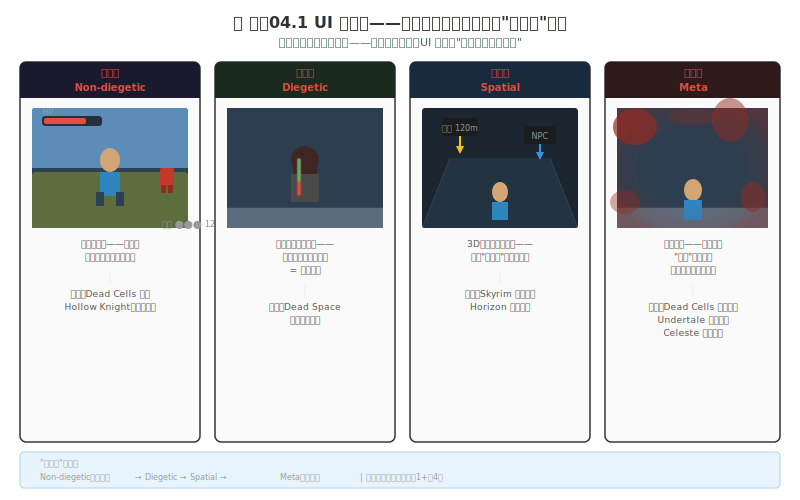
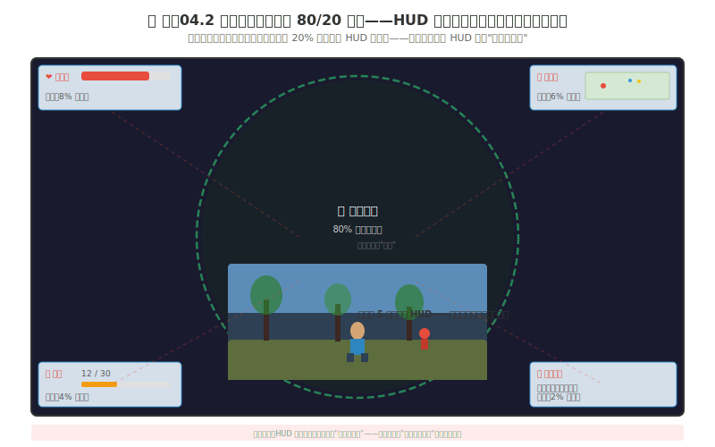
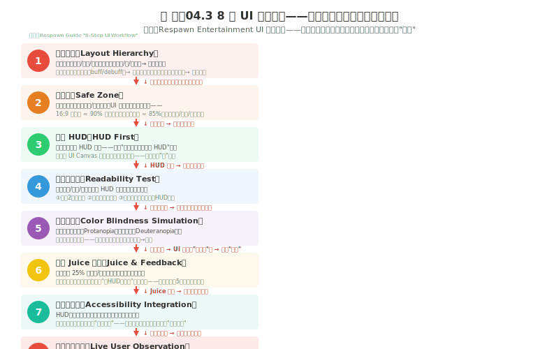

# 制作04 UI 设计：不只是好看，是好用

### 4.0 这一章解决什么问题

制作03 收尾时，你的贯穿角色终于"有地方站"——`character-final.png` 站进了你搭的第一个 tile 场景，脚下有地、头顶有天。可玩家还是没法和这个世界交互：角色还剩多少血？手里是什么道具？那个 NPC 能不能对话？这扇门能不能开？这些"游戏内部数据 → 玩家一眼就懂"的翻译，全是 UI（User Interface，用户界面）的活。对程序员来说，UI 是你和机器之间的"API 文档"——但你的玩家不是程序员。你的玩家不需要读文档。你的玩家需要在 **0.3 秒内**从视觉信息中提取"我现在能做什么 / 我现在不能做什么 / 接下来会发生什么"。

**独立游戏 UI 设计的三重矛盾：**
1. **你只有一个人——但 UI 是程序+美术+交互+心理学的交叉领域。** AAA 游戏有 5-20 人的"UI/UX 团队"专做界面。你需要一个能在"一个人的流水线"中跑通的 UI 工作顺序。
2. **你的 HUD（Heads-Up Display，抬头显示）在抢玩家对游戏世界的注意力——但你需要 HUD 传递关键信息。** 多数注意力应留给游戏世界，只有少量在 HUD 上。你的 HUD 的每一个像素都必须有"为什么这个像素必须存在"的答案——不能是"因为别的游戏都有所以就加一个"。
3. **你的玩家群体中有 8% 的男性和 0.5% 的女性有色觉障碍——你的 UI 依赖颜色来传递信息吗？** 如果你的"绿色 = 安全 / 红色 = 危险"是游戏中唯一的区分方式——8% 的玩家无法区分。色盲无障碍的色感基础在练手05 已经铺过，本章把它落到 UI 层。

**本章核心承诺：** 你将理解 UI 的三重功能——不是"画一个好看的血条"，是"信息 + 操作 + 情绪"的三合一设计。你将掌握 UI 的四类型分类——知道什么 UI 应该放在哪里、为什么放那里。你将拥有一个 8 步 UI 工作顺序——从布局层次到真人测试，不可跳级的流程。你将学会四种 UI 风格（像素风格为主）和色盲无障碍设计——让更多人能玩到你的游戏而不只是"看起来好看"。

> **贯穿式项目衔接：** 制作03 你的 `character-final.png` 进了 `scene-v01-tile.aseprite`，但场景里没有任何状态显示——玩家不知道角色还剩几条命。本章 L1 你就给这个场景截一张图，用纯色矩形在它上面摆 HUD 原型——3 秒扫视测试你的信息优先级。你的角色从制作02 起就在等"被看见状态"，这一章给它一层 HUD。

---

### 4.1 UI 的三重功能——信息 / 操作 / 情绪

UI 不是"画一个血条然后放上去"。UI 是你和玩家之间的**对话界面**。这个对话有三个层——每一层失去，玩家的体验就降一级。

#### 功能一：信息（Information）——"告诉你什么"

UI 的第一个功能是**你向玩家传递信息**。血量还剩多少？弹药还有几发？这是什么道具？那个方向有什么？第 3 个任务要我去哪里？

这是 UI 的"基线功能"——所有 UI 都必须做到这个。但"做到"和"做好"之间的差距是：**信息不仅要存在——信息要在玩家需要它的 0.3 秒内被提取到。**

**信息呈现的核心规则：**

- **位置固定法则。** 血量——永远在同一个位置。小地图——永远在同一个角落。弹药数——永远在同一个位置。玩家不需要"找"——玩家在扫视时"下意识知道那个位置是什么信息"。如果你的血量在战斗中从左上角"飘"到右下角——玩家在 0.3 秒的扫视中找不到它——它等于"不存在"。

- **关键资源按任务选择：快速反应用图形，精确决策加数字。** 显示"87/100 HP"在扫视时比一根红色细条更精确——但连续血量变化更适合图形。选择取决于玩家需要的是"大概"还是"精确"。

- **"少即是多"的信息经济学。** 一瞬间玩家能处理的信息极其有限——认知心理学告诉我们工作记忆只能容纳 3-5 个"组块"（Chunk）同时活跃。如果你的 HUD 上有 12 个信息点——玩家的大脑在混沌中找不到最重要的那个。你的 HUD 应该只显示**"现在绝对必要"**的信息——而不是"所有可能有用的信息"。

**案例：** 《Hollow Knight》的血量——灵魂槽不是用数字表示的，而是用小圆形槽（灵魂容器）——每个圆形槽的填满/空心状态是**二值的**（满/空），不是连续的。这是极其聪明的 UI 设计——玩家不需要判断"67% 满"，只需要判断"3 个满 / 2 个满 / 1 个满"——视觉判断速度是数量级的提升。（注意：Hollow Knight 的整体美术是手绘风格，它的 HUD 也随之是手绘风而非像素风——但这个"二值状态"的设计思路对像素 UI 同样适用，是你该学的设计思想，不是它的画风。）

> **程序员类比：** UI 的信息功能 ≈ 函数的返回值。你的函数必须返回清晰、类型明确的值——而不是返回一个模糊的"大概是什么"。`getHealth(): number` 优于 `getHealthBar(): HTMLDivElement`。UI 的信息功能就是：你的玩家调用 `glance(): Status`，返回的是明确的 `{hp: 87, ammo: 12, objective: "find_key"}`——而不是一个需要玩家自己推断的 `{red_bar: "mostly_full", bullet_icon: "??"}`。

---

#### 功能二：操作（Operation）——"让你做什么"

UI 的第二个功能是**你接收玩家的输入**——玩家要做什么？按哪里？拖哪里？哪个按钮是攻击？哪个按钮是跳跃？哪个图标可以点？哪个不能点？

在 PC 和主机游戏中，操作主要通过物理按键完成——UI 的角色是**告诉玩家哪个按键对应哪个操作**。在触屏游戏中，操作直接在 UI 元素上——按钮、拖拽、滑条——**UI 元素本身就是操作界面**。

**操作 UI 的核心规则：**

- **可交互与不可交互的视觉差异必须一目了然。** 一个"灰色的按钮"和"亮色的按钮"——0.1 秒内玩家必须知道"我不能点第一个"和"我可以点第二个"。这个视觉差异不能只是颜色的差异——因为色盲玩家无法区分某些颜色——你需要**颜色 + 形状/明度/边框**双重编码。灰色的按钮不仅颜色灰——而且边框消失/文字变细/没有投影。

- **点击/触摸区域必须足够大。** 人的手指尖触摸面积约为 10-14mm 直径——在触屏上，任何可点击的 UI 元素的最小推荐尺寸是 44×44 点（Apple HIG）或 48×48 点（Google Material）。如果你的"关闭"按钮是 20×20 像素——在手机上它无法被手指准确点击——你的操作 UI 在物理上不可用。

- **操作反馈必须在 100ms 内出现。** 玩家点击一个按钮——按钮必须在 0.1 秒内产生视觉反馈（按下的效果）。如果反馈延迟超过 0.1 秒——玩家的大脑不认为"按钮因为我的点击而改变"——它认为是"按钮自己变了，或者我的点击没被接收"。0.1 秒是大脑感知"因果关系"的时间阈值——超过这个阈值，操作感崩溃。

**案例：** 《Undertale》的战斗 UI——四个大按钮（FIGHT / ACT / ITEM / MERCY）排成一行，每个按钮边界清晰、按下时整框抖动并变色。玩家在战斗中不需要"摸索"——所有可用的操作都以"最大的视觉存在感"呈现，而且按钮的像素边框 + 文字一起编码状态，色盲玩家也能分辨哪个被选中。

---

#### 功能三：情绪（Emotion）——"让你感受到什么"

UI 的第三个功能是最容易被独立开发者忽略的——UI 不仅是信息和操作的载体。UI 也是**情绪和"世界感"的载体**。

你的 UI 的风格、动画、音效——在所有时间都在告诉玩家"你现在在什么样的游戏世界中"。一个纯文本的"HP: 87/100"和一个有脉搏跳动动画的心脏图标——这两个东西传递的信息完全相同——但前者说"你在操作一个数据表格"，后者说"你在一个危险的地牢中，你的生命在跳动"。

**情绪 UI 的核心规则：**

- **屏幕震动 / 血溅 / 暗角——这些是"Meta UI"。** 当玩家血量降到 25% 以下时，屏幕四周逐渐变暗（暗角效果）、屏幕微微泛红——玩家不需要"读取 HUD"就知道自己快死了。这种 UI 把信息编码在**人的本能反应中**——暗角 = 视觉场在缩小 = "我快死了"——这是几百万年的演化让大脑做出的自动判断。

- **UI 的"材质"传递世界感。** 一个奇幻 RPG 的 UI 背景是羊皮纸纹理——你在"翻阅一本古书"。一个科幻游戏的 UI 背景是蓝光全息面板——你在"操作未来的控制台"。像素游戏则用像素边框 + 有限调色板告诉你"你在一台复古机器上"——UI 和画面共用一套色板时，两者是同一个"视觉宇宙"。

- **Juice（果汁）——让 UI 有"生命"。** 获取经验条时——经验条不是"瞬间从 30% 跳到 40%"，而是有一个微小的"冲过头再回来"的弹性动画（Overshoot）。升级时——整个等级图标有一个膨胀的"弹出"动画。这些微交互（Micro-interaction）不是"华丽的包装"——它们是**游戏感的原材料**。没有 Juice 的 UI = 你在操作 Excel。有 Juice 的 UI = 你在玩游戏。（"Juice It or Lose It" 那个 4 分钟演讲是这步的核心论据，4.4 第 6 步还会再提。）

> **一句话总结 UI 的三重功能：** 信息让你知道 / 操作让你行动 / 情绪让你相信。

---

### 4.2 UI 四类型——从纯屏幕到纯游戏世界

同一个信息（比如"血量"）有四种根本不同的显示方式。这四种 UI 类型的分类来自玩家社区 fungies.io 的学术研究——不是按"好不好看"分类的，是按 **UI 在游戏世界中的"存在深度"**分类的。

*图 制作04.1：UI 四类型（Four UI Types）——非叙事 / 叙事 / 空间 / 元，从最"远"的纯屏幕叠加到最"近"的 Meta 效果。每向外走一步，UI 就越像游戏世界的一部分。*

#### 类型一：Non-diegetic（非叙事 UI / 非世界化）

**定义：** 纯屏幕叠加——UI 元素悬浮在游戏画面之上，游戏角色"看不到"这些 UI。这是最常见的 HUD 形式——血条、弹药数、小地图、任务提示、技能栏——这些元素贴在屏幕最上层，像贴在摄像机镜头上的贴纸。

**优点：** 最清晰——信息直接、可读性最高。实现最简单——你只需要 UI Canvas + 几个 Sprite / Text 元素。

**缺点：** 最"出戏"——玩家始终被提醒"你在玩一个游戏"。沉浸感最弱。

**像素游戏适用场景：** 大多数 2D 像素游戏（横版动作、平台跳跃、俯视角 RPG、策略游戏）的最常见选择。如果你的游戏不追求"沉浸式模拟"而是追求"清晰可玩"——Non-diegetic 是你的默认选择。

**案例：** 《Dead Cells》的 HUD——血条、技能冷却、武器槽纯 Non-diegetic，和它的像素画面共用一套暗色高对比色板，风格统一。《Celeste》更极简——左上角只有草莓计数和死亡数，几乎"隐形"。《Hollow Knight》的血量槽和灵魂槽也属于 Non-diegetic（但它的 HUD 是手绘风，见 4.5 手绘 UI）。

---

#### 类型二：Diegetic（叙事 UI / 世界化）

**定义：** UI 元素存在于游戏世界内部——游戏角色可以"看到"这些 UI。最经典的案例是《Dead Space》中主角 Isaac 的脊背血量显示——血量不是屏幕上的一个条，而是角色脊柱上的一段发光管——角色在游戏中"真的"戴着这个血量显示设备。

**优点：** 极高的沉浸感——UI 不"破坏"游戏世界。玩家不需要"跳出"游戏去看 HUD——信息在游戏世界中。

**缺点：** 实现难度大幅上升。信息可读性可能受损——脊背发光管可能被环境光/遮挡物/视角遮挡——信息不可见时等于不存在。

**像素游戏适用场景：** Diegetic UI 的成本/收益比对独立像素开发者通常不划算——你需要为"世界中的 UI"额外画 sprite、处理遮挡。但如果你的像素游戏追求沉浸（如像素恐怖游戏把血量画成角色身上闪烁的伤口），这是值得投入的方向。

**案例：** 《Dead Space》的脊背血量和武器弹药显示（在武器本身上显示剩余子弹数）是叙事 UI 的教科书案例——即便它不是像素游戏，这个"把状态画进角色身体"的思路对像素角色同样可借鉴。

---

#### 类型三：Spatial（空间 UI）

**定义：** UI 元素在 3D 空间中——但不是"游戏世界物体"。它们悬浮在空间中——角色无法交互——但角色可以"看到"（从叙事角度）。最经典的是《Skyrim》中的罗盘标记——浮空的"目标点"——以及《Horizon Zero Dawn》中的浮空路标。

**优点：** 在"世界化"和"可读性"之间找到平衡——浮空标记本身是 Non-diegetic 的清晰元素，但它们被嵌入在 3D 空间中——跟随游戏世界的透视——不破坏空间感。

**缺点：** 在 2D 游戏中几乎无法使用——Spatial UI 依赖于 3D 透视。在 3D 游戏中——浮空标记可能因为距离/遮挡而不可见。

**像素游戏适用场景：** 如果你在做 2D 像素游戏——Spatial UI 基本不是你的工具。它依赖 3D 透视，2D 像素没有这个维度。如果你的像素游戏是 2.5D 或等距视角（如《RimWorld》的悬浮标签），可以谨慎使用。

---

#### 类型四：Meta（元 UI）

**定义：** UI 是屏幕效果——存在于"叙事层"（角色不应该能看到，但玩家能看到）。在像素游戏里最常见的是受击时的屏幕闪红、《Dead Cells》低血量时的屏幕暗角、《Undertale》受击时的屏幕震动和灵魂破碎、《Celeste》死亡瞬间的屏幕闪白。

**优点：** 最强的情绪感染力——血溅屏幕不只是"说"你受伤了——它"让你感受到"受伤。暗角不只是"提示"血量低——它"模拟"了濒死时的视觉场缩小。

**缺点：** 极难做对。Meta UI 如果过度——变成"视觉污染"——挡住核心游戏性信息。如果不足——浪费了实现时间。

**像素游戏适用场景：** 任何需要强调"生死时刻"的像素游戏。屏幕闪红和暗角在独立像素动作游戏里极其常见——而且实现成本不高（全屏贴图 / 后处理 / 一个 ColorRect 覆盖层）。

> **独立像素游戏 UI 类型的最常见组合：Non-diegetic（主 HUD）+ Meta（伤害/濒死反馈）。** 这是最少实现成本 + 最大功能和情绪收益的组合——你用纯屏幕叠加传递核心游戏性信息，用 Meta 效果传递情绪和世界感。

---

### 4.3 80/20 法则——HUD 的每一个像素都在抢注意力

这是本章最核心的数据——你应该把这个数字刻在 UI 设计的每一个决策里：**眼动追踪研究发现，玩家仅 20% 的视觉注意力花在 HUD 元素上——另外 80% 在游戏世界中的角色/敌人/环境/事件上。**

*图 制作04.2：HUD 注意力分配的 80/20 法则——你的 HUD 不是在"帮助玩家"——它是在和游戏世界竞争玩家仅有 20% 的碎片注意力。*

这个数据对所有 UI 决策的影响是根本性的：

**第一：HUD 元素不是越多越好——每个元素都在"偷走"玩家对游戏世界的注意力。** 如果你加了一个"环境温度显示"但你的游戏没有温度机制——你偷走了 1% 的注意力却给了玩家零价值的回报。每个 HUD 像素必须有"为什么玩家现在需要这个信息"的答案。
**第二：HUD 元素的位置决定了它被注意到的概率。** 玩家对屏幕不同位置的视觉敏感度是不同的——因为玩家大部分时间在注视屏幕的中央区域（游戏角色所在的位置）。HUD 元素越靠近屏幕边缘——被注意到的概率越低——但这也意味着它对游戏世界的"干扰"越低。这是一个需要权衡的决策：血条需要快速被注意到——所以靠中上（或中下）。小地图需要不时被参考但不应该打断战斗——所以放在角落。弹药数字在射击游戏中需要快速被扫视到——所以放在准星附近（而不是角落）。
**第三：重要的 HUD 信息需要"多重编码"——不只是放在一个位置，而是用多种方式传递同一个信息。** 血量低——不仅是血条变短变红（Non-diegetic）。也是屏幕边缘泛红（Meta）。也是角色走路姿势改变（游戏世界内）。也是心跳音效（音频）。这些多重编码确保——即使玩家 80% 的注意力在游戏世界中没有扫视血条——低血量仍然被感知到。**多重编码 = 同一个信息通过不同"感通道"传递——视觉（UI + 游戏世界）+ 音频 + 触觉（手柄震动）。**

> **程序员类比：多重编码 = 冗余的信号通道，像分布式系统的多副本。** 你的"低血量"信号像一条写进三个副本的消息——视觉通道一份、音频通道一份、触觉通道一份。任何一个通道在某类玩家身上"宕机"（色盲玩家收不到颜色通道），另外两个副本仍然投递了消息。单一通道 = 单点故障；多重编码 = 高可用。

---

### 4.4 8 步 UI 工作顺序——从布局到真人

这是一个参考 Respawn 等团队流程整理的 UI 设计工作顺序。这 8 步不是"你可以按需调整的"——这是一个**不可跳级的管道**。前一步没验证通过——你不能做后一步。因为你每跳一步，在后面发现前一步的问题时——你需要"回撤"的修改量是指数级增长的。

*图 制作04.3：8 步 UI 工作顺序——参考 Respawn 等团队流程整理。独立开发者可以跳过像素精度，但不能跳过"验证"——因为你在第 8 步发现的问题在第 3 步修复的成本是最低的。*

#### 第 1 步：布局层次（Layout Hierarchy）

**先不要画任何东西。先决定"什么信息在最前、什么在中间、什么在最后"。** 信息分层：
- **第一层（必须始终可读）：** 血/魔/体力——玩家的"生存数据"。位置固定在屏幕上不需要移动视线的地方。
- **第二层（定时参考）：** 小地图、弹药数、当前任务目标——玩家在日常游戏中间歇性扫视的信息。
- **第三层（临时/事件性）：** 伤害数字、buff/debuff 提示、获得物品通知——只在特定事件发生时出现——出现后消失。

**这层的检验标准：** 列出你游戏的所有 UI 元素。每个元素被分入第一/第二/第三层中的一层。第一层的元素不超过 3 个——如果你的第一层有 7 个元素，你在让玩家"同时监控 7 个数据点"——人的工作记忆无法做到。

---

#### 第 2 步：安全区（Safe Zone）

不同屏幕有不同的裁剪/过扫描比例。在不同设备上（PC 显示器 / 手机 / Switch / Steam Deck），你的 UI 元素可能被裁剪掉部分——或者被刘海屏/圆角/手势条覆盖。**安全区规则：** UI 核心元素（第一层和第二层）应放在屏幕的"安全区"内——通常是 90% 的屏幕面积（从边缘各缩进 5%）；手机上需额外避开顶部刘海/胶囊和底部手势条——有效安全区可能只有 85% 甚至更少。**像素游戏适配：** 像素 UI 要特别小心整数缩放——UI 元素被安全区裁掉半个像素时，1:2 / 1:3 整数倍缩放会把它彻底吃掉。用百分比定位 + 锚点系统让 UI"浮动"到安全位置，而不是粘在像素坐标上。

---

#### 第 3 步：先建 HUD（HUD First）

在你的引擎中先实现 HUD 原型——不是"先做完整界面再做 HUD"。HUD 是游戏中**一直在屏幕上**的东西——它的性能、可读性、视觉权重都必须优先被验证。**怎么做：** 用纯色矩形 + 占位文本在引擎中搭建 HUD 框架（Godot 用 Control 节点 / ColorRect / Label；Unity 用 Canvas + Image + Text）。先让数据从游戏逻辑"流"到 HUD 上（扣血 → 血条变短；获得弹药 → 弹药数字增加）。数据流先走通——美化后面再说，因为美化在数据流不通时做的是无效的工作。

---

#### 第 4 步：测试可读性（Readability Test）

在不同条件下测试你的 HUD 是否可读：
- 退后 2 米（模拟玩家坐在沙发上玩主机的距离）
- 在户外/窗户背光处（模拟强环境光下屏幕反射导致的低对比度）
- 在角色高速移动中尝试读取 HUD 数字（模拟战斗中玩家没有"停下来看"的奢侈）

像素字体在小尺寸下尤其要测——像素字体的可读性依赖每个像素的精确位置，背光和缩放会"糊"掉这些像素。如果你的 HUD 在上述任何一个条件中不可读——回到第 1 步调整。

---

#### 第 5 步：色盲模拟（Color Blindness Simulation）

至少测试红色盲（Protanopia）和绿色盲（Deuteranopia）——最常见的两种色觉障碍。用工具：Color Oracle（免费桌面 app）、Chrome DevTools 的 Rendering 面板、Unity 的 Color Blindness Filter。**核心测试：** 把你的 UI 转成灰度看——如果信息在灰度中仍然可读（因为信息同时被形状/位置/明度编码），色盲玩家也能正确读取；如果信息在灰度中"消失"——你的 UI 依赖颜色传递信息——回到第 1 步。色彩与色盲的底层在练手05 已经讲过（功能金字塔的交互层、色盲三规则），本章 4.6 把它展开成 UI 专属的四原则。

---

#### 第 6 步：添加 Juice 反馈（Juice & Feedback）

前 5 步做完之后——你的 UI 已经是"功能性正确"的。第 6 步让 UI 变得"有生命"：
- 血量低于 25% → 血条闪红（用一个正弦波驱动的透明度动画）
- 获得经验 → 经验条填充 + 微小的"冲过头再回来"的弹性动画
- 获得新物品 → 物品图标飞入背包图标的动画
- 按下按钮 → 按钮缩小 5% 再弹回

这些不是"锦上添花"——它们是让玩家感受到"这个 UI 有灵魂"的微交互。没有 Juice 的 UI = 操作 Excel 表格 + 数据可视化。有 Juice 的 UI = 玩游戏。"Juice It or Lose It" 那个 4 分钟演讲是说服你加 Juice 的最快方式。

---

#### 第 7 步：集成无障碍（Accessibility Integration）

至少做 3 件事——这 3 件事是独立团队也能承受的：
1. **字体大小选项**（小/中/大）——让视力较弱的玩家能读取 UI 文字。像素字体切换大小时要保持整数倍缩放，否则糊。
2. **高对比度模式**——在 UI 元素上加强明度对比度，让低视力玩家能看到。
3. **色盲模式**——用形状/图案代替纯色（如血量的"红色 = 危险"改为"红色 + 一个闪烁的警告图标"）。

---

#### 第 8 步：观察真人使用（Live User Observation）

这一步是**不能跳过的验证**——不是因为"用户研究很重要"这个抽象的理由——而是因为你自己（开发者）已经对这个 UI 太熟悉了——你觉得"显而易见"的东西在第一次看到你游戏的玩家的眼中可能是"完全看不懂"的。

找人玩。不说话。不解释。只观察。
- 他们在哪里犹豫了？（→ 操作 UI 不清晰）
- 他们在哪里点错了？（→ 按钮位置/大小/辨识度有问题）
- 他们在哪里反复看 UI？（→ 信息没有被"下意识"获取——需要读取）
- 他们在哪里完全忽略了 UI 提示？（→ UI 位置/颜色/动画没有抢到注意力）

这一步发现的问题，回头用制作09 的一致性审计清单做一次跨场景核对——确保你修 UI 时没有破坏别的场景的视觉一致。

> **程序员类比：** 这 8 步 ≈ 你的 CI/CD pipeline——每步是一个 stage。第 1 步定义"接口"（布局）→ 第 2-3 步"实现"→ 第 4-5 步"单元测试"→ 第 6-7 步"feature flag"→ 第 8 步 = 部署到生产 + 监控用户行为。你在第 1 步发现的问题在第 1 步修复的成本是 1——在最后 1 步发现第 1 步的问题时修复成本是 100。跳级 = 跳过测试直接上线 = 必出事故。

---

### 4.5 像素 UI 风格

你的 UI 不仅是功能——它也是风格。像素游戏的 UI 必须和画面共用一套视觉语言，风格04 的视觉风格文档里专门有一栏登记 UI 风格决策——这一节给你那栏填什么。

**核心原则：UI 和游戏画面是同一个"视觉宇宙"。** 像素画面 + 矢量 HUD = 玩家眼睛在两种视觉语言之间反复跳——这种"视觉打架"会在制作09 一致性审计时被抓出来。

**边框。** 用 1 像素宽的线——和背景有至少 3 个明度等级的差距，否则边框被背景吃掉。边角保留像素特有的锯齿，不做 AA 柔化——这和练手08 的抗锯齿原则一致：UI 边框适合硬边，柔化后反而失去像素识别度。对话框、菜单框、血条外框全部用同一套边框规则——边框宽度和颜色在风格文档里锁死，不因"这个框比较大"就改用 2px 边框。

**图标。** 图标尺寸和角色/tile 尺寸锁定一致。制作02 锁了 32×32 角色，UI 图标就别突然用 24×24——混尺寸等于视觉打架。图标尺寸的"可读尺度"：
- **16×16**：极简符号——一个心形=血量，一把剑=攻击，一枚金币=金钱。适合信息密度高的面板（背包/商店）。
- **32×32**：可以有更多细节——心形加数字、武器加纹理、技能图标可区分"火球"和"冰箭"。适合 HUD 主界面。
- **换色区分状态**：同一图标换个色板条目 = 不同状态（灰=冷却中，亮=可用，闪=即将过期）。和练手05 的调色板替换是同一机制，零额外绘制。

**字体。** 必须用像素字体，不能用矢量字体。矢量字体的平滑边缘在像素画面中像"另一个世界的产物"。常见开源像素字体：Press Start 2P、VT323、方正像素 12px。像素字体的可读性依赖整数倍缩放——非整数倍 = 糊。中文像素字体的最小可读尺寸是 14-16px——如果你的 UI 面板需要大量中文，确认像素字体在这个尺寸下可读。

**面板框架。** 像素 UI 的对话框/菜单框直接复用制作03 的 9-Slice——四角固定、四边拉伸、中心填充，和 tile 的 9-Slice 是同一个算法。菜单背景的"材质暗示"也要统一——奇幻 RPG 用木板/羊皮纸纹理的像素化版本，科幻用金属/蓝光面板的像素化版本。但无论什么材质，它必须是像素画的——不能引入手绘纹理或矢量渐变。

**面板内信息排布。** 像素 UI 的面板空间非常有限——一个 32×32 的图标区域只有 1024 像素。信息排布遵循：最重要的信息放左上（Z 型扫视的起点），操作按钮放底部或右侧（手指/鼠标最容易到达的位置），装饰元素放四角——不占据信息区的像素。如果一个面板"太挤"，优先删装饰元素而不是缩文字。

**案例拆解：**
- 《Stardew Valley》的菜单——木板纹理边框 + 像素图标 + 像素字体，背包/工具栏/对话框和农场画面共用一套像素语言，是像素 UI 一体化的标杆。
- 《Undertale》的黑底白边像素对话框 + 打字机文字 + 四个大按钮（FIGHT/ACT/ITEM/MERCY）——像素 UI 操作编码的典范：4 个操作各占一个象限，不用读文字看颜色就知道"战斗/行动/道具/慈悲"。
- 《Dead Cells》的 HUD——暗色高对比像素 UI 配快节奏战斗，血条和技能冷却的信息编码在像素 UI 里做到了"瞟一眼就知道"的速度。
- 《Celeste》——极简到左上角只有草莓计数和死亡数，像素美学推到极致：UI 几乎消失，融入画面。

---

### 4.6 色盲无障碍设计——不纯靠颜色传递信息

4.4 第 5 步提到了色盲模拟——但这里需要展开为一个独立的设计原则。因为 8% 的男性玩家有色觉障碍——这意味着你的游戏如果有 1000 个玩家，约 80 人无法区分"红色和绿色"——而"红 = 坏 / 绿 = 好"是游戏 UI 中最常见的颜色编码方式。练手05 给了色盲的色感基础（色盲三规则），这一节是它在 UI 层的四原则展开。

**原则一：形状/图标双重编码。** 不要只用"绿色 = 安全区 / 红色 = 危险区"——在绿色的圆形上叠加一个"安全图标"（盾牌/圆圈），在红色的圆形上叠加一个"危险图标"（骷髅/叉）。颜色不再承载信息的关键——形状承载。颜色变成了"助攻"而不是"唯一的信使"。

**原则二：明度双重编码。** 在 UI 中，红色和绿色在色盲玩家眼中可能都是"棕色/灰色"——但红色的明度通常比绿色低（红色更暗）。因此——把"危险信息"标记为暗 + 红，"安全信息"标记为亮 + 绿——明度差异在色盲条件下仍然可辨。这是练手04 明度三区在无障碍层的应用——明度是最稳的编码维度。

**原则三：位置/模式双重编码。** "不可用的按钮"不仅是灰色——它没有投影/没有边框/文字细。这些"多重缺陷"的叠加（灰色 + 无投影 + 无边框 + 文字细）让色盲玩家也能在 0.1 秒内识别出"这个按钮不能点"——即使他们无法区分灰色和亮色的颜色差异。

**原则四：音频+触觉的多通道。** "血量低了"——不仅是血条变红/变短。也加入低频心跳音效（听觉）。也加入手柄震动（触觉）。当你有 3 个感通道传递同一个"危险"信息——即使 1 个通道在你某些玩家身上不可用（色盲玩家无法用颜色通道）——另外 2 个通道仍然传递了信息。这就是 4.3 末尾"多重编码 = 冗余信号通道"在无障碍上的落地。

---

### 4.7 常见踩坑

**踩坑一："别人游戏里有的 UI，我也需要有。"**
你看到《暗黑破坏神》有血球——你也加血球。你看到《魔兽世界》有 24 个技能图标——你也加 24 个图标。你看到《星露谷物语》有日/夜时间显示——你也加时间显示。每加一个——你用掉了玩家 20% 注意力中的一部分。如果你的游戏没有《魔兽世界》的技能系统——24 个图标是 24 个"无用但占据空间的像素"。**解决：** 每个 UI 元素必须有**你的游戏**中的存在理由——不是因为"别的游戏有"——是因为"你的这个具体游戏中玩家需要这个信息 / 这个操作 / 这个情绪"。

**踩坑二："美化优先于功能——我先设计一个好看的 HUD 框架，再往里面填内容。"**
你花了 2 天设计了一个精美的像素 HUD 框架——有复杂的边框、有装饰角花、有逐渐褪色的边缘。然后你发现在这个框架中——血量数字太小"装不下"——弹药的位置和你游戏的战斗节奏不匹配——小地图太远玩家必须大范围移动眼睛。**解决：** 永远遵循 8 步顺序——内容先行（第 1 步），美化最后（第 6 步）。在第 6 步之前——你的 UI 只应该是纯色矩形。如果你在纯色矩形阶段发现布局问题——修改成本是零。如果你在装饰完成后发现布局问题——你浪费了 2 天的装饰工作。

**踩坑三："我的 UI 在 16:9 屏幕上看起来完美——但在 4:3 / 21:9 / 手机上 UI 被切掉了。"**
你把 UI 元素粘在了像素坐标上（`x: 1820, y: 20`）——当你切换到一个 1920×1080 的屏幕时，这些元素在屏幕边缘恰到好处。但切换到一个 1280×720 的屏幕时——这些像素坐标被裁剪到了屏幕外。**解决：** 用百分比定位 + 锚点系统。Canvas Scaler（Unity）或 Control 的 Anchor（Godot）——这些是你的工具。

**踩坑四："我加入了很多 Juice——弹跳/旋转/闪烁——结果 UI 看起来像一个狂欢会而不是一个游戏的界面。"**
Juice 是"增强反馈"——不是"让每一个 UI 元素都开始跳舞"。Juice 的量和频率必须是克制的——否则 Juice 从"反馈"变成了"噪音"。**解决：** Juice 的节奏规则——"任何 UI 元素在安静时不做动画。只在状态变化时做一次动画。" 血条在血量变化时闪一下（1 次动画）。经验条在获得经验时填充（1 次动画）。升级图标在升级时弹出（1 次动画）。如果你让血条"永远在闪"——你的玩家会在 2 分钟后将血条视为"背景噪音"——然后当血条真的在说"你快死了！"的时候——玩家已经无视它了。

---

### 4.8 练习

#### L1 · HUD 纯色矩形原型 + 3 秒扫视测试（15 分钟）

**目标：** 用最简单的方式验证你的 HUD 布局的信息优先级。

**步骤：**
1. 截一张你的游戏实际画面截图（贯穿项目就用制作03 L1 搭出的 `scene-v01-tile.png` + 里面的 `character-final.png`），放在画布里。
2. 用纯色矩形（无文字、无图标）在截图上标注你的 HUD 元素位置——红色=最重要信息（血量等）、蓝色=次要信息（弹药/分数）、灰色=装饰性 UI。
3. 后退两步，看你的截图 3 秒——哪块红色先被眼睛捕捉到？
4. 如果最先被注意到的不是最重要的信息——交换矩形位置。

**怎么检验：** 红色块必须是画面中视觉权重最高的 UI 元素。如果你在 3 秒内先注意到了蓝色块而不是红色块——你的 UI 层级需要重排。（这就是 8 步顺序第 1 步 + 第 3 步的纸质版：15 分钟纯色矩形验证的信息优先级，等于在引擎里省掉几小时"画完才发现位置错了"的返工——纯色矩形阶段改位置零成本，像素装饰画完再改等于推倒重画。）

---

### 4.9 本章小结

- **UI 是你和玩家之间最频繁的对话，有三层——信息/操作/情绪。** 信息让你知道（`getHealth(): number` 返回明确类型）、操作让你行动（44×44pt / 48×48dp 最小触控区 + 100ms 内反馈）、情绪让你相信（Meta 效果 + Juice）。
- **UI 四类型按"世界化程度"分：Non-diegetic / Diegetic / Spatial / Meta。** 像素游戏最常用 Non-diegetic（主 HUD）+ Meta（伤害/濒死反馈）。Dead Space 的脊背血量是叙事 UI 的教科书案例（设计思路可借鉴，不必照搬画风）。
- **80/20 法则是 UI 第一定律——HUD 只有 20% 注意力，每个像素都要有存在理由。** 重要信息要"多重编码"= 冗余信号通道（视觉 + 音频 + 触觉），单通道 = 单点故障。
- **8 步 UI 工作顺序 = 不可跳级的 CI/CD pipeline。** 布局 → 安全区 → HUD 先行 → 可读性 → 色盲 → Juice → 无障碍 → 真人观察。前一步不通过不做后一步——第 1 步的 bug 在第 8 步修的成本是 100 倍。
- **像素游戏用像素 UI。** 边框 1px + 明度差 3 级、图标 16/32 和角色尺寸锁定、字体必须像素字体、框架 9-Slice = 制作03 tile 的 9-Slice。面板内信息排布遵循 Z 型扫视——最重要的放左上，操作放底部，装饰放四角。
- **色盲四原则 = 不纯靠颜色。** 形状双重编码、明度双重编码、位置/模式双重编码、音频+触觉多通道。底层色感在练手05，UI 层四原则在本章。

> **如果只记住一句话：** UI 的"美"不是第一次设计的目标——**"可用"才是**。你的 HUD 可以在视觉上"不够精致"——但不能在功能上"让玩家找不到需要的信息"。先让玩家能从你的 HUD 中"活着走出来"——再让它"看起来好看"。

> **上手行动**：今晚按 L1 给你的 `scene-v01-tile.png` 截图叠一层纯色矩形 HUD——3 秒扫视测试信息优先级。如果红色块不是最先被注意到的，重排位置——这一步零像素成本，却能在你进引擎画像素 HUD 前省掉几小时返工。位置定了，再按 8 步顺序的第 3 步进 Godot 用 ColorRect + Label 搭数据流原型。

---

### 4.10 扩展阅读

1. **[Hodent, Celia. 《The Gamer's Brain》](https://celiahodent.com/)** — 认知心理学与游戏 UX 设计的圣经。**为什么推荐：** 本章的 80/20 注意力分配、0.1 秒的因果感知窗口、工作记忆 3-5 组块限制——都基于 Hodent 的认知心理学研究。
2. **[Respawn Entertainment — UI Design Guide（开发者分享）](https://www.respawn.com/)** — 《Titanfall》和《Apex Legends》的 UI 团队公开分享的设计流程。**为什么推荐：** 本章的 8 步 UI 工作顺序直接取自 Respawn 的设计指南。
3. **[fungies.io — "The Four Types of Video Game UI"](https://www.fungies.io/)** — UI 四类型（Non-diegetic/Diegetic/Spatial/Meta）的系统性分类和案例。**为什么推荐：** 本章 4.2 的 UI 四类型分类直接来自 fungies.io 的学术研究。
4. **[Game UI Database](https://www.gameuidatabase.com/)** — 收录数百款游戏的 UI 截图，可按 UI 元素类型搜索。**为什么推荐：** 做 UI 设计之前——先在 Game UI Database 中找到和你游戏同类型的 UI 案例——"反向工程"它们的布局和信息层次。可专门搜像素游戏的菜单/HUD 案例。
5. **[Color Oracle](https://colororacle.org/)** — 免费的色盲模拟工具（Windows/Mac/Linux）。**为什么推荐：** 第 5 步色盲模拟的具体工具——在你的屏幕上实时模拟三种色盲类型的效果。
6. **[Apple Human Interface Guidelines](https://developer.apple.com/design/human-interface-guidelines/)** 和 **[Google Material Design](https://m3.material.io/)** — 两个最大的操作 UI 规范。**为什么推荐：** 虽然是为 app 设计的——但点击区域大小（44×44pt/48×48dp）、间距、对比度规则——完全适用于游戏 UI。
7. **[Juice It or Lose It](https://www.youtube.com/watch?v=Fy0aCDmgnxg)** — 一个 4 分钟的演讲，展示了同一个游戏在加入 Juice 前后的巨大差异。**为什么推荐：** 第 6 步的核心论据——Juice 从"好"到"极好"的效果——用这个视频的案例来说服自己加 Juice。
8. **练手05《色彩》** & **风格04《视觉风格文档》** & **制作09《一致性审计》** — **为什么推荐：** 练手05 给了色盲的色感基础（色盲三规则 + 功能金字塔），本章 4.6 把它展开成 UI 四原则。风格04 的视觉风格文档有一栏专登 UI 风格决策——本章 4.5 给你那栏填什么。制作09 的一致性审计清单会跨场景核对 UI 风格有没有"打架"——混风格（像素画面 + 矢量 UI）会被它抓出来。

---

### 4.11 本章引注

[^1] Hodent, Celia. 《The Gamer's Brain: How Neuroscience and UX Can Impact Video Game Design》, CRC Press, 2018. 本章的注意力分配、因果感知窗口、工作记忆限制、以及多重编码的理论基础。
[^2] Respawn Entertainment. "UI Design Workflow", GDC Vault / Developer Blog, 2019. 《Apex Legends》的开发团队分享的 8 步 UI 工作顺序。
[^3] fungies.io. "The Four Types of Video Game UI." https://www.fungies.io/ — UI 四类型分类的学术框架（Non-diegetic / Diegetic / Spatial / Meta）。
[^4] Game UI Database. https://www.gameuidatabase.com/ — 游戏 UI 的截图数据库。
[^5] Color Oracle. https://colororacle.org/ — 色盲模拟桌面应用。
[^6] Apple Inc. "Human Interface Guidelines." https://developer.apple.com/design/human-interface-guidelines/ — 触屏 UI 元素的最小推荐尺寸（44×44pt）。
[^7] Google. "Material Design 3." https://m3.material.io/ — 触屏 UI 元素的最小推荐尺寸（48×48dp）和 UI 设计系统。
[^8] "Juice It or Lose It." YouTube, uploaded by Martin Jonasson & Petri Purho, 2012. https://www.youtube.com/watch?v=Fy0aCDmgnxg — 游戏 Juice 的经典案例对比。

---

> **下一章：制作05 动画与特效。** 你的角色有了，场景有了，UI 也有了——但一切都还是静止的。下一章你将为像素注入生命：从迪士尼 12 原则中精选对独立游戏最重要的 5 条，从帧数决策矩阵确定"每一帧在什么时候、有多长"，再给攻击/受击/死亡配上像素特效——让你的角色从"会站"变成"会呼吸、会挥剑、会爆炸"。
