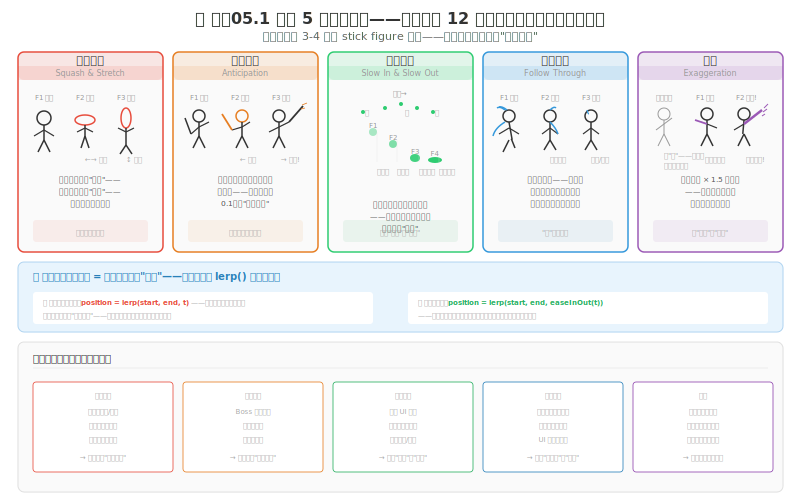
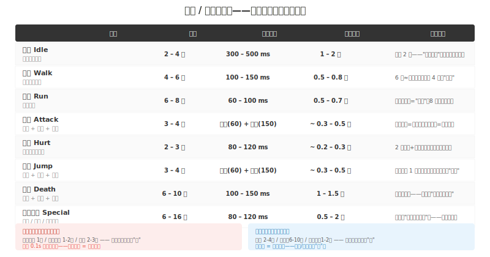
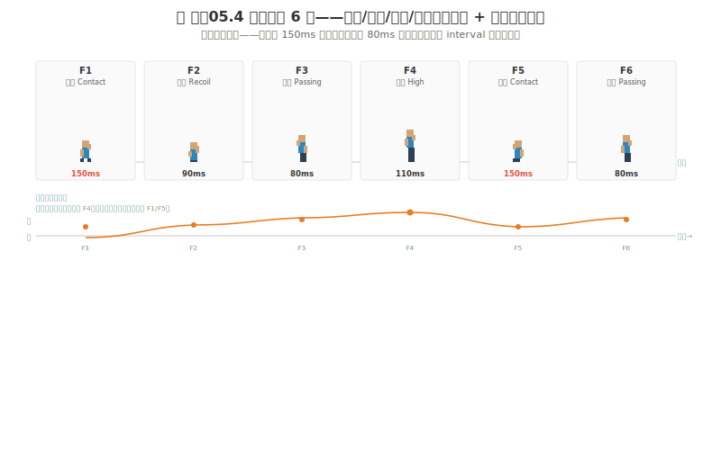
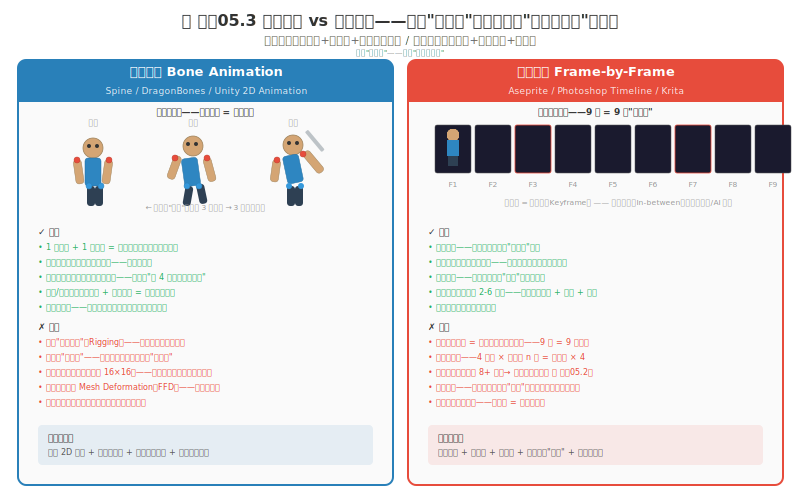
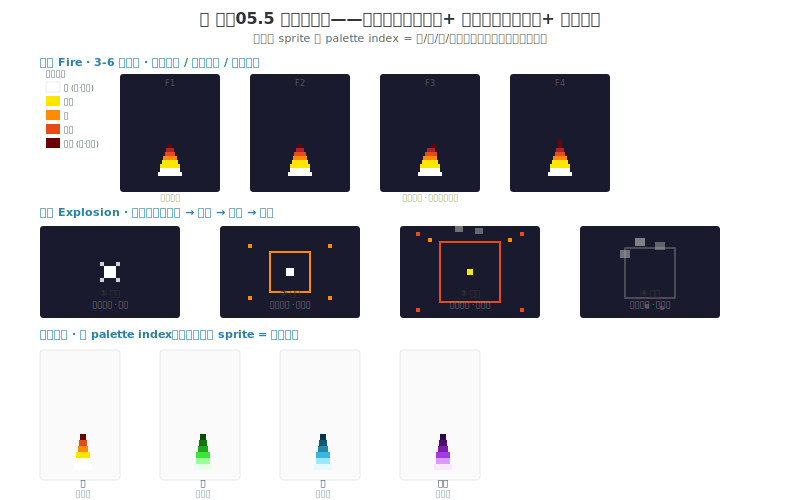

# 制作05 动画与特效：让像素动起来

### 5.0 这一章解决什么问题

制作04 收尾时，你的贯穿角色终于"有地方站"也有了 HUD——`character-final.png` 站在 `scene-v01-tile.aseprite` 里，头顶血条、脚踩 tile。可它还是一张"静止的图片"——站着是图片，走路是"滑行的图片"，攻击是"一张图片瞬间跳到另一个位置"。这不是"动画不好"——这是"没有动画"。

动画（Animation）是你让角色从"图片"变成"活物"的唯一方式。没有动画的游戏——再好的美术看起来都是一个"幻灯片"。有了好动画——哪怕你的美术不精致（stick figure 小人加色块），角色也会看起来"有灵魂"。这一章同时是全书"特效"的唯一入口——攻击要冒火、爆炸要有冲击波、发光武器要能脉动——这些 VFX（Visual Effects，视觉特效）以前没讲过，本章一并补上。

**独立游戏动画的两重矛盾：**
1. **动画是"帧数 × 方向数"的乘法。** 一个角色 9 个动作 × 平均 6 帧 = 54 帧——再乘 4 方向 = 216 帧——再乘你的角色总数 = 你的动画工时。AAA 有专门动画师做每一帧——你一个人要做完所有帧。你的动画决策必须从一开始就考虑工时上限。
2. **动画原则对你的媒介极度敏感。** 像素动画（8×8 到 64×64）的"一帧"和手绘（200×400）的"一帧"工时相差几十倍。你的帧数决策必须基于你的实际媒介——不是看 AAA 怎么做就怎么做。

**本章核心承诺：** 你将学会动画 5 条核心原则——从迪士尼 12 条中精选对独立游戏最重要的 5 条——每条配游戏应用对照。你将拥有一张帧数决策矩阵——9 种常见动作的推荐帧数、每帧时长、总时长——这是你估算动画工时的基准数据。你将理解骨骼 vs 逐帧的取舍——不是"哪个更好"，是"你的技能和时间预算决定了哪个适合你"。最后你将拿到一套特效配方——火、激光、发光、爆炸、破坏、物理——以及把它们一份 sprite 复用成火/毒/冰/诅咒四种的换色技法。

> **贯穿式项目衔接：** 制作02 你完成的 `character-final.png` 至今是静止的——制作03 给它场景、制作04 给它 HUD，但都没让它"动"。本章 L1 你就用它做弹跳球的挤压拉伸练习（拿它当球也行，拿它当被击飞的受击帧也行），L2 给它加 2 帧呼吸待机——它从这一章开始"活着"，下一章制作06 才谈非手绘的替代管线。

---

### 5.1 五条核心动画原则——你不是迪士尼，但你可以"偷"他们的 5 个东西

1930 年代迪士尼的"九老"（Frank Thomas 和 Ollie Johnston）在《The Illusion of Life》中总结了 12 条动画原则。独立游戏开发者不必掌握全部 12 条——你只需要 5 条。这 5 条直接决定角色的"活感"和游戏感。书 B 把 12 条中最相关于像素的列了 6 条（挤压拉伸 / 预备 / 跟随 / 慢入慢出 / 弧线 / 次要动作）——其中 4 条和我这 5 条重合，弧线和次要动作我并入下面的"缓入缓出"和"跟随"里讲，不单列，避免重复。



*图 制作05.1：动画 5 条核心原则——从迪士尼 12 条中精选。每条配 3-4 帧 stick figure 序列——注意帧与帧之间的"关键变化"。这 5 条不是装饰性技巧——是决定"角色有没有灵魂"的东西。*

#### 原则一：挤压拉伸（Squash & Stretch）

物体运动时形状会变形。向上跳时身体被"拉长"，蹲下准备跳时被"压扁"，被重击时在冲击方向上"压缩"。**唯一约束：体积守恒。** 拉长时变窄，压扁时变宽——体积守恒让变形"可信"而不是"随意"。

这是游戏感的第一来源：球落地被压扁 = 玩家"感受到"重量和冲击力；角色跳起被拉长 = 玩家"感受到"向上的力。像素里怎么做：32×32 角色，"跳起"帧比"站立"帧高 4 像素、窄 2 像素；"蹲下准备"帧矮 4 像素、宽 2 像素——增加的高度 ≈ 减少的宽度，体积守恒。

#### 原则二：预期动作（Anticipation）

任何主要动作之前——角色先向**反方向**做一个小幅度预备。跳之前先蹲下，出拳之前先收拳，跑之前先后倾。这个"反向"瞬间给玩家大脑 0.1 秒预判时间——让大脑准备好"即将发生什么"。

这对独立游戏至关重要，因为它解决了"玩家看不到敌人攻击提示"的根本问题：Boss 从静止直接跳到攻击帧——玩家无法反应——不是玩家慢，是你没给反应窗口。攻击动画不是"出拳帧"——是"后摆帧 + 出拳帧"，后摆帧必须在命中前 100-200ms 出现（人类对危险的最快反应时间）。Boss 大招的预备长度 = 威胁程度：0.5 秒蓄力 = 玩家知道"大招来了" = Boss 战节奏之源。

#### 原则三：缓入缓出（Slow In & Slow Out）

运动开始和结束时慢、中间快。现实中有质量的物体因惯性不可能"瞬间进入恒速"（那需要无限力）也不可能"瞬间停止"（那需要无限减速）。你的动画必须模拟"开始慢 → 中间快 → 结束慢"——不能匀速。

这是"活的"和"死的"最清晰界限：匀速 = 机器人，缓入缓出 = 活物。走路每帧位移若恒定 4px——机器人；若是 3,4,5,5,5,4,3——有生命的行走（每半步起止都有惯性）。引擎里 UI / 摄像机 / 平台移动不用"画"缓入缓出——用缓动公式：`lerp(start, end, easeInOut(t))` 而不是 `lerp(start, end, t)`。标准函数：`easeInOutQuad(t) = t < 0.5 ? 2*t*t : -1+(4-2*t)*t`。低帧数像素里用"帧停留"（Frame Hold）模拟：跳跃顶点那 1 帧在屏幕上挂 120-180ms——这就是低帧数的缓出→缓入。

> **程序员类比：** 缓入缓出 ≈ 运动曲线的插值。匀速 = 每帧 `delta` 是常数；缓入缓出 = `delta` 变化——开始小（慢）、中间大（快）、结束小（慢）。这跟动画曲线编辑器里的贝塞尔控制柄是同一件事——左手柄控制"开始有多慢"，右手柄控制"结束有多慢"。

#### 原则四：跟随动作（Follow Through）

主体运动停止后——附着在主体上的附属部分（头发、衣服、披风、尾巴、挥舞的武器）**不会同时停止**。它们有惯性，继续运动，超越主体停止点，回弹，静止。这个"主体停了但附属物还在动"的瞬间创造"重量感"和"材质感"。

像素极简实现：32×32 角色"停步"帧的披风位置比"静止站立"帧向运动方向偏移 2px（惯性继续飘），下一帧回弹 1px，再回到静止——3 帧、3 像素偏移，玩家眼睛能感知"披风有重量"。书 B 把"次要动作"（Secondary Action，跳跃时头发飘动）单列——本质和跟随同源，我合并：附属物因主体运动而带的额外动效，都是这条。

#### 原则五：夸张（Exaggeration）

游戏动画不是对现实的"模拟"——是对现实的"强化"。你的角色不是真人。让攻击准备比真实拳击手幅度更大，让受击飞行距离比真人被击飞更远，让跳跃更高、空中停留更长。

这是游戏和模拟器最本质的区别：模拟器给你"真"，游戏给你"好玩"。现实剑砍弧度约 120°——你的游戏里从头顶后方 30° 砍到地面加小回弹约 160-180°，这额外弧度让玩家"看清剑的运动"而不是"看到一个模糊闪过"。现实拳击打中人退 10-20cm——你的游戏里人退 2-3 个身位，这个额外距离让"我打了他 → 他飞出去"的因果反馈强一个量级。死亡动画最夸张：不是"倒下"——是"后退 + 空中转一圈 + 落地弹一下 + 消散"。

---

### 5.2 帧数决策矩阵——你的动画工时基准

5.1 给了你"做什么"——这一节给你"做多少"。动画是"帧数"的艺术，每一帧代表一单位工时。你决定动画规格时——不是在决定"好看不好看"——是在决定**你接下来几个月有多少天要在动画桌上过**。



*图 制作05.2：帧数 / 时长参考表——9 种核心游戏动作的推荐帧数和时长。这不是"最好的"——是独立游戏社区最常见的"可玩"基准。你的实际帧数可以根据风格调整——但不能离开这些范围太远。*

这张表怎么读：**帧数** = 动作由几帧组成，越少越快做但越"跳跃"。**每帧时长** = 这一帧在屏幕上停留多久——短（60-80ms）= 快、有力、有冲击感（攻击蓄力、跳跃腾空）；长（120-200ms）= 缓慢、有重量感、有停顿感（呼吸、命中"挂住"）。**总时长** ≠ 总帧数 × 单帧时长——因为不同帧停留时间不同，有些帧被"挂住"更久。

> **程序员类比（帧时序）：** 帧时长 = 定时器 interval，**不等长 interval 制造节奏**。接触帧 150ms 是重音，过渡帧 60ms 是连读——就像你写动画循环时给不同 keyframe 配不同的 `duration`。全等长 interval = 节拍器 = 机械感；不等长 interval = 乐句 = 活感。你的 4 帧动画若帧时是 [60, 160, 60, 120]ms，比 12 帧全 80ms 的"匀速"动画打击感强得多。

**记忆法则：快速帧 = 反应力 / 长帧 = 重量感。** 攻击：蓄力快（60-80ms，前摇不能拖否则手感"肉"）+ 命中长（120-200ms，命中要"挂住"否则打击感消失）——这一快一慢 = 攻击手感核心。跳跃：腾空快（60-80ms，按跳就跳）+ 顶点长（120-180ms，空中"悬挂"）——这是平台跳跃的灵魂。行走 4-6 帧 100-150ms 中速有节奏；跑步 6-8 帧 60-100ms——帧多但因帧时短所以循环更快，跑步的"流畅"不是因为帧多，是因为每帧切换更快。

**工时计算：** 一个动作的动画工时 ≈ 帧数 × 每帧绘制时间。像素 32×32 一帧 ≈ 15-30 分钟。总工时 = (Idle + Walk + ... + Death 帧数) × 每帧工时 × (1 + 方向系数)：2 方向（左右翻转）×1，4 方向 ×3，8 方向 ×6。如果算出来"不可能"——你需要降级。

#### 工时不够时的三个降级策略

**降级一：帧数减半——"2 帧 Idle"。** 规格表说 Idle 2-4 帧——极致降级 2 帧：站姿 + 微呼（胸 / 头上移 1-2px）。代价：呼吸像"机械上下摆动"无缓的效果，极简像素可接受，高分辨率手绘会很机械。

**降级二：方向折叠——"只做左右"。** 4 方向降到 2 方向（左右翻转），上下移动用左右帧"飘移"（朝向不变只滑行）。代价：俯视角角色"侧滑"；但平台跳跃本就不需要上下朝向——对它这不是降级，是"按理就该这样"。

**降级三：帧复用——"攻击蓄力帧 = Idle 帧"。** 攻击蓄力本该独立 1-2 帧——偷懒让蓄力 = Idle 帧，下一帧直接跳命中帧。代价：攻击失去预备动作，玩家看不到蓄力信号，攻击变"瞬间 Idle → 命中"。快速战斗勉强可接受，Boss 战和需要可读的攻击中——没有预备 = 没有反应窗口 = 战斗变"靠猜"。

> **一句话：** 一致的低帧（所有角色所有动作都 4-6 帧）比不一致的混合帧（主角走 8 帧、NPC 走 2 帧）更统一——视觉上更像"有意识的风格选择"而不是"做不完的妥协"。**在项目开始时降级**（8→6），不要在中期被迫降级。

---

### 5.3 Aseprite 动画基础——帧、洋葱皮、帧率

书 A 的原则和矩阵是"该做什么"——书 B 补的是"在 Aseprite 里怎么操作"。Aseprite 的动画面板在窗口下方，动画由一系列帧（Frame）组成，快速播放产生运动错觉。

**帧操作：** 新建帧点动画面板的"+"；复制帧选中后右键 Duplicate Frame；删帧按 Delete；调顺序拖拽；预览点播放。

**帧速率（FPS）：** 传统动画 24 帧/秒，游戏常用 30，高端 60——但**像素动画常用 8-15 帧/秒**，低帧率是像素动画的风格特征，不是缺陷。你不需要追 60fps——你的 6 帧走路循环以 100ms/帧（10fps）播放就是"对"的。

**洋葱皮（Onion Skinning）：** 让你看到当前帧前后的半透明叠加图，像在透写台上工作。Aseprite 动画面板里跑步小人图标开启，可选看前帧 / 后帧 / 前后帧，可调半透明强度。注意：先在帧属性勾选 "Transparent: Enabled" 并选透明色，洋葱皮才正常。

> **程序员类比（洋葱皮）：** 洋葱皮 = git diff / 版本叠加——半透明显示前后帧，看运动轨迹。当前帧是 working tree，前帧是 HEAD^，后帧是 HEAD@{1}；三层叠在同一画布上，你一眼看到"这一帧相对前后改了哪些像素"——和 `git diff` 高亮改动的行是同一种"差分视图"。逐帧动画没有它，你就是在盲改——每帧重新画却不参照前后，围巾第 3 帧 12px 宽、第 5 帧 10px 宽的不一致就是这么来的。

**游戏动画状态：** 和电影动画不同，游戏动画要应对实时输入，被拆成独立状态——Idle / Walk / Run / Jump / Attack / Hurt / Death。Aseprite 里每个状态是一段独立的帧序列（一个 Tag），引擎按状态切换播放——这就是 5.2 矩阵里那 9 行动作的由来。你不必为每个状态做满帧数，但每个状态至少要有"可识别"的最低帧数（见 5.5 工作流）。

---

### 5.4 像素动画的两个独有陷阱——闪烁与最小移动

这是书 B 相对书 A 最关键的补充——书 A 讲动画原则时假设你能在帧间自由变形，但像素网格上你**没有亚像素**。两条像素专属的坑，手绘动画根本遇不到。

#### 陷阱一：像素闪烁（Pixel Flashing）

相邻帧之间，某些像素突然出现或消失，造成视觉跳动感——这是像素动画最常见的毛病。本质是：单像素在帧间反复跳色，玩家读作"闪烁"而不是"运动"。

**修法：** 保持过渡平滑，避免像素帧间突然出现 / 消失；检查相邻帧，让边缘变化最小化；非常小尺寸下某些闪烁无法避免——那就把闪烁的像素挪到不显眼的位置（轮廓内侧而非边缘）。

> **程序员类比（像素闪烁）：** 像素闪烁 = 像素级抖动噪声，像 bad antialiasing——单像素在帧间反复跳色，读作闪烁而非运动。就像你的渲染管线在相邻帧之间随机抖动 1 个采样点，玩家大脑做"帧间差分"时把这 1px 当噪声而不是位移。解法和去噪一样：让相邻帧的像素差尽量是"成块的位移"而不是"零散的跳色"。

#### 陷阱二：最小移动距离（Minimum Movement）

像素动画中一个物体的最小移动距离是 **1 像素**。如果角色的脚只有 3 像素高，那么"移动 1 像素"= 脚高度的 1/3——这是一个很大的跳跃。这就是为什么待机动画通常只需要 1 像素的上下移动——再多就"抽搐"，再少就看不见。

> **程序员类比（最小移动）：** 最小移动 = 低于 1 像素/帧的位移在像素网格上不可见——要么不移动，至少移动 1px，**没有亚像素**。像整数运算里没有小数：你想让角色"缓慢漂移 0.3px/帧"——在像素画布上等于 0px/帧（永远不动）或 1px/帧（三倍速）。要在低分辨率下做"慢动作"，靠的不是亚像素位移，是**帧停留**——同一帧挂 2-3 个 tick 再前进 1px（5.2 的 Frame Hold）。

这两条合起来是像素动画的"网格约束"——你的所有 5 条原则（5.1）都要在"整数像素"的前提下落地：挤压拉伸是整像素的增减，缓入缓出是帧停留不是亚像素间距，跟随是附属物整像素偏移。记住这点，5.1 的原则才不会在像素里"水土不服"。

---

### 5.5 走路循环——像素动画的第一课，与四步工作流

走路循环（Walk Cycle）是像素动画最基础也最重要的技能。书 B 给的标准是 8 帧，独立游戏社区 4-6 帧也常见（见 5.2 矩阵）——帧数越少越省工时，但步态越"跳"。



*图 制作05.4：6 帧走路循环——接触（Contact）/ 低位（Recoil）/ 过步（Passing）/ 高位（High Point）四个关键位 + 两个过渡。注意身体高度的上下起伏：双腿交叉时为波峰、双腿分开时为波谷。帧时序不等长——接触帧是"重音"。*

**走路循环设计要点：** 身体有上下起伏（波峰在双腿交叉时、波谷在双腿分开时）；手臂与腿交替摆动；头部保持相对水平（减少上下晃动）；脚跟先着地、脚尖最后离地。最易错的是"滑行感"——脚步移动 1px/帧，地面平移也必须 1px/帧，步速等于地速，否则角色像在冰上走。5.4 的"最小移动"在这里直接适用：脚每帧至少移动 1px，没有"半步"。

**测试：** 引擎里放一段水平地面让角色从左走到右看 5 秒——脚步速度和地面平移一致吗？不一致就是滑行感，这是动画中最常见也最破坏沉浸的错误。

#### 从走路循环到完整角色：四步动画工作流

你会画走路循环了——但一个角色有 7-9 个状态，先做哪个？书 A 给的四步顺序：

**第一步：先做空闲（Idle）。** Idle 是玩家不按键时的默认状态——玩家看到最多。Idle 是"死"的（纯静止帧=一张图），角色在整个游戏 70% 时间里看起来是死的。最低标准：至少 2 帧——站着 + 微浮动（呼吸）。32×32 身体上下浮动控制在 1px 内（5.4 的最小移动），64×64 可 2-3px 胸肩浮动 + 1 帧眨眼。测试：不输入让角色 sit there 看 10 秒——太快焦虑，太慢像尸体，1-2 秒呼吸循环（吸 0.5-1 秒 + 呼 0.5-1 秒）是自然尺度。

**第二步：做移动（Walk + Run）。** 玩家第二多时间在移动。最低标准：走路 4 帧、跑步 6 帧。4 帧是"极简可行"——2 帧做不到步态（至少 4 帧：左腿前 + 中间 + 右腿前 + 中间）。6 帧跑步能展现和走路的视觉差异——不只是"快了"，是身体前倾大、四肢摆幅大。走路和跑步必须是**不同动画**——不是同一套帧不同播放速度，否则跑起来像"冰上走"。

**第三步：做核心交互（Attack / Jump）。** 游戏性核心，帧数 / 时长直接影响手感（5.2 的"快帧=反应力"）。攻击最低 2-3 帧：后摆（1，预备）+ 命中（1，挂 120-200ms）+ 回弹（可选 1）。跳跃最低 3-4 帧：下蹲（1，预备）+ 腾空（1，60-80ms 快）+ 空中（1）+ 落地压缩（可选 1）。

**第四步：做特殊状态（Hurt / Death）。** 被动的、非玩家主动触发，但是最强烈的情感触发点。受击最低 2 帧：身体后仰（1）+ 回弹恢复（1），挂 80-120ms 让玩家"感受到被打了"，加闪白 / 闪红强化反馈。死亡最低 3-4 帧——不是"倒下"是"死亡序列"：后退（1）+ 倒地（1）+ 消散（1-2，Alpha 1→0 或边缘逐像素消散）。

> **程序员类比（四步工作流）：** 这四步 ≈ 实现 CRUD 的顺序——先做 Read（Idle 是默认读状态，访问频率最高），再做高频写（Walk/Run），再做业务核心（Attack/Jump 是你的核心 API），最后做异常路径（Hurt/Death 是 error handler）。先做访问频率最高的状态——因为它的"最低标准"决定了角色 70% 时间的观感。

---

### 5.6 骨骼动画 vs 逐帧动画——不是"哪个好"，是"哪个适合你"

这是独立开发者最关键的一个动画决策——选错了，接下来几个月的时间预算会被吞噬。



*图 制作05.3：骨骼 vs 逐帧——这不是"技术优劣"对比，是"你的技能分配和时间预算"对比。选错路线 = 你花 2 个月做了一个"不该用这个技术"的东西。*

**骨骼动画（Bone）：** 角色分成多个部分（头 / 身体 / 手臂 / 腿 / 武器）各绑一根骨骼，做动画时不是"重画整帧"而是**旋转骨骼**，引擎自动算各部分新位置。工具：Spine（行业标准）、DragonBones（免费）、Unity 2D Animation、Godot Skeleton2D。选骨骼的条件：分辨率较高（64×64 以上或手绘尺寸）、需要多方向（4 / 8 向，旋转根节点即可换朝向）、动画需频繁迭代（改姿态是秒级）、需要换装（换纹理骨骼不变，动画自动继承）。骨骼的"机械感"问题：纯骨骼无 Mesh Deformation 时关节是"两硬块旋转"——像木偶；解法是 FFD 网格变形平滑关节，但门槛更高。

**逐帧动画（Frame-by-Frame）：** 每一帧是独立绘制的完整图，9 帧走路 = 9 次完全重画。工具：Aseprite（像素标准）、Krita、Photoshop Timeline。选逐帧的条件：你是像素艺术（像素细节无法被骨骼控制，像素级手工不可替代）、帧数少（每动作 2-6 帧，此时逐帧总绘制时间 < 骨骼的"绑定+调试"总时间）、单 / 双方向（逐帧多方向成本线性增长）、风格需要"独特手工感"（骨骼做不出"某帧眼睛歪、围巾随机飘"的微观个性）。逐帧最大难点：不同帧同一角色可能因"每帧重画"而不一致——围巾第 3 帧 12px 宽、第 5 帧 10px 宽会让围巾在动画里"跳"（闪烁，见 5.4）。解法：洋葱皮（5.3）。

**决策公式：**

```
if (你的媒介 == "像素" && 帧数 < 8) {
    选逐帧
} else if (方向数 >= 4 || 需要换装) {
    选骨骼
} else if (分辨率 >= 64×64 && 帧数 >= 8) {
    选骨骼
} else {
    选逐帧  // 逐帧是低门槛默认——没有骨骼的学习成本
}
```

> **程序员类比（骨骼 vs 逐帧）：** 骨骼 = 骨架绑定（像 React 组件树复用变换）——一套骨骼定义，旋转节点生成所有姿势，数据小、可换装、多方向便宜，但牺牲变形自由、关节有"机械感"。逐帧 = 手写每帧（像手写汇编）——每帧全控、能做像素级个性，但改一个动作要重画所有帧、多方向成本线性爆炸。不确定时 = 逐帧（学习成本低，你能立刻开始）。一句话：像素 = 逐帧，高帧数 + 多方向 = 骨骼。

---

### 5.7 特效三原则与配方——火、激光、发光、爆炸、破坏、物理

前面五节讲的是"角色怎么动"——这一节讲"角色动了之后，世界怎么响应"。特效（VFX，Visual Effects）是像素艺术最具表现力的部分，但特效的核心不是炫技，是**清晰地传达游戏中发生了什么**。这是全书"特效"的唯一入口——书 A 没有专章，书 B ch12 整章并入此处。

#### 特效三原则

1. **可读性优先：** 玩家必须一眼就懂这是"火焰""爆炸"还是"激光"——不能是"一团模糊的亮色"。
2. **风格一致：** 特效风格必须和整体美术统一——像素游戏里特效也得是像素，不能突然出现一个矢量柔光球。
3. **性能意识：** 特效帧数越多运行时越耗性能——同屏 10 个爆炸各 8 帧 = 80 个 sprite 在动。特效帧数宁少勿多，3-6 帧够用。



*图 制作05.5：特效配方卡——上半是火焰（色板阶梯 白→亮黄→橙→红橙→深红，根部固定、顶部渐暗、每帧变形）、下半是爆炸的四拍结构（闪光→扩张→峰值→消散）。同一份 sprite 换 palette index 即得火 / 毒 / 冰 / 诅咒四种。*

#### 火（Fire）

火焰是最常见的特效，通常 3-6 帧循环。要点：**底部最亮**（温度最高，亮黄 / 白）、**顶部渐暗**（橙→红→深红）、**每帧形状不同**（避免机械重复）、**根部固定**（与物体接触点在所有帧位置一致，否则火像在"跳"）。典型色板阶梯：

```
白色 → 亮黄 → 橙 → 红橙 → 深红
```

#### 激光与射线（Lasers）

激光的核心是**强烈方向性 + 高对比度**。中心极亮（白 / 最亮色）、边缘发光（两侧加光晕）、发射动画（从发射点到目标快速展开）、消散动画（发射后渐隐）。表现发光线条（如绊线、陷阱线）——在线条两侧加淡色过渡像素制造发光感。

#### 发光（Glow）

发光的关键是**逐层扩散的半透明光环**：核心用最亮色画物体本身 → 内晕（较淡同色一圈）→ 外晕（更淡 / 半透明最外层）→ 脉动动画（光晕大小或透明度循环变化）。魔法 / 能量效果可用**色相循环**（Hue Cycling）让发光物体自动变色，制造能量涌动感。

#### 爆炸（Explosions）——四拍结构

爆炸要表现**能量向外扩散**，典型结构是四拍（图 制作05.5 下半）：

1. **初始闪光：** 一个白色亮点——爆炸的开始。
2. **扩张：** 碎片和烟雾向四周扩散。
3. **峰值：** 爆炸达到最大范围。
4. **消散：** 碎片下坠、烟雾飘散渐隐。

构成元素：中心闪光（白 / 亮黄）、碎片（向各方向飞散的小块）、冲击波（快速扩散的环形波纹）、烟雾（缓慢上升渐隐的灰 / 深色烟）。

#### 破坏与损伤（Damage）

**表面损伤：** 裂缝（不规则锯齿线）、凹陷（深色像素制造凹痕）、烧焦（黑 / 深棕不规则斑点）、碎裂（边缘缺口）。**物体碎裂：** 被破坏时 2-3 帧过渡——完整 → 出现裂缝 → 碎裂成块。**状态切换：** 完整箱子 → 打破的箱子，用 2-4 帧过渡让切换自然（不要"瞬间替换"）。

#### 物理（Physics）

**掉落：** 加速（下落速度递增模拟重力）→ 碰撞（落地瞬间加一个挤压帧，5.1 原则一）→ 反弹（落地后轻微回弹再静止）。**弹跳：** 关键是"每次弹起高度递减、速度递增"——快速起落几次后停止。物理特效可以直接复用 5.1 的挤压拉伸——掉落物落地那帧压扁、弹起那帧拉长，零额外原则学习成本。

---

### 5.8 特效复用——一份 sprite，火 / 毒 / 冰 / 诅咒四种

独立游戏工时是乘法——你不可能为每种元素各画一套特效。书 B 给的复用三法是省工时的关键。

**颜色替换（Palette Swap）：** 同一个特效模板只改颜色就变成完全不同的效果——红色调 → 火 / 爆炸，蓝色调 → 冰 / 魔法，绿色调 → 毒 / 自然，紫色调 → 暗影 / 诅咒。你的有限调色板（练手05）里这几个色相早就有 slot——换的是 palette index，不是重画像素。

> **程序员类比（换色复用）：** 换色复用 = 同一特效 sprite 换 palette index——火→毒→冰，零额外绘制，像换主题（dark / light theme 切换 CSS 变量）。像素图的"颜色"存在独立的调色板表里，sprite 存的是索引——你改表里的几个 RGB 值，所有引用该 index 的像素自动变色。一份火 sprite + 四套调色板 = 四种特效，存储成本几乎为零。

**缩放与镜像：** 大型特效可通过把小型特效放大获得（注意整数倍缩放保持像素硬边，非整数倍会糊——制作07 上引擎会专门讲）。镜像翻转可生成对称特效（左右对称的爆炸 = 一半手画 + 水平翻转）。

**旋转：** 某些特效（能量球、旋风）可用旋转动画——Aseprite 里用旋转工具或逐帧手绘实现。注意：像素旋转会产生锯齿失真——小角度旋转宁可手绘重画，不要硬转。

---

### 5.9 练习

#### L1 · 弹跳球——4 帧验证挤压拉伸与缓入缓出（20 分钟）

**目标：** 用最经典的动画入门练习体验 5 条原则中的 2 条。

**步骤：**
1. Aseprite 新建 64×128 画布。
2. 画一个圆球，4 帧循环：F1 球在高位（圆形）→ F2 球落地拉长（挤压）→ F3 球反弹压缩（拉伸）→ F4 球回到高位恢复正常。
3. 帧时长 100ms/帧，循环播放。
4. 调整：过渡太均匀就把中间帧缩到 60ms（加速下落）、接触帧拉到 150ms（减速挤压）——体会 5.2 的"不等长 interval 制造节奏"。

**怎么检验：** 播放 4 帧循环，球看起来在"弹跳"而不是"闪烁"——能感知重力感。若像上下平移而非弹跳，问题在挤压拉伸变形不够夸张（或踩了 5.4 的像素闪烁——边缘像素跳色）。**最低完成线：** 4 帧之间存在"落地拉长→反弹压扁"的变形差异即过。

#### L2 · 给贯穿角色加 2 帧呼吸待机（15 分钟）

**目标：** 让制作02 的 `character-final.png` 从"静止图片"升级到"在呼吸的活物"。

**步骤：**
1. 打开 `character-final.png`，复制第 1 帧为第 2 帧。
2. 第 2 帧把躯干整体上移 1 像素（模拟吸气）——注意 5.4 的最小移动：1px 是极限，别移 2px 否则"抽搐"。
3. 开洋葱皮（5.3）检查过渡平滑、无像素闪烁。
4. 帧速 500ms/帧（2 帧/秒）播放预览。

**怎么检验：** 角色在"呼吸"而非"机械上下"。1-2 秒一个循环是自然尺度。这一帧是你角色"活着"的起点——制作06 之前它就靠这 2 帧撑场面。

#### L3 · 4 帧火焰特效 + 换色复用（25 分钟）

**目标：** 体验 5.7 的火焰配方和 5.8 的换色复用。

**步骤：**
1. 新建 32×32 画布，设计 4 帧火焰循环。
2. 定义色板：白 → 亮黄 → 橙 → 红 → 深红（5.7 的色板阶梯）。
3. 画每帧火焰形状——根部固定、顶部渐暗、每帧变形（避免机械重复）。
4. 帧速约 100ms/帧播放。
5. **复用挑战：** 复制这份火焰，把色板换成 蓝→青→白 → 绿→黄绿→深绿 → 紫→品红→深紫——同一份 sprite 现在是冰 / 毒 / 诅咒三种特效，零额外绘制。

**怎么检验：** 火看起来在"烧"（向上蹿动）而不是"闪"。换色后的三种特效各自可读（玩家一眼分得清冰 / 毒 / 诅咒）——5.7 可读性原则 + 5.8 换色复用同时验证。

---

### 5.10 本章小结

- **5 条核心原则从迪士尼 12 条精选：挤压拉伸 / 预期 / 缓入缓出 / 跟随 / 夸张。** 每条都在独立游戏的极简帧数（2-8 帧/动作）下有效——不是需要 24fps 才能用的高级技巧。书 B 的"次要动作"并入跟随、"弧线"并入缓入缓出的间距——不单列避免重复。
- **帧数矩阵是动画工时基准。** 快速帧（60-80ms）= 反应力（蓄力、腾空），长帧（120-200ms）= 重量感（命中、顶点）——这一快一慢的对比 = 手感全部来源。帧时长 = 不等长 interval 制造节奏，比帧数多少更重要。
- **三降级：帧数减半 / 方向折叠 / 帧复用。** 一致的低帧比不一致的混合帧更像"风格选择"——开始时降级，别中期被迫降级。
- **Aseprite 三件套：帧 / 洋葱皮 / 帧率。** 洋葱皮 = git diff 看前后帧差分；像素动画 8-15fps 是风格不是缺陷。
- **像素两个独有陷阱：像素闪烁 / 最小移动。** 没有 subpixel——要么不动，至少 1px；"慢动作"靠帧停留不靠亚像素位移。所有 5 条原则都要在整数像素前提下落地。
- **骨骼 vs 逐帧：** 像素 = 逐帧（手写汇编），高帧数 + 多方向 = 骨骼（React 组件树复用变换）。不确定时 = 逐帧。
- **特效三原则：可读 / 一致 / 性能。** 配方：火（色板阶梯白→深红，根部固定）、激光（中心亮 + 边缘光晕）、发光（逐层扩散 + 色相循环）、爆炸（闪光→扩张→峰值→消散四拍）、破坏（裂缝 / 凹陷 / 烧焦 / 碎裂）、物理（掉落加速 + 挤压反弹）。
- **特效复用三法：换色 / 缩放镜像 / 旋转。** 换色 = 同一 sprite 换 palette index（火→毒→冰→诅咒，像换 theme），一份 sprite + 四套调色板 = 四种特效。

> **如果只记住一句话：** 好动画不取决于**帧数多**——取决于**关键帧时长的对比**。4 帧 [60,160,60,120]ms 比 12 帧全 80ms 有更强打击感和活感——帧时长的变化 = 动画的灵魂，帧数的多少 = 灵魂的"分辨率"。

> **上手行动：** 今晚做 L1 弹跳球（20 分钟，验证挤压拉伸 + 缓入缓出），再做 L2 给 `character-final.png` 加 2 帧呼吸——你的贯穿角色从这一章开始"活着"。下一章制作06 才谈非手绘的替代管线（3D 渲像素 / AI / 程序化），在你没掌握手绘逐帧之前，别急着跳过去。

---

### 5.11 扩展阅读

1. **[Thomas, Frank & Johnston, Ollie. 《The Illusion of Life: Disney Animation》](https://www.amazon.com/Illusion-Life-Disney-Animation/dp/0786860707)** — 12 条动画原则的原始出处。**为什么推荐：** 5.1 的 5 条精选自这 12 条——卡住时回到这 12 条找你缺的那条。
2. **[Alan Becker — "12 Principles of Animation" YouTube 系列](https://www.youtube.com/watch?v=uDqjIdI4bF4)** — 网络上最通俗的 12 条视频。**为什么推荐：** 极简 stick figure 展示每条原则，每条 1-2 分钟就懂。
3. **[GDC — "The Art of Screen Shake" by Jan Willem Nijman](https://www.youtube.com/watch?v=AJdEqssNZ-U)** — Vlambeer 讲屏幕抖动和 Juice。**为什么推荐：** 5.2 的"快帧=反应力"涉及的屏幕抖动和攻击反馈——Vlambeer 是游戏感极致实践者。
4. **[Aseprite 官方文档——动画 & 洋葱皮](https://www.aseprite.org/docs/)** — 像素动画标准工具。**为什么推荐：** 5.3 的洋葱皮在 Aseprite 按 F3 开启——做每帧时同时看到前后帧幽灵。
5. **[Spine 官方文档](https://esotericsoftware.com/spine-documentation)** — 2D 骨骼动画行业标准。**为什么推荐：** 5.6 骨骼路线——Spine 是 2D 游戏骨骼的"不变选择"，曲线陡但效果极好。
6. **[DragonBones 官方文档](https://docs.egret.com/dragonbones)** — 免费 2D 骨骼替代。**为什么推荐：** 没 Spine 预算（$69-299）时的开源替代，功能没那么完善但能完成独立游戏骨骼需求。
7. **[Michafrar. 《Pixel Logic — A Guide to Pixel Art》](https://www.pixellogic.net/)** — 像素动画专章。**为什么推荐：** 5.4 的像素闪烁 / 最小移动在 Michafrar 书中有逐像素实现案例。

---

### 5.12 本章引注

[^1] Thomas, Frank & Johnston, Ollie. 《The Illusion of Life: Disney Animation》, Abbeville Press, 1981. 动画 12 条原则原始出处——5.1 的 5 条核心原则从中精选。
[^2] 书 B 第 11 章《动画原理》——Aseprite 动画基础、洋葱皮、12 原则中像素相关的 6 条、像素闪烁、最小移动、游戏动画状态、走路循环。5.3 / 5.4 / 5.5 的素材来源。
[^3] 书 B 第 12 章《动画特效》——特效三原则、火 / 激光 / 发光 / 爆炸 / 破坏 / 物理 / 复用。5.7 / 5.8 的素材来源。
[^4] Sprite-AI. "Animation Frame Data Analysis." 独立游戏社区动画帧数 / 时长统计——5.2 帧数决策矩阵的统计数据来源。
[^5] Aseprite. https://www.aseprite.org/ — 像素动画标准工具，支持洋葱皮和帧管理。
[^6] Esoteric Software. Spine — 2D Skeletal Animation Tool. https://esotericsoftware.com/ — 2D 骨骼动画行业标准。
[^7] Becker, Alan. "12 Principles of Animation." YouTube, 2017. https://www.youtube.com/watch?v=uDqjIdI4bF4 — 12 条原则极简化视频教程。
[^8] Nijman, Jan Willem. "The Art of Screen Shake." GDC, 2013. https://www.youtube.com/watch?v=AJdEqssNZ-U — Vlambeer 游戏感演讲，屏幕抖动 / Juice / 帧时长对比。

---

> **下一章：制作06 非手绘管线。** 你有了角色、场景、UI、动画、特效——全套手绘像素资产。但手绘逐帧是工时黑洞——下一章给你三条替代管线：3D 渲染成像素、AI 辅助生成、程序化生成——以及《Dead Cells》怎么用 3D 渲像素省下海量动画工时。在你没掌握手绘之前别跳过去——但要知道替代品在哪。
