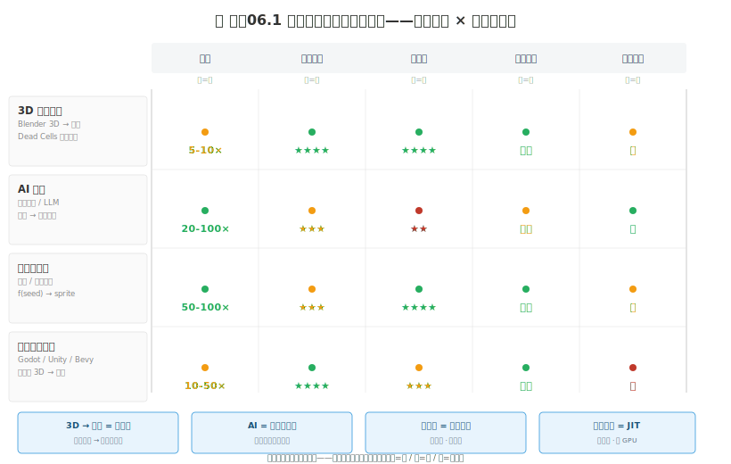
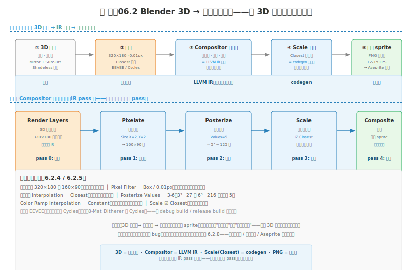
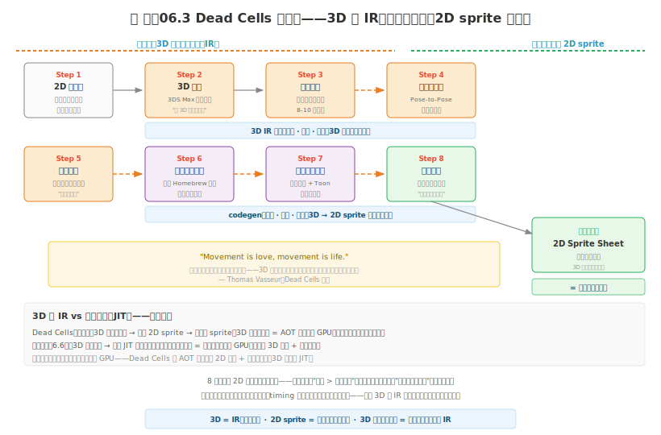

# 制作06 非手绘管线：3D、AI 与程序化

### 6.0 这一章解决什么问题

制作05 收尾时，你的贯穿角色终于"活着"了——2 帧呼吸待机，会挤压拉伸的弹跳。但你做那个 2 帧呼吸花了 15 分钟，做完一个角色的 7-9 个状态（Idle/Walk/Run/Jump/Attack/Hurt/Death）至少要一周——再乘 4 方向、再乘你的角色总数，你的动画工时账单会爆。这就是上一章 5.2 帧数矩阵那张表背后的真相：**手绘逐帧是工时黑洞**，一个人做不完一整个游戏的动画。

这一章不是教你"画得更好"——是给你**替代管线**。当手绘逐帧的工时撑不住资产规模（几十个角色、上百帧动画、数千个 Tile）时，你能用 3D 软件、AI、程序化生成、引擎实时渲染来"外包"掉一部分逐像素的劳动。这些方法打破了第 1 章"每个像素都有意放置"的传统定义——但在实际游戏开发中已被广泛采用，包括《死亡细胞》（Dead Cells）这种像素标杆。

**先声明立场：手绘是根本，非手绘是杠杆。** 你在读这一章之前，应该已经走过制作01-05 的手绘基本功——能画一条干净的线、能控制 Banding、能做 2 帧呼吸。在你根本都还没扎实之前跳到非手绘管线，等于还没学会写函数就去用代码生成器——生成出来的东西你连 review 都做不到。杠杆放大的是你已有的能力，不是凭空替代它。

**本章核心承诺：** 你将了解非手绘像素艺术的四大技术路线，掌握 Blender 3D→像素这条最成熟管线的核心工作流，知道 AI 辅助生成（注意：是"生成"，不是观察05 的"反馈"）的边界，理解程序化批量生成和引擎实时渲染各自适合什么场景，并看清 Dead Cells 是怎么用 3D 当"中间表示"省下海量动画工时的。

> **贯穿式项目衔接：** 制作05 给你的 `character-final.png` 加了 2 帧呼吸——这一章不直接给它加东西。本章是"工具栈扩展"：当你将来要做第 2、第 5、第 20 个角色时，手绘逐帧不再是唯一选项。L1 让你跑通一次 Blender 3D→像素，体会"编译"一次角色是什么感觉。

---

### 6.1 方法概览——四条非手绘管线

非手绘像素艺术方法可以分成四大类。先看全景，再逐个展开。

*图 制作06.1：四条非手绘管线对比矩阵——横轴是四条管线，纵轴是五个评判维度。右上角标注了每条的程序员类比。注意没有一条在所有维度上都占优——选型就是选你愿意付的代价。*

| 类别 | 核心思路 | 效率提升 | 风格保真度 | 学习成本 |
|------|---------|---------|-----------|---------|
| **3D 渲染管线** | 建模后低分辨率像素化渲染 | 5-10× | ★★★★ | 中（需 3D 基础） |
| **AI 生成** | 文本/图片 → AI 生成像素图 | 20-100× | ★★★ | 低 |
| **程序化生成** | 代码/规则批量生成资产 | 50-100× | ★★★ | 中（需编程） |
| **游戏引擎实时渲染** | 引擎内实时 3D→像素渲染 | 10-50× | ★★★★ | 高（需着色器编程） |

> **程序员类比（四条管线各自的对应物）：** 3D→像素 = **编译器**（高维源码编译到像素目标码）；AI 生成 = **代码生成器 / Copilot**（起骨架不负责正确性）；程序化 = **脚本批量生成**（确定性、可复现）；引擎实时 = **JIT 编译**（运行时把 3D 编译成像素，省存储吃 GPU）。这四个类比贯穿全章，记住它们你就记住了每条管线的本质。

#### 6.1.1 3D 渲染管线（本章重点）

当前最成熟、最实用的非手绘方法。核心思想极简：**在 Blender 等 3D 软件中建模，用低分辨率 + 无抗锯齿的方式渲染输出**，产生像素风格。代表作 Dead Cells 全程用此管线做角色动画。这是 6.2 的主角。

#### 6.1.2 AI 生成

用扩散模型或大语言模型生成像素风格图像。适合概念探索和快速原型——但输出必须经过大量后处理才能达到游戏可用标准。注意：这里的 AI 是**生成**素材，和观察05 的 AI **反馈**是两件事——6.4 会专门把这条边界讲清楚。

#### 6.1.3 程序化生成

通过代码和规则自动生成像素资产。适合大规模批量生产（几十个不同颜色的怪物、几百个头像）。你写的是"生成器"而不是"产物"——确定性、可复现，给同样的种子永远得到同样的输出。6.5 展开。

#### 6.1.4 游戏引擎实时渲染

在 Godot 等引擎中通过自定义渲染管线实现实时 3D 像素化。适合需要运行时完整 3D 交互的像素风格游戏（如全 3D 场景但视觉是像素）。6.6 展开。

---

### 6.2 Blender 3D → 像素艺术管线

这是本章的核心，篇幅最大。因为它是当前独立游戏社区验证过最实用的非手绘路线——Dead Cells、以及大量独立项目都在用。

#### 6.2.1 核心原理——3D 是源码，像素是目标码

把 3D 模型渲染成像素风格，本质上做三件事：

1. **降低分辨率** — 渲染输出分辨率降到 320×180 甚至更低
2. **禁止平滑** — 关闭所有抗锯齿和纹理过滤，强制最近邻采样
3. **限制颜色** — 把颜色数量量化到有限调色板

> **程序员类比（3D→像素 = 编译器）：** 3D 模型是**高维源码**——每个顶点有 xyz、每面有法线、材质有 PBR 参数，信息维度远超像素网格能承载的。像素图是**目标码**——固定分辨率、固定调色板、每个像素一个颜色索引。从 3D 到像素就是一次"编译"：Blender 的 Compositor（合成器）是 **LLVM IR 阶段**——在中间表示层做优化（像素化、量化、抖动），最后一步 downscale 才是**目标码生成（codegen）**。你改源码（3D 模型）→ 重新编译 → 得到新目标码（像素 sprite），迭代成本是"重新渲染"而不是"重画所有帧"。

**关键技术参数：**

| 参数 | 推荐值 | 作用 |
|------|--------|------|
| 渲染分辨率 | 320×180 或 160×90 | 越低像素感越强 |
| 纹理过滤 | Closest（最近邻） | 防止纹理模糊 |
| Pixel Filter | 0.01px | 消除 EEVEE 亚像素模糊 |
| 颜色数量 | 8-32 色 | 通过 Posterize 或 Color Ramp 限制 |
| 渲染引擎 | Cycles 或 EEVEE | Cycles 更精确，EEVEE 更快 |

#### 6.2.2 渲染引擎选择

| 引擎 | 优势 | 劣势 | 推荐场景 |
|------|------|------|---------|
| **EEVEE**（实时） | 速度快，视口即所得 | 光照精度偏低 | 快速迭代、动画预览 |
| **Cycles**（光线追踪） | 光照精确，8-Mat Ditherer 可用 | 渲染慢 | 最终帧渲染 |

迭代阶段用 EEVEE 看大概效果，定稿时切 Cycles 跑精确光照——和你在 IDE 里先用 debug build 快速跑、最后用 release build 出正式包是同一节奏。

#### 6.2.3 第一步：建模原则——低模，因为像素会吃掉细节

3D 建模的风格直接决定像素化最终效果。关键原则：**不要建高精度模型**。像素化后所有细小细节都会丢失或被扭曲。

- ✅ 低多边形（low-poly）风格，大色块、少细节，表面尽量平滑（像素化后硬边会变成锯齿）
- ❌ 不要细小凹凸纹理、不要单独的小螺丝小装饰——它们在 160×90 下全部蒸发

角色建模的标准流程：基础体块（方块/圆柱/球体组合）→ Mirror 修改器保持对称 → Subdivision Surface（级别 1-2）平滑表面 → UV 展开（如用纹理）→ 绑定骨架（如有动画）。

**材质设置：** 对所有 Image Texture 节点把 Interpolation 设为 **Closest**（最近邻）。对纯色材质（不用贴图），用 Shadeless（无光照）材质效果更佳——`RGB → Emission → Material Output`，输出纯色块，光照不再搅乱你的调色板。

#### 6.2.4 第二步：渲染设置——三处必须改

这是把 3D 渲染转成像素风格的关键。

**输出分辨率**（Output Properties）：Resolution X/Y 设 320×180 或 160×90，Aspect Ratio 1:1。

**Pixel Filter**（Render Properties → Film）：Pixel Filter 选 Box，Filter Width 设 **0.01px**——这一步最关键，消除 EEVEE 的亚像素模糊。漏改这步你的像素边缘永远是"糊的"而不是"硬的"。

**纹理过滤**：所有 Image Texture 节点 Interpolation = Closest，Extension = Repeat 或 Extend。

#### 6.2.5 第三步：颜色量化——把渐变砍成色阶

3D 渲染天生产出连续光滑渐变——这和像素艺术的色块感是对立的。必须用量化强制产生色阶。

**方法 1：Color Ramp（推荐入门）。** 在 Shader Editor 里 Principled BSDF 的 Base Color 之前加一个 Color Ramp 节点，Interpolation 设为 **Constant**（常量插值），滑块数量控制颜色级数（建议 3-6 级）。

**方法 2：Posterize 节点。** 在 Compositor 中加 Posterize 节点，每通道颜色级数 Values=3-6（即 3³ = 27 色）。

**方法 3：8-Mat Ditherer（Lospec 方法）。** 需 Cycles 引擎。把不同材质指定不同 Material Index，在 Compositor 用 8-Mat Ditherer 组，为每种材质设独立色板阶梯（Color Ramp）和抖动参数——这是 Lospec Blender Toolkit 的招牌功能，6.3 详述。

#### 6.2.6 第四步：合成器像素化——IR 阶段的核心工作

Compositor 是 3D→像素编译器的"LLVM IR 阶段"——所有像素化、量化、抖动都在这里完成。

*图 制作06.2：Blender 3D→像素完整流程——上半是管线全景（建模 → 渲染 → Compositor 节点链 → downscale → 像素 sprite），下半是 Compositor 内部节点链（Render Layers → Pixelate → Posterize → Scale → Composite）。每个节点是一个处理 pass，箭头是数据流——和编译器 IR 的 pass 链是同构的。*

**Pixelate 节点：** Size X/Y 根据分辨率调整——320×180 下 Size=2 产生 160×90 像素块，Size=4 产生 80×45。

**Scale 节点：** Image 输入接 Pixelate 输出，勾选 **Closest**（最近邻）禁止平滑插值，缩放回需要的输出尺寸——这就是"目标码生成"那一步。

#### 6.2.7 动画输出

像素动画通常低帧率（12-15 FPS 而非 30 FPS）——这和制作05 的帧时序原则一致，低帧率是像素动画的风格特征。

**输出设置：** Format = PNG 序列帧，Color = RGBA（透明背景），Frame Rate = 12 或 15 FPS。渲染动画：Timeline 设时长 → Output Properties 设输出目录 → Render → Render Animation。

**后续处理：** 渲染出的 PNG 序列帧 → 导入 Aseprite 作为帧（File → Import → Sprite Sheet）→ 手动清理像素闪烁（5.4）→ 打包为 Sprite Sheet → 导入游戏引擎（制作07）。

#### 6.2.8 已知问题与解决方案

| 问题 | 原因 | 解决方案 |
|------|------|---------|
| **像素闪烁** | 边缘在不同帧落在不同像素位置 | 多级采样或后处理帧稳定；最后在 Aseprite 手动修几帧 |
| **颜色不一致** | 光照角度变化导致同一面颜色不同 | Shadeless 材质控制颜色；限制光源数量 |
| **细节丢失** | 低分辨率化后细小几何消失 | 建模时放大关键特征，避免细小元素 |
| **边缘锯齿跳动** | 模型边缘和像素网格对齐不一致 | 固定摄像机视角；像素完美平移（Pixel Perfect Panning） |

像素闪烁是这条管线最顽固的 bug——本质和 5.4 手绘动画的闪烁同源：相邻帧边缘落在不同像素位置。区别是手绘你能逐帧控制，3D 渲染你只能调摄像机和采样。这也是 Dead Cells 团队"本可以用手修复，但那违背了管线初衷"的取舍点（6.7）。

---

### 6.3 Blender 工具推荐——别从零搭节点链

6.2 教你手搭 Compositor 节点链是为了让你理解原理——实际生产中你不必每次从零搭，社区已经有成熟工具包。

**Lospec Blender Toolkit（免费）。** Lospec.com 出品的免费工具包，**单 blend 文件即用**，无需安装插件。包含 Shadeless Material（无光照纯色块）、8Mat Ditherer（8 种材质独立色板 + 抖动，需 Cycles）、Pixel Background（合成器插像素背景）、Vertex Jitter（PS1 风格顶点抖动）、Billboards（始终面向摄像机的平面，2D 精灵在 3D 场景用）。初次尝试 3D→像素就从这里开始——零安装门槛。

**Lucas Roedel 像素渲染插件（免费）。** 已更新至 Blender 5.0。通过屏幕空间 Bayer 矩阵 + Color Ramp 常量插值实现像素化光照。社区修改版增加了风格化高光和粒子烟雾效果。想理解像素化原理就读它的代码——免费且开源。

**Blender to Pixels（免费开源）。** Astropulse 开发的**纯合成器方案**——所有效果在 Compositor 完成，无需改材质或模型。8 通道独立色板阶梯、自动抖动、深度雾、风格化滤镜、内嵌文档。任何模型换一个材质值即可像素化渲染——和 6.2 的"3D 是源码"类比完美契合：源码不动，只改 IR pass 配置。

**True Pixel Art Generator（$15）。** Byte Bard 的付费插件，提供更完整的自动化：一键合成器设置、自动 Sprite Sheet 打包、Alpha 裁剪（自动算空白区域）、关键帧采样（保持真实复古帧率）、多视角渲染（前后左右/俯视）、GIF 导出。批量资产生产用它——自动化程度最高。

**工具选型一句话：** 初次尝试用 Lospec（零安装），理解原理用 Lucas Roedel（代码可读），纯合成器工作流用 Blender to Pixels（不依赖材质设置），批量生产用 True Pixel Art Generator（自动打包）。

---

### 6.4 AI 辅助像素生成——生成，不是反馈

先划一条本书最重要的 AI 边界：**观察05 讲的是 AI 做"反馈"（feedback），这一章讲的是 AI 做"生成"（generation）。** 两件事的能力边界完全不同，混淆了会踩大坑。

观察05 的 AI 是你的**私教/linter**——你看完画让它分析八维度、给改进建议，它不产出像素，只产出关于像素的判断。它的边界是：精确明度判断不行、像素级细节不行、原创性评价会奉承。

这一章的 AI 是你的**代码生成器/Copilot**——你给文本或图片，它直接产出像素图。它的边界是：产出的图边缘不干净、颜色偏离调色板、连续生成风格不稳定、缺乏逐像素控制。

> **程序员类比（AI 生成 = 代码生成器 / Copilot）：** AI 生成像素图 ≈ Copilot 生成代码——给你一个**草稿**，不是给你**正确性**。Copilot 写出的函数你能直接 merge 进生产代码吗？不能——你得 review、改 bug、调风格、补它漏掉的边界情况。AI 生成的像素图也一样：它是"起稿"，不是"成品"。**AI 产出 → 人工精修** 才是可用流程，直接用 AI 出图进引擎 = 直接用 Copilot 代码上生产 = 必出 bug。

**AI 像素艺术分类：**

| 类型 | 原理 | 代表工具 |
|------|------|---------|
| **文本→像素** | 扩散模型从文本生成 | PixelLab.ai、Adobe Firefly |
| **图片→像素** | 风格迁移或像素化转换 | AnyPixel、TeleStyle |
| **LLM 原生生成** | LLM 编写像素数据/代码 | PIXL（.pax 格式）、YoYoPixel |
| **智能体绘制** | AI 模拟人类逐像素绘制 | Texel Studio |

**推荐工作流（AI 产出 → 人工精修）：**

1. 在 PixelLab.ai 或 PixelAI（Aseprite 插件）生成基础像素图
2. 导入 Aseprite
3. 用练手08 的方法修 Banding 和抗锯齿
4. 用练手05 的方法优化调色板
5. 输出最终资产

**PixelAI（Aseprite 内置 AI）：** 直接在 Aseprite 内部使用的 AI 生成插件，支持本地模型（Python + SD/SDXL/FLUX）、云端模型（Replicate）、自定义 LoRA、框架抽取（自动分割 Sprite Sheet）、直接放入 Aseprite 画布作为新图层/帧——它把"生成"和"精修"放进同一个工具，省了导入导出。

**当前 AI 像素生成的四个局限（必须知道，否则会过度信任）：**

1. **边缘不干净** — 容易出现半透明亚像素（违反像素艺术的硬边原则）
2. **颜色不一致** — 同一 Sprite 不同区域颜色偏离调色板
3. **风格不稳定** — 连续生成的多个 Sprite 风格有差异（做一套角色时致命）
4. **缺乏逐像素控制** — 无法精确控制每个像素位置（像素艺术的核心恰恰是逐像素控制）

这四条和观察05 AI 反馈的局限是**对称的**：反馈 AI 看不清像素级细节，生成 AI 也控不住像素级细节。结论一致——**像素级的手工决策，AI 替代不了**。AI 适合概念探索和 placeholder，最终资产仍需手工精修。

---

### 6.5 程序化与批量生成——写生成器，不画产物

当你需要**大量变体**（几十个不同颜色/装备的角色、几百个头像、上千个 Tile），程序化生成比手工或 AI 都高效——而且**确定性**是它独有的优势。

> **程序员类比（程序化 = 脚本批量生成）：** 程序化生成 ≈ 写一个脚手架脚本批量生成文件——你写的是**生成器**，不是**产物**。给同样的输入（种子、参数）永远得到同样的输出，确定性、可复现。这和 AI 生成的"每次结果不同"是本质区别：AI 是概率采样，程序化是纯函数 `f(seed, params) → sprite`。Git 里追踪的是生成器代码和参数，不是成千上万张图——存储和 diff 都友好。

**Pixel Factory（Python 批量生成器）。** 开源 Python 工具，内置 4 个主题（森林可爱生物、地牢怪物、机器人外星人、海洋生物）。每个主题自动生成 Idle/Walk/Attack 三种动画，每种 4 帧。支持调色板变体、Sprite Sheet 打包、ZIP 导出——适合快速填充"需要一群小怪"的场景。

**piximps（确定性头像生成）。** 输入字符串 → 唯一恶魔头像，8×8 到 32×32，输出 SVG/PNG。同样的字符串永远得到同样的头像——这是确定性生成的典型用例：玩家 ID → 专属头像，无需存储图本身，只存 ID。

**PIXL（LLM 原生 Tileset）。** 用 TOML 格式的 `.pax` 文件定义 Tile，LLM 原生可编写。数据以 RLE（行程编码）存储像素，Git 友好（纯文本 diff）。提供 24 个 MCP 工具用于 AI 驱动的 Tileset 创建——这是 AI 生成和程序化的交叉点：LLM 写生成器（.pax），引擎读 .pax 渲染 Tile，产物是确定性的。

程序化生成的适用边界：它擅长**变体**（换色、换装备、换尺寸），不擅长**原创造型**——生成器本身仍需你手工设计基础模板。它放大的是"一个模板 → 一百个变体"的杠杆，不是"零 → 一"的创造。

---

### 6.6 游戏引擎实时渲染——JIT 编译像素

前三种管线都是"离线"生成 sprite——3D 渲染成 PNG、AI 生成 PNG、程序化生成 PNG，产物是静态文件。第四种管线不同：**在游戏运行时实时把 3D 场景渲染成像素**，不预生成 sprite。

> **程序员类比（引擎实时 = JIT 编译）：** 引擎实时渲染 ≈ **JIT 编译**（Just-In-Time）——运行时把 3D"源码"编译成像素"目标码"，不预编译成静态 sprite。好处：省掉海量预渲染存储（一个 3D 模型 + 着色器 = 无限视角的像素输出，不用存几千张 PNG）；代价：吃 GPU（每帧都要跑 3D 渲染 + 像素化 pass）。离线管线是 AOT 编译（Ahead-Of-Time）——预编译好存盘，运行时只读不编。选 AOT 还是 JIT 取决于你的瓶颈是存储还是 GPU。

#### 6.6.1 Godot 方案

**Project Shadowglass（2026）：** 目前最先进的 Godot 3D 像素风格案例。自定义着色器 + 渲染代码 + 像素稳定系统实现"全 3D 像素艺术"。因 Godot 开源，可直接改渲染器源码——你能改"编译器"本身，而不只是调参数。

**Godot PixelRenderer：** 使用 SubViewport 渲染 + Sobel 边缘检测 + Bayer 抖动，支持 GLTF 模型——开箱即用的 3D→像素 renderer，适合不想从零写 shader 的 Godot 用户。

引擎实时渲染的适用边界：它适合"3D 玩法 + 像素视觉"的游戏（全 3D 场景、自由摄像机），不适合传统 2D 像素游戏（那些用预渲染 sprite 就够）。门槛是着色器编程——你得能读懂 6.2 的 Compositor 节点链，再把它翻译成 Godot Shader。本节聚焦 Godot，它是本书的默认引擎。

---

### 6.7 真实案例：Dead Cells 像素管线——3D 当中间表示

Dead Cells（Motion Twin，2018）是 3D→像素管线最知名的实战案例。它的像素风格广受好评，但开发团队规模极小，没有人力手绘所有角色动画。解决方案和 6.2 节的核心思路完全一致：**3D 建模 → 低分辨率像素渲染 → 输出 2D 序列帧**——只是工具链从 Blender 换成了 3DS Max + 自研渲染器，细节上有自己的定制。

*图 制作06.3：Dead Cells 工作流——3D 当 IR（中间表示）。3D 模型只用于生成动画帧，最终产物是 2D sprite，3D 从不进入游戏。8 步流程：2D 概念图 → 极低面数 3D 建模 → 骨骼绑定 → 关键帧动画 → 插值策略 → 低分辨率渲染 → 法线贴图着色 → 手工精修。*

**工作流分解（8 步）：**

1. **2D 概念图** — 画出基本的 2D 像素角色概念稿
2. **3D 建模** — 在 3DS Max 中建极低面数模型（"会让专业 3D 艺术家流泪"）
3. **骨骼绑定** — 绑定骨架准备动画
4. **关键帧动画** — Pose-to-Pose 方法设关键帧
5. **插值策略** — 插值帧只加在关键帧前后，**绝不加在中间**（保持像素感）
6. **低分辨率渲染** — 自研 Homebrew 程序渲染低分辨率、无抗锯齿输出
7. **法线贴图着色** — 保留法线贴图 + Toon Shader，保留体积感
8. **手工精修** — 对关键帧手动清理像素闪烁

这 8 步和 6.2 节的 Blender 3D→像素管线本质上是同一条流水线，只是换了工具和加了几个自定义环节：6.2 用 Blender + Compositor 节点链，Dead Cells 用 3DS Max + 自研 Homebrew 渲染器；6.2 在 Compositor 里做颜色量化，Dead Cells 在自研渲染器里做低分辨率无抗锯齿输出；6.2 输出后可能需要少量手工修正，Dead Cells 专设了手工精修这一步来清理像素闪烁。**骨架是一样的：建模 → 动画 → 低分辨率渲染 → 后处理 → 像素 sprite。** 不是两套方法，是一套方法的两种实现——选 Blender 是因为它免费开源适合独立开发者，Dead Cells 选 3DS Max 是因为团队已有的工具链惯性。

> **程序员类比（Dead Cells = 3D 当 IR）：** Dead Cells 把 3D 当**中间表示（IR）**——3D 只在"编译期"存在，用来生成动画帧；最终产物是 2D sprite，**3D 从不进入游戏运行时**。这就像编译器用 LLVM IR 做优化和代码生成，但最终发布的二进制里没有 IR——只有目标码。游戏里跑的是 2D 序列帧，3D 模型留在构建管线里。对比 6.6 的引擎实时方案：那是 3D 进入运行时（JIT），Dead Cells 是 3D 只在构建期（AOT）。两种哲学，选哪个看你的运行时瓶颈。

**核心优势：**
- **迭代速度极快** — 新武器从模型到可玩动画在几天内完成
- **调整成本极低** — 动画 timing 可以在几分钟内迭代几十次（改 3D 关键帧重新渲染，而不是逐帧重画）
- **多人协同** — 不同角色由多个 3D 动画师并行制作

**局限性：**
- 像素闪烁问题未被根除（"本可以用手修复，但那违背了管线的初衷"）
- 细节层次有限（"这是一个遗憾的取舍"）
- 不适用于摄像机视角频繁变化的场景（2D sprite 不支持自由视角）

> "Movement is love, movement is life." — Thomas Vasseur，Dead Cells 主美。这句话点出了他们选 3D 管线的根本动机：动画的"运动"比单个帧的"像素精度"更重要——3D 管线让他们把精力投在运动节奏上，把像素闪烁当作可接受的取舍。

---

### 6.8 方法对比与选型指南

把六种方法（含手绘）放一起对比，帮你选型。

| 方法 | 效率 | 质量 | 学习成本 | 工具成本 | 适用场景 |
|------|------|------|---------|---------|---------|
| **手绘（制作01-05）** | 1× | ★★★★★ | 低 | Aseprite $20 | 所有场景（基本功） |
| **Blender 管线** | 5-10× | ★★★★ | 中 | 免费 | 动画角色、多视角资产 |
| **AI 生成+精修** | 10-20× | ★★★ | 低 | 订阅制 | 概念探索、placeholder |
| **程序化生成** | 50× | ★★★ | 中 | 免费 | 批量变体、头像、Tileset |
| **引擎实时渲染** | 10-50× | ★★★★ | 高 | 免费/引擎费 | 3D 像素风格游戏 |
| **Dead Cells 混合管线** | 5-10× | ★★★★★ | 高 | 商业软件 | 高质量像素动画 |

**如何选择（按你的身份）：**

**如果你是一个人开发者（独立游戏）：**
- 静态资产：Blender 管线 + Aseprite 精修
- 角色动画：Blender 管线（学 Dead Cells 模式）
- Tileset：手绘（制作03）或 PIXL（AI 辅助）

**如果你是小团队（2-5 人）：**
- 主美负责手绘关键角色
- 程序化生成批量小怪
- Blender 管线负责场景和道具
- AI 工具用于概念探索

**如果你做 3D 像素风格游戏：**
- 引擎实时渲染（Godot）
- 核心角色用 Blender 烘焙
- TAA 和子像素稳定必须配置

**一句话选型法则：** 手绘保质量上限，Blender 管线保动画效率，程序化保批量变体，AI 保概念探索速度，引擎实时保 3D 玩法。没有一条是"万能"——选你愿意付的代价。

---

### 6.9 练习

#### L1 · 首次 Blender 像素渲染——跑通一次"编译"（30 分钟）

**目标：** 用最简单的 3D 模型跑通 6.2 的完整管线，体会"3D 源码编译到像素目标码"是什么感觉。

**步骤：**
1. Blender 新建一个 UV 球体，加 Subdivision Surface（级别 2）。
2. 材质设为纯色（任意颜色），用 Shadeless（RGB → Emission）。
3. 渲染分辨率设为 320×180，Pixel Filter 设为 0.01px。
4. 在 Compositor 加 Pixelate 节点（Size=2）+ Posterize 节点（Values=5）+ Scale 节点（Closest）。
5. 渲染并观察输出——它应该看起来像像素图而不是 3D 渲染。

**怎么检验：** 输出图的边缘是硬的（锯齿分明）而不是糊的——如果糊，说明 Pixel Filter 或纹理过滤没改对，回去查 6.2.4。**最低完成线：** 一张 320×180 的像素风格球体渲染图即过——不必好看，跑通管线就是目的。

#### L2 · 色板级数对比——感受量化的代价（20 分钟）

**目标：** 体会 6.2.5 颜色量化中"级数"对像素感的影响，建立你的个人偏好基准。

**步骤：**
1. 用 L1 的同一个球体模型，渲染三次，分别用 3 级、6 级、12 级颜色（改 Posterize 的 Values 或 Color Ramp 滑块数）。
2. 把三张图并排放，比较"像素感"差异。
3. 记录你个人的偏好级数——这是你后续项目的默认值。

**怎么检验：** 三张图之间有可辨认的色阶差异——3 级最"块状"、12 级最"光滑"。你能说出自己偏好哪一级以及为什么。**最低完成线：** 三张图 + 一句你的偏好理由即过。

#### L3 · Dead Cells 风格极低面数角色动画（60 分钟）

**目标：** 用 6.7 的 Dead Cells 模式做一次"3D 当 IR"的完整体验——建模、绑骨、动画、渲染、精修。

**步骤：**
1. Blender 创建一个极低面数角色（<500 面）——不要追求精致，Dead Cells 的模型"会让专业 3D 艺术家流泪"。
2. 绑定骨架（8-10 根骨骼）。
3. 制作待机 → 攻击 → 待机的 Pose-to-Pose 动画——关键帧之间不加中间插值（6.7 第 5 步的插值策略）。
4. 低分辨率渲染输出序列帧（12 FPS）。
5. 在 Aseprite 中导入序列帧，打包为 Sprite Sheet，手动清理 2-3 处像素闪烁。

**怎么检验：** 最终 Sprite Sheet 在 Aseprite 里播放时角色在"动"而不是"闪烁"——6.7 的"运动比像素精度更重要"在你手上验证了一次。**最低完成线：** 一个可播放的 3 帧待机/攻击循环 Sprite Sheet 即过——不必精致，跑通"3D → IR → 2D sprite"的闭环就是目的。

---

### 6.10 本章小结

- **四条非手绘管线各有类比：** 3D→像素 = 编译器（高维源码 → 像素目标码，Compositor = LLVM IR，downscale = codegen）；AI 生成 = 代码生成器/Copilot（起草稿不保正确性）；程序化 = 脚本批量生成（确定性可复现）；引擎实时 = JIT 编译（运行时编译，省存储吃 GPU）。
- **Blender 3D→像素管线是当前最成熟的非手绘路线。** 核心三步：降低分辨率 + 禁止平滑 + 限制颜色。Compositor 是 IR 阶段——Pixelate → Posterize → Scale(Closest) 是标准节点链。工具从零到成熟：Lospec Toolkit（零安装）→ Lucas Roedel（读代码）→ Blender to Pixels（纯合成器）→ True Pixel Art Generator（批量自动化）。
- **AI 生成 ≠ AI 反馈。** 观察05 的 AI 是 linter/私教（反馈，不产出像素）；本章的 AI 是 Copilot/代码生成器（生成，产出像素但需精修）。两者局限对称：像素级细节都搞不定。AI 产出 → 人工精修才是可用流程。
- **程序化生成的杀手锏是确定性。** `f(seed, params) → sprite` 是纯函数——同样输入永远同样输出，Git 友好。擅长变体不擅长原创。
- **引擎实时渲染是 JIT，离线管线是 AOT。** 选哪个看运行时瓶颈是存储还是 GPU。Godot 开源能改渲染器源码是独有优势。
- **Dead Cells 把 3D 当 IR——3D 只在编译期，从不进运行时。** 8 步管线从 2D 概念图到手工精修，核心取舍是"运动比像素精度重要"，像素闪烁是可接受的代价。

> **如果只记住一句话：** 非手绘管线是**杠杆**不是**替代**——3D 编译、AI 起草、程序化批量、引擎 JIT，每一种放大的是你已有的手绘基本功，在你根本都还没扎实之前别跳过去用它们，否则你连生成出来的东西好不好都 review 不了。

> **上手行动：** 今晚做 L1——30 分钟跑通一次 Blender 3D→像素渲染，体会"编译一个角色"是什么感觉。如果你没有 Blender，先下载（免费）+ 装 Lospec Blender Toolkit（单文件即用）。L1 跑通了再考虑 L3 的 Dead Cells 风格动画——那是"3D 当 IR"的完整闭环。

---

### 6.11 扩展阅读

1. **[Lospec Blender Toolkit](https://lospec.com/blender-toolkit/)** — 免费、单文件即用的 3D→像素工具包。**为什么推荐：** 6.2 的 Compositor 节点链手搭很累——Lospec 把 Shadeless 材质、8Mat Ditherer、Pixel Background 都打包好了，L1 从这里起步最快。
2. **[Blender to Pixels (Astropulse)](https://astropulse.itch.io/blender-to-pixels)** — 纯合成器方案，免费开源。**为什么推荐：** 6.3 的"不依赖材质设置"方案——任何模型换一个材质值即像素化，理解"3D 是源码、Compositor 是 IR"的最佳实物教材。
3. **[True Pixel Art Generator ($15)](https://byte-bard.itch.io/3d-to-2d-blender-addon)** — 付费自动化插件。**为什么推荐：** 批量生产阶段用——自动 Sprite Sheet 打包 + Alpha 裁剪 + 多视角渲染，省掉手工后处理。
4. **[Dead Cells 3D 动画管线解析](https://www.gamedeveloper.com/)** — 在 gamedeveloper.com 搜 "Dead Cells 3D pipeline"。**为什么推荐：** 6.7 的 8 步工作流原始出处——Thomas Vasseur 亲述他们怎么用极低面数 3D 省下动画工时，"Movement is love, movement is life"的语境来源。
5. **[David Holland — Godot 3D 像素艺术渲染](https://davidhol.land/articles/3d-pixel-art-rendering/)** — 深度技术文章。**为什么推荐：** 6.6 Godot 方案的理论基础——Project Shadowglass 之前最系统的 Godot 3D 像素渲染论述。
6. **[PixelAI (Aseprite 插件)](https://red335.itch.io/pixelai-local-ai-directly-in-aseprite)** — Aseprite 内置 AI 生成。**为什么推荐：** 6.4 的"AI 产出 → 人工精修"工作流在同一个工具内闭环——生成和精修不用切换软件。
7. **[PIXL (LLM 原生 Tileset)](https://pixl-site.vercel.app/)** — .pax 格式 + MCP 工具。**为什么推荐：** 6.5 程序化和 AI 的交叉点——LLM 写生成器（.pax），引擎读 .pax 渲染，产物确定性、Git 友好。

---

### 6.12 本章引注

[^1] 四条管线总览、Blender 3D→像素完整管线（建模/渲染/量化/合成器/动画/已知问题）、Blender 工具推荐、AI 辅助生成、程序化与批量生成、引擎实时渲染、Dead Cells 案例、方法对比。本章补四条管线的程序员类比，ASCII 节点图转 SVG。
[^2] Lospec. "Blender Toolkit." https://lospec.com/blender-toolkit/ — 6.3 的 Lospec 工具包来源，单 blend 文件即用的 3D→像素方案。
[^3] Roedel, Lucas. "Pixel Art Addon for Blender." https://lucasroedel.gumroad.com/l/pixel_art — 6.3 的 Lucas Roedel 插件，Bayer 矩阵 + Color Ramp 常量插值的像素化光照方案。
[^4] Astropulse. "Blender to Pixels." https://astropulse.itch.io/blender-to-pixels — 6.3 的纯合成器方案，8 通道独立色板 + 自动抖动 + 深度雾。
[^5] Byte Bard. "True Pixel Art Generator." https://byte-bard.itch.io/3d-to-2d-blender-addon — 6.3 的付费自动化插件，一键合成器 + Sprite Sheet 打包 + 多视角渲染。
[^6] Vasseur, Thomas. Dead Cells 3D 动画管线访谈，Motion Twin / gamedeveloper.com — 6.7 的 Dead Cells 工作流与"Movement is love, movement is life"引语来源。
[^7] Holland, David. "3D Pixel Art Rendering in Godot." https://davidhol.land/articles/3d-pixel-art-rendering/ — 6.6 Godot 方案的理论基础论述。
[^8] 观察05《AI 美术私教》——6.4 AI 生成与 AI 反馈的边界对照来源。观察05 讲 AI 做"反馈"（linter/私教），本章讲 AI 做"生成"（Copilot/代码生成器），两者能力边界对称但用途不同。

---

> **下一章：制作07 上引擎。** 你有了全套资产——手绘角色、场景、UI、动画、特效，以及这一章给你的非手绘替代管线。下一章把它们从画布搬上屏幕：PNG 导出、最近邻上采样、Godot 导入设置、像素完美摄像机——从画布到屏幕的最后一步，是"做"的终点、"整"的起点。
