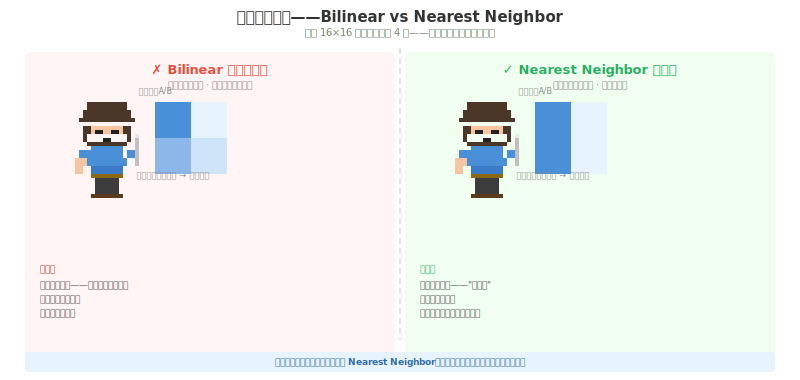
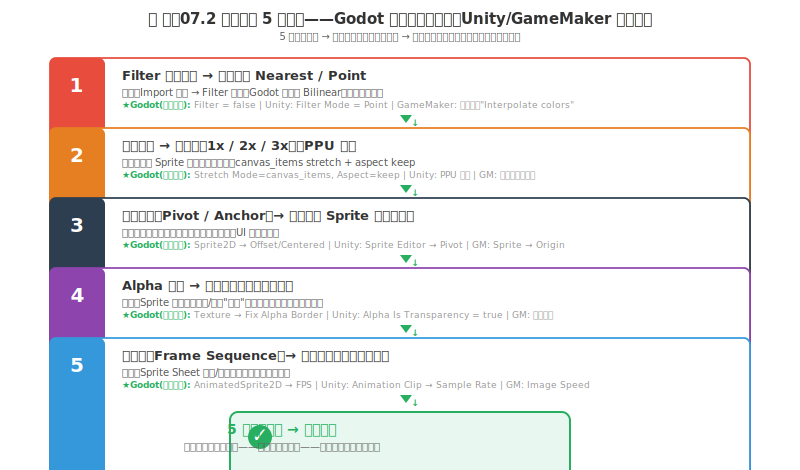

# 制作07 上引擎：从画布到屏幕的最后一步

### 7.0 这一章解决什么问题

你花了一周时间画了 5 个角色、3 个场景、20 个道具。你在 Aseprite 的预览窗口里看了无数遍——每一个 Sprite 都锐利清晰，像素边界分明，颜色准确。

你把第一个角色拖进 Godot——画面糊了。你以为是缩放比例不对，调了一遍——还是糊。你把第二个角色重新导出——画面出现奇怪的"白边"，像角色被"贴"在背景上的贴纸。你把动画帧拖进去——引擎里角色走路的帧切得不对，第 3 帧循环到第 2 帧而不是第 4 帧。

**你的画布是"你的世界"。你的引擎是"玩家的世界"。这两个世界的图像渲染逻辑不同。** 你从画布到引擎的这一步——不是"复制粘贴"——是"翻译"。翻译做错——你画得再好的资产在玩家的屏幕上看起来都像"次品"。

制作01 已经替你锁定了 Aseprite + Godot 这对工具栈——三原则下"最不慢"的解，管线最短：`.aseprite` → 导出 `PNG` → 拖进 Godot → 上线。制作02 的 10 步管线 Step 9-10 已经带你走过"导出 PNG + 引擎验证"的最短路径。这一章把那条最短路径展开成完整的工程指南——理解每一步背后的数学和引擎假设，而不是机械点菜单。

---

### 7.1 导出——你的 PNG 设置比你想象的更重要

#### 7.1.1 缩放算法的数学真相——为什么 Bilinear 毁了你的一切

你的像素 Sprite 是 32×32。你的游戏窗口是 256×256。你需要在某个地方把 32×32 的图像放大 4 倍。你可以选择在 Aseprite 里"导出时 ×4"——也可以选择在 Godot 里把 Sprite 的 Scale 设为 4——但核心问题是同一件事：**每个原始像素现在占据 4×4 = 16 个屏幕像素。中间的 15 个像素是什么颜色？**

两种算法给出了根本不同的答案：

**Bilinear 双线性插值（Bilinear Interpolation）：**
1. 取目标像素在原始图像中的"浮点坐标"。比如你要的屏幕像素对应原始图像的坐标 (0.3, 0.4)。
2. 找到离这个浮点坐标最近的 4 个原始像素——在 x 方向找两个最近的，在 y 方向找两个最近的——构成一个 2×2 的原始像素矩阵。
3. 先做两次水平方向的线性插值：分别计算两个"临时混合值"（x 方向的加权平均）。
4. 再做一次垂直方向的线性插值：把两个临时混合值再做一次 y 方向的加权平均。
5. 结果是：**一个"原始图像中不存在"的过渡色**——邻居 A 的蓝色 + 邻居 B 的白色 = 屏幕上的浅蓝色。

这个数学过程对摄影照片是必要的——它消除像素锯齿，让人眼看到"连续的"图像。但对像素艺术来说——**这个"连续性"就是你花了整个游戏周期在追求的"像素感"的敌人**。Bilinear 把"像素边界"转换成"颜色梯度"——你的锐利方块变成了模糊的渐变——像素的"固有语言"被翻译成了摄影照片的语言。

**Nearest Neighbor 最近邻（Nearest Neighbor / Point Sampling）：**
1. 取目标像素在原始图像中的浮点坐标。
2. 找离这个浮点坐标**最近的一个**原始像素。
3. 直接把那个原始像素的颜色复制过来。
4. 结束。

**没有颜色混合，没有过渡色，没有模糊。** 每一个原始像素在放大后都是一个清晰的、独立的彩色方块。这是你想要的。



*图 制作07.1：Bilinear vs Nearest Neighbor——同一个 16×16 像素角色放大 4 倍。左：Bilinear 导致的"颜色泛滥"让每个像素变成一团模糊。右：Nearest Neighbor 保留"每个像素是一个独立方块"。这不是"好不好看"的问题——是"你的游戏到底是不是像素游戏"的问题。*


#### 7.1.2 PNG 导出——每一个设置的含义

制作02 Step 9 已经给了最短路径："缩放整数倍 + Nearest Neighbor + PNG"。这里展开每一个选项的含义——因为"为什么"比"怎么做"更重要。

**1. 缩放比例（Resize / Scale）：** 1x / 2x / 3x / 4x / 自定义。如果引擎支持引擎内缩放（Godot 支持），导出时保持 1x——让引擎做 Nearest Neighbor 放大。这保留了"如果有一天你想改 2x 到 3x"的灵活性——不需要重新导出所有资产。

**2. 缩放算法（Scaling Algorithm）：** **必须选 Nearest Neighbor。** 这没有"看情况"——永远选 Nearest Neighbor。

**3. 透明背景（Transparent Background）：** 必须勾选。没有 Alpha 通道——你的角色的背景是白色 / 黑色——在引擎中角色背后是"有颜色的方块"而不是"透明的角色"。

**4. 像素格式（Pixel Format）：** RGBA——红绿蓝 + Alpha，标准选项。

**导出的操作检查清单——在点"导出"按钮之前：**
1. 缩放算法：Nearest Neighbor。
2. 缩放倍数：1x（或你的游戏目标的整数倍）。
3. Alpha 通道：有。
4. 文件格式：PNG（不是 JPEG——JPEG 在 100% 质量下仍有压缩伪影，会毁掉像素边界）。

---

### 7.2 Godot 导入

制作01 锁定了 Godot 作为本书的引擎——免费、开源、无版税，2D 渲染管线对像素友好。这一节给你 Godot 的像素完美导入设置——从单张纹理到项目全局。

#### 7.2.1 单张纹理导入——Import 面板四处必改

你拖 PNG 进 FileSystem 面板。选中 PNG → Import 选项卡：

- **Filter（过滤）：** 默认是"Enable"——这意味着 **Bilinear 过滤已经开启**。对——你读对了——Godot 的默认设置是"模糊你的像素艺术"。把它关掉。那个复选框叫 Filter——把它从"开"变成"关"。这是 7.1.1 讲的数学差异在引擎里的直接落点。
- **Mipmaps（Mipmap）：** 默认是"Enable"——生成不同分辨率的预缩放版本（用于 3D 纹理的远近距离切换）。对 2D 像素艺术来说——关掉。你的 Sprite 不需要"远看时有低分辨率的版本"——你只有一个分辨率。
- **压缩（Compression）：** 默认是"VRAM Compressed"——会对纹理做有损压缩。2D 像素艺术——改成"Lossless"。你的 16 色板经不起有损压缩对颜色的破坏。
- **HDR：** 关掉。像素艺术不需要高动态范围。

> **省时操作：** Godot 支持导入预设（Import Preset）。你改好一张纹理的设置后——点 Import 面板底部的 "Preset" → "Save As" → 命名 "PixelArt2D"——之后新导入的 PNG 都能一键应用这套设置。这是把"手动改四处"变成"一次配置永久复用"的工程化手段——和你在 IDE 里存代码模板一个道理。

#### 7.2.2 项目全局设置——像素完美视口

单张纹理改好了还不够。你的游戏窗口怎么把低分辨率视口放大到玩家的高分辨率屏幕——这是第二个模糊来源。Project Settings → Display → Window → Stretch：

- **Stretch Mode → `canvas_items`：** 把画布元素（Canvas Items）按整数倍拉伸，而不是把纹理本身拉伸。这是 Godot 4 像素游戏的正确拉伸模式——它在视口层面做 Nearest Neighbor，而不是让每个 Sprite 各自被拉伸。
- **Stretch Aspect → `keep`：** 保持原始宽高比，多余空间用黑边填充（letterbox）。不选 `expand`——`expand` 会把视口拉伸到窗口尺寸，破坏整数像素对齐。
- **整数缩放：** 设你的游戏内分辨率（如 320×180）和窗口大小为整数倍关系。Godot 4.3+ 支持 `Integer Scale` 开关——勾上它，Godot 自动只做整数倍放大，绝不出现 1.5x 这种半像素对齐。


---

### 7.3 像素完美相机——画面不抖的第二道关卡

7.2 的纹理设置搞定了"每一张 Sprite 被正确渲染"。但渲染正确的 Sprite 装在错误的相机上——画面仍然会抖。相机是像素游戏画面质量的第一道质检——如果你的相机坐标是浮点数，你看到的每一帧都是"不同版本"的像素。

#### 7.3.1 为什么相机是独立于纹理的第二个模糊源

纹理设置保证了"一个 16×16 的 Sprite 在引擎里被放大到 64×64 时每个原始像素占 4×4 个锐利方块"。但相机在游戏世界中移动时，引擎要计算"当前视口应该显示游戏世界的哪个矩形区域"。这个计算涉及浮点数——如果相机的 X 坐标是 100.3，引擎必须决定"原始像素的第 100.3 列对应屏幕的第几列"。

结果：相邻两帧，角色位置不变，但相机移动了 0.5px——同一个 Sprite 的同一个像素，在帧 1 落在屏幕像素 (320, 180)，在帧 2 落在屏幕像素 (321, 180) 和 (322, 180) 之间的模糊边界上。视觉表现为**画面微抖**——不是角色在抖，是相机在浮点坐标移动时，像素对齐每帧都在变。

三个经典症状：

1. **角色抖动（Sub-pixel Jitter）：** 角色站着不动，但你感觉他在"微微颤抖"。相机跟在角色后面用 `lerp()` 平滑，平滑产生浮点坐标 → 角色 Sprite 在不同帧落在不同屏幕像素位置。
2. **Tile 接缝闪烁：** 地面 tile 之间偶尔出现 1px 的线——不是总有，只有相机在某些特定位置时出现。这是 tile 网格和屏幕像素网格不对齐导致的"裂缝"。
3. **缩放模糊卷土重来：** 你明明设了 Nearest Neighbor，但画面还是糊——因为相机层的缩放因子不是整数。

#### 7.3.2 核心修复：相机坐标取整

让相机的位置永远是整数。在 Godot 中，给你的 Camera2D 节点加一行脚本：

```gdscript
func _process(_delta):
    position = position.round()
```

`round()` 把浮点坐标取到最近整数。相机移动时，`position` 只会在 100.0 → 101.0 → 102.0 之间跳动，不会出现 100.3、100.7 这种中间态。

`round()` vs `floor()` 的选择：
- `round()`：100.4 → 100，100.6 → 101。移动更流畅，但偶尔有半像素犹豫。
- `floor()`：100.7 → 100。相机严格滞后，角色可能"顶到画面边缘"才切换像素行。适合高速运动游戏（避免 camera drag 产生浮点）。
- 大多数 2D 平台游戏用 `round()` 就够了。

**验证方法：** 画一张 16×16 的 1px 黑白棋盘格测试图（每个格子 1×1 像素）。导入引擎，铺满整个场景作为背景。让相机以恒定速度移动。用肉眼盯着屏幕的一个固定点——如果有任何像素行"闪烁"，说明相机坐标不是整数。所有行都稳定，说明取整生效。

#### 7.3.3 死区（Dead Zone）——让相机柔和但不浮点

`position.round()` 解决了像素对齐，但引入了新问题：相机紧贴角色，角色每移动 1px，整个画面跳 1px——这个"跳"在低速移动时感觉很机械。

解法是给相机一个**死区**（Dead Zone）：角色在一个小矩形范围内移动时，相机不动；角色超出死区边界时，相机才跟过去。死区的大小应该是你角色尺寸的整数倍——比如 32×32 角色设 16-32px 死区。

Godot 实现：选中 Camera2D → Inspector → Drag Margins → 设 Left/Right/Top/Bottom 为相同的值（如 16）。四个方向独立控制——横版游戏通常左右死区 > 上下死区（水平移动更多）。

死区 + 取整的组合：角色在死区内移动 → 相机不动（0 位移）。角色超出死区 → 相机在新位置做 `round()` → 一次跳转 ≥ 1px。画面在"稳定（死区内）"和"整数跳转（死区外）"之间切换——没有浮点状态的中间态。

#### 7.3.4 缩放必须整数倍

7.2.2 在项目层面设了整数缩放，但相机层（Camera2D 的 Zoom 属性）也需要是整数。`zoom = Vector2(2, 2)` 是合法的；`zoom = Vector2(1.5, 1.5)` 会让 Nearest Neighbor 在相机层失效——即使项目设置是对的外部窗口，相机内部把画面先缩放了 1.5x 再交给视口，就会产生半像素。

规则：**窗口缩放、视口缩放、相机 Zoom——每一层都必须是整数。** 一个非整数，全链路破功。

#### 7.3.5 Pixel Snap + Look Ahead——让相机既精确又自然

死区解决了"角色微动时画面不抖"——但还有两个常见的相机需求：

**Pixel Snap（像素对齐）：** 除了相机 `position.round()`，还需要确保所有 Sprite 的子像素偏移也被消除。Godot 中在 Project Settings → Rendering → 2D → Snap 2D Transforms to Pixel 开启——这会让所有 Sprite 的 position/rotation/scale 自动对齐到像素网格。和 `position.round()` 互补：round 管相机，Snap 管 Sprite。

**Look Ahead（视线前置）：** 横版游戏中，玩家主要看向角色前进方向而不是角色本身。相机不应该始终把角色放画面中心——应该在角色面朝的方向上多留一些空间。简单实现：`camera.position = (player.position + player.velocity * look_ahead_offset).round()`。`look_ahead_offset` 通常设为 0.3-0.5 秒的速度预判量。这比纯死区更自然——玩家能看到"前方有什么"，而不是"撞上了才发现"。

#### 7.3.6 Camera Shake + Screen Flash——Juice 的像素实现

制作04 讲了 Juice 对 UI 的重要性——这里把它落到相机的像素约束下：

**Camera Shake（镜头抖动）：** 受击、爆炸、Boss 登场时短时间随机偏移相机位置。像素游戏的 shake 必须遵守整数约束——`camera.offset = Vector2(randi()%6 - 3, randi()%6 - 3)`，确保偏移量是整像素。衰减方式：持续 0.1-0.3 秒，振幅从大（±3px）衰减到 0。

**Screen Flash（全屏闪白/闪红）：** 最简单的做法是在相机层加一个全屏 ColorRect，透明度短暂（0.05-0.1 秒）从 30% 跳到 0%。闪白 = 受击反馈；闪红 = 濒死警告。纯像素实现 = 不需要粒子系统，一行 Tween 代码搞定。

#### 7.3.7 镜头运动五型——相机不只是"跟屁虫"

前面四小节保证相机"正确"——这一小节讲相机"有趣"。相机在游戏中的行为不只是跟随角色——不同的相机运动类型传递不同的叙事信号。下面五型来自电影摄影机运动，直接对应你游戏中的 Camera2D 行为：

| 类型 | 英文 | 相机行为 | 像素游戏中的实现 | 叙事效果 |
|------|------|---------|---------------|---------|
| **推** | Push In | 相机缓慢靠近目标 | Zoom 从 2x 平滑过渡到 3x（整数倍切换，过渡帧允许短暂模糊） | 紧张、专注、"有什么要发生了" |
| **拉** | Pull Out | 相机远离目标 | Zoom 从 2x 过渡到 1x | 渺小、孤独、展示环境规模 |
| **摇** | Pan | 相机水平移动扫视场景 | Camera2D 从 A 点平滑移动到 B 点（用 `round()` 保持整数步进） | 展示空间、"这个世界很大" |
| **移** | Track | 相机跟随角色平移 | 这是平台游戏的标准——死区 + 取整 | 正在发生的事——玩家在操作 |
| **跟** | Dolly Zoom | 相机移动的同时改变 Zoom | 相机后退 + Zoom 放大（或反过来），像素游戏慎用——极端效果 | 眩晕、超现实、精神失控 |

**像素游戏使用建议：**
- **Track（移）**：平台游戏标准配置——不需要额外代码，死区 + 取整就是 Track。
- **Push In（推）**：Boss 出场、进入新区域时用。缓慢推进 1-2 秒，使用整数 Zoom 节点（2x→3x），过渡期间画面短暂非整数是可以接受的——推进结束后稳定在整数 Zoom 即可。
- **Pan（摇）**：关卡开始时的"展示镜头"——相机从关卡起点缓慢平移到角色位置。用 Godot 的 Tween 在 2-3 秒内完成，使用 `round()` 确保每帧位置是整数。
- **Pull（拉）**：角色死亡、关卡通关时用——拉远展示角色在环境中的位置。
- **相机运动的速度建议**：像素游戏中相机运动会暴露"像素感"——缓慢推进时，像素的硬边在移动中会显得"跳动"。如果推进速度是 1px/帧 = 60px/s（60fps），这是肉眼可感知的"跳"。要么推进速度快到不被感知（3-5px/帧），要么慢到可以接受（0.5px/帧靠帧停留实现，但这属于制作05 的子像素动画范畴——相机层做这事比角色层更复杂）。

---

### 7.4 第一次导入的 5 件检查——做完再关窗口

你拷完引擎设置——不要急着"觉得"没问题就继续做别的。你需要验证。验证不是"看一遍"——是"对每一项做一个明确的检查——检查结果必须能对着别人说'是——我检查了'——而不是'应该是吧'。"



*图 制作07.2：引擎导入 5 件检查——每件必须在导入后立即验证。5 件全部通过 → 素材就绪。任一件未通过 → 不要改引擎设置来"适配坏素材"——回到画布修正原始文件。*

**检查 1：Filter 真的关了吗？——用"像素放大法"确认**

把 Sprite 在引擎预览中放大到 400-800%。看一个像素的边界——如果相邻像素之间有"模糊的过渡色"——Filter 没关。如果每个像素都是清晰的、独立的方块——Filter 关了。

**为什么不能用肉眼看原始大小：** 在 1x 缩放率——你的眼睛的分辨率不够区分"模糊像素的边缘"和"清晰像素的边缘"。但你的玩家的显示器分辨率可能比你高——在高 DPI 屏幕上——Bilinear 的模糊度会比你的屏幕更明显。你不能用你的屏幕"看"这个 Bug 有没有——你要用"极端缩放"测。

**检查 2：缩放比例是整数倍——不是 1.5x / 2.3x / 3.7x**

引擎内 Sprite 的 Scale 值——如果是小数——你的像素不再对齐屏幕像素——结果是：某些像素占据 2 个屏幕像素，某些像素占据 3 个屏幕像素，某些像素在"半个屏幕像素"的边界上——导致拉伸失真（Stretching Artifact）。

**规则：** 所有 Sprite 的 Scale 必须是整数：1, 2, 3, 4……。相机和视口也必须像素对齐。如果你的角色是 32×32 像素，你需要它在屏幕上显示为 64×64——设置 Scale 为 2——不是 1.5 的缩放 + 一些位置偏移来"凑到 64"。Godot 的 `canvas_items` + `keep` + 整数缩放（7.2.2）在项目层面保证这一点——但你仍需检查单个 Sprite 没有被手动设了小数 Scale。

**检查 3：锚点位置在所有同类 Sprite 中统一**

把角色的锚点放在一个位置——你所有的角色都用同一个锚点规则（如"脚底中心"）。把道具的锚点放在中心——你所有的道具都用同一个锚点规则（如"物品的中心点"）。把 UI 精灵的锚点放在左上角——所有 UI 精灵的锚点在左上角。

**不统一的锚点**导致的问题：你在代码中把 `Sprite2D.position` 设置为 (100, 200)——角色 A 的脚在 (100, 200)，角色 B 的肚子在 (100, 200)，角色 C 的头顶在 (100, 200)。这三个角色"站在同一个位置"——但它们在画面上的位置完全不同——你的代码的 position 设置失效了——因为 position 是锚点位置——不是"脚底位置"——除非你的锚点在脚底。

**检查 4：Alpha 通道——透明区域没有"白边" / "黑边"**

把你的角色 Sprite 放在一个有色背景上——不是白色、不是黑色——是一个中间灰色（如 #808080）。看 Sprite 的边缘——如果有白色的"光晕"（alpha halo）——说明你的原始文件中的透明区域有"不完全透明"的白色像素残留——或者引擎在透明边缘做了 Bilinear 混合。修复方法：**源画布修，不在引擎修**——原始文件中把透明区域的所有半透明像素全部清理掉（Alpha = 0 而不是 Alpha = 1-254）。Godot 的 "Fix Alpha Border" 选项能缓解——但最好从原始文件源头解决。

**检查 5：帧序列——播放顺序无跳帧、无重复**

如果你的角色动画是 4 帧：步行、左腿前、步行、右腿前——把 4 帧的 Sprite Sheet 导入后——设置动画速度为 0.1 秒/帧——然后 PLAY。看：
- 第 3 帧和第 4 帧没有"停顿"或"闪烁"——帧与帧之间的间隔均匀。
- 帧的切割没有"割到像素中间"——导致某帧比实际内容多 1 像素的"空白边缘"。
- 如果你用了自动切割（Automatic Slice）——某些引擎会把相同颜色的相邻像素当成"空白间隔"——导致帧被切错——手动切割永远比自动切割可靠。

**当一个检查失败时——不要"调引擎参数来补偿"。** 如果你的 Sprite 在引擎中模糊——是因为 Filter 没关——不是"你需要导出更大的版本"。如果你的 Sprite 的边缘有白边——是你的原始文件的透明区域没清理干净——不是"你需要把引擎的背景色改成白色来隐藏白边"。引擎参数是你的"确认开关"——不是你的"修复工具"。修复——在原始画布文件中做。

---

### 7.5 引擎截图 vs 画布原图——像素级对比法

你的大脑在"独立状态"下很容易产生一个幻觉——"我看起来和在引擎里一样"。这个幻觉是大脑对视觉信息的"自洽式整合"——大脑倾向于假设"我产出的和我看到的是同一个东西"。

**唯一的破幻觉方法：叠图对比。**

**操作步骤：**
1. 在你的画布软件（Aseprite）中打开一个 Sprite——放大到 400%。
2. 在你的引擎中——运行游戏——截一张这个 Sprite 的引擎渲染截图——也放大到 400%。
3. 把两张图放在同一个画面（用任何看图软件）——放大到你能看到单个像素的程度。
4. 切换两张图——A/B 对比。

**在切换中你会看到的差异：**
- "一个像素的颜色略有偏差"——颜色空间转换导致的色差（RGB 值在导出的过程中被轻微偏移了）。修复：检查是否在导出进程中有颜色配置文件（Color Profile）被嵌入——去掉所有颜色配置文件——导"裸 RGB 值"。
- "引擎中的 Sprite 比原图宽/矮了 1 像素"——引擎的网格切割位置偏了。修复：检查 Sprite Sheet 切割的格线。
- "引擎中有一个像素在原图中没有"——可能是某个"Mipmap"或者"边缘填充（Edge Padding）"造成的。修复：关掉 Mipmap 和任何"纹理边缘扩展"选项。
- "原图中的透明像素在引擎中变成了半透明"——Alpha 通道被压缩或重处理过。修复：压缩模式改 Lossless。

**不需要每次都做叠图对比——只需要在你"第一次导入一个新类型的 Sprite"时做一次。** 做好这一次——建立起对"引擎翻译你的图像的准确性"的信任——后续的导入不需要重复检查（除非你改了引擎版本或导出设置）。

---

### 7.6 引擎不是你的"显示器"——是"翻译器"

你的画布和你的引擎之间的每一次数据传输——都经过一次"图像翻译"。这个翻译过程不是透明的——它插入了它自己的假设（"这张图是照片"）、它自己的操作（"让我模糊一下边缘"）、它自己的压缩（"让我把 16 色压缩一下"）。

你的工作不是"相信引擎会原样展示你的画"——你的工作是"验证引擎原样展示了你的画"。你花在验证上的 10 分钟——在你接下来的 6-12 个月的开发期中——每天帮你省掉"为什么这个 Sprite 看起来不对"的 20 分钟摸查找 Bug。10 分钟对 100+ 小时的回报。

**引擎是翻译不是显示。** 你的画布才是"显示"——Aseprite 里你画的每一个像素就是你看到的每一个像素。引擎不是——它中间隔了一层翻译。这层翻译的默认配置是为照片优化的——你的像素艺术必须手动把这层翻译"校准"成忠实模式。

**源画布修，不在引擎修。** 当翻译出了错——你的修复方向是回到源头（`.aseprite` 画布文件）改原始数据，不是在引擎里加补丁。引擎里加的每一个补丁（调背景色隐藏白边、调缩放凑尺寸）都是一笔技术债——它会在你换引擎版本、换平台、加新资产时反咬你一口。

**核心规则摘要：**
1. 导出：Nearest Neighbor，PNG，RGBA，1x 缩放。
2. 引擎：关掉 Filter（所有引擎的默认 Filter 都是"开"），关掉 Mipmap，关掉压缩。Godot 全局：`canvas_items` + `keep` + 整数缩放。
3. 验证：5 件检查逐项确认——像素放大法确认 Filter、整数倍确认缩放、同类统一确认锚点、有色背景确认 Alpha、手动切割确认帧序列。
4. 比较：叠图对比——确认引擎没有"创作"你的图像中没有的颜色或形状。

---

### 7.7 常见引擎 Bug 速查表——按症状索引

以后在引擎里看到画面不对，先查这张表。每个症状对应一个根因 + 一条修复路径。

| 现象 | 根因 | 修复 |
|------|------|------|
| 画面整体模糊 | Filter 没关（Bilinear 开着） | 7.2.1——纹理 Import 面板关 Filter |
| Sprite 边缘有白边/黑边 | Alpha 通道有半透明残留 | 7.4 检查 4——Aseprite 里清透明区域 |
| Tile 之间出现 1px 裂缝 | 相机坐标浮点 + 网格不对齐 | 7.3.2——`position.round()` |
| 角色站着不动画面微抖 | 相机 lerp 产生浮点坐标 | 7.3.3——加死区 |
| 缩放后画面模糊 | 非整数倍缩放 | 7.2.2——整数缩放 + `canvas_items` |
| 锯齿/摩尔纹 | 导出了非整数倍尺寸 | 7.1.2——整数倍缩放导出 |
| 颜色变了 | Compression 有损压缩 | 7.2.1——Compression 改 Lossless |
| 动画帧错位 | Sprite Sheet 切割线偏了 | 7.4 检查 5——手动切割 |
| 高 DPI 屏画面变小/模糊 | 分辨率三层没对齐 | 见下方 DPI 节 |

### 7.8 DPI / Retina——游戏内部分辨率 ≠ 窗口大小 ≠ 显示器分辨率

这是像素游戏最常见的新人踩坑点。很多开发者在 MacBook Retina 或 4K 屏幕上第一次跑自己游戏——画面要么小到看不清，要么"整数缩放明明设对了但还是糊"。

原因就一条：**你把三个不同层面的"分辨率"混成了一个。**

```
游戏内部分辨率（Game Internal Resolution）
    你设的 320×180 或 480×270——这是游戏世界的大小。
    ↓
窗口大小（Window Size）
    玩家看到的窗口尺寸，比如 1280×720。
    引擎按 Stretch 设置把游戏内部分辨率放大到窗口大小。
    ↓
显示器分辨率（Display Resolution）
    物理屏幕的像素密度。Retina 屏上 1280×720 的窗口实际占据 2560×1440 物理像素。
    这是操作系统在管的——你的游戏只到窗口大小这一层。
```

**规则：游戏内部分辨率 × 整数倍 = 目标窗口大小。** 320×180 可以整数倍到 640×360(2×)、960×540(3×)、1280×720(4×)、1920×1080(6×)。如果玩家屏幕是 1366×768——选最接近的整数倍窗口（1280×720），剩余空间用黑边填充。Godot 的 `canvas_items` + `keep` + `Integer Scale` 已自动处理——你只需保证内部分辨率和目标窗口是整数倍关系。

---

### 7.9 练习

#### L1 · 导出-导入-对比全流程（15 分钟）

1. 在 Aseprite 中画一个 16×16 的简单 Sprite——一个两种颜色的方块（如蓝底 + 红 X）。
2. 导出 PNG——Nearest Neighbor，1x。
3. 导入 Godot——关掉 Filter、关掉 Mipmaps、Compression 改 Lossless。项目设置 Stretch Mode=`canvas_items`、Aspect=`keep`。
4. 引擎中截一张这个 Sprite 的图——放大到 500%——和画布原图做叠图对比。
5. 如果一模一样——你对你的引擎有"导入信任"——接下来的所有资产都用这个设置。如果不一样——在下周内找到原因并修复——不要带着"引擎可能会改我的图"的疑虑做 6 个月的开发。
6. 再做一次——这次用 Bilinear 导出——对比同一 Sprite 的 Bilinear 和 Nearest Neighbor 的差异——把这个差异记在脑子里——这是你未来在引擎中一眼就能认出的"模糊 Bug"的视觉指纹。

**合格标准：** 一组叠图对比截图——Nearest Neighbor 版边缘锐利、Bilinear 版边缘模糊，你能说出差异原因。

#### L2 · Godot 像素完美项目模板（10 分钟）

1. 新建一个 Godot 项目，把 7.2.1 的四处纹理设置存成名为 "PixelArt2D" 的 Import Preset。
2. 把 7.2.2 的三个项目设置（`canvas_items` + `keep` + 整数缩放）配好。
3. 导入一张测试 PNG，确认 5 件检查全过。
4. 把这个项目存成模板——你后续所有像素项目的起点。

**合格标准：** 一个可复用的 Godot 像素项目模板，新导入的 PNG 默认就是像素完美设置。

#### L3 · 三引擎菜单地图（10 分钟——如果你用一个以上的引擎）

1. 拿一张白纸（或一个空白文本文件）——画出"关掉 Filter"在 Godot / Unity / GameMaker 中的菜单位置。
2. 在每个引擎的菜单位置旁边——写下"默认值是反的——我必须手动改"。
3. 把这张纸放在你开发时能看到的位置——不是装饰——是你每次"加新资产到引擎"时的最后一步检查列表。

**合格标准：** 一张三引擎对照表，标注 Godot 为本书默认引擎。

---

### 7.10 本章小结

- **Bilinear 毁像素，Nearest Neighbor 保像素。** 数学层面：Bilinear 对 2×2 矩阵做两次线性插值，产出"原图不存在的过渡色"；Nearest Neighbor ≈ `int(floor(floatCoord))`，直接取最近整数，无混合。像素艺术在数学本质上是离散的二维整数数组——用连续信号插值算法处理离散信号 = 对 `int[]` 做 `float` 运算。
- **PNG 导出四件套：** Nearest Neighbor + 整数倍缩放 + Alpha 通道 + PNG 格式。永远不用 JPEG——压缩伪影毁像素边界。
- **Godot 像素完美 = 四处纹理设置 + 三个项目设置。** 纹理：Filter 关、Mipmaps 关、Compression Lossless、HDR 关。项目：Stretch Mode=`canvas_items`、Aspect=`keep`、整数缩放开。存成 Import Preset 一次配置永久复用。
- **5 件检查是导入后的验收门。** Filter（像素放大法）→ 整数缩放 → 锚点统一 → Alpha 无白边 → 帧序无错乱。任一件失败 → 回画布修，不在引擎修。
- **像素完美相机是画面不抖的第二道关卡。** 纹理设置对 + 相机浮点坐标 = 画面仍然抖。相机坐标必须 `round()` 取整；加死区（16-32px）让相机柔和但不浮点；相机 Zoom 和窗口缩放一样必须整数倍。三步配齐 → 角色静止时画面纹丝不动，移动时整数跳转无半像素闪烁。
- **镜头运动五型让相机不只是"跟屁虫"。** 推/拉/摇/移/跟——五型直接对应 Godot Camera2D 的五种行为策略。平台游戏标配 Track（移），Boss 出场用 Push（推），关卡开场用 Pan（摇）——一条 `position.round()` 让所有五型都在像素完美的前提下运动。
- **叠图对比是破幻觉的唯一手段。** 第一次导入新类型 Sprite 时做一次——建立"导入信任"——后续不必重复。

> **如果只记住一句话：** 引擎是翻译不是显示——你的工作是验证引擎忠实翻译了你的画，不是相信它原样展示了你的画；翻译出了错，源画布修，不在引擎修。

> **上手行动：** 今晚做 L1——15 分钟跑通"导出 PNG → Godot 像素完美导入 → 叠图对比"全流程，建立你的"导入信任"。再做 L2——10 分钟存一个 Godot 像素项目模板，后续所有项目从这里起步。

---

### 7.11 扩展阅读

1. **[Godot 官方文档 — 2D 与像素艺术](https://docs.godotengine.org/)** — Godot 4 的 2D 渲染、纹理导入设置、`canvas_items` 拉伸模式、整数缩放。**为什么推荐：** 本章 7.2 的所有 Godot 设置的官方出处——7.2.1 的 Import 面板、7.2.2 的项目设置都在这里有完整说明。
2. **[Godot 官方文档 — Multiple Resolutions](https://docs.godotengine.org/)** — Godot 的多分辨率与拉伸模式详解。**为什么推荐：** 7.2.2 的 `canvas_items` + `keep` + 整数缩放在不同设备上的行为——这是你的像素游戏在 1080p / 4K / 笔记本屏幕上都保持像素完美的理论基础。
3. **制作01《你的工具：Aseprite 与工具逻辑》** — 1.1.2 锁定 Aseprite + Godot 的三原则论证。**为什么推荐：** 本章 7.2 的 Godot 设置是制作01 工具选择的落地——你在那里知道"为什么是 Godot"，在这里知道"Godot 怎么配"。
4. **制作02《像素角色工作流》** — Step 9-10 的导出 PNG + 引擎验证最短路径。**为什么推荐：** 本章 7.1.2 是制作02 Step 9 的展开——那里给你"怎么做"，这里给你"为什么每一步这么设"。
5. **制作09《一致性审计》** — 所有资产导入引擎后的全局一致性检查。**为什么推荐：** 本章解决"单张资产导入正确"——制作09 解决"50 张资产放一起看起来是不是一家人"。先过本章 5 件检查，再进制作09 审计。
6. **[Lospec — Pixel Art Guide: Scaling](https://lospec.com/)** — 像素艺术缩放算法的社区总结。**为什么推荐：** 7.1.1 的 Bilinear vs Nearest Neighbor 数学解释的视觉补充——Lospec 有同一张图在不同算法下的对比 GIF。

---

### 7.12 本章引注

[^1] Bilinear vs Nearest Neighbor 数学、PNG 导出清单、引擎导入对比（Godot 为主）、第一次导入 5 件检查、引擎截图 vs 画布原图叠图对比法、"引擎是翻译不是显示器"、"源画布修不在引擎修"。本章补充 Godot 4 像素完美项目设置（`canvas_items` + `keep` + 整数缩放）与 Import Preset 工作流。

[^2] Godot 官方文档 — 2D 渲染与像素艺术纹理设置. https://docs.godotengine.org/ — 7.2.1 的 Import 面板 Filter/Mipmaps/Compression 设置、7.2.2 的 Stretch Mode `canvas_items` / Aspect `keep` / 整数缩放的官方说明。制作01 1.1.2 已引用 Godot 对像素友好的论证，本章是其工程落地。

[^3] 制作02《像素角色工作流》Step 9-10——导出 PNG（Nearest Neighbor + 整数缩放）+ 引擎验证（Godot Filter 设 Nearest、禁 Mipmaps）的最短路径。本章 7.1.2 是其展开。

