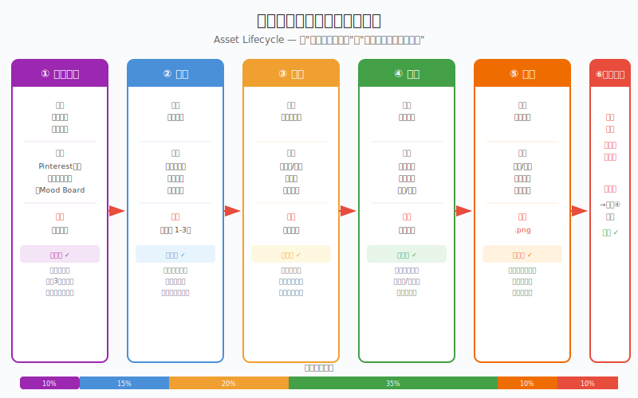
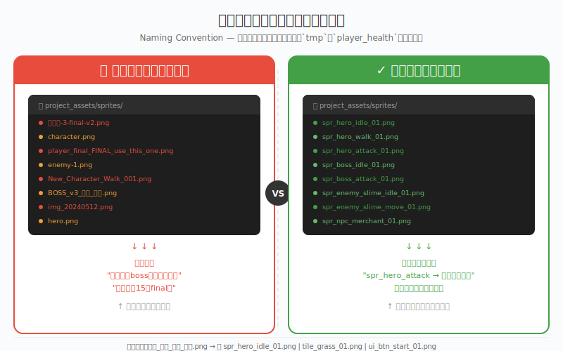

# 制作08 生产管线：从一个素材到一套资产

### 8.0 这一章解决什么问题

制作07 你把单张资产像素完美地搬上了引擎屏幕——Bilinear vs Nearest Neighbor 的数学、PNG 导出四件套、Godot 像素完美设置、5 件导入检查、叠图对比。你能把一张资产从画布搬到玩家的屏幕了。但如果你开始做一个真正的游戏项目，一个尖锐的问题会立刻浮现：

**你会画一个宝箱，但你能画 50 个宝箱吗？**

你有一个角色，但它需要待机、走路、攻击三套动画。你改了一版、两版、三版。文件夹里开始出现`最终版-final-真的最终-v3-副本.png`。你分不清哪个文件是最新的。你花了三个小时画了一个道具，但它和别的道具风格不统一，你得返工。

这就是单个资产能力和**生产系统能力**的差距。很多人会画，但不会"生产"。两者的区别就像"会写一个函数"和"能管理一个代码仓库"——后者需要的不是你更聪明的手，而是一套让你不会搞砸自己的流程。

这一章是观察01 三能力模型里"**整**"（整合）能力的管线层。观察01 说"整"是独立游戏开发者独有的顶层能力——纯美术从业者不需要考虑引擎导入和运行时一致性，但你必须考虑。制作07 解决了"单张资产进引擎"，这一章解决"一套资产怎么流水线生产"，制作09 解决"这套资产放一起是不是一家人"。三章合在一起，就是"整"的全部训练。

本章要解决的瓶颈是：**你没有一个从"我要做这个"到"这个在引擎里能用了"的标准化流程。** 没有流程，每一个资产都是一次即兴创作——即兴创作在灵感迸发时很爽，在需要批量生产时是灾难。

> **程序员类比：** 这就像你刚开始编程时，一个`main.py`文件写到底。后来你学会了模块化、命名规范、Git、CI/CD。不是说后者写出的代码"更正确"，而是后者让你能在凌晨三点找到三个月前写的那行 bug 源于哪个文件。美术生产管线是同一回事——它不是让你画得更好，是让你少踩自己的坑。

---

### 8.1 一张资产的完整生命周期

在你开始画任何东西之前，先建立"一个资产有六个阶段"的认知。这不是教条，但如果你跳过某个阶段，你几乎一定会在后面付出代价。



*图 8.1：一张像素资产的完整生命周期——参考→草稿→粗胚→精修→导出→引擎验证，底部是典型时间占比。前三个阶段加起来近一半时间，很多人把它们压到 10%，于是精修阶段反复返工。*

#### 阶段一：参考收集（Reference Gathering）

**输入：** 一句需求描述——"我要一个像素风的宝箱道具"或"一个像素风的史莱姆敌人"。

**操作：** 打开 Pinterest、Google Images 或 ArtStation。搜索你想要的东西。至少收集 3-5 张参考图。一张看整体造型，一张看材质细节，一张看色彩方案，一张看类似游戏里的做法。把它们扔进一个画板（Mood Board）。**参考图用于分析，不直接描摹或商用复制。**

**输出：** 一个参考图集合，贴在你能随时看到的地方。Aseprite 支持把参考图拖进画布作为参考图层，或放在第二显示器上。

**检查点：** 你的参考够具体吗？"像素宝箱"可以是一个铁皮包边的橡木箱，也可以是一个镶宝石的金色圣物箱。"具体"意味着当你开始画的时候，你不需要再去查"宝箱到底长什么样"。

**为什么不能跳过：** 跳过参考收集的人画出的是"脑海中的宝箱"——一个模糊的原型。模糊原型会在大约画到一半的时候开始背叛你：比例不对，细节不知道放哪里，色彩不知道用什么。然后你打开 Pinterest——在画了一半的时候——这比画之前就查参考慢得多。

---

#### 阶段二：草稿（Thumbnail / Sketch）

**输入：** 参考图板。

**操作：** 用最粗糙的方式快速出 2-3 个方案。像素资产就用缩略图（Thumbnail）——24×24 或 32×32 就够了，只关心轮廓和明暗大块。每个方案花 5-10 分钟。

**输出：** 2-3 个粗草稿。

**检查点：** 轮廓剪影能一眼辨识出是什么东西吗？这是"剪影测试"（Silhouette Test）——如果纯黑轮廓分不出是宝箱还是石头，说明造型有问题。比例顺眼吗？有没有选了最佳呈现角度？

**为什么不能跳过：** 草稿阶段是纠正方向成本最低的时候。在这个阶段推翻一个方案只需要 5 分钟。在精修阶段推翻一个方案可能需要 5 小时。

---

#### 阶段三：粗胚（Blockout / Rough）

**输入：** 选定的草稿方案。

**操作：** 定下大型。画布放大到工作尺寸（如 32×32 或 64×64），画出主要体块和固有色。光线只做一个大致的明暗区分（二分法）。

**输出：** 一个"看得出是什么东西但细节全无"的粗胚资产。

**检查点：** 比例已经定死了吗？如果这个阶段比例还不对，后续修改代价会越来越大。色块分区读得懂吗？——一个不玩游戏的人看一眼能不能说出"这是一个木头箱子"而不是"一团棕色"？

**为什么不能跳过：** 粗胚是"定型"阶段。在这个阶段之后，你不应该再做大比例改动。就像写完代码的架构之后不改接口签名——可以改实现，不能改契约。

---

#### 阶段四：精修（Polish / Refinement）

**输入：** 粗胚资产，参考图板（再次对照）。

**操作：** 这是最花时间的阶段。加入细节——纹理、做旧、高光、材质区分、边缘处理、抗锯齿（见练手08）。反复对照参考图：你的宝箱和参考图里的宝箱，"完成感"在同一个水平吗？

**输出：** 最终资产本体（尚未导出裁剪）。

**检查点：** 和参考图对比，细节密度是否匹配？有没有"漏画"的部分——比如画了箱子正面忘了侧面？有没有杂线、漏色、接缝？尺寸是否符合你游戏的需求规范？（比如一个 16×16 的道具图标和一个 64×64 的角色立绘要求完全不同。）

**为什么不能跳过：** 这显然是核心阶段。但关键在于：**很多人在没有完成前三个阶段的情况下直接进入精修。** 跳阶段的结果是你在精修中发现"哦不对这个角度不对"然后重来——精修成本 ×2。

---

#### 阶段五：导出（Export）

**输入：** 精修完成的资产。

**操作：** 裁剪到正确边界。确认尺寸规范。确认格式（像素艺术永远是 PNG——见制作07 的 JPEG 反例）。确认透明通道存在且正确。**按照命名规范重命名文件**（见 8.2 节）。制作07 已给最短路径：Nearest Neighbor + 整数倍缩放 + Alpha 通道 + PNG。

**输出：** 一个命名规范、格式正确、尺寸合规的游戏资产文件。

**检查点：** 在图片查看器中打开，边界内没有多余透明区域，也没有被意外裁剪。文件名一眼能读出这是什么资产。

**为什么不能跳过：** 一个画得完美但导错了尺寸的资产=不能用。一个画得完美但叫`未命名-3.png`的资产=一个月后你找不到它。

---

#### 阶段六：引擎验证（In-Engine Verification）

**输入：** 导出后的资产文件。

**操作：** 拖进 Godot（本书默认引擎）。放在实际游戏场景中看效果。调引擎内的参数（Filter、Mipmaps、Pixels Per Unit、`canvas_items` 拉伸模式等——制作07 有完整设置清单和 5 件检查）。

**输出：** 在引擎中"看起来没问题"的资产，或者一个"返回阶段四精修"的决定。

**检查点：** 和其他已完成的资产放在一起，风格统一吗？在游戏实际运行分辨率下，细节是否可见/是否需要调整？5 件导入检查（Filter 关、整数缩放、锚点统一、Alpha 无白边、帧序无错乱）全过了吗？

**为什么不能跳过：** Aseprite 里好看 ≠ 引擎里好看。渲染环境不同、尺寸缩放不同、周围资产的搭配不同——都可能让一个"画得很好"的资产在引擎里显得格格不入。永远在目标环境中做最终判断。这一步的完整工程指南见制作07。

---

#### 时间分配参考

| 阶段 | 时间占比 | 说明 |
|------|---------|------|
| 参考收集 | 10% | 前期投入，后期省时间 |
| 草稿 | 15% | 探索方向，成本极低 |
| 粗胚 | 20% | 定型关键，不可跳过 |
| 精修 | 35% | 最花时间的阶段 |
| 导出 | 10% | 规范比速度重要 |
| 引擎验证 | 10% | 最后的防线 |

> **注意：** 以上占比是典型参考值，不同资产类型会变化（如简单道具精修占比可能更低、角色动画帧精修占比可能更高）。

你会发现，前三个阶段加起来占了近一半的时间——而很多人把它们压缩到 10%。这就是为什么他们的精修阶段要反复返工。

---

### 8.2 命名的艺术

**程序员，这一节你会秒懂。**

在你的代码里，你不会写：

```python
def do_stuff_v3_final():
    pass

x = tmp123
```

你写：

```python
def calculate_player_damage(attacker, defender):
    pass

player_health = 100
```

文件名是同一个道理。当你有一百个资产文件时，`未命名-3.png`就是一段你不愿意维护的遗留代码。



*图 8.2：命名对比——左边是技术债，三周后没人知道哪个是最终版；右边是自动化收益，按名称排序自动分组，任何时间打开一眼就懂。*

#### 命名公式

```
类型_对象_动作/状态_序号.扩展名
```

实际例子：

| 命名 | 含义 | 一眼读出？ |
|------|------|-----------|
| `spr_hero_idle_01.png` | 精灵_英雄_待机_第1帧 | ✓ |
| `spr_hero_walk_03.png` | 精灵_英雄_走路_第3帧 | ✓ |
| `spr_boss_attack_01.png` | 精灵_Boss_攻击_第1帧 | ✓ |
| `tile_grass_01.png` | 图块_草地_01 | ✓ |
| `tile_dungeon_floor_01.png` | 图块_地牢_地板_01 | ✓ |
| `ui_btn_start_hover.png` | UI_按钮_开始_悬停态 | ✓ |
| `item_potion_health_01.png` | 道具_药水_回血_01 | ✓ |

类型前缀（`spr` / `tile` / `ui` / `item`）是你的"命名空间"——它把不同种类的资产在文件管理器里天然分开，就像你不会把`user_service.py`和`texture.png`扔进同一个目录。

#### 为什么用下划线不用空格和中文

- **空格：** 在某些引擎和命令行工具中，文件路径里的空格需要转义（escape）。`spr hero idle.png`变成`spr\ hero\ idle.png`。自找麻烦。
- **中文：** 部分引擎的 Asset Database 对非 ASCII 路径支持不稳定。保险起见用英文单词。如果你的团队全中文且引擎确认支持，`角色_英雄_待机_01.png`也可以——但`spr_hero_idle_01.png`在任何环境下都能用。**书稿文件可中文；进入游戏引擎资产目录建议 ASCII。**
- **大小写：** 全小写。`Spr_Hero_Idle.png`和`spr_hero_idle.png`在某些文件系统（如 Linux）上是两个文件，在 Windows 上是同一个文件。全小写消除歧义。

#### 命名的隐含收益

当你按`类型_对象_动作_序号`命名后，文件管理器里的排序会自动变成分组视图：

```
spr_boss_attack_01.png
spr_boss_attack_02.png
spr_boss_idle_01.png
spr_hero_attack_01.png
spr_hero_idle_01.png
spr_hero_walk_01.png
```

所有 Boss 的帧在一起，所有英雄的帧在一起。不需要手动建文件夹——**命名本身就是一种组织方式。** 这和你在代码里用`user_service.py`而不是`service.py`是同一个逻辑。

**如果你只有 10 个资产，命名不规范也能忍受。如果你有 100 个资产，不规范命名让你每天浪费 10 分钟找文件。如果你有 500 个资产，不规范命名让你想重做整个项目。** 从第一个资产开始就用规范命名——这不是"以后再说"的事。制作02 的角色工作流和制作03 的 Tileset 都从第一帧起就用这套公式。

---

### 8.3 版本控制的美术适配

你肯定用 Git 管理代码。但美术资产能用 Git 吗？答案是：**文本格式的源文件（如 `.svg`、Aseprite 的 `.aseprite` 在某些情况下）可以，二进制大文件（`.png`、`.psd`、`.aseprite` 的打包部分）不太适合 Git 的原生 diff。** 大多数独立开发者最终发现——对美术资产来说，迭代文件夹比 Git 分支更直观。

#### 迭代文件夹法

```
assets/sprites/hero/
├── v1/                          # 第一版：基础造型
│   ├── spr_hero_idle_01.png
│   └── spr_hero_walk_01.png
├── v2/                          # 第二版：改了配色
│   ├── spr_hero_idle_01.png
│   └── spr_hero_walk_01.png
├── v3/                          # 第三版：加了披风
│   ├── spr_hero_idle_01.png
│   └── spr_hero_walk_01.png
└── current/                     # 当前使用版（引擎从这里读取）
    ├── spr_hero_idle_01.png
    └── spr_hero_walk_01.png
```

`current/`文件夹里的内容是引擎实际引用的路径。当你需要回退到 v2 时，把 v2 的内容覆盖到 current/。Git 只用来做备份和时间点记录——不要指望 Git 帮你 diff 两张 PNG 图。

#### 反面教材：final 版地狱

```
project/
├── hero.png
├── hero_v2.png
├── hero_final.png
├── hero_final_v2.png
├── hero_FINAL_FINAL.png
├── hero_FINAL_FINAL_USE_THIS.png
└── hero_FINAL_FINAL_USE_THIS_v2.png
```

当你看到这种文件夹结构时，你已经输了。你现在不知道哪个是真正的最终版，不知道 v2 和 final 之间改了什么，不知道 FINAL_FINAL 和 FINAL_FINAL_USE_THIS 有什么区别。

**铁律：** 永远不要用"final"这个词作为文件名的一部分。它从来不是 final。用版本号。v1、v2、v3。版本号是递增的、客观的、没有感情色彩的。`v3`没骗你——它只是第三个版本。`final`欺骗了你——它根本不是 final。

#### Git 的实际建议

- 把 `.aseprite`（Aseprite 源文件）放入 Git 追踪。它是"源码"。
- 把导出的 `.png` 最终资产文件放入 Git 追踪（或使用 Git LFS 处理大文件）。
- 把迭代中间产物（v1/v2/v3 里的旧 PNG）可以选择不入 Git——或放入一个`_archive/`文件夹后用 `.gitignore` 忽略。
- 提交信息（Commit Message）写成"hero: redesign color palette v3"而不是"update"。就像你不会写`git commit -m "fix"`一样。

> **程序员类比：** 迭代文件夹是你美术资产的"分支"。`current/`是你的`main`分支——引擎永远读这个。`v1/v2/v3`是你的 feature 分支——保留历史但不影响运行。这比给 PNG 文件做 Git merge 要靠谱得多。

---

### 8.4 瓶颈诊断：找到你的慢在哪

当你的资产生产速度不如预期时，不要笼统地说"我画得太慢了"。**画得慢是一个症状，不是原因。** 你需要定位瓶颈在六个阶段中的哪一个。

#### 四步诊断法

**第一步：记录一个资产的完整时间。**

找一个典型资产——比如一个道具或一个敌人角色。用手机计时器或 Toggl Track / Clockify 记录你在每个阶段花了多少时间。不需要精确到秒，精确到 5 分钟即可。结果可能长这样：

| 阶段 | 预计占比 | 实际耗时 | 偏差 |
|------|---------|---------|------|
| 参考收集 | 10% (6min) | 5min | OK |
| 草稿 | 15% (9min) | 3min | ⚠️偏少 |
| 粗胚 | 20% (12min) | 8min | ⚠️偏少 |
| 精修 | 35% (21min) | 50min | 🔴严重超标 |
| 导出 | 10% (6min) | 4min | OK |
| 引擎验证 | 10% (6min) | 2min | ⚠️偏少 |

**第二步：分析偏差。**

在这个例子里，精修花了 50 分钟而不是 21 分钟。为什么？因为草稿和粗胚被压缩了——你在定型不充分的情况下进入了细节——然后在精修阶段发现"这个比例不对"、"颜色需要大改"、"结构要重新考虑"。**精修超支不是精修的问题，是前三阶段欠的债。**

引擎验证偏少也是一个危险信号——你可能在 Aseprite 里看着"还行"就过了，没有在游戏实际环境中检查（制作07 的叠图对比法就是治这个的）。

**第三步：对症下药。**

- **参考收集超支：** 你是不是陷入了"Pinterest 黑洞"——刷了 40 分钟参考图但一张都没真正用上？解法：设 15 分钟硬时限。时间到就关网页，用已经找到的图。
- **精修超支（最常见）：** 你是在"画"还是在"磨"？"画"是有明确目标的推进——加阴影、加纹理、修边缘。"磨"是无目标的来回调整——反复放大缩小看同一个地方、改一点又改回去。解法：每个精修阶段设 30 分钟上限，时间到就进入导出。如果看起来"不够好"，记下来，下一个资产改进，不要在同一个资产上永无止境地磨。
- **导出超支：** 你是不是每次导出都要手动调十几个参数？解法：保存导出预设（Preset）。Aseprite 和 Godot 都支持。设一次，点一个按钮，完事。
- **引擎验证被跳过：** 你是不是"懒得导进引擎"？解法：引擎保持打开状态，资产导出后直接看效果——不要让验证成为一个"额外步骤"。

**第四步：一次只修一个瓶颈。**

不要试图同时优化所有阶段。找到最拖你后腿的那个环节——通常就是精修超支——针对它做一个改变。下周再检查时间记录，看有没有改善。

---

### 8.5 练习——把管线装进你的项目

#### L1 · 生命周期走一遍（20 分钟）

任选一个简单资产（如一个 16×16 的药水瓶道具），按六阶段走一遍：参考收集→草稿→粗胚→精修→导出→引擎验证。在每个阶段的输出处停一下，对照该阶段的检查点。最后把导出的 PNG 拖进 Godot，跑制作07 的 5 件检查。

**合格标准：** 一个能在引擎里显示的药水瓶 PNG，外加一张纸/一个文本文件，写清六个阶段各自的输入和输出——你能对着它说出"这一步我做了什么、产出了什么"。

#### L2 · 命名与版本控制审计（15 分钟）

打开你现有的项目文件夹（没有就用 L1 的产物造一个）。检查三件事：有没有任何文件名包含`final`？有没有文件名包含空格或中文？有没有文件名让你无法一眼看出内容？把违规的全部按`类型_对象_动作_序号`公式重命名，并建一个`v1/` + `current/`的迭代文件夹结构。

**合格标准：** 文件夹里零个`final`、零个空格、零个"看不出内容"的文件名；`current/`里是引擎引用的版本，`v1/`里是上一版备份。

#### L3 · 瓶颈计时（一周）

用 Toggl Track 或 Clockify，花一周时间记录你每个资产的六阶段耗时。周末汇总成 8.4 那张偏差表。找出你超支最严重的那一个阶段——针对它做一个改变（如"精修设 30 分钟上限"）。第二周再记录一次，对比改善。

**合格标准：** 两周的计时数据 + 一张偏差对比表 + 一个明确的"我下周要改的阶段"结论。如果你发现自己精修占比超过 50%，你几乎一定在跳前三个阶段——回到 L1 把六阶段的节奏重新内化。

---

### 8.6 本章小结

这一章讲的是一个看似无聊但决定你项目存亡的东西：**流程。**

- **六阶段生命周期**（参考→草稿→粗胚→精修→导出→引擎验证）不是官僚主义，是"不要在画到一半时才发现走错了方向"的保险单。这是"整"能力的管线骨架——制作07 是它第六阶段的展开，制作09 是它跑完一套之后的全局验收。
- **命名规范**不是强迫症，是"三个月后你还能找到那个文件"的唯一办法。用`类型_对象_动作_序号`，全小写，全下划线。像素资产用 `spr_` / `tile_` / `ui_` / `item_` 前缀当命名空间。
- **迭代文件夹**是你美术的版本控制系统。`current/`是 main 分支，`v1/v2/v3`是历史记录。永远不要用`final`这个词。
- **瓶颈诊断**告诉你"慢在哪里"而不是笼统地说"我画得慢"。记录时间，分析偏差，一次修一个环节。

建立管线不会让你的美术水平在一夜之间提高。但它会让你少犯错，而少犯错就是进步——**尤其是在凌晨两点 Deadline 前那个"为什么我的英雄在引擎里是粉红色的"瞬间。**

> **程序员类比（最后一个）：** 你不写测试也能交付代码。但你知道写了测试的代码库在三个月后重构时不会让你心脏病发作。美术管线是你的测试套件——不性感，但救命。

> **如果只记住一句话：** 你会画一个资产不等于你能生产一套资产——前者靠手，后者靠流程；六阶段生命周期 + 规范命名 + 迭代文件夹，是把"会画"翻译成"能生产"的三件套。

> **上手行动：** 今晚做 L1——20 分钟把一个 16×16 药水瓶走完六阶段，在引擎里跑通 5 件检查。再做 L2——15 分钟审计你现有项目的命名和文件夹，干掉所有`final`。

---

### 8.7 扩展阅读

1. **制作07《上引擎：从画布到屏幕的最后一步》** — Bilinear vs Nearest Neighbor、PNG 导出四件套、Godot 像素完美设置、5 件导入检查、叠图对比。**为什么推荐：** 本章第六阶段"引擎验证"的完整工程指南——那里给你"怎么验"，这里给你"它在整条管线里的位置"。
2. **制作09《一致性审计》** — 所有资产导入引擎后的全局一致性检查。**为什么推荐：** 本章解决"一套资产怎么流水线生产"，制作09 解决"这套资产放一起看起来是不是一家人"。先过本章的管线，再进制作09 审计。
3. **制作02《像素角色工作流》** — 10 步管线 + 四层楼角色设计法。**为什么推荐：** 本章的六阶段是抽象的生命周期，制作02 的 10 步是它在角色资产上的具体落地——两者对照着读，"管线"就不再是抽象概念。
4. **制作03《环境与 Tile》** — 三层叙事 + Tileset 模块化。**为什么推荐：** Tileset 是"批量生产"最典型的资产类型——本章的命名规范（`tile_grass_01.png`）在制作03 的 Tile 库里大规模实战。
5. **观察01《三能力模型与自评》** — 看 / 做 / 整三层能力模型。**为什么推荐：** 本章是"整"（整合）能力的管线层——理解你在三能力栈的哪一层发力，能帮你判断自己卡在"做"还是"整"。
6. **Toggl Track 或 Clockify** — 免费的时间追踪工具。**为什么推荐：** 用一周记录你的资产生产时间——你会发现很多关于自己工作习惯的惊讶真相（8.4 瓶颈诊断的必备工具）。
7. **《The Gamedev Business Handbook》** 中关于美术外包和生产管线的章节。**为什么推荐：** 即使你不出外包，外包管理流程中的"规格文档→检查点→验收标准"方法论可以直接套用在自己的生产管线上。

---

### 8.8 本章引注

[^1] 书 A 第 18 章《建立你的生产管线》——六阶段资产生命周期（参考→草稿→粗胚→精修→导出→引擎验证）+ 时间分配、命名规范公式、迭代文件夹版本控制（v1/v2/v3/current）、瓶颈诊断四步、"final 版地狱"反模式、Toggl Track 时间追踪。本章为 A 原声保留，例子像素重定向（`spr_` / `tile_` 前缀、PNG 导出、Aseprite/Godot 工具栈），交叉引用重穿到新章节编号（制作02 / 制作03 / 制作07 / 制作09 / 观察01），补"整"能力管线层定位与 L1/L2/L3 练习。

[^2] 制作07《上引擎》——第六阶段"引擎验证"的完整展开：Bilinear vs Nearest Neighbor 数学、Godot 像素完美导入设置、5 件导入检查、叠图对比法。本章 8.1 阶段六是其在上游管线中的定位。

[^3] 观察01《三能力模型与自评》1.1 节——"看 / 做 / 整"三层能力模型，"整"=整合（引擎导入 + 运行时一致性）。本章与制作07 / 制作09 共同训练"整"层，本章负责其中的生产管线维度。

---

> **下一章：制作09 一致性审计。** 你现在有了一条能批量生产资产的管线——但管线跑出来的 50 张资产放在一起，看起来是"一个人做的"还是"五个人拼的"？下一章给你一份 10 项一致性清单和 5 种常见 bug，把"一套资产"收敛成"一个视觉体系"。
